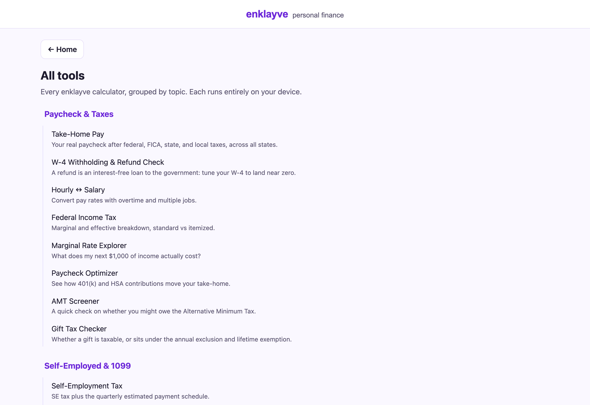
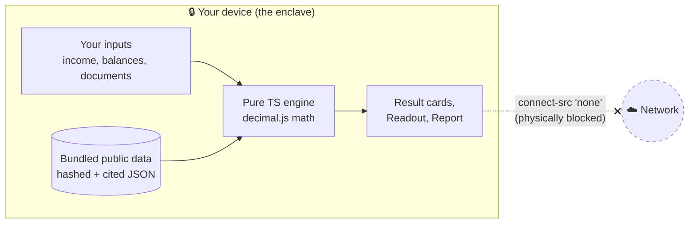
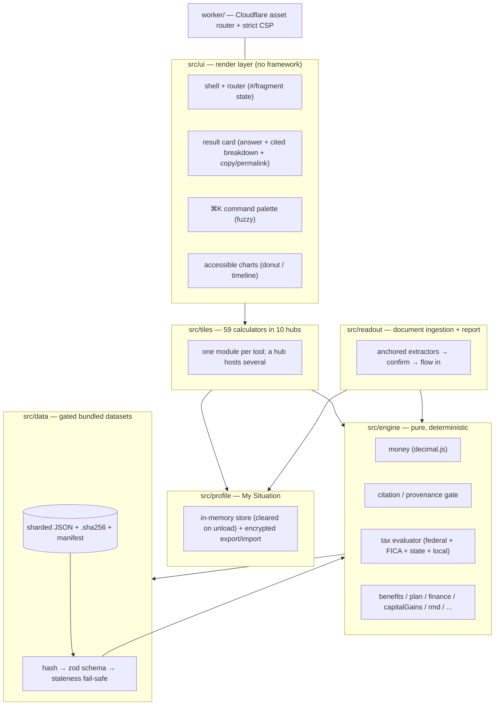
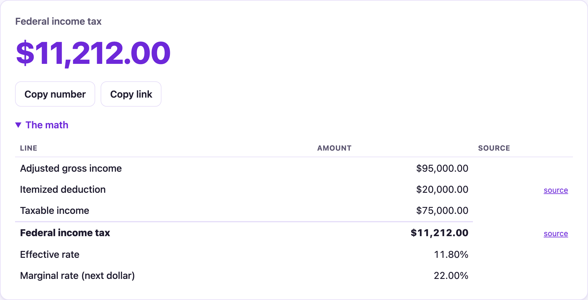
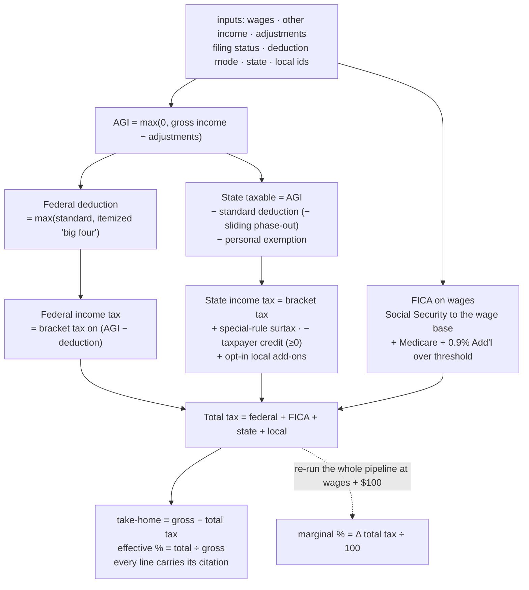
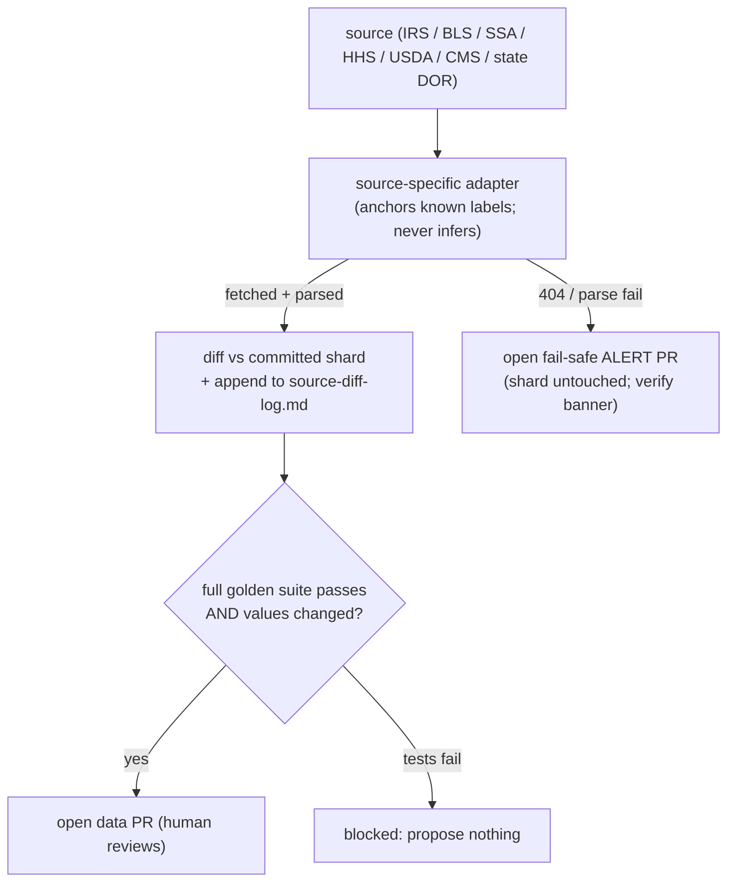
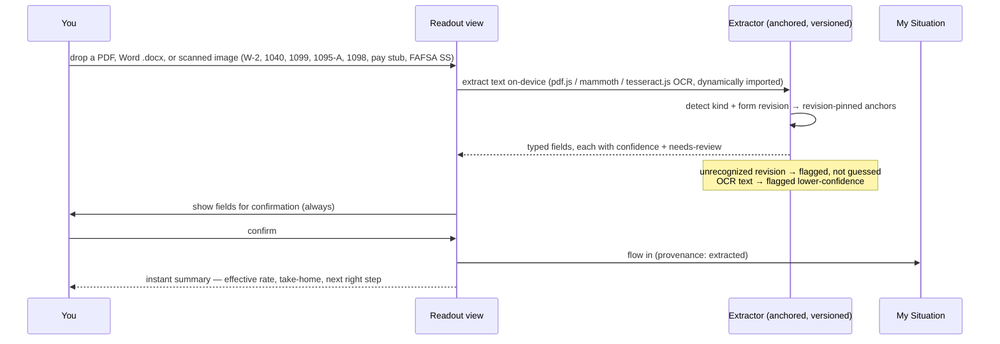
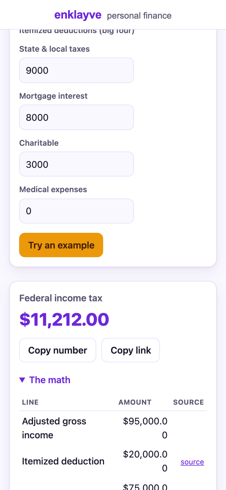
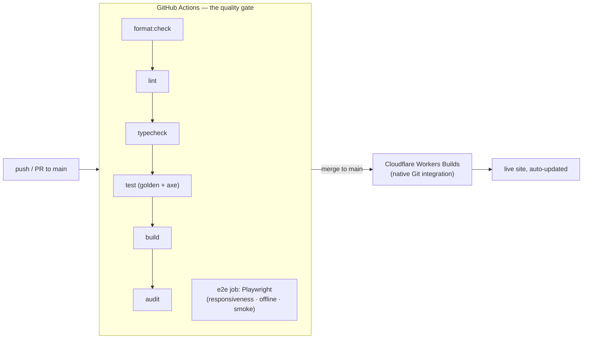

# enklayve

> Your private financial enclave. Every number is computed on your device. Nothing is ever sent anywhere.


[](https://github.com/clay-good/enklayve/actions/workflows/ci.yml)
[](LICENSE)
[](#determinism--verification)
[](#the-privacy-guarantee-its-literal)

enklayve is the honest money guidance the personal-finance experts charge for — your real take-home pay, what you owe in taxes, what public benefits you're owed, and your next right step — except it's **free, and it always will be.** No accounts, no ads, no cookie banner, no upsell. It's a free public utility for understanding your money: deterministic, private, and showing its work.

It's meant to feel like peace in a transactional web. Every figure is reproducible from public data bundled into the site, every rule links its source so you can verify it yourself, and there's zero telemetry, zero AI, and zero runtime network calls. The Content-Security-Policy sets `connect-src 'none'`: the browser physically cannot send your data out, even if a bug tried to.

Scope is the **United States** today (federal and state taxes and benefits); Europe, then India, China, and Russia are on the roadmap as each jurisdiction's rules are learned properly. enklayve is educational information, not financial, tax, investment, or legal advice.

See [docs/specs/SPEC.md](docs/specs/SPEC.md) (the vision + Phases 0–11), [docs/specs/SPEC-2.md](docs/specs/SPEC-2.md) (experience, ingestion, guidance + Phases 12–17), and [docs/specs/SPEC-3.md](docs/specs/SPEC-3.md) (the trust pass: robustness invariants, citation integrity, and the next-wave roadmap) for the full plan.

### By the numbers

A verifiable snapshot — every figure here is reproducible from the repo, not marketing.

| Metric | Value | Where to check |
|---|---|---|
| Deterministic calculators | **59** in **10 topic hubs**, plus the on-home anti-budget | [`src/tiles/registry.ts`](src/tiles/registry.ts) |
| Tax jurisdictions | **51 — every one of the 50 states + DC** (41 income-tax states + DC + 9 no-income-tax) | [`data/state-*-income-tax-*.json`](data) |
| Cited dataset shards | **74**, each with a sibling `.sha256` + manifest entry; every `sourceDocument` ≤160 chars (audit-enforced) | [`data/manifest.json`](data/manifest.json) |
| Tests | **958** unit/golden across 66 files, **+22** Playwright e2e | `npm run test` / `npm run test:e2e` |
| Runtime network requests | **0** — `connect-src 'none'` blocks them at the browser | [`worker/index.ts`](worker/index.ts) |
| Auto-persisted user data | **0** — only the locale preference touches `localStorage` | `npm run audit` |
| UI framework / runtime deps that phone home | **none** | [`package.json`](package.json) |

---

## Table of contents

- [What you can do with it](#what-you-can-do-with-it)
- [The privacy guarantee, it's literal](#the-privacy-guarantee-its-literal)
- [The home: the budget is the plan](#the-home-the-budget-is-the-plan)
- [Architecture at a glance](#architecture-at-a-glance)
- [The tax engine (the moat)](#the-tax-engine-the-moat)
- [The data layer and refresh workflows](#the-data-layer-and-refresh-workflows)
- [The Readout: deterministic document ingestion](#the-readout-deterministic-document-ingestion)
- [My Situation, the plan, and My Readout Report](#my-situation-the-plan-and-my-readout-report)
- [Determinism & verification](#determinism--verification)
- [Design language](#design-language)
- [Build status](#build-status)
- [Project layout](#project-layout)
- [Develop](#develop)
- [CI/CD and deploy](#cicd-and-deploy)
- [Design decisions worth knowing](#design-decisions-worth-knowing)
- [Roadmap & deliberately deferred](#roadmap--deliberately-deferred)
- [License](#license)

---

## What you can do with it

**59 deterministic calculators**, each with a worked example, per-figure citations, a plain-English "How this works," "Learn more" links, and deep-linkable URL state. They're grouped into **10 plainly-named topic hubs** (a hub is one page with a segmented control switching between its calculators; the underlying engine is shared, so a number entered in one tool prefills every other). The **anti-budget** that gives every dollar a job lives directly on the home — it *is* the plan, in written form. Reach any calculator by ⌘K search or the crawlable [All Tools index](#cicd-and-deploy), which lists **every calculator by name under its hub** (and the static `tools.html` mirror links each one's pre-rendered landing page, so all 69 pages are reachable in one hop, not just via the sitemap).



*The crawlable All Tools index — the full catalog, grouped by hub, each line a deep link. The same list is mirrored as static `tools.html` for search engines.*

### Paycheck & Taxes

| Tool | What it answers |
|---|---|
| Take-Home Pay | Your real net pay (federal + FICA + state + local) across all 50 states + DC — every U.S. jurisdiction is now modeled |
| W-4 Withholding & Refund Check | Is my withholding right? The per-paycheck tweak to land near $0 |
| Hourly ↔ Salary | Convert either way, with overtime and a second-job stack |
| Federal Income Tax | Marginal + effective breakdown, standard vs itemized (the big four) |
| Marginal Rate Explorer | What your next $1,000 of income actually costs |
| Paycheck Optimizer | Tax saved per $1,000 into a 401(k) vs an HSA |
| AMT Screener | A coarse yes/maybe/no on the Alternative Minimum Tax, with a Form 6251 pointer |
| Gift Tax Checker | Whether a gift is taxable, or sits under the annual exclusion / lifetime exemption |

### Self-Employed & 1099

| Tool | What it answers |
|---|---|
| Self-Employment Tax | The full 15.3%, the deductible half, the four 1040-ES installments |
| Quarterly Taxes & Set-Aside | What to skim off each 1099 payment; the safe-harbor minimum; the four 1040-ES due dates (next-business-day rule applied) |
| What Should I Charge? | Work backward from take-home to the billable hourly rate |
| 1099 Contract vs W-2 Salary | The rough salary a contractor rate equals |
| Self-Employed Retirement | SEP-IRA vs Solo 401(k), capped at the §415(c) limit |

### Investing

| Tool | What it answers |
|---|---|
| Capital Gains | Short-term stacked + long-term 0/15/20% bands + the 3.8% NIIT |
| Cost-Basis Lot Picker | FIFO / specific-ID realized gain, split short vs long |
| Tax-Loss Harvesting | Schedule D netting, the $3,000 offset, the carryforward |
| Child Tax Estimator | A child's investment income across the three IRC §1(g) bands |
| Compound Growth | Growth at a rate you supply (never a market prediction); opt-in ± range |
| Treasury I Bond | What a Series I savings bond earns and is worth (TreasuryDirect) |
| CPI Inflation Adjuster | What a past dollar is worth in another year (BLS CPI-U) |

### Retirement

| Tool | What it answers |
|---|---|
| Contribution Optimizer | 401(k)/IRA/HSA room left this year against IRS limits + catch-ups |
| Roth Conversion Ladder | The 5-year seasoning schedule and the bridge stream it builds |
| Backdoor / Mega-Backdoor Roth | The pro-rata rule; after-tax 401(k) room |
| IRA Deduction Checker | Whether your traditional-IRA contribution is deductible at your income (IRC §219(g) phase-outs) |
| Required Minimum Distribution | Balance ÷ the IRS Uniform Lifetime factor for your age |
| Retirement Drawdown & RMD Timeline | How long savings last, in today's dollars; opt-in ± range |
| Social Security Claiming Age | Benefit at 62 / FRA / 70 from the published SSA formula |
| Social Security Taxation | How much of your benefit is taxable — the IRC §86 0/50/85% provisional-income rule |
| Downshift Point | When you can stop adding savings and still arrive |

### Borrowing & Debt

| Tool | What it answers |
|---|---|
| Debt Freedom Planner | Snowball vs avalanche, the freedom date and interest for each |
| Loan & Mortgage Amortization | Full schedule + extra-payment what-ifs |
| Refinance Break-Even | Months to recoup the closing costs |
| Auto Loan & True Cost of Credit | Total of payments and the effective annual rate |
| Balance Transfer Break-Even | Net saving after the fee across the intro window |
| Freedom Date | The date a single balance is gone |

### Budgeting & Cash Flow

| Tool | What it answers |
|---|---|
| 50/30/20 Spending Plan | Needs / wants / savings from your take-home |
| Cash-Flow Timeline | The running daily balance and the tightest day |
| Sinking Fund Planner | The level monthly amount to reach a goal by a date |

> The full **zero-based budget** ("give every dollar a job until $0 is left to assign") is the home page itself — it auto-computes taxes through the same engine, splits the rest across living-expense and investing lines, and closes with the anti-budget order-of-operations. It needs no separate tile.

### Home & Big Purchases

| Tool | What it answers |
|---|---|
| Home Buying Readiness | The all-in price you can afford on the 28/36 guideline |
| Rent vs Buy | A net-cost comparison over a chosen horizon; opt-in ± range that can flip the verdict |
| College Cost Planner | The monthly contribution to fully fund it by enrollment; opt-in ± range |

### Insurance & Protection

| Tool | What it answers |
|---|---|
| Health Plan Chooser | The cheaper plan for a year of expected spend |
| Life Insurance Needs | The transparent DIME method |
| Disability Insurance Needs | The monthly income gap if you couldn't work |
| Umbrella Liability Coverage | Coverage sized to net-worth exposure |
| Estate & Beneficiary Checklist | The deterministic basics (not legal advice) |

### Benefits & Aid (What You're Owed)

| Tool | What it answers |
|---|---|
| What Am I Owed? (screener) | A plain-English list of likely-eligible programs + dollars |
| Federal Poverty Level | Your % of the FPL (contiguous / Alaska / Hawaii) |
| Earned Income Tax Credit | The estimate from the published phase-in/out |
| Child Tax Credit | CTC + the refundable Additional CTC |
| ACA Premium Tax Credit | The marketplace subsidy (you supply the benchmark premium) |
| Saver's Credit | 50/20/10% of capped contributions by AGI tier |
| SNAP Eligibility | The gross + net income tests and an estimated benefit |
| Medicaid Threshold | Adult MAGI eligibility by state |
| FAFSA Student Aid Index | The published need-analysis methodology, every step shown |
| Pell Grant | The award from the SAI |
| Education Credit Comparison | AOTC vs Lifetime Learning Credit — which saves more this year |

### Where You Stand

| Tool | What it answers |
|---|---|
| Peace of Mind | Rainy-day cushion, runway, net worth, My Enough Number, and the time to reach it — one calm view |
| Sabbatical / Big-Purchase Planner | What a break costs your runway |

---

## The privacy guarantee, it's literal

Most money sites are lead-generation businesses: you type your income, they route it to lenders and advertisers. enklayve routes **nothing**, and that is enforced at the network layer rather than promised in a policy.



- **`connect-src 'none'`** in the Content-Security-Policy means the page cannot open a network connection — no `fetch`, no `XHR`, no beacon, no websocket. A bug *cannot* exfiltrate your data because the browser refuses the connection.
- **No telemetry, no accounts, no third-party anything.** No analytics, no CDN fonts, no trackers. The only persisted state is your locale preference in `localStorage`.
- **Sensitive inputs never persist.** Income, balances, and parsed documents live in memory and are cleared on page unload (`pagehide`).
- **Datasets are bundled, not fetched.** Every shard is inlined at build time and re-verified in the browser against its content hash before use, so the running app knows exactly what it's computing from while staying offline-capable.
- The release audit (`npm run audit`) fails the build if any of these invariants is violated.

Two same-origin **workers** are the only carve-outs from `connect-src 'none'`, and each is allowed `connect-src 'self'` for the same reason — it fetches same-origin static assets only, has no server endpoint, and never touches your in-memory data: the **offline service worker** (`/sw.js`), which caches the shell, and the **OCR worker** (`/ocr/*`), which loads its wasm engine and bundled language model when you drop a scanned image. A worker's CSP comes from its own response, not the page's, so neither loosens any page — every page still serves `connect-src 'none'`.

---

## The home: the budget is the plan


*The home: a hero, the on-device Readout dropzone, and the anti-budget — income in, taxes auto-computed through the same `evaluateTaxes` engine, every remaining dollar given a job while "left to assign" falls to zero.*

The home is stripped to the essentials (redesigned through 2026-06-02; BUILD-SPEC-2 §0.7 and the later consolidation notes). The header is just the wordmark **enklayve** with the lowercase tagline *personal finance* — no theme toggle, no buttons. The body is three stacked zones: a one-line hero, the **Readout dropzone** (drop a pay stub / W-2 / tax form for an instant private readout, never uploaded), and then the centerpiece — the **anti-budget**. The budget takes an income at any pay frequency, a filing status, and a state, auto-computes taxes through the **same `evaluateTaxes` engine** the Take-Home tile uses, and lets you split the rest across living-expense and investing lines while a donut fills and "left to assign" falls toward zero. It closes with the plain-English **anti-budget order-of-operations** (automate everything, then fund things in order: full match → kill high-interest debt → six months of cash → 401(k)/IRA/HSA → brokerage → whatever future you believe in). There is no separate "My Plan" page anymore: **the live budget plus that order-of-operations *is* the plan.** Every other calculator is reached by the **⌘K command palette** or the crawlable **All Tools index** (linked in the footer).

```
+---------------------------------------------------------------+
|  enklayve  personal finance                                   |
|                                                               |
|                  Your money, made simple.                     |
|     Your real take-home, the taxes you owe, the benefits      |
|        you might be missing, and your next smart move.        |
|                                                               |
|   +-------------------------------------------------------+   |
|   |   Drop a pay stub, W-2, or tax form                   |   |
|   |        ->  instant private readout (never uploaded)   |   |
|   +-------------------------------------------------------+   |
|                                                               |
|   Your budget                          ╭───────────╮          |
|   Income [ $ 60,000 ] [Annually ▾]     │   donut   │          |
|   Filing [ Single ▾ ]  State [ ID ▾ ]  │  fills to │          |
|   Taxes (auto)        − $11,234        │    $0     │          |
|   Housing/Transport/Food/Debt/Other …  ╰───────────╯          |
|   Retirement / Brokerage …          Left to assign: $0        |
|                                                               |
|   The anti-budget: give every dollar a job …                  |
+---------------------------------------------------------------+
|  [Why enklayve]      [GitHub]          [♥ Clay Good]          |
+---------------------------------------------------------------+
```

Every U.S. income-tax state and DC is modeled, so selecting any state shows a real combined figure — no "not modeled yet" caveat anywhere. Every view is **vertical-scroll only on every device width** — form controls shrink inside their grid track (`min-width: 0`), wide "show the math" tables and chart timelines get their own contained horizontal scroll, and an `overflow-x: clip` backstop on both the content column *and the document root* guarantees the viewport itself never scrolls sideways. `viewport-fit=cover` + safe-area insets keep the chrome clear of the notch. A Playwright suite **measures** this — every view and all 59 calculators, from 320px to 1440px, plus landscape phones — so a regression fails CI rather than shipping.

---

## Architecture at a glance

A single static site. **No UI framework** — vanilla TypeScript with a tiny render layer keeps the bundle small and the determinism obvious. A pure engine at the core, a gated data layer feeding it, one module per tool on top, and a thin Cloudflare Worker that only serves assets and sets headers.



| Layer | Responsibility |
|---|---|
| `src/engine` | Exact decimal money math, the citation/provenance gate, the composable tax evaluator, and the per-domain math (benefits, finance, capital gains, RMD, Social Security, FAFSA, the guidance plan) |
| `src/data` | zod schemas for every dataset kind, content-hash integrity, and the per-dataset fail-safe gate (stale or corrupt → a verify banner, never a wrong number) |
| `src/tiles` | One module per calculator. Adding a tool never touches the shell |
| `src/ui` | Render layer, the light theme, result card, fuzzy palette, fragment router, accessible charts |
| `src/profile` | My Situation — the in-memory session profile and the portable encrypted export (surfaced in the Readout Report) |
| `src/readout` | Anchored document extraction, the confirm flow, and the downloadable Readout Report |
| `worker` | A minimal Cloudflare Worker: asset routing + the security headers |

---

## The tax engine (the moat)

A **declarative rule corpus, not a pile of conditionals.** Each jurisdiction is a typed JSON data file; **one generic evaluator** consumes any number of them. Adding a state means adding *data*, not code — which is how the engine stays maintainable across annual updates and how outside contributors can help safely.



*The engine's visible output. Every result opens "The math" by default — a breakdown whose third column links each statutory figure to its source (here, the IRS bracket schedule and the standard-deduction notice). Derived lines (effective rate, taxable income) carry no link by design; only sourced numbers do. Captured from the live app via `npm run screenshots`.*


**Anatomy of one evaluation.** [`evaluateTaxes`](src/engine/tax/evaluate.ts) is a pure function that composes the three tax bases in a fixed order, then measures the *combined* marginal rate the only honest way — by re-running the entire pipeline against a $100 wage probe, so bracket edges, the Social Security wage base, and the Additional Medicare threshold all register at once (no hand-derived marginal formula to drift).



- Seeded with **all 51 jurisdictions — every one of the 50 states and DC** — kept current through the staggered annual refresh (SPEC §14.3). **No-income-tax states are first-class records,** not omissions, so a resident sees their state by name with $0 state tax confirmed (and its citation), not a generic "no state tax modeled."
- **Per-filing-status schedules are supported** (the schema keys brackets by status and `bracketsFor` resolves each, with the QSS→MFJ→single fallback). New Jersey (different rates *and* thresholds), Minnesota (same rates, different thresholds), Kansas (a two-bracket schedule, single threshold vs. doubled-for-joint), and New Mexico (where head-of-household filers share the married-jointly schedule) all use it, so a state whose tiers differ by status is now data, not code.
- Handles ordered marginal brackets, filing statuses, standard vs itemized (the "big four": SALT capped, mortgage interest, charitable, medical above the floor), FICA with the wage base + 0.9% Additional Medicare, personal exemptions, special rules (e.g. the CA mental-health surtax), top-bracket surtaxes (e.g. the MA 4% millionaire surtax, modeled as a clean second bracket), a **taxpayer tax credit** that stands in for a standard deduction (Utah: a nonrefundable credit equal to a share of the federal deduction, phasing out with income), a **sliding standard deduction** that phases down as AGI rises (South Carolina's SCIAD), a **federal-income-tax deduction** — the "federal tax paid" subtraction, either uncapped (the Alabama shape) or capped and AGI-phased (the Oregon shape), computed from the engine's own federal figure so the marginal probe stays honest — a **high-income benefit recapture** that adds a flat amount phasing in over an income band — one ramp for all statuses (Arkansas's bracket adjustment) or per-status stacked ramps (Connecticut's 2% phase-out add-back + tax recapture, which claw back the lower-bracket benefit toward a flat 6.99%), a **percent-of-tax personal credit** that slides down with AGI in a step table (Connecticut's Table E), opt-in local add-ons (NYC, Yonkers, Ohio municipalities), and a **mandatory residence-based local tax** — Maryland's county / Baltimore-City income tax, a required single-select set by county of residence (flat or, for Anne Arundel and Frederick, income-tiered).
- **Filing-status fallback:** the seeded states define single / married-jointly / head-of-household; the other two resolve correctly — **qualifying surviving spouse → the married-jointly schedule** (federally and in essentially every state, so it's never silently taxed as single), and married-filing-separately → single (the documented state-level assumption). Federal defines all five explicitly.
- **Fail-safe is per jurisdiction:** if the California source is stale, California shows a verify banner while every other jurisdiction keeps working.

### State coverage cheat sheet

Every seeded state is modeled at one consistent launch fidelity — **brackets + standard deduction + personal exemption** (plus the documented capability each state needs: a taxpayer credit, a sliding deduction, a federal-tax deduction, or — Maryland — a mandatory county local tax), cross-checked against the Tax Foundation's 2026 state-rate table and cited to the state DOR — with state-specific credits, optional municipal add-ons, and state itemized deductions deferred to a later wave.

| Shape | States | How it's modeled |
|---|---|---|
| Graduated brackets (one schedule, all statuses) | CA, NY, DC, OH, VA, MO, DE, RI | Ordered marginal tiers; CA adds the 1% mental-health surtax, OH the opt-in Columbus municipal tax, VA stacks a $930 personal exemption on its standard deduction, MO runs eight compressed tiers (0%→4.7%) over a federal-conformity deduction, DE runs seven tiers (0%→6.6%) over a small statutory $3,250/$6,500 deduction with the *same* brackets for joint filers — a built-in marriage penalty. RI (3.75/4.75/5.99%) keeps uniform brackets but stacks *both* a standard deduction and a $5,250-per-taxpayer exemption (the VA stack on a uniform schedule). WV (2.11→4.58%, the 2026 5% cut) runs five uniform tiers with NO standard deduction and a $2,000-per-exemption personal exemption |
| Graduated, **schedule differs by filing status** | NJ, MN, KS, NM, OK, HI, MT, ND, VT, NE | NJ: single/MFS run a 7-bracket schedule, MFJ/HoH/QSS an 8-bracket one (an extra 2.45% tier); no standard deduction, a $1,000 exemption ($2,000 joint). MN: same four rates (5.35–9.85%) but single/MFJ/HoH thresholds all differ, over an indexed standard deduction. KS: two rates (5.20%/5.58%) crossing at $23,000 single / $46,000 joint (SB 1), over a standard deduction *and* a $9,160/$18,320 exemption. NM: six rates (1.5–5.9%, HB 252) where head-of-household and surviving-spouse filers share the married-jointly schedule (NM has no separate HoH schedule), over the federal-conformity deduction. OK: three rates (2.5/3.5/4.5%, HB 2764 2026) over a 0% band, single thresholds doubled for joint/HoH/surviving-spouse, plus a $6,350/$12,700/$9,350 deduction and $1,000/exemption. **HI: twelve brackets (1.40%→11.00%, the most of any state)** where the thresholds derive by a fixed statutory ratio — MFJ exactly 2× single, HoH exactly 1.5× single (Act 46 2024) — over an $8,000/$16,000/$12,000 standard deduction and a $1,144 exemption. **MT: two rates (4.70%/5.65%, HB 337 2025) on federal taxable income** (conformity, federal standard deduction embedded) with the 4.70% bracket running to $47,500 single / $95,000 joint (2×) / $71,250 HoH (1.5×). **ND: a 0% band then two rates (1.95%/2.50%, SB 2034) on federal taxable income** (conformity) — the lowest top rate of any wage-taxing state — where, unlike MT/HI's clean ratios, the per-status thresholds index independently (1.95% opens at $49,575 single / $82,800 joint / $66,400 HoH; the 0% band means a single filer at $60k taxable owes $0). **VT: four rates (3.35/6.60/7.60/8.75%, 32 V.S.A. §5822)** over per-status thresholds (single 6.60% at $49,400 / joint at $82,500 / HoH at $66,200, climbing to 8.75% over $249,700 / $304,000 / $276,850) — over the Rhode Island/Virginia stack: a $7,650/$15,300/$11,450 standard deduction *and* a $5,300-per-exemption personal exemption (one single/HoH, two joint). **NE: three rates (2.46/3.51/4.55%, LB 754) for 2026** — the 2025 schedule's top two rates (5.01%/5.20%) both cut to 4.55% and merged — over per-status thresholds (single 4.55% over $24,120, joint over $48,250, HoH over $38,590) and a $8,600/$17,200/$12,600 standard deduction; the ~$171 per-person exemption *credit* is omitted at launch fidelity. The engine resolves brackets per status — adding such a state is now data, not code |
| Flat rate | PA (3.07%), IL (4.95%), MI (4.25%), GA (4.99%), NC (3.99%), AZ (2.50%), CO (4.40%), IN (2.95%), KY (3.50%), ID (5.30%), LA (3.00%), IA (3.80%) | A single bracket; standard deduction and/or personal exemption where the state grants one. ID and IA conform to the federal standard deduction (the CO pattern); LA grants a large $12,875 / $25,750 standard deduction ($25,750 for head of household too) |
| Flat + top surtax | MA (5.0% + 4% over $1,107,750) | Two brackets — the surtax is just the top marginal tier |
| Flat over a floor | MS (4.0% over the first $10,000) | A `[{0, 0%}, {10000, 4.0%}]` schedule — the exempt floor is the zero-rate tier |
| Flat + taxpayer credit | UT (4.45%) | Taxes federal AGI directly, then subtracts a nonrefundable taxpayer tax credit (6% of the federal deduction, phasing out at 1.3% of income over a filing-status base) — the credit stands in for a standard deduction |
| **Sliding standard deduction** | SC (1.99% / 5.21% over $30k), WI (3.50→7.65%), ME (5.8→7.15% + 2% surtax) | A deduction that phases down as income rises, two forms of the engine's `standardDeductionPhaseOut` field. **SC** (`divisor` form): the SCIAD ($15k/$30k/$22.5k) is reduced *proportionally* — by `deduction × (AGI − threshold)/divisor` (single $40k→$95k, etc.), rounded down to the next-lowest $10 (H.4216). **WI** (`reductionRate` form): a $13,960/$25,840 maximum reduced by a *flat percentage of AGI* above a threshold — 12% over $20,119 (single, gone by $136,453), 19.778% over $29,039 (joint, gone by $159,690), independent of the deduction's size (Wis. Stat. §71.05(23)); WI also stacks a $1,200-per-exemption personal exemption. **ME** (`divisor` form, read straight from 36 M.R.S. §5124-C): $15,700/$31,400/$23,550 reduced by `deduction × (AGI − threshold)/divisor`, divisors $75k/$112.5k/$150k (single $102,250→$177,250, etc.), over per-status brackets (MFJ 2× / HoH 1.5× single), a $5,300 exemption, and a new 2026 9.15% millionaire-surtax bracket |
| **Federal income tax deduction** | AL (uncapped), OR (capped + AGI-phased) | The "federal tax paid" subtraction against *state* taxable income, computed from the engine's own federal figure so the marginal probe stays honest. **AL**: 2/4/5% graduated (Ala. Code §40-18-5), the **full** federal tax deductible (§40-18-15(a)(1)), over a sliding standard deduction that floors at $2,500/$5,000 ($3,000/$8,500/$5,200 max). **OR**: 4.75→9.9% graduated (ORS §316.037), the federal-tax subtraction **capped at $8,500** ($4,250 MFS) and **phased out by AGI** — full below $125k single / $250k joint, gone by $145k / $290k (OR-40 Table 4, ORS §316.680/§316.695) — over a $2,835/$5,670/$4,560 standard deduction |
| **Mandatory residence-based local tax** | MD (state 2%→6.5%, plus a county tax 2.25%–3.30%) | The one state where a county income tax is *mandatory*, set by county of residence — not opt-in like NYC. Modeled via the engine's `residenceLocalTax`: the take-home tile renders a required single-select **county** dropdown (defaulting to Montgomery), and the engine applies the chosen county's rate to Maryland taxable income. 22 counties are flat; **Anne Arundel and Frederick are income-tiered** (modeled with per-bracket local add-ons). The per-status state schedule runs 2%→6.5% (the FY2026 bill adding 6.25%/6.5% tops over $500k/$1M single, $600k/$1.2M joint) over a fixed $3,350/$6,700 standard deduction and a $3,200/$6,400 exemption |
| **High-income benefit recapture** | AR (0/2/3/3.4/3.9% + a bracket adjustment) | A *uniform* graduated schedule (same brackets for every status, like DE/WV), but above ~$94,700 of net taxable income the **bracket adjustment** recaptures the benefit of the lower 0–3.4% brackets, converging to a near-flat 3.9%. Modeled via the engine's `incomeRecapture`: a flat amount ramping linearly from $0 (at $94,700) to a constant **$329** (at $97,900), added to the bracket tax — exact below the band and above it (matching the AR1000F "$3,809 + 3.9% over $100,000" note to the cent), with a ≤~$15 residual only inside the band. Standard deduction $2,470/$4,940; the low-income tables and the $29 personal credit are omitted (conservative) |
| **Full multi-stage computation** | CT (2%→6.99%, the deepest schedule modeled) | The whole CT-1040 Tax Calculation Schedule (Tables A–E): a seven-rate per-status schedule over a personal exemption ($15k/$24k/$19k) that **phases out dollar-for-dollar** (`standardDeductionPhaseOut`, reductionRate 1.0); **two stacked high-income recaptures** — the 2% phase-out add-back (Table C) and the tax recapture (Table D) — via per-status `incomeRecapture` stages that claw back the lower-bracket benefit toward a flat 6.99%; and a **percent-of-tax personal credit** (Table E, 0.75→0 by AGI) via the `personalCreditRate` step table, so `tax = (B + C + D) × (1 − credit)`. Exact to the cent against the official schedule (apart from a ≤ one-step residual inside each recapture ramp) |
| No income tax | TX, FL, AK, NV, NH, SD, TN, WA, WY | First-class records: empty brackets, $0 confirmed, citation noting any non-wage tax (e.g. WA's capital-gains excise) |

**Idaho** models like Colorado (a clean 5.3% flat tax over the federal-conformity standard deduction, HB 40 2025). **Utah** joined once the engine learned the **taxpayer tax credit** it needs: Utah grants no standard deduction, so it taxes federal AGI at a flat **4.45%** (SB 60, 2026, cutting the 4.5% 2025 rate) and gives relief through a *nonrefundable* credit — 6% of the federal deduction, reduced by 1.3% of taxable income above a filing-status base ($18,213 single / $36,426 married jointly), floored at zero. That phase-out raises the effective marginal rate in its band (the engine's wage probe measures it correctly), and below ~$21k the credit cancels the tax entirely. The optional `taxpayerCredit` field on the jurisdiction schema carries it as data, so the one generic evaluator stays the moat. The $2,111-per-dependent personal exemption that would enlarge the credit is omitted (the engine models the no-dependent filer, like every state), so the figure errs slightly high — the conservative side.

**Louisiana** joined via its 2024 reform (Act 11), which collapsed the graduated 1.85%/3.5%/4.25% schedule into a clean **3% flat tax** and raised the standard deduction to **$12,875 single / $25,750 married jointly** — and, unusually, **$25,750 for head of household too** (the federal split puts HoH below MFJ). It needed no engine change (flat rate + standard deduction, the Georgia pattern). Those are the 2026 CPI-indexed amounts (the $12,500/$25,000 2025 base grown 3.0% under Act 11's annual adjustment), cross-checked against the Tax Foundation 2026 table.

**Iowa** joined via Senate File 2442 (2024), which finished Iowa's move to a flat **3.8%** for 2025 and after, over the **federal-conformity standard deduction** ($16,100 / $32,200 / $24,150) — the same shape as Idaho and Colorado, so again no engine change. Iowa's small $40 single / $80 married personal-exemption *credit* and its opt-in local school-district surtaxes are omitted at launch fidelity (like every state's credits and county/municipal add-ons), so the figure errs slightly high by at most $40/$80 — the conservative side.

**Connecticut** (the **51st jurisdiction**, ~3.6M residents) is **the last U.S. income-tax state — with it, every one of the 50 states + DC is modeled** — and the deepest single tax computation the engine performs. Connecticut runs the entire CT-1040 **Tax Calculation Schedule**, Tables A through E, every figure read verbatim from the official 2025 form: Connecticut income tax = **(Table B initial tax + Table C 2% add-back + Table D recapture) × (1 − Table E credit)**. Four mechanisms had to compose correctly. **(A) The personal exemption** — $15,000 single / $24,000 joint / $19,000 head of household — **phases out dollar-for-dollar** (reduced $1,000 per $1,000 of AGI over $30k/$48k/$38k, gone by $44k/$71k/$56k), modeled by reusing the engine's `standardDeductionPhaseOut` with `reductionRate` 1.0. **(B) The seven-rate schedule** (2% / 4.5% / 5.5% / 6% / 6.5% / 6.9% / 6.99%, per status). **(C + D) Two stacked high-income recaptures** that claw back the benefit of the lower brackets so the top earners pay a near-flat 6.99% — the 2% phase-out add-back (max $250/$500/$400) and the tax recapture (max $3,400/$6,800/$5,320). These generalized the Arkansas `incomeRecapture` capability to **per-status stacked ramps**; because the exemption is fully phased out before any recapture begins, taxable income equals AGI throughout the recapture range, so the model matches Tables C/D exactly (apart from a ≤ one-step residual inside each ramp). **(E) A percent-of-tax personal credit** that slides from 0.75 down to 0 as AGI rises in published steps — *essential*, because a $60,000 single filer gets a 10% credit that a bare-bracket model would silently drop. This needed a new `personalCreditRate` step table per filing status, applied as `tax × (1 − rate)` after the recapture. Verified against the official 2025 CT-1040 Tax Calculation Schedule (Tables A–E) and Conn. Gen. Stat. §12-700, cross-checked against the Tax Foundation 2026 table; **golden-tested to the cent across the whole income range** (single $25k → **$130.00** with a full exemption + 35% credit, single $40k → $1,192.50 with a partial exemption, single $60k → **$2,312.50** as the 2% add-back begins, single $100k → $4,991.67 past the credit cutoff, single $300k → $19,812.07 into the Table D recapture, MFJ $40k → $208.00, MFJ $80k → $2,790.00, MFJ $500k → $30,862.07 with both recaptures stacked, HoH $60k → $2,070.00, MFS = single, QSS = joint), plus synthetic isolation tests of the recapture stages and the credit table. Married filing separately maps to single (its slightly different exemption / Table C band / credit steps the documented rare-status approximation); the property-tax credit, EITC, and pass-through-entity-tax credit are omitted at launch fidelity; no local income tax. **With Connecticut, the fifty-state moat is complete — every U.S. income-tax state and DC is modeled, cited, and golden-tested.**

**Arkansas** (the **50th jurisdiction**, ~3.1M residents) brings coverage to every U.S. income-tax state but one, and it needed the session's one new capability: a **high-income benefit recapture**. Arkansas's rate schedule (Ark. Code §26-51-201) is *uniform* across filing statuses — it does not double the brackets for couples — running 0% on the first $5,599 of net taxable income, then **2% / 3% / 3.4% / 3.9%** over $5,600 / $11,200 / $16,000 / $26,400, read verbatim from the official **2025 AR1000F Regular Income Tax Table** (which reconciles to the dollar: net taxable $61,000 → $1,961). Its signature is the **bracket adjustment**: above ~$94,700 of net taxable income Arkansas claws back the benefit of those lower brackets, so a high earner's tax converges to a near-flat 3.9% schedule. The engine gained an `incomeRecapture` block — a flat amount that ramps linearly from $0 (at $94,700) to a constant **$329** (at $97,900) and stays $329 above — derived *exactly* from the table's own "$3,809 + 3.9% of the excess over $100,000" note: the graduated tax at $100,000 is $3,480.00, so the recapture is precisely $3,809 − $3,480 = **$329**. That makes the model **exact below the band and above it** — every high income matches the AR1000F note to the cent — with only a ≤~$15 linear-vs-step residual inside the narrow $94,700–$97,900 phase-in band. The standard deduction is **$2,470** ($4,940 married jointly); married filing separately maps to single, a qualifying surviving spouse to married jointly. Omitted at launch fidelity, all conservative (errs high): the **Low Income Tax Tables** (which zero out tax below $14,643 of AGI for a single filer, so the engine over-taxes the lowest earners by ≤~$141), the $29-per-person personal credit, and Arkansas's 2026 indexing (the latest-published 2025 schedule is used — the CA/VT/NE precedent; the 3.9% top rate held and thresholds index ~2-3%/year). Verified against the official 2025 AR1000F table and Ark. Code §26-51-201, cross-checked against the Tax Foundation 2026 table; golden-tested across every region of the schedule (single $60k → **$1,823.67**, single $15k → $151.90 in the low brackets, single $90k → $2,993.67 just below the recapture, single $97,170 → $3,273.30 exactly at the $94,700 floor with no recapture, single $99k → $3,532.82 mid-band, **single $130k → $4,882.67 with the full $329 recapture, exact against the table note**, MFJ $60k → $1,727.34, MFS = single, QSS = joint), plus a synthetic isolation test of the recapture ramp and its schema guard. Its refresh adapter anchors the standard deduction; the brackets, the recapture band, and the $29 credit are the reviewer's data-only step. *(Connecticut has since shipped as the 51st — every one of the 50 states + DC is now modeled.)*

**Maryland** (the **49th jurisdiction**, ~6.2M residents) was the deferred state that needed a genuinely new *capability*: a **mandatory, residence-based local income tax**. Every Maryland resident pays a county (or Baltimore City) income tax set by **where they live**, not where they work — unlike the opt-in NYC/Yonkers/Columbus add-ons, where a resident checks the one that applies. So the engine gained a `residenceLocalTax` block: when a state carries it, the take-home tile renders a **required single-select county dropdown** (defaulting to Montgomery, the most populous county, at 3.20%) rather than checkboxes, and the evaluator applies the chosen county's rate to Maryland taxable income. The 2026 county rates run **2.25%** (Worcester) to **3.30%** (Dorchester, Kent — the FY2026 budget bill raised the cap from 3.20%), all 24 jurisdictions read from the official Comptroller of Maryland 2026 withholding memo; **Anne Arundel and Frederick adopted income-tiered local rates** (Anne Arundel 2.70%/2.94%/3.20%, Frederick 2.25%/2.75%/2.96%/3.20%), modeled with the engine's existing per-bracket local add-on. The **state** schedule is ten per-status rates — 2% / 3% / 4% / 4.75% / 5% / 5.25% / 5.5% / 5.75% / **6.25% / 6.5%** (the last two added by the FY2026 bill, HB 352, over $500k/$1M single, $600k/$1.2M joint) — over the fixed **$3,350 / $6,700** standard deduction the 2025 session set and a **$3,200 / $6,400** personal exemption. Verified against the Comptroller memo and Md. Code Tax-Gen §10, cross-checked against the Tax Foundation 2026 table; golden-tested to the cent (single $60k in Montgomery → **state $2,486.38 + local $1,710.40**; the county swap to Worcester drops the local line to $1,202.63 with the state line unchanged; Anne Arundel's tiered rate → $1,451.43, Frederick's → $1,352.12; MFJ $60k → state $2,175.25; single $200k → state $9,649.75 into the 5.5% bracket; MFS = single, QSS = joint), plus a UI test that the county selector is a required single-select defaulting to Montgomery and deep-links the choice. Launch-fidelity residuals, all disclosed: the personal-exemption phase-out (above $100k single / $150k joint federal AGI — the full $3,200/$6,400 is exact below it, where most filers sit, the RI/VT/ME precedent), the Anne Arundel/Frederick tiers modeled on their single-filer thresholds (exact for single, ≤~$345 conservative for a high-income joint filer in those two counties), the new 2% net-capital-gains surtax (never reached by the wage engine), and the local EITC. As with NYC for New York, the marginal-rate and optimizer tiles show Maryland **state + federal only** (they omit all local taxes by design); the take-home tile carries the county tax. Its refresh adapter anchors the standard deduction; the per-status brackets and the county-rate chart are the reviewer's data-only step. *(Arkansas and Connecticut have since shipped as the 50th and 51st — all 50 states + DC are now complete.)*

**Nebraska** (the **48th jurisdiction**, ~2.0M residents) is a clean per-filing-status data-only add — proof the bracket-by-status capability keeps paying off. Its 2023 **LB 754** reform set a multi-year rate-cut path (top rate 5.84% in 2024 → 5.20% in 2025 → **4.55% in 2026** → 3.99% in 2027), and for 2026 the statute (Neb. Rev. Stat. §77-2715.03) drops **both** of the 2025 schedule's top two rates — the 5.01% and 5.20% bands — to 4.55%, collapsing a four-bracket schedule into a clean **three-bracket** one: **2.46% / 3.51% / 4.55%**. The two lower rates and every threshold are read verbatim from the **official 2025 Nebraska Tax Calculation Schedule** (Form 8-460-2025): single 4.55% over **$24,120**, married jointly/QSS over **$48,250**, head of household over **$38,590** (the 2.46%/3.51% breakpoints at $4,030/$8,040/$7,510), and the base-tax figures reconcile **to the cent** (the single 4.55% band opens at $24,120 on a cumulative base of $804.30 = 2.46%·4,030 + 3.51%·20,090). The **2026 rate (4.55%) is the statutory LB 754 value** — definitively in effect, not a forecast — while the bracket thresholds and the **$8,600 / $17,200 / $12,600** standard deduction use the latest-published official **2025** figures, because Nebraska's DOR had not yet posted the 2026 indexed schedule at retrieval; the thresholds index ~2-3% a year, so using the 2025 ones under-indexes slightly and **errs slightly high** — the conservative side, the California/Vermont precedent. **Married filing separately maps to single exactly** (Nebraska's MFS schedule and $8,600 deduction match single); a qualifying surviving spouse falls back to the married-jointly schedule. It needed **no engine change**. Nebraska's relief for personal exemptions is a nonrefundable **~$171-per-person credit** (§77-2716.01), not a deduction — the engine has no flat-credit mechanism, so it is omitted at launch fidelity (a flat ≤$171 overstatement, the conservative side, like Oregon's exemption credit). Verified against the official 2025 Tax Calculation Schedule, the Form 1040N booklet, and §77-2715.03, cross-checked against the Tax Foundation 2026 table; golden-tested (single $60k → **$2,045.54**, single $20k → $357.83 in the 3.51% band, single $100k → $3,865.54 in the 4.55% band, MFJ $60k → $1,417.86, HoH $60k → $1,676.51, MFS = single, single > joint, QSS = joint). The child/dependent-care and earned-income credits, the now-exempt Social Security income, and the property-tax-paid credit (Form PTC) are omitted at launch fidelity; no local income tax. Its refresh adapter anchors the indexed standard deduction; the per-status bracket tables and the scheduled 2027 cut to 3.99% stay the reviewer's data-only step. *(Maryland, Arkansas, and Connecticut have since shipped as the 49th–51st — all 50 states + DC are now complete.)*

**Alabama** (the **46th jurisdiction**, ~5.1M residents) and **Oregon** (the **47th**, ~4.2M) shipped together because both needed one engine capability the project built ahead of the data: a **federal income tax deduction** — the "federal tax paid" subtraction, taken against *state* taxable income and computed from the engine's *own* federal figure for the same filer, so the combined marginal-rate probe captures the interaction automatically. Alabama uses the **uncapped** form, Oregon the **capped-and-AGI-phased** form.

**Alabama** runs three statutory, unindexed rates (Ala. Code §40-18-5) — **2% / 4% / 5%**: single, married-filing-separately, and head-of-family filers pay 2% on the first $500, 4% to $3,000, 5% above; married-jointly filers get doubled bands ($1,000 / $6,000), so **head of family uses the single rate schedule**, not the doubled one. Alabama taxable income = Alabama AGI (≈ federal AGI for wages) − standard deduction − personal exemption − **the full federal income tax** (§40-18-15(a)(1)). Its standard deduction is the sliding Form 40 chart (§40-18-15(b)): a maximum of **$3,000 single / $8,500 joint / $5,200 head of family / $4,250 MFS** that slides down — by $25 / $175 / $135 / $87.50 per $500 of AGI over $25,500 — to a **non-zero floor** of $2,500 (single/HoH/MFS) or $5,000 (joint) at AGI $35,500. That floor is a *new* shape: the existing `standardDeductionPhaseOut` only slid a deduction to **zero**, so the engine gained an optional per-status **`floor`** (additive and gated, so the other 45 jurisdictions are untouched) — every Alabama status phases over the same $25,500→$35,500 band at its own rate (single 5%, head of family 27%, joint 35% of AGI over $25,500), each landing on its floor at exactly $35,500. The personal exemption is **$1,500** (single/MFS) / **$3,000** (joint/head of family), §40-18-19. Verified against the Alabama DOR Form 40 standard-deduction chart and Ala. Code §§40-18-5/-15/-19, cross-checked against the Tax Foundation 2026 table; golden-tested across the floor (single $25k → $940.50 with the full $3,000 deduction below the phase-out, single $30k → $1,175.25 mid-phase-out, single $60k → **$2,509.00** at the $2,500 floor deducting the full $5,020 federal tax, joint $60k → $2,378.00, head of family → $2,487.60, QSS = joint). The continuous phase-out understates the deduction by at most one $500 step (≤ ~$9 of tax) inside the band, always the conservative direction; the per-dependent exemption (which slides $1,000→$300 by AGI) and municipal occupational taxes are omitted at launch fidelity. Its refresh adapter anchors the deduction maximums (the figure last moved by Act 2022-292).

**Oregon** is the harder shape — the federal-tax subtraction is **capped and AGI-phased**. Its four rates (ORS §316.037) — **4.75% / 6.75% / 8.75% / 9.9%** — sit over per-status thresholds read from the official **2025 Form OR-40 rate charts**: Chart S (single / MFS) 4.75% to $4,400, 6.75% to $11,100, 8.75% to $125,000, 9.9% above; Chart J (joint / head of household / surviving spouse) doubles the lower two ($8,800 / $22,200, top $250,000). These reconcile **to the cent** against the charts' published base figures (the single 8.75%-band base **$4,065.00** = 4.75%·4,400 + 6.75%·6,700 + 8.75%·38,900). Oregon taxable income = AGI − standard deduction (**$2,835 / $5,670 / $4,560**) − a **federal income tax subtraction** that is **capped at $8,500** ($4,250 MFS) and **phases out linearly with AGI** per the OR-40 **Table 4** — full below $125,000 (single/MFS) / $250,000 (joint/HoH/QSS), zero at $145,000 / $290,000 — modeled via the cap-plus-phase-out form of `federalTaxDeduction` (the evaluator subtracts `min(federal tax, cap-after-phase-out)`). Oregon's $256-per-person exemption relief is a nonrefundable **credit**, not a deduction, so it is omitted at launch fidelity (a flat ≤$256 overstatement, the conservative side, like every state's credits). The 2025 figures are carried to 2026 — Oregon hadn't posted indexed 2026 *annual* schedules at retrieval (only the 2026 withholding formulas), the California/Vermont precedent, a slight under-index erring **high** — while the $125k/$250k bracket top and the phase-out band are **statutory-fixed** (ORS §316.037/§316.695), unchanged. Verified against the 2025 OR-40 instructions (rate charts + Table 4) and ORS §§316.037/316.680/316.695, cross-checked against the Tax Foundation 2026 table; golden-tested (single $60k → **$4,252.69** subtracting the full $5,020 federal tax, joint $60k → $3,885.38, HoH → $3,885.55, single $30k → $1,942.69 where the subtraction equals the federal tax itself rather than the cap, single $135k → $10,916.09 with the cap halved to $4,250 mid-band, single $160k → $13,811.84 with the subtraction fully phased out, **MFS $60k → $4,320.06 showing the $4,250 cap bind**, QSS = joint). With Alabama and Oregon, the **federal-tax-deduction capability is no longer a waiting test fixture — it ships in production data,** leaving four income-tax jurisdictions (Maryland, Connecticut, Arkansas, Nebraska) before every one of the 50 states + DC is complete.

**Maine** (the **43rd jurisdiction**, ~1.4M residents) is the *third* state to use the engine's **sliding standard deduction** — with the phase-out read verbatim from statute. Maine's three rates (36 M.R.S. §5111) — **5.8% / 6.75% / 7.15%** — sit over per-status thresholds (married jointly **2× single**, head of household **1.5× single**): single 6.75% at $27,400, 7.15% at $64,850. Effective 2026, Maine adds a **new 2% surcharge** on income above $1M (single) / $1.5M (joint/HoH), modeled as a **9.15%** top bracket (the Massachusetts-millionaire shape). It subtracts **both** a standard deduction (**$15,700 / $31,400 / $23,550**) **and** a **$5,300-per-exemption** personal exemption, and the standard deduction **phases out** exactly per §5124-C(2) — reduced by `deduction × (Maine AGI − threshold) ÷ divisor`, thresholds **$102,250 / $153,400 / $204,550**, divisors **$75,000 / $112,500 / $150,000** (so it reaches zero at $177,250 / $265,900 / $354,550) — modeled with the existing `standardDeductionPhaseOut` divisor form, **no engine change**. The *separate* personal-exemption phase-out (§5126-A, applicable only above ~$341,000) is omitted at launch fidelity: the one non-conservative residual (≤ ~$485), at incomes where the standard deduction is already fully gone (the MN/RI high-income-phase-out precedent). Both phase-out statutes were read in full from the Maine Legislature PDFs to get the divisors exact. Cited to the MRS 2026 rate schedule (revised May 5, 2026) and 36 M.R.S. §§5111/5124-C/5126-A; golden-tested (single $60k → $2,372.20, **single $120k → $6,824.47 exercising the phase-out**, MFJ $120k → $4,743.93, HoH $90k → $3,737.18, single > joint, QSS = joint). The age/blindness additional deduction, the dependent-exemption credit, and other Maine credits are omitted at launch fidelity — the figure errs slightly high. No local income tax. *(Nebraska was deferred at the time Maine shipped — its 2026 indexed schedule was unpublished — but has since shipped as the **48th**, once its statutory 2026 LB 754 rate over the official 2025 schedule gave a clean, verifiable figure.)*

**Montana** (the **42nd jurisdiction**, ~1.1M residents) is a clean **federal-taxable-income conformity** add (the Idaho/Iowa/North Dakota pattern). Montana's 2021 **SB 399** reform replaced six progressive brackets with a **two-rate** schedule computed on **federal taxable income** — the federal standard deduction *is* the starting point — and **HB 337 (2025)**, billed as the largest income-tax cut in state history, cut the top rate from 5.90% to **5.65%** for 2026 (→ 5.40% in 2027) and widened the **4.70%** bracket. For 2026 the 4.70% rate runs to **$47,500** (single), **$95,000** (joint, exactly 2× single), and **$71,250** (head of household, exactly 1.5× single); **5.65%** applies above. The engine models it as conformity — Montana taxable income = AGI − the federal standard deduction ($16,100 / $32,200 / $24,150 for 2026), then the two-rate per-status schedule — so it needed **no engine change**, and **married filing separately maps to single exactly**. Cited to the Montana DOR HB 337 guidance, MCA §15-30-2103, and the Tax Foundation 2026 table; golden-tested (single $60k → $2,063.30 all in the 4.70% band, single $120k → $5,419.10 crossing to 5.65%, MFJ $120k → $4,126.60 on the 2× threshold, HoH $100k → $3,608.65 crossing the 1.5× threshold, single > joint, QSS = joint). Montana's preferential 7.25%-equivalent **net long-term capital-gains rate** (which the wage engine never reaches), its credits, and any Montana-specific addbacks are omitted at launch fidelity — the figure errs slightly high. No local income tax.

**North Dakota** (the **44th jurisdiction**, ~0.8M residents) is the *fourth* federal-taxable-income conformity add (the Idaho/Iowa/Montana pattern) and the **lowest top rate of any state that taxes wage income**. North Dakota's 2023 **SB 2034** reform replaced its old five-bracket schedule with a **0% bottom band** then just **1.95%** and **2.50%**, computed on **federal taxable income** — so, as with Montana, the federal standard deduction ($16,100 / $32,200 / $24,150 for 2026) *is* the starting point and the engine needed **no change**. Unlike Montana's and Hawaii's clean 2×/1.5× ratios, North Dakota's per-status thresholds index **independently** for inflation: for 2026 the 1.95% band opens at **$49,575** (single), **$82,800** (married jointly, ≈1.67× single), and **$66,400** (head of household, ≈1.34×); the 2.50% band opens at **$250,400 / $304,850 / $277,600**. The figures are the **official** ones from the North Dakota Office of State Tax Commissioner's 2026 ND-1/ND-EZ Tax Rate Schedules (Form ND-1ES, SFN 28709 (12-2025)), **verified to the cent** — the schedule's published base tax of **$3,916.09** at the single 2.50% break is exactly 1.95% × ($250,400 − $49,575), and the joint **$4,329.98** and HoH **$4,118.40** base figures reconcile the same way. Because the bottom band is 0% on the first $49,575 of taxable income, a single filer at $60,000 (taxable $43,900) owes a deliberate, **cited $0** — not a missing number. **Married filing separately maps to single exactly** (its published schedule shares the $16,100 deduction). Golden-tested (single $60k → $0 in the 0% band, single $80k → $279.34, single $300k → $4,753.59 reaching the 2.50% top band, MFJ $120k → $97.50, HoH $100k → $184.28, single > joint, QSS = joint). North Dakota's preferential long-term **net capital-gains exclusion** (a lower rate the wage engine never reaches), its marriage-penalty credit, and other North Dakota credits are omitted at launch fidelity — the figure errs slightly high. No local income tax. *(Nebraska was deferred at the time North Dakota shipped — its 2026 indexed schedule wasn't yet posted — but has since shipped as the **48th**, applying its statutory 2026 LB 754 rate over the official 2025 Tax Calculation Schedule.)*

**Vermont** (the **45th jurisdiction**, ~0.6M residents) is a pure data-only add on the **deduction-plus-exemption stack** (the Rhode Island / Virginia shape), now on a per-filing-status graduated schedule. Vermont's four rates (32 V.S.A. §5822) — **3.35% / 6.60% / 7.60% / 8.75%** — sit over per-status thresholds read verbatim from the official **2025 Vermont Tax Rate Schedules** (IN-111): single (Schedule X) 6.60% over $49,400, 7.60% over $119,700, 8.75% over $249,700; married jointly (Schedule Y-1) over $82,500 / $199,450 / $304,000; head of household (Schedule Z) over $66,200 / $171,000 / $276,850. The schedule's published whole-dollar base-tax figures reconcile **to the cent** against these marginal thresholds (the single 8.75% base **$16,175** = 1,654.90 + 6.60%·70,300 + 7.60%·130,000; MFJ base **$18,428**; HoH **$17,179**). Vermont taxable income = AGI − the **standard deduction** ($7,650 / $15,300 / $11,450) − the **$5,300-per-exemption** personal exemption (one single/HoH, two joint), both read from the **IN-111-2025 instructions** — the existing stack, so it needed **no engine change**. Vermont indexes its brackets, deduction, and exemption annually, but the department had not posted indexed 2026 *annual* rate schedules at retrieval (only the 2026 wage-bracket withholding charts, effective Jan 1 2026); the **Tax Foundation 2026 table carries these 2025 figures forward as 2026**, so the latest-published 2025 schedule is used — the same call made for California's brackets — a small under-index that errs slightly **high**, the conservative side. **Married filing separately maps to single** at launch fidelity (Vermont's true Schedule Y-2 is slightly narrower — 6.60% over $41,250, 7.60% over $99,725, 8.75% over $152,000 — so a rare MFS filer errs slightly low). Vermont's **high-income minimum** (for AGI over $150,000, the greater of the schedule or 3% of AGI less U.S.-obligation interest) **never binds for wage-only income** — the schedule tax exceeds 3% of AGI at every income the engine models — so it is omitted with no effect on the figure. Cited to the VT 2025 Rate Schedules, the IN-111-2025 instructions, and the Tax Foundation 2026 table; golden-tested (single $60k → $1,576.18 in the 3.35% band, single $120k → $5,459.80, single $200k → $11,413.30 in the 7.60% band, MFJ $60k → $1,142.35, MFJ $400k → $24,562.00 in the 8.75% top band, HoH $100k → $3,343.00, single > joint, QSS = joint). The additional $1,250 age-65/blind standard deduction, dependent exemptions beyond the filer, the Vermont capital-gains and Social Security exclusions, and Vermont's credits are omitted at launch fidelity — the figure errs slightly high. No local income tax.

**Hawaii** (the **41st jurisdiction**, ~1.4M residents) is the **deepest graduated schedule the engine models** — **twelve brackets**, the most of any state, beating Delaware's seven. Hawaii's twelve rates (HRS §235-51) — **1.40% / 3.20% / 5.50% / 6.40% / 6.80% / 7.20% / 7.60% / 7.90% / 8.25% / 9.00% / 10.00% / 11.00%** — are uniform across filing statuses; only the thresholds differ, and they do so by a **fixed statutory ratio**: the married-filing-jointly schedule is exactly **2× single** and head-of-household exactly **1.5× single** (verified against both the 2024 published schedule and the Tax Foundation 2026 table — single's 3.20% tier opens at $9,600, joint's at $19,200, HoH's at $14,400). **Act 46 (SLH 2024)** — the largest income-tax cut in Hawaii history, phasing in through 2031 — widened the brackets for 2025 (carried to 2026; next widening 2027) and stepped the **2026 standard deduction** up to **$8,000** (single/MFS), **$16,000** (joint), **$12,000** (head of household), from the 2024-25 $4,400/$8,800/$6,424; a **$1,144-per-exemption** personal exemption stacks on top. It needed **no engine change** — the existing brackets + standard deduction + personal exemption stack covers it, just deeper. Notably, **married filing separately maps to single exactly** here (Hawaii's Schedule I, the $8,000 deduction, and the $1,144 exemption all apply to MFS), so the engine's MFS→single fallback is precise rather than an approximation. Cited to the Hawaii Department of Taxation, HRS §235-51, and Act 46; cross-checked against the Tax Foundation 2026 table; golden-tested across the depth of the schedule (single $60k → $2,756.26 into the 7.6% tier, single $15k → $81.98 in the bottom 1.4% band, MFJ $120k → $5,512.51, HoH $60k → $2,027.01, single $300k → $22,551.80 climbing into the 10% tier, QSS = joint). The per-dependent and age-65 exemptions, the refundable food/excise and EITC credits, and the lower **7.25% long-term capital-gains rate** (which the wage-based engine never reaches) are omitted at launch fidelity, so the figure errs slightly high — the conservative side. Hawaii levies no county/local income tax.

**Wisconsin** (the **40th jurisdiction**, ~5.9M residents) was the second new *engine capability* of its week — the **second form of the sliding standard deduction**, the variant the roadmap had explicitly deferred when South Carolina shipped. Wisconsin's four rates for 2026 — **3.50% / 4.40% / 5.30% / 7.65%** (Wis. Stat. §71.06) — apply over **per-status thresholds** (single 4.40%/5.30%/7.65% at $15,110/$51,950/$332,720, joint at $20,150/$69,260/$443,630); the elevated 5.30% threshold reflects the **2025-27 budget's second-bracket expansion (2025 Act 15)**. Its signature is the **sliding standard deduction** (§71.05(23)(a)): a **$13,960 / $25,840** maximum reduced by a *flat percentage of Wisconsin AGI* above a threshold — **12%** over $20,119 (single, reaching $0 at $136,453), **19.778%** over $29,039 (joint, reaching $0 at $159,690). That is a genuinely *different* form from South Carolina's SCIAD: SC reduces *proportionally* to the deduction (`deduction × (AGI − threshold)/divisor`), Wisconsin by a flat rate *independent* of it (`rate × (AGI − threshold)`). So the engine's `standardDeductionPhaseOut` gained an optional **`reductionRate`** alternative to `divisor` (the schema enforces exactly one per entry), additive and gated so the other 39 jurisdictions are untouched. A **$1,200-per-exemption** personal exemption (raised from $700 by 2025 Act 15) stacks on top ($1,200 single/HoH, $2,400 joint). The internal consistency is exact — the published $13,960/$25,840 maxima over the $20,119→$136,453 and $29,039→$159,690 spans resolve to *precisely* the statutory 12% and 19.778%. **Head of household maps to the single schedule at launch fidelity** (Wisconsin's true HoH deduction has a two-segment phase-out and its brackets sit just wider than single, so this errs slightly high, the conservative side). Verified against the Tax Foundation 2026 table, the Wisconsin DOR, Wis. Stat. §§71.05(23)/71.06, and 2025 Act 15; golden-tested across the phase-out (single $60k → $2,047.54, single $18k → $99.40 with the full deduction below the threshold, joint $120k → $5,012.07, single $150k → $7,282.86 fully phased out, HoH = single, QSS = joint). The $1,200 dependent and $250 age-65 exemptions, the married-couple credit, and the WAGI-rounded lookup tables (the engine uses the continuous statutory formula) are omitted at launch fidelity. With Wisconsin, **both sliding-deduction forms — and all three once-deferred deduction capabilities — now ship.**

**West Virginia** (the **39th jurisdiction**, ~1.8M residents) shipped data-only on the uniform-graduated (Ohio/Missouri) pattern. Its five rates for 2026 — **2.11% / 2.81% / 3.16% / 4.22% / 4.58%** at $0 / $10k / $25k / $40k / $60k — reflect the **5% across-the-board cut effective Jan 1, 2026**, the latest step in the multi-year HB 2526 (2023, a 21.25% cut) and SB 2033 (2024) rate-reduction program. The schedule is **identical for single, married jointly, and head of household** — West Virginia doesn't widen the brackets for couples (a marriage penalty, mitigated only by the doubled exemption); married filing separately uses a half-threshold schedule the engine maps to single. West Virginia has **no standard deduction** (§11-21-16 allows none beyond gambling losses); the only subtraction is the **$2,000-per-exemption** personal exemption ($2,000 single/HoH, $4,000 joint). The base tax amounts were **verified to the penny against the WV Tax Division 2026 schedule** ($211 at $10k, $632.50 at $25k, $1,106.50 at $40k, $1,950.50 at $60k). Golden-tested (single $60k → $1,866.10, joint $60k → $1,781.70, head-of-household = single, single $100k → $3,690.90 crossing all five brackets, QSS = joint). The dependent exemption is omitted at launch fidelity; a future trigger-based cut (the next review is August 2025 for a 2027 cut) is the reviewer's data-only step.

**Oklahoma** (the **38th jurisdiction**, ~4.1M residents) was a fresh 2026 reform shipped data-only. **HB 2764** consolidated Oklahoma's old six-bracket schedule into **three brackets over a 0% band**, differing by filing status: single and married-filing-separately filers pay **0%** to $3,750, then **2.5% / 3.5% / 4.5%** over $3,750 / $4,900 / $7,200; married-filing-jointly, head-of-household, and surviving-spouse filers use a **doubled** schedule (0% to $7,500, then the same rates over $7,500 / $9,800 / $14,400) — so **head of household uses the joint rate schedule** (the New Mexico shape) while keeping its own standard deduction. The bracket tables were **verified to the penny against the Oklahoma Tax Commission's 2025 Legislative Update** (its published base amounts — $28.75 / $109.25 single and $57.50 / $218.50 joint — match exactly). Oklahoma starts from federal AGI over a frozen standard deduction ($6,350 / $12,700 / $9,350, §2358) and a **$1,000-per-exemption** personal exemption, so the existing deduction + exemption stack covers it with no engine change. Golden-tested (single $60k → $2,154.50, joint $60k → $1,609.00, head-of-household $60k → $1,804.75 on the joint schedule with the $9,350 deduction, single > joint, QSS = joint). HB 2764's revenue trigger (which can cut every rate 0.25% in a future year — the "path to zero"), the low-income additional exemption, and other OK credits are out of scope at launch fidelity; a trigger-based rate cut is the reviewer's data-only step.

**South Carolina** (the **37th jurisdiction**, ~5.4M residents) was the first to need a new engine capability since Utah — a **sliding standard deduction**, the form the roadmap had deferred (with Wisconsin). H.4216 (signed March 30, 2026, effective 2026) restructured SC into **two uniform brackets** — **1.99%** on the first $30,000 of taxable income, **5.21%** above (no 0% bracket) — and **decoupled from the federal deductions**: federal AGI is the starting point, and the deduction is the new **South Carolina Income Adjusted Deduction (SCIAD)** of **$15,000** (single/MFS), **$22,500** (head of household), **$30,000** (joint/surviving spouse). The SCIAD *slides*: it is reduced by `SCIAD × (AGI − threshold) ÷ divisor` — single $40k/$55k (gone by $95k AGI), HoH $60k/$82.5k (gone by $142.5k), joint $80k/$110k (gone by $190k) — and the reduction **rounds down to the next-lowest $10** (§12-6-1140(15)). Because that phase-out bites at ordinary incomes (a $60k single filer is mid-phase-out), it couldn't be dropped like Rhode Island's high-income phase-out; instead the engine gained an **optional `standardDeductionPhaseOut` field** (additive and gated, so the other 36 jurisdictions are untouched). Worked single $60k: reduction = $15,000 × (60,000 − 40,000)/55,000 = $5,454.54 → rounded to $5,450, so SCIAD = $9,550, taxable = $50,450. Verified against the SCDOR "Information about H. 4216" page and the H.4216 bill text, cross-checked against the Tax Foundation 2026 table, and golden-tested across every phase-out branch (single $60k → $1,662.45, MFJ $60k → $597.00 below the start, HoH $60k → $987.75 at the start, single $80k → $2,988.39 mid-band with the $10 round-down, single $100k → $4,244.00 fully phased out, QSS = joint). The dependent exemption and other SC credits are omitted at launch fidelity. Its refresh adapter anchors the SCIAD base amounts; a future trigger-based rate cut stays the reviewer's data-only step.

**Rhode Island** (the **36th jurisdiction**, ~1.1M residents) is a combination not yet seeded: **uniform brackets across filing statuses** (like Delaware and Missouri) *stacked with both a standard deduction and a personal exemption* (like Virginia and Kansas). Its three rates — **3.75% / 4.75% / 5.99%** — apply at the *same* dollar breakpoints for everyone (4.75% over $82,050, 5.99% over $186,450 for 2026); only the standard deduction ($11,200 single / $22,400 joint / $16,800 head of household) and the **$5,250-per-taxpayer** personal exemption ($5,250 single/HoH, $10,500 joint) differ by status, both subtracted before the brackets. Every figure is the 2026 inflation-adjusted amount from the **Rhode Island Division of Taxation Advisory ADV 2025-22** (issued Nov 3, 2025), **verified to the penny against the advisory** (3.75% of $82,050 = $3,076.88; the cumulative tax at the top breakpoint is $8,035.88). It needed no engine change — the uniform schedule plus the existing personal-exemption field cover it. Golden-tested (single $60k → $1,633.13, joint $60k → $1,016.25, head-of-household $60k → $1,423.13, single $250k → $10,857.17 crossing all three brackets, QSS = joint). Rhode Island phases out the standard deduction and exemptions for modified AGI between $261,000 and $290,800 and grants a $5,250-per-dependent exemption — both omitted at launch fidelity (the no-dependent, below-phase-out filer), so the figure errs slightly high for very high earners, the conservative side. Its refresh adapter anchors the standard deduction (the MN/VA pattern); since RI's uniform brackets, deduction, and exemption all index together each year in one advisory, they roll alongside it as the reviewer's data-only step.

**New Mexico** (the **35th jurisdiction**, ~2.1M residents) is a per-filing-status shape: the first seeded state with **no separate head-of-household schedule** — heads of household and surviving spouses use the *same* schedule as married filing jointly (the state statute, §7-2-7 NMSA, groups them), while single filers use their own. Its six rates (**1.5% / 3.2% / 4.3% / 4.7% / 4.9% / 5.9%**) were restructured by **HB 252** (Laws 2024, ch. 67) effective 2025, and the thresholds are fixed in statute (not indexed), so they carry to 2026: the single schedule crosses at $5,500 / $16,500 / $33,500 / $66,500 / $210,000, the joint/HoH schedule at $8,000 / $25,000 / $50,000 / $100,000 / $315,000. New Mexico computes from federal AGI over the **federal standard deduction** ($16,100 / $32,200 / $24,150 for 2026 — a head of household takes the $24,150 federal HoH deduction while using the joint *rate* schedule) with no personal exemption, so it needed no engine change. The schedules were **verified to the penny against the HB 252 bill text** (the single schedule's cumulative tax at $210,000 is exactly $9,748; the joint schedule's at $315,000 is exactly $14,624 — both matching the bill's stated base amounts). Golden-tested (single $60k → $1,654.30, joint $60k → $784.40, head-of-household $60k → $1,130.55 on the joint schedule with the HoH deduction, single > joint, QSS = joint). New Mexico's fourth statutory schedule (married filing separately, thresholds half of joint) is approximated by the engine's documented MFS → single mapping, so an MFS filer's tax errs slightly *low* — the one non-conservative direction, accepted at launch fidelity for a rare status and disclosed in the shard. The low-income comprehensive tax rebate, the capital-gains deduction, and other NM credits are omitted at launch fidelity. Its refresh adapter anchors the standard deduction (the MN pattern); the federal-conformity deduction rolls with the IRS refresh and the statutory bracket tables stay the reviewer's data-only step on any HB 252 successor.

**Delaware** (the **34th jurisdiction**, ~1.0M residents) was the deepest graduated schedule at the time it landed — **seven tiers** (since surpassed by Hawaii's twelve) — but with the cleanest provenance: both the rates and the standard deduction are fixed in statute and unindexed, so it needed no engine change. The schedule (30 Del. C. §1102, unchanged for tax years 2014 and later) is 0% on the first $2,000, then 2.2% / 3.9% / 4.8% / 5.2% / 5.55% over $2k / $5k / $10k / $20k / $25k, and **6.6% above $60,000** — and it is **identical for every filing status**: Delaware does *not* double the brackets for couples, a built-in **marriage penalty** where a joint return's only relief is the larger standard deduction. That deduction is the statutory **$3,250 single / $6,500 joint** (§1108, unindexed since 2000; HoH uses the single figure). Delaware grants **no personal exemption** — it was replaced in 1996 by a nonrefundable $110-per-exemption *credit* (plus $110 for filers 60+), omitted at launch fidelity like every state's credits, so the figure errs slightly high (by at most $110–220). **HB 13** would add 6.75% / 6.95% tiers above $125k / $250k effective 2026 but was **not enacted** (the 2025 session adjourned without it), so the statutory schedule stands; a future enactment is the reviewer's data-only step. Cited to the DE Division of Revenue rate schedule and the Delaware Code, cross-checked against the Tax Foundation 2026 table, and golden-tested (single $60k → $2,763.13, joint $60k → $2,582.75, HoH = single, the marriage-penalty invariant — joint stays above 90% of single — and QSS = joint). Its refresh adapter anchors the standard deduction; since both it and the brackets are statutory, the adapter is purely a change-watch on the source.

**Kansas** (the **33rd jurisdiction**, ~2.9M residents) is a *third* per-filing-status shape. Senate Bill 1 (2024 special session) collapsed its old three-bracket schedule into **two rates** — 5.20% then **5.58%** — but the crossover depends on filing status: Kansas publishes a "married filing joint" schedule (5.58% over **$46,000**) and an "all other filers" schedule (5.58% over **$23,000**, covering single, married-filing-separately, and head of household). Taxable income subtracts **both** a standard deduction ($3,605 / $8,240 / $6,180) **and** a large personal exemption ($9,160 per filer, $18,320 joint) — the Virginia stack, now on a per-status schedule. The rates, thresholds, and exemption are statutory (SB 1); the lightly-indexed standard deduction is the figure that moves. Golden-tested (single $60k → $2,548.31, joint → $1,738.88, head-of-household → $2,404.63 on the $23,000 schedule, single > joint, QSS = joint). The $2,320-per-dependent exemption is omitted at launch fidelity (conservative); Kansas has no local income tax.

**Minnesota** (the **32nd jurisdiction**, ~5.7M residents) was the *second* per-filing-status state — proof the lifted capability generalizes. Its four rates (5.35% / 6.8% / 7.85% / 9.85%) are the same for everyone, but the thresholds differ by status: single crosses into 6.8% at $33,310, married-filing-jointly at $48,700, head-of-household at $41,010 (and so on up the schedule), so the per-status bracket arrays genuinely diverge. It runs over an **indexed standard deduction** ($15,300 / $30,600 / $23,000 for 2026) with no personal exemption (TCJA conformity). These are the Minnesota DOR's official 2026 figures (announced December 2025; brackets and deduction index together each year). Golden-tested (married $60k → $1,572.90, head-of-household → $1,979.50, single → $2,556.61, single > joint at equal income, QSS = joint). The $5,300-per-dependent exemption and the high-earner standard-deduction phase-out are omitted at launch fidelity (conservative). Its refresh adapter anchors the indexed standard deduction; the three per-status bracket tables roll alongside it (they index in lockstep) as the reviewer's data-only step.

**New Jersey** (the **31st jurisdiction**, ~9.3M residents) was the first whose graduated **schedule differs by filing status** — which lifted a capability the project had deliberately deferred. The engine already keyed brackets by status (`bracketsByFilingStatus` + the QSS→MFJ→single fallback); New Jersey is simply the first seeded state to exercise it, so it needed **no engine change**. Single and married-filing-separately filers use Schedule A — 1.4% / 1.75% over $20k / 3.5% over $35k / 5.525% over $40k / 6.37% over $75k / 8.97% over $500k / **10.75% over $1M** (seven brackets). Married-filing-jointly, head-of-household, and qualifying-surviving-spouse filers use Schedule B, which inserts a **2.45% tier over $50k** and a 3.5% tier over $70k (5.525% over $80k, 6.37% over $150k) — eight brackets, taxing the middle more gently, so a joint return owes materially less than two singles at the same income. New Jersey has **no standard deduction** and a **$1,000 personal exemption** ($2,000 joint; $1,000 for a head of household). The rates are statutory (N.J.S.A. 54A:2-1), unchanged since the 2020 "millionaire's" bracket, so accuracy is high-confidence; golden-tested (single $60k → $1,767.25, joint $60k → $1,001.00, and a QSS return equals the joint one). The $1,500-per-dependent exemption, the up-to-$15,000 property-tax deduction, and other deductions/credits are omitted at launch fidelity, so the figure errs slightly high — the conservative side. Its refresh adapter is a dedicated parser that anchors the live top rate and its $1M threshold (the figures that move), ignoring the $500k tier below it.

**Missouri** (the **30th jurisdiction**, ~6.2M residents) runs a graduated tax whose **eight-tier** schedule is identical for every filing status (RSMo 143.011): 0% on the first $1,313 of taxable income, then 2% / 2.5% / 3% / 3.5% / 4% / 4.5% in $1,313 steps, and a top rate of **4.7%** above $9,191 (reduced from 4.8% under the SB 3 (2022) revenue triggers, holding at 4.7% for 2026). The brackets are so compressed that essentially all of a normal wage is taxed at 4.7% on the margin. Its standard deduction equals the **federal** figure by statute ($16,100 / $32,200 / $24,150 for 2026, the IA/ID/CO conformity pattern), and it has **no personal exemption** (TCJA conformity zeroed it). It needed no engine change — the existing graduated parser fits — and is golden-tested (single $60k → $1,887.36, married $60k → $1,130.66). The values are the MO DOR's latest officially published schedule; the 2026 CPI-indexed thresholds shift each tier by ~$35 (immaterial, since the margin is 4.7% either way) and roll as the reviewer's data-only step. Missouri's percentage-of-federal-tax-paid deduction (phased down to 0% as AGI rises, ~$15–50 of state tax for a typical filer) and the Kansas City / St. Louis 1% earnings taxes are omitted at launch fidelity, so the figure errs slightly high — the conservative side.

**Virginia** (the **29th jurisdiction**) was the first *graduated* state that also grants a flat-dollar **personal exemption**, so the engine subtracts both the standard deduction and the exemption before the brackets: taxable income = AGI − standard deduction − $930 per exemption. Its 2% / 3% / 5% / 5.75% schedule (at $3,000 / $5,000 / $17,000) is fixed in statute (Code of Va. §58.1-320) and identical for every filing status — only the standard deduction and exemption vary — so it needed no engine change, just data. The **$8,750 single / $17,500 married** standard deduction is the 2026 figure under HB1600 (2025); it carries a documented **sunset back to $3,000 / $6,000 for tax year 2027** unless the General Assembly extends it (recorded in the shard's `sourceNote`). Virginia has no head-of-household status, so federal HoH filers use the single figures. Cross-checked against the §58.1-320 statute and Virginia Tax; golden-tested (single $60k → $2,635.90, married $60k → $2,079.30). A new `state-va` refresh adapter anchors the movable standard deduction (the CA/NY/GA/NC/DC pattern), with the statutory brackets left as the reviewer's data-only step.

---

## The data layer and refresh workflows

Datasets are versioned, sharded JSON, each with a sibling `.sha256` and pinned in a top-level manifest. A GitHub Action per source group keeps them current on a published cadence — and **never ships a wrong number**: a refresh opens a data PR only when values changed *and* the full golden suite passes; a fetch/parse failure opens a fail-safe **alert PR** instead; nothing is auto-committed to `main`.



### Refresh cadence cheat sheet

| Dataset | Source | Cadence | Pillar |
|---|---|---|---|
| Federal income tax, std deduction, AMT, cap-gains thresholds | IRS annual rev. proc. | Annual, Oct–Nov | 1 |
| Retirement / HSA / FSA limits, catch-ups, mileage | IRS annual notice | Annual | 1 |
| FICA wage base, COLA, SS bend points | SSA fact sheets | Annual, Oct | 1 & 3 |
| CPI-U (inflation) | BLS public API | Monthly, ~2nd week | 1 & 3 |
| Treasury I savings-bond rates | TreasuryDirect | Semiannual, May & Nov | 1 & 3 |
| 50-state income tax | State DOR pubs (one adapter/state) | Annual, staggered | 1 |
| Federal Poverty Level | HHS | Annual, January | 2 |
| EITC + Child Tax Credit | IRS annual rev. proc. | Annual | 2 |
| ACA applicable-percentage table | IRS / CMS | Annual | 2 |
| SNAP allotments + deductions | USDA FNS | Annual, Oct | 2 |
| Medicaid MAGI thresholds | CMS / state pubs | Annual | 2 |
| FAFSA SAI + Pell schedule | Dept. of Education | Annual | 2 |
| IRA deduction phase-outs · gift-tax exclusion/exemption · AMT exemption | IRS annual notice / rev. proc. (Notice 2025-67, Rev. Proc. 2025-32) | Annual | 1 |

**Every seeded income-tax jurisdiction now has a refresh adapter,** organized by the shape the parser anchors: standard-deduction states (CA, NY, GA, NC, DC, VA, MN, KS, DE, NM, RI, SC, OK, WI, and HI — the adapter anchors the standard deduction (for SC, the statutory SCIAD base amounts; for OK, the frozen §2358 amounts, with a trigger-based rate cut the reviewer's step; for WI, the indexed sliding-deduction maximum, the MN pattern; for HI, the Act 46 standard-deduction amounts, with the twelve per-status bracket tables and the 2027 Act 46 widening the reviewer's step; for MT, the federal-conformity standard deduction, with the two-rate per-status schedule and the scheduled 2027 cut to 5.40% the reviewer's step; for ME, the indexed standard deduction, with the per-status brackets and the §5124-C phase-out thresholds the reviewer's step; for ND, the federal-conformity standard deduction (the MT pattern), with the independently-indexed per-status 1.95%/2.50% thresholds the reviewer's step); VA's and KS's brackets are statutory, DE's brackets and deduction are both statutory so its adapter is a pure change-watch, NM's six-rate per-status schedule is statutory (HB 252) with a federal-conformity deduction that rolls with the IRS refresh, RI's uniform brackets and exemption index together with the deduction in one annual advisory, while MN's index in lockstep with the deduction, so their per-status / uniform / statutory bracket tables roll alongside as the reviewer's data-only step), flat-rate states (PA, IL, MI, AZ, CO, IN, KY, ID, UT, LA, IA — IN's personal exemption overlaid like IL's), graduated bracket-table states (OH, MO, and WV — MO's eight uniform tiers and WV's five (its 2026 5% cut, no standard deduction, $2,000 exemption) anchored the same way — plus MS as a two-tier "0% then a flat rate over a $10,000 floor"), and two special cases with their own dedicated parsers: MA, whose 5% base rate plus 4% surtax over an inflation-adjusted threshold fits neither generic parser (it anchors the base rate and the threshold), and NJ, whose schedule differs by filing status (its parser anchors the live top "millionaire's" rate and its $1M threshold, ignoring the $500k tier below). The no-income-tax records have nothing to refresh. See [docs/data-sources.md](docs/data-sources.md) and [docs/source-diff-log.md](docs/source-diff-log.md).

---

## The Readout: deterministic document ingestion

Drop a document and the browser parses it locally, extracts known fields by **anchoring to form labels and box numbers — never by inference** — and uses them (after you confirm) to populate every tool. The vaulytica pattern, applied to personal finance, with nothing uploaded. (Drop a previously-saved `.json` situation here instead and it's restored, not parsed — the welcome-back path.)



Every document family in the spec has an extractor: the **typed W-2 / 1040 / pay stub**, the **1099 series** (INT, DIV, NEC, B), **1095-A**, **1098**, and the **FAFSA Submission Summary**. Typed PDFs are read with **pdf.js**, **Word `.docx`** files with **mammoth**, and **scanned or photographed images** (PNG/JPG/…) with on-device **OCR (tesseract.js)** — all three dynamically imported (each code-splits into its own lazy chunk, so the shell stays light) and all three run fully on-device, so `connect-src 'none'` stays literally true. The same anchored, revision-pinned extractors read every source, since each reduces to text; OCR output is marked the lower-confidence `"ocr"` source so every field it produces is flagged for review.

**How OCR keeps the privacy promise.** tesseract.js needs its WebAssembly core and a ~2 MB English language model at runtime — things that normally come from a CDN. enklayve instead **vendors the model** (`public/ocr/eng.traineddata.gz`) and **emits the worker + wasm core same-origin** (`dist/ocr/`, via a small Vite plugin), so nothing is ever fetched cross-origin. The OCR Web Worker is created from that same-origin URL (`workerBlobURL: false`) so it adopts its own response CSP — `connect-src 'self'` plus `'wasm-unsafe-eval'`, scoped to `/ocr/*` only — exactly the way the offline service worker (`/sw.js`) is the one other carve-out. **Every page still serves `connect-src 'none'`.** The assets are lazy and the service worker runtime-caches them on first use, so OCR works offline thereafter and never weighs down the first visit. tesseract.js and the language model are Apache-2.0.

---

## My Situation, the plan, and My Readout Report

- **My Situation** — a single in-memory profile every tool reads from and writes to, so you enter income once. Per-field provenance (typed / extracted / assumed). Never persisted automatically; cleared on unload. It is invisible plumbing — ~36 tiles share it so a value entered once prefills the rest, and the Readout flows confirmed document fields into it. **Continuity is opt-in and user-held:** the **Readout Report** carries a "Keep a private copy" control that exports the profile to a local file you keep — plain JSON, or **passphrase-encrypted on-device (PBKDF2 → AES-GCM)** — and restores one there; you can also **drop that saved `.json` on the Readout dropzone** to restore it on the way back in. All via [`src/profile/portable.ts`](src/profile/portable.ts). The product never writes it to storage and never sends it anywhere.
- **The plan** — the default ordered plan (starter cushion → full employer match → high-cost debt → full rainy-day fund → tax-advantaged retirement → sinking funds → war chest) is encoded as **data** in a pure engine (`src/engine/plan.ts`), so steps reorder and toggle. Its user-facing form is now the **home anti-budget** (the live budget *is* your situation; the order-of-operations *is* the next right step) rather than a separate "My Plan" page, which was retired. The engine lives on: it computes the single next right step that the Readout Report prints.
- **My Readout Report** — a downloadable, self-contained, script-free HTML summary generated entirely on-device: the snapshot, the tax picture, what you may be owed, your next right step (from the plan engine above), and an assumptions-and-sources appendix. **Byte-identical** when regenerated from the same profile + dataset versions (a golden test asserts it). It can also be printed straight from the app: a `@media print` stylesheet strips the site chrome and interactive controls, lays the content out black-on-white, keeps tables and sections from breaking across pages, and prints each citation's URL so the appendix stays verifiable on paper. Alongside it, a **"Keep a private copy"** control exports/restores your situation (plain or passphrase-encrypted) — the opt-in, user-held continuity across sessions.

---

## Determinism & verification

Every output is a pure function of the inputs and the bundled dataset version. No AI, no inference, no randomness, no market prediction.

- **Golden corpus.** Hundreds of `inputs + dataset → expected output` cases under [`tests/golden`](tests). CI fails if any case drifts; it's also the gate every data-refresh PR must pass. Regenerate an intended change with `npm run golden:regen`.
- **Cross-validation.** Federal/state/FICA cases are checked against published worked examples for the seeded tax year.
- **Bounds & fuzz.** More income never decreases tax owed within a bracket; take-home is never negative; marginal rate is never below zero (seeded fuzz, thousands of iterations).
- **Robustness property suite.** A deterministic property suite ([`tests/engine/propertyInvariants.test.ts`](tests/engine/propertyInvariants.test.ts), SPEC-3 §2.9) sweeps every public engine function over the boundary space — zero, negative, fractional, near-`MAX_SAFE_INTEGER`, and absent-key — and asserts no function throws and no `Money` it returns is non-finite, so the screen can never paint `$NaN`. The **tax evaluator** is fuzzed over **every one of the 51 jurisdictions × all five filing statuses × a grid of incomes and AGI shapes** (~7,650 evaluations), asserting the family invariants no tile may violate: tax is finite and never negative, never exceeds 100% of gross (take-home ≥ 0), and the effective and marginal rates stay in [0, 1] — so the recaptures, the percent-of-tax credit, the exemption phase-outs, and the local add-ons hold under stress, not just at the golden incomes. It also pins the load-bearing statutory identities: self-employment tax on the 92.35% base, long-term capital gains *stacking* on ordinary income, the EITC plateau paying exactly the max credit, and the TreasuryDirect I-bond composite-rate formula.
- **No-hang, no-NaN robustness.** Every horizon (years / months / compounding periods) and dynamic-row count is clamped at the engine, so an absurd input — or a crafted deep link — can never spin a runaway loop or an astronomically large `Decimal.pow` and freeze the tab. And the display layer is the last line of defense: a value that overflows JS `Number` range or computes to NaN renders a neutral "(out of range)" sentinel rather than "$NaN"/"$∞" — guarded at the formatting chokepoints (`Money.format`, the percent helper, and the count-up animation). An all-tools e2e sweeps the whole catalog across five hostile input classes — a big-but-finite `999,999,999`, zero (divide-by-zero bait), a negative, and magnitudes near and over `Number.MAX_VALUE` (`1e308`) that overflow intermediate math to `Infinity` (where `Infinity / Infinity` becomes NaN and `Intl` prints the `∞` glyph, both of which the sweep matches) — and asserts zero hangs and zero NaN/Infinity/∞; `horizonCaps`, `money`, and `countup` unit tests hold the individual bounds. The fragment router is equally forgiving: a garbled link with a malformed percent-sequence (`#/%`) falls back to the home instead of throwing and blanking the page.
- **Honest deep links and honest gaps.** A deep link promises that pasting it reproduces the exact result, so when a stale or hostile fragment param is out of range (`?m=0`, `?wr=0`, `?size=0`) the read-time clamp that keeps the math safe also surfaces a calm one-line note saying what it raised — and dismisses it the moment you start editing (the clamp is unchanged; only the silence is). In the same spirit, where coverage genuinely stops — SNAP for Alaska and Hawaii, whose allotment tables aren't bundled yet — the screener prints a "not estimated here, check Benefits.gov" row instead of silently dropping the program (SPEC-3 §2.3 / hardening B1, B3).
- **Provenance gate.** Every shipped figure must resolve to a non-empty citation — no orphan numbers ship. On screen, every statutory breakdown line carries an inline "source" link; a citation's name (`sourceDocument`) is capped at 160 characters so the hover tooltip stays readable, with the long "why this value / transcription" rationale split into a `sourceNote` that the Readout Report renders where it can wrap. The audit enforces the cap so the convention can't silently regress (SPEC-3 §3, [docs/specs/SPEC-3-citations.md](docs/specs/SPEC-3-citations.md)).
- **Accessibility.** axe-core runs inside the test suite across the home, About, All Tools, the Readout, the Report, and every tile form, with **zero violations**. A **skip-to-content link** (WCAG 2.4.1) is the first focusable element on every page — it focuses the `<main>` directly (no hash navigation), and focus moves into the content region after each route change; visible focus rings throughout, and the command palette is fully keyboard-operable, never traps, and restores focus to the prior element when dismissed. On any **coarse pointer** (a `@media (pointer: coarse)` block), every primary control — buttons, links, the switch-calculator tabs, the All Tools hub headers, every `<select>`, the checkbox rows, and the disclosure toggles — is sized to a **≥44px tap target** (WCAG 2.5.8), so nothing is fiddly under a thumb.
- **Release audit.** `npm run audit` mechanically verifies CSP `connect-src 'none'`, no cross-origin loads in the built output, full citation coverage, the ≤160-char citation-name cap, and no sensitive persistence.
- **Security-header contract.** A unit test drives the real Cloudflare Worker `fetch` with a mock asset binding and asserts the full family on every response — `connect-src 'none'` on pages (relaxed to `'self'` only for `/sw.js` and the `/ocr/*` wasm worker), HSTS with `preload`, `Referrer-Policy: no-referrer`, `X-Content-Type-Options`, `X-Frame-Options: DENY`, a locked-down `Permissions-Policy`, COOP/CORP, and the immutable-vs-`no-cache` policy — so a dropped header or a loosened CSP fails CI rather than shipping.
- **End-to-end in a real browser.** A Playwright suite (`npm run test:e2e`) runs the production build in headless Chromium to verify what happy-dom can't: **no horizontal scroll on every view across eight device widths (320–1440px)** and on **all 59 calculators** at a 360px phone, **plus landscape phones** (short viewports, where the ⌘K palette must also stay within the screen) and **every Readout state that renders only after a file drop** — the confirm + summary (driven through the real anchored extractor with a sample W-2), and the unrecognized-document warning, the encrypted-restore unlock row, the wrong-passphrase error, and a successful restore feeding a populated Report — the **offline** service worker (loads with the network cut), the deep-link → compute path, that a **clamped deep link** still shows its disclosure note and fits a phone, that **print media strips the app chrome** so the Report prints as a clean document, that **no tool hangs or renders NaN/Infinity** when every field is set to an absurd value, and that on a **coarse pointer** every primary control (switch-calculator tabs, selects, hub headers, checkbox rows) renders at a **≥44px tap target** (WCAG 2.5.8). It runs as its own CI job so the unit suite stays fast.



*The same computed result on a 390px phone — the guarantee made visible: the form controls shrink to their track and the breakdown's amounts **wrap** instead of forcing a sideways scroll, so the page scrolls vertically only. Regenerate every shot from the live build with `npm run screenshots`.*

**958 unit/golden tests across 66 files** (plus 22 Playwright e2e tests) pass today, alongside `format:check`, `lint`, `typecheck`, `build`, the audit, and `wrangler deploy --dry-run`.

---

## Design language

The jan.ai feeling (clean, airy, friendly, fast) with a royal identity.

| Token | Value |
|---|---|
| Primary | Royal purple, ~`#6D28D9`, with vivid violet accents |
| Secondary | Warm gold / amber for good-news states and primary CTAs |
| Red | **Warnings only** — money tools that use red as a primary color make people anxious |
| Theme | A single calm light theme — soft off-white background, easy on the eyes, no toggle |
| Numbers | Big and legible; one gentle count-up on reveal that respects `prefers-reduced-motion` |
| Tone | Plain English, encouraging, never scolding — "here's where you stand," not "you're behind" |

Owned surfaces are named in the first person (My Situation, My Readout Report, My Enough Number; the standalone My Plan page was retired into the home anti-budget). Every tool carries a "How this works" explainer, "Learn more" links, and the on-device / US-only / not-advice promise. Modals are never traps (Close + Done + Escape + click-outside).

---

## Build status

All phases from both specs are complete or at a deliberately-deferred boundary. Highlights:

| Phase | Status | What landed |
|---|---|---|
| 0–4 | ✅ | Scaffold, money/citation primitives, data layer, the tax engine, the UI shell + design system |
| 5 | ✅ | Every Pillar 1 tile (paycheck, taxes, investing, borrowing, growth, RMD, CPI) |
| 6 | ✅ | Every Pillar 2 tile + the combined "What Am I Owed?" screener |
| 7 | ✅ | Safe Harbor: Peace of Mind, Freedom Date, Downshift, Sabbatical |
| 8 | ✅ | Offline PWA — service worker precache + runtime cache, installable, manifest (offline load verified end-to-end) |
| 9 | ✅ | Data-refresh workflows for every seeded source with an anchorable figure |
| 10 | ✅ | CI, the release audit, the Cloudflare Git-integration deploy, and the Playwright e2e job (responsiveness + offline + smoke) |
| 11 | ✅ | Crawlability (per-tile shells, sitemap, robots), on-page SEO/social (incl. a raster 1200×630 social card), docs, mobile responsiveness |
| 12–13 | ✅ | My Situation (session profile + encrypted export); the home (redesigned to three calm zones, §0.7) |
| 14 | ✅ | The Readout — every document family has an anchored, revision-pinned extractor; reads typed PDF (pdf.js), Word `.docx` (mammoth), and scanned images (on-device OCR, tesseract.js) on-device |
| 15–16 | ✅ | The guidance engine (`plan.ts`, now surfaced as the home anti-budget); My Readout Report |
| 17 | ✅ | The §6 expansion catalog — budgeting, debt, home, open enrollment, tax moves, protection, long-horizon |

See the spec files for the full per-wave history.

---

## Project layout

| Path | What lives here |
|---|---|
| `src/engine` | Money math, citation/provenance, the tax evaluator, and per-domain math |
| `src/data` | Dataset schemas, integrity check, manifest loader, fail-safe gate, browser loader |
| `src/tiles` | One module per calculator (59 of them), the hub factory, and the registry |
| `src/ui` | Render layer, the light theme, result card, command palette, router, charts, views |
| `src/profile` | My Situation — the in-memory session profile and the portable encrypted-export module |
| `src/readout` | Anchored extractors, the confirm flow, and the Readout Report builder |
| `data` | Sharded JSON datasets, sibling `.sha256` files, and the manifest |
| `scripts` | Data-refresh adapters, the manifest builder, static-page generators, the social-card (`og:image`) and README-screenshot (`screenshots`) generators, the release audit |
| `worker` | Cloudflare Worker asset router and security headers |
| `tests` | Unit tests, the golden correctness corpus, and the axe accessibility sweep |
| `docs` | The specs, data sources, adding-a-state, contributing, the source diff log, and the launch checklist |

---

## Develop

```sh
npm install
npm run dev            # local dev server (Vite)
npm run test           # unit + golden corpus + axe accessibility (Vitest)
npm run test:e2e       # responsiveness + offline + smoke in a real browser (Playwright)
npm run typecheck      # tsc --noEmit
npm run lint           # eslint
npm run format         # prettier --write
npm run build          # production build to dist/
npm run audit          # CSP / no cross-origin loads / provenance / citation length / no sensitive persistence
npm run data:manifest  # regenerate data/manifest.json + .sha256 after editing a shard
npm run golden:regen   # regenerate the tax-engine golden snapshot after an intended change
npm run og:image       # regenerate the 1200x630 social-card PNG after a brand/copy change
npm run screenshots    # regenerate the README screenshots (docs/screenshots/) from the live build
npm run deploy:dry     # wrangler dry-run deploy
```

Node 20+ for the app (Node 24 in CI runs the TypeScript build scripts directly). New to the codebase? [docs/contributing.md](docs/contributing.md) covers the tile contract and the non-negotiable principles; [docs/adding-a-state.md](docs/adding-a-state.md) is a data-only walkthrough.

---

## CI/CD and deploy



**GitHub Actions is the quality gate; Cloudflare is the deploy.** The repo is connected to Cloudflare's native Git integration (Workers Builds), which builds and deploys on every push to `main` — so there is no deploy workflow and no `CLOUDFLARE_*` secret. Production responses carry the full security headers (CSP, HSTS, `Referrer-Policy: no-referrer`, `X-Content-Type-Options`, frame/permissions policies); `index.html` and the data manifest are served `no-cache`, hashed `/assets/*` are immutable for a year.

The [launch checklist](docs/launch-checklist.md) walks every acceptance criterion before announcing.

---

## Design decisions worth knowing

- **No UI framework.** Vanilla TS + a tiny render layer. Smaller bundle, obvious determinism. Revisited only if a framework clearly earns its weight.
- **`decimal.js` for all money math.** Never floating-point arithmetic on currency.
- **Adding a state is data, not code.** The tax engine is one evaluator over typed jurisdiction files.
- **The user supplies the one un-bundleable figure.** Rather than ship a genuinely huge dataset, a few tools ask for the single local number (ACA's county benchmark premium, Social Security's PIA, the W-4 paycheck withholding) and keep every other figure verifiable.
- **Consolidation over duplication.** Rainy Day / Runway / War Chest / Enough Number share one computation, so they're one Peace of Mind dashboard, not four tools that re-collect the same inputs.
- **Never predict markets.** Where a return or inflation rate is needed, the user supplies it or accepts a labeled default; CPI is used only for the honest "what a past dollar is worth" question. When an assumption matters, the answer is **sensitivity** not a forecast: an opt-in low/base/high range re-runs the same deterministic function at the assumption ±a labeled delta (three pure evaluations, never a simulation). And when a rate leaves any defensible band, a calm one-line hint ("…of 80.0% is unusually high — treat the result as a stress scenario, not a recommendation") signposts the extreme **without ever clamping it** — the input stands and the math still runs, so an honest stress test never reads as a quiet correction.
- **One eager shell, heavy libs lazy.** All 59 calculators (plus `decimal.js` and the zod schemas) ship in a single bundle (~150 kB gzipped) that the service worker precaches whole, so the app is instant and works fully offline after the first visit. The only genuinely large dependencies — pdf.js, mammoth (with its pako/jszip docx stack), and tesseract.js, used solely by the Readout — are dynamically imported into their own lazy chunks and runtime-cached on first use, so they never weigh down the shell. (Vite's 500 kB chunk warning is tuned up to 700 kB accordingly, with a documented regression tripwire.)

---

## Roadmap & deliberately deferred

Deferred *for accuracy or scope*, not faked:

- **International** (Europe → India, China, Russia) as each jurisdiction's rules are learned properly. Be right before being everywhere.
- **The fifty-state moat is complete — every one of the 50 states + DC is modeled, cited, and golden-tested** (41 income-tax states + DC + 9 no-income-tax). What remains is *keeping it current* through the staggered annual refresh, not adding states. The clean flat-tax states landed fastest (Louisiana's 3% and Iowa's 3.8% reforms, both data-only); same-schedule graduated states followed (Virginia 29th, Missouri 30th, Delaware 34th — a deep seven-tier statutory schedule — Rhode Island 36th, a standard-deduction + exemption stack on a uniform schedule, and West Virginia 39th, its 2026 5% cut over a uniform schedule with no standard deduction); the **federal-taxable-income conformity** states (Idaho, Iowa, **Montana (42nd)** — a two-rate 4.70%/5.65% schedule under HB 337, the largest income-tax cut in Montana history — and **North Dakota (44th)**, a 0%-band-then-1.95%/2.50% schedule under SB 2034, the lowest top rate of any wage-taxing state) compute on federal taxable income, so the federal standard deduction is the starting point; **New Jersey (31st) lifted the per-filing-status limitation**, **Minnesota (32nd), Kansas (33rd), New Mexico (35th), Oklahoma (38th), and Hawaii (41st)** proved it generalizes (Oklahoma a fresh 2026 reform — three brackets over a 0% band, head of household on the joint schedule; Hawaii the deepest schedule yet — twelve brackets whose thresholds derive by a fixed 2×/1.5× ratio), **South Carolina (37th) lifted the sliding-standard-deduction limitation** (H.4216's SCIAD, a deduction reduced *proportionally* with AGI), **Wisconsin (40th) added the second sliding-deduction form** (Wis. Stat. §71.05(23)'s deduction reduced by a *flat percentage* of AGI — 12% single, 19.778% joint), and **Maine (43rd) reused the SC divisor form** (its §5124-C standard-deduction phase-out, plus a new 2026 9.15% millionaire surtax) — so all three deferred *engine* capabilities (per-filing-status, taxpayer credit, and both sliding-deduction variants) ship; and **Vermont (45th)** added the Rhode Island deduction-plus-exemption stack on a per-status graduated schedule (3.35→8.75%, data-only, cited to the official 2025 IN-111 rate schedules confirmed for 2026 by the Tax Foundation table); and **Alabama (46th) and Oregon (47th) shipped the federal-income-tax-deduction capability into production data** — the "federal tax paid" subtraction against state taxable income, computed from the engine's own federal figure so the marginal probe stays honest, **uncapped** for Alabama (Ala. Code §40-18-15(a)(1), over a sliding standard deduction that floors at $2,500/$5,000 — a new per-status `floor` on the engine's `standardDeductionPhaseOut`) and **capped-and-AGI-phased** for Oregon (ORS §316.680/§316.695, the $8,500 cap phasing out $125k→$145k single / $250k→$290k joint per the OR-40 Table 4), each golden-tested to the cent in [`states.test.ts`](tests/golden/states.test.ts) alongside the synthetic shape/fallback/schema cases in [`federalTaxDeduction.test.ts`](tests/engine/federalTaxDeduction.test.ts); and **Nebraska (48th)** shipped data-only once its 2026 figures resolved cleanly — the 2023 LB 754 reform cut both of the 2025 schedule's top two rates (5.01%/5.20%) to a single **4.55%** for 2026, collapsing it to a clean three-bracket per-status schedule (2.46%/3.51%/4.55%) over the official 2025 Tax Calculation Schedule thresholds and the $8,600/$17,200/$12,600 standard deduction, with the ~$171 per-person exemption *credit* omitted at launch fidelity (the Oregon precedent); and **Maryland (49th)** lifted the **mandatory residence-based local-tax** capability — every resident pays a county income tax set by where they live (2.25%–3.30%, two counties income-tiered), modeled via the engine's new `residenceLocalTax` block and a required single-select county dropdown in the take-home tile, over a ten-rate per-status state schedule (the FY2026 bill adding 6.25%/6.5% tops); and **Arkansas (50th)** lifted the **high-income benefit-recapture** capability — its bracket adjustment claws back the lower-bracket benefit above ~$94,700 of net taxable income, modeled via the engine's new `incomeRecapture` block (a flat $329 ramping over $94,700→$97,900), exact below the band and above it against the official AR1000F table, with the low-income tables and the $29 personal credit omitted (conservative); and finally **Connecticut (51st)** — the deepest computation modeled — composing the whole CT-1040 Tax Calculation Schedule: the seven-rate schedule, a dollar-for-dollar exemption phase-out, **two stacked high-income recaptures** (the 2% phase-out add-back and the tax recapture, which generalized `incomeRecapture` to per-status stacked ramps), and a **percent-of-tax personal credit** (the new `personalCreditRate` step table, essential because it reaches the middle class — a $60k single filer's 10% credit), all four mechanisms golden-tested to the cent across the income range. **No income-tax state remains** — the map is full. See the [state coverage cheat sheet](#state-coverage-cheat-sheet).
- **i18n string extraction** — the locale preference persists; a full pre-rendered-variant extraction is held rather than ship a speculative abstraction.
- **Finer-grained local income taxes** — residence-driven *mandatory* locals now ship (Maryland's county / Baltimore-City tax, 2.25–3.30% by county of residence, via the engine's `residenceLocalTax`), and opt-in municipal add-ons ship for NYC / Yonkers / Columbus. What's still deferred is the *long tail*: every Indiana county, Ohio's full municipal set beyond the opt-in example, Pennsylvania's local EIT, and similar — modeled where a state would materially undercount without them, otherwise held. (Per-filing-status graduated schedules, mandatory residence-based locals, the federal-tax deduction, sliding deductions, high-income recaptures, and percent-of-tax credits are all **no longer deferred** — every one ships; see the [state coverage cheat sheet](#state-coverage-cheat-sheet).)

The Playwright live-offline + responsiveness e2e suite, previously deferred, now ships as its own CI job (see [Determinism & verification](#determinism--verification)).

**SPEC-3 §4 next wave — complete.** The whole roadmap shipped, all cited to the 2026 IRS figures and tested: the IRA Deduction Checker, Gift Tax Checker, AMT Screener, Child Tax Estimator, and Education Credit Comparison (five new tools, five new shards); the Quarterly-Taxes 1040-ES due-date calendar and the Peace-of-Mind arrival date (two enhancements); cross-tool "Related tools" links (§4.1); and opt-in sensitivity bands (§4.9) on Compound Growth, College Cost, Rent vs Buy, and Retirement Drawdown. Only the §4.10 parked items remain by design — anything needing a market-return forecast stays out, with sensitivity bands as the in-scope answer.

---

## License

MIT — free forever, open source, auditable. See [LICENSE](LICENSE).
