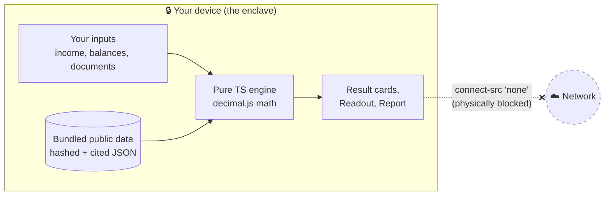
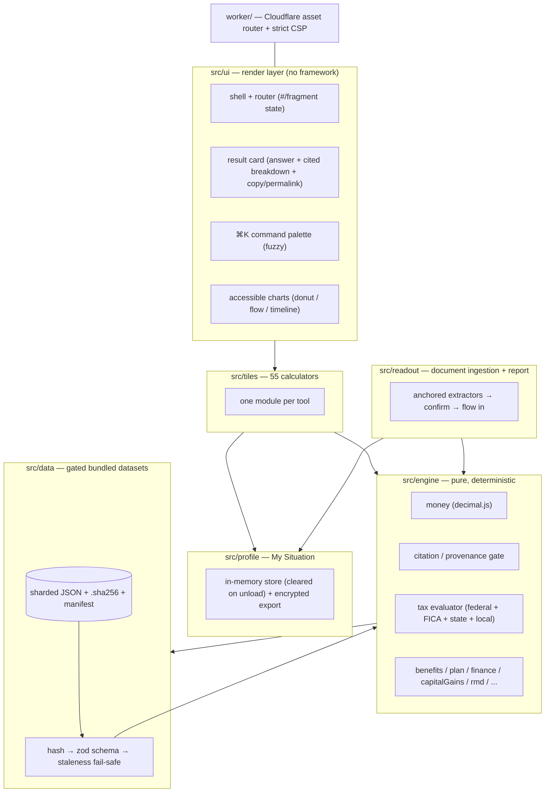
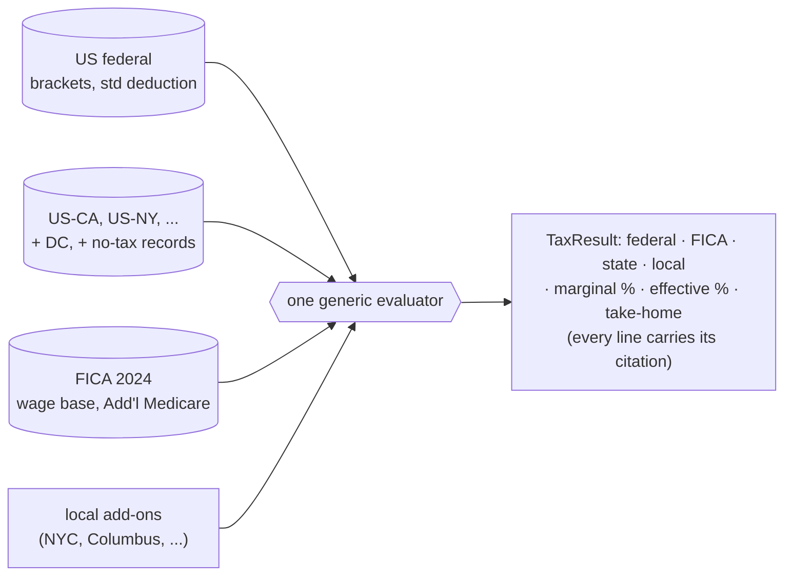
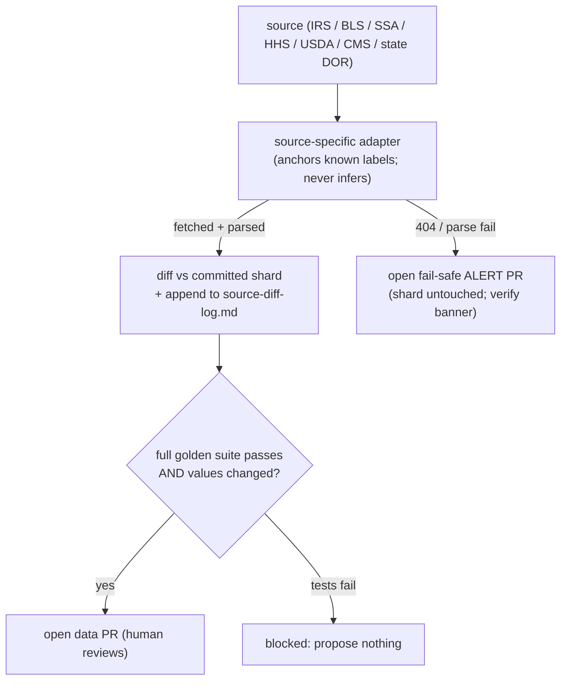
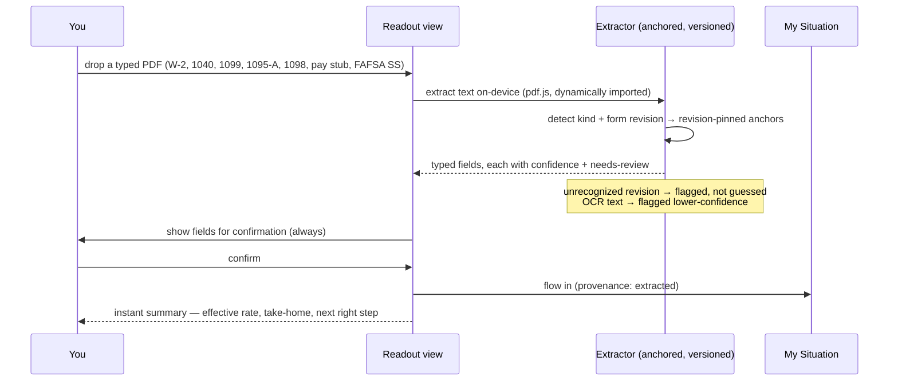
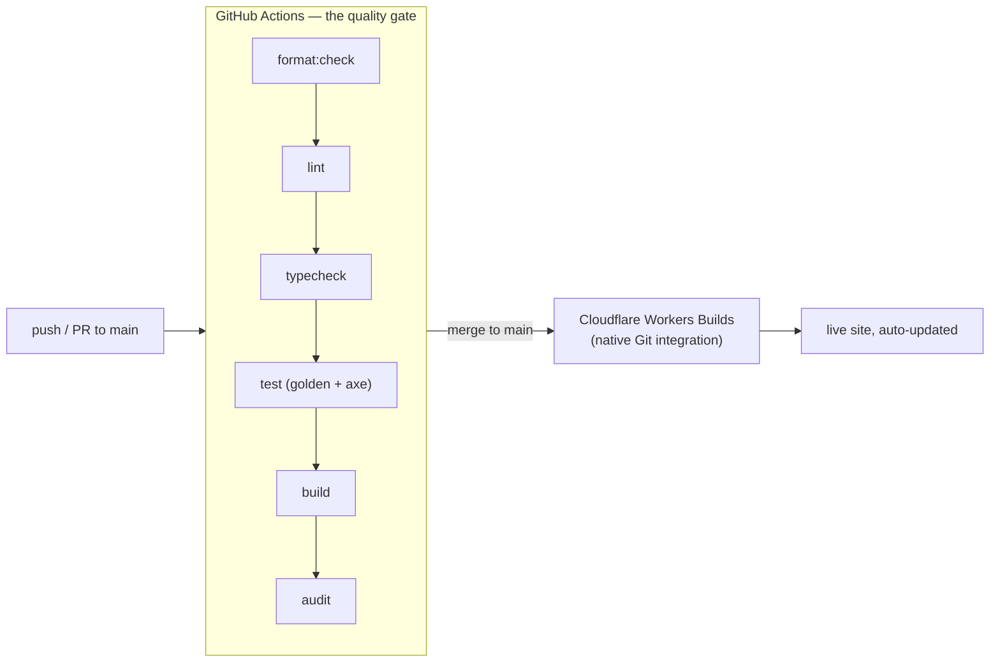

# enklayve

> Your private financial enclave. Every number is computed on your device. Nothing is ever sent anywhere.

[](https://github.com/clay-good/enklayve/actions/workflows/ci.yml)
[](LICENSE)
[](#determinism--verification)
[](#the-privacy-guarantee-its-literal)

enklayve is the honest money guidance the personal-finance experts charge for — your real take-home pay, what you owe in taxes, what public benefits you're owed, and your next right step — except it's **free, and it always will be.** No accounts, no ads, no cookie banner, no upsell. It's a free public utility for understanding your money: deterministic, private, and showing its work.

It's meant to feel like peace in a transactional web. Every figure is reproducible from public data bundled into the site, every rule links its source so you can verify it yourself, and there's zero telemetry, zero AI, and zero runtime network calls. The Content-Security-Policy sets `connect-src 'none'`: the browser physically cannot send your data out, even if a bug tried to.

Scope is the **United States** today (federal and state taxes and benefits); Europe, then India, China, and Russia are on the roadmap as each jurisdiction's rules are learned properly. enklayve is educational information, not financial, tax, investment, or legal advice.

See [docs/specs/SPEC.md](docs/specs/SPEC.md) (the vision + Phases 0–11) and [docs/specs/SPEC-2.md](docs/specs/SPEC-2.md) (experience, ingestion, guidance + Phases 12–17) for the full plan.

---

## Table of contents

- [What you can do with it](#what-you-can-do-with-it)
- [The privacy guarantee, it's literal](#the-privacy-guarantee-its-literal)
- [The home: a teaching journey](#the-home-a-teaching-journey)
- [Architecture at a glance](#architecture-at-a-glance)
- [The tax engine (the moat)](#the-tax-engine-the-moat)
- [The data layer and refresh workflows](#the-data-layer-and-refresh-workflows)
- [The Readout: deterministic document ingestion](#the-readout-deterministic-document-ingestion)
- [My Situation, My Plan, My Readout Report](#my-situation-my-plan-my-readout-report)
- [Determinism & verification](#determinism--verification)
- [Design language](#design-language)
- [Build status](#build-status)
- [Project layout](#project-layout)
- [Develop](#develop)
- [CI/CD and deploy](#cicd-and-deploy)
- [Design decisions worth knowing](#design-decisions-worth-knowing)
- [Roadmap & deliberately deferred](#roadmap--deliberately-deferred)
- [License](#license)

---

## What you can do with it

**56 deterministic tools**, each with a worked example, per-figure citations, a plain-English "How this works," "Learn more" links, and deep-linkable URL state. They're organized into eight plainly-named money areas (the browse taxonomy; the underlying engine is shared so a number entered in one tool prefills every other):

### Paycheck & Taxes

| Tool | What it answers |
|---|---|
| Take-Home Pay | Your real net pay across all 50 states + DC (federal + FICA + state + local) |
| W-4 Withholding & Refund Check | Is my withholding right? The per-paycheck tweak to land near $0 |
| Hourly ↔ Salary | Convert either way, with overtime and a second-job stack |
| Federal Income Tax | Marginal + effective breakdown, standard vs itemized (the big four) |
| Self-Employment Tax | The full 15.3%, the deductible half, the four 1040-ES installments |
| Quarterly Taxes & Set-Aside | What to skim off each 1099 payment; the safe-harbor minimum |
| What Should I Charge? | Work backward from take-home to the billable hourly rate |
| 1099 Contract vs W-2 Salary | The rough salary a contractor rate equals |
| Marginal Rate Explorer | What your next $1,000 of income actually costs |
| Paycheck Optimizer | Tax saved per $1,000 into a 401(k) vs an HSA |

### Investing

| Tool | What it answers |
|---|---|
| Capital Gains | Short-term stacked + long-term 0/15/20% bands + the 3.8% NIIT |
| Cost-Basis Lot Picker | FIFO / specific-ID realized gain, split short vs long |
| Tax-Loss Harvesting | Schedule D netting, the $3,000 offset, the carryforward |
| Compound Growth | Growth at a rate you supply (never a market prediction) |
| Treasury I Bond | What a Series I savings bond earns and is worth (TreasuryDirect) |
| CPI Inflation Adjuster | What a past dollar is worth in another year (BLS CPI-U) |

### Retirement

| Tool | What it answers |
|---|---|
| Contribution Optimizer | 401(k)/IRA/HSA room left this year against IRS limits + catch-ups |
| Self-Employed Retirement | SEP-IRA vs Solo 401(k), capped at the §415(c) limit |
| Roth Conversion Ladder | The 5-year seasoning schedule and the bridge stream it builds |
| Backdoor / Mega-Backdoor Roth | The pro-rata rule; after-tax 401(k) room |
| Required Minimum Distribution | Balance ÷ the IRS Uniform Lifetime factor for your age |
| Retirement Drawdown & RMD Timeline | How long savings last, in today's dollars |
| Social Security Claiming Age | Benefit at 62 / FRA / 70 from the published SSA formula |
| Downshift Point | When you can stop adding savings and still arrive |

### Borrowing & Debt

| Tool | What it answers |
|---|---|
| Loan & Mortgage Amortization | Full schedule + extra-payment what-ifs |
| Refinance Break-Even | Months to recoup the closing costs |
| Auto Loan & True Cost of Credit | Total of payments and the effective annual rate |
| Balance Transfer Break-Even | Net saving after the fee across the intro window |
| Freedom Date | The date a single balance is gone |
| Debt Freedom Planner | Snowball vs avalanche, the freedom date and interest for each |

### Budgeting & Cash Flow

| Tool | What it answers |
|---|---|
| Budget Overview | Where the money goes *and* when it moves, on one screen |
| 50/30/20 Spending Plan | Needs / wants / savings from your take-home |
| Zero-Based Budget | Give every dollar a job (the goal is $0 left) |
| Cash-Flow Timeline | The running daily balance and the tightest day |
| Sinking Fund Planner | The level monthly amount to reach a goal by a date |

### Home, Family & Protection

| Tool | What it answers |
|---|---|
| Home Buying Readiness | The all-in price you can afford on the 28/36 guideline |
| Rent vs Buy | A net-cost comparison over a chosen horizon |
| College Cost Planner | The monthly contribution to fully fund it by enrollment |
| Health Plan Chooser | The cheaper plan for a year of expected spend |
| Life Insurance Needs | The transparent DIME method |
| Disability Insurance Needs | The monthly income gap if you couldn't work |
| Umbrella Liability Coverage | Coverage sized to net-worth exposure |
| Estate & Beneficiary Checklist | The deterministic basics (not legal advice) |

### Benefits & Aid (What You're Owed)

| Tool | What it answers |
|---|---|
| Federal Poverty Level | Your % of the FPL (contiguous / Alaska / Hawaii) |
| What Am I Owed? (screener) | A plain-English list of likely-eligible programs + dollars |
| Earned Income Tax Credit | The estimate from the published phase-in/out |
| Child Tax Credit | CTC + the refundable Additional CTC |
| ACA Premium Tax Credit | The marketplace subsidy (you supply the benchmark premium) |
| Saver's Credit | 50/20/10% of capped contributions by AGI tier |
| SNAP Eligibility | The gross + net income tests and an estimated benefit |
| Medicaid Threshold | Adult MAGI eligibility by state |
| FAFSA Student Aid Index | The published need-analysis methodology, every step shown |
| Pell Grant | The award from the SAI |

### Where You Stand

| Tool | What it answers |
|---|---|
| Peace of Mind | Rainy-day cushion, runway, net worth, My Enough Number — one calm view |
| My Plan | The single next right step, with the math and a link to the tool |
| Sabbatical / Big-Purchase Planner | What a break costs your runway |

---

## The privacy guarantee, it's literal

Most money sites are lead-generation businesses: you type your income, they route it to lenders and advertisers. enklayve routes **nothing**, and that is enforced at the network layer rather than promised in a policy.



- **`connect-src 'none'`** in the Content-Security-Policy means the page cannot open a network connection — no `fetch`, no `XHR`, no beacon, no websocket. A bug *cannot* exfiltrate your data because the browser refuses the connection.
- **No telemetry, no accounts, no third-party anything.** No analytics, no CDN fonts, no trackers. The only persisted state is your theme and locale preference in `localStorage`.
- **Sensitive inputs never persist.** Income, balances, and parsed documents live in memory and are cleared on page unload (`pagehide`).
- **Datasets are bundled, not fetched.** Every shard is inlined at build time and re-verified in the browser against its content hash before use, so the running app knows exactly what it's computing from while staying offline-capable.
- The release audit (`npm run audit`) fails the build if any of these invariants is violated.

The service worker is the one component allowed `connect-src 'self'` — it caches same-origin static assets only (there is no server endpoint), so the app works on a plane while still never touching your in-memory data.

---

## The home: a teaching journey

The home leads with the **Readout dropzone** (drop a pay stub / W-2 / 1040 / 1095-A for an instant private readout), then inline **⌘K search**, then a **teaching journey** — the seven ordered steps of My Plan rendered as numbered cards, each explaining the lesson behind it and linking to the one tool that performs it. The full catalog is one click away ("Browse all tools" + the crawlable All Tools index).

```
+---------------------------------------------------------------+
|  enklayve                        [theme]   [⌘K]   [My Plan]    |
|                                                               |
|              Know where you stand. Privately.                 |
|                                                               |
|   +-------------------------------------------------------+   |
|   |   Drop a pay stub, W-2, 1040, or 1095-A               |   |
|   |        ->  instant private readout                    |   |
|   |             (or browse the tools)                     |   |
|   +-------------------------------------------------------+   |
|                                                               |
|   [  Search any tool or question...                       ]   |
|                                                               |
|   1 ─ Starter cushion .............. → Peace of Mind          |
|   2 ─ Capture the full match ....... → Paycheck Optimizer     |
|   3 ─ Clear high-cost debt ......... → Debt Freedom Planner   |
|   4 ─ Full rainy-day fund .......... → Peace of Mind          |
|   5 ─ Tax-advantaged retirement .... → Contribution Optimizer |
|   6 ─ Sinking funds ................ → Sinking Fund Planner   |
|   7 ─ Build the war chest .......... → My Enough Number       |
+---------------------------------------------------------------+
```

Every view is **vertical-scroll only on every device width** — form controls shrink inside their grid track (`min-width: 0`), wide "show the math" tables get their own contained horizontal scroll, an `overflow-x: clip` backstop guards the content column, and `viewport-fit=cover` + safe-area insets keep the chrome clear of the notch.

---

## Architecture at a glance

A single static site. **No UI framework** — vanilla TypeScript with a tiny render layer keeps the bundle small and the determinism obvious. A pure engine at the core, a gated data layer feeding it, one module per tool on top, and a thin Cloudflare Worker that only serves assets and sets headers.



| Layer | Responsibility |
|---|---|
| `src/engine` | Exact decimal money math, the citation/provenance gate, the composable tax evaluator, and the per-domain math (benefits, finance, capital gains, RMD, Social Security, FAFSA, the guidance plan) |
| `src/data` | zod schemas for every dataset kind, content-hash integrity, and the per-dataset fail-safe gate (stale or corrupt → a verify banner, never a wrong number) |
| `src/tiles` | One module per calculator. Adding a tool never touches the shell |
| `src/ui` | Render layer, three themes, result card, fuzzy palette, fragment router, accessible charts |
| `src/profile` | My Situation — the in-memory session profile and the portable encrypted export |
| `src/readout` | Anchored document extraction, the confirm flow, and the downloadable Readout Report |
| `worker` | A minimal Cloudflare Worker: asset routing + the security headers |

---

## The tax engine (the moat)

A **declarative rule corpus, not a pile of conditionals.** Each jurisdiction is a typed JSON data file; **one generic evaluator** consumes any number of them. Adding a state means adding *data*, not code — which is how the engine stays maintainable across annual updates and how outside contributors can help safely.



- Seeded with the **ten most populous states + DC** (CA, NY, TX, FL, PA, IL, OH, GA, NC, MI, DC). **No-income-tax states (TX, FL) are first-class records,** not omissions.
- Handles ordered marginal brackets, filing statuses, standard vs itemized (the "big four": SALT capped, mortgage interest, charitable, medical above the floor), FICA with the wage base + 0.9% Additional Medicare, special rules (e.g. the CA mental-health surtax), and opt-in local add-ons.
- **Fail-safe is per jurisdiction:** if the California source is stale, California shows a verify banner while the other 50 keep working.

---

## The data layer and refresh workflows

Datasets are versioned, sharded JSON, each with a sibling `.sha256` and pinned in a top-level manifest. A GitHub Action per source group keeps them current on a published cadence — and **never ships a wrong number**: a refresh opens a data PR only when values changed *and* the full golden suite passes; a fetch/parse failure opens a fail-safe **alert PR** instead; nothing is auto-committed to `main`.



### Refresh cadence cheat sheet

| Dataset | Source | Cadence | Pillar |
|---|---|---|---|
| Federal income tax, std deduction, AMT, cap-gains thresholds | IRS annual rev. proc. | Annual, Oct–Nov | 1 |
| Retirement / HSA / FSA limits, catch-ups, mileage | IRS annual notice | Annual | 1 |
| FICA wage base, COLA, SS bend points | SSA fact sheets | Annual, Oct | 1 & 3 |
| CPI-U (inflation) | BLS public API | Monthly, ~2nd week | 1 & 3 |
| Treasury I savings-bond rates | TreasuryDirect | Semiannual, May & Nov | 1 & 3 |
| 50-state income tax | State DOR pubs (one adapter/state) | Annual, staggered | 1 |
| Federal Poverty Level | HHS | Annual, January | 2 |
| EITC + Child Tax Credit | IRS annual rev. proc. | Annual | 2 |
| ACA applicable-percentage table | IRS / CMS | Annual | 2 |
| SNAP allotments + deductions | USDA FNS | Annual, Oct | 2 |
| Medicaid MAGI thresholds | CMS / state pubs | Annual | 2 |
| FAFSA SAI + Pell schedule | Dept. of Education | Annual | 2 |

State adapters cover the seeded eleven by shape: standard-deduction states (CA, NY, GA, NC, DC), flat-rate states (PA, IL, MI), and graduated bracket-table states (OH). See [docs/data-sources.md](docs/data-sources.md) and [docs/source-diff-log.md](docs/source-diff-log.md).

---

## The Readout: deterministic document ingestion

Drop a document and the browser parses it locally, extracts known fields by **anchoring to form labels and box numbers — never by inference** — and uses them (after you confirm) to populate every tool. The vaulytica pattern, applied to personal finance, with nothing uploaded.



Every document family in the spec has an extractor: the **typed W-2 / 1040 / pay stub**, the **1099 series** (INT, DIV, NEC, B), **1095-A**, **1098**, and the **FAFSA Submission Summary**. pdf.js is code-split into its own chunk and its worker is a same-origin asset configured to fetch nothing, so `connect-src 'none'` stays literally true.

---

## My Situation, My Plan, My Readout Report

- **My Situation** — a single in-memory profile every tool reads from and writes to, so you enter income once. Per-field provenance (typed / extracted / assumed). Never persisted automatically; cleared on unload. Continuity is opt-in via a user-held export that can be passphrase-encrypted on-device (PBKDF2 → AES-GCM).
- **My Plan** — the default ordered plan (starter cushion → full employer match → high-cost debt → full rainy-day fund → tax-advantaged retirement → sinking funds → war chest) encoded as **data**, so steps reorder and toggle. It reads My Situation, determines the current step, and surfaces one concrete next action with its dollar figure and a link to the tool that performs it. Opinionated by default, fully adjustable, never scolding.
- **My Readout Report** — a downloadable, self-contained, script-free HTML summary generated entirely on-device: the snapshot, the tax picture, what you may be owed, your next right step, and an assumptions-and-sources appendix. **Byte-identical** when regenerated from the same profile + dataset versions (a golden test asserts it).

---

## Determinism & verification

Every output is a pure function of the inputs and the bundled dataset version. No AI, no inference, no randomness, no market prediction.

- **Golden corpus.** Hundreds of `inputs + dataset → expected output` cases under [`tests/golden`](tests). CI fails if any case drifts; it's also the gate every data-refresh PR must pass. Regenerate an intended change with `npm run golden:regen`.
- **Cross-validation.** Federal/state/FICA cases are checked against published worked examples for the seeded tax year.
- **Bounds & fuzz.** More income never decreases tax owed within a bracket; take-home is never negative; marginal rate is never below zero (seeded fuzz, thousands of iterations).
- **Provenance gate.** Every shipped figure must resolve to a non-empty citation — no orphan numbers ship.
- **Accessibility.** axe-core runs inside the test suite across the home, About, All Tools, the Readout, the Report, and every tile form, with **zero violations**.
- **Release audit.** `npm run audit` mechanically verifies CSP `connect-src 'none'`, no cross-origin loads in the built output, full citation coverage, and no sensitive persistence.

**608 tests across 52 files pass today**, alongside `format:check`, `lint`, `typecheck`, `build`, the audit, and `wrangler deploy --dry-run`.

---

## Design language

The jan.ai feeling (clean, airy, friendly, fast) with a royal identity.

| Token | Value |
|---|---|
| Primary | Royal purple, ~`#6D28D9`, with vivid violet accents |
| Secondary | Warm gold / amber for good-news states and primary CTAs |
| Red | **Warnings only** — money tools that use red as a primary color make people anxious |
| Themes | Light (default), dark, and high-contrast (high-contrast matters for retirement math) |
| Numbers | Big and legible; one gentle count-up on reveal that respects `prefers-reduced-motion` |
| Tone | Plain English, encouraging, never scolding — "here's where you stand," not "you're behind" |

Owned surfaces are named in the first person (My Situation, My Plan, My Readout Report, My Enough Number). Every tool carries a "How this works" explainer, "Learn more" links, and the on-device / US-only / not-advice promise. Modals are never traps (Close + Done + Escape + click-outside).

---

## Build status

All phases from both specs are complete or at a deliberately-deferred boundary. Highlights:

| Phase | Status | What landed |
|---|---|---|
| 0–4 | ✅ | Scaffold, money/citation primitives, data layer, the tax engine, the UI shell + design system |
| 5 | ✅ | Every Pillar 1 tile (paycheck, taxes, investing, borrowing, growth, RMD, CPI) |
| 6 | ✅ | Every Pillar 2 tile + the combined "What Am I Owed?" screener |
| 7 | ✅ | Safe Harbor: Peace of Mind, Freedom Date, Downshift, Sabbatical |
| 8 | ✅ | Offline PWA — service worker precache + runtime cache, installable, manifest |
| 9 | ✅ | Data-refresh workflows for every seeded source with an anchorable figure |
| 10 | ✅ | CI, the release audit, and Cloudflare Git-integration deploy |
| 11 | ✅ | Crawlability (per-tile shells, sitemap, robots), on-page SEO/social, docs, mobile responsiveness |
| 12–13 | ✅ | My Situation (session profile + encrypted export); the teaching-journey home |
| 14 | ✅ | The Readout — every document family has an anchored, revision-pinned extractor |
| 15–16 | ✅ | My Plan (the guidance engine); My Readout Report |
| 17 | ✅ | The §6 expansion catalog — budgeting, debt, home, open enrollment, tax moves, protection, long-horizon |

See the spec files for the full per-wave history.

---

## Project layout

| Path | What lives here |
|---|---|
| `src/engine` | Money math, citation/provenance, the tax evaluator, and per-domain math |
| `src/data` | Dataset schemas, integrity check, manifest loader, fail-safe gate, browser loader |
| `src/tiles` | One module per calculator (55 of them) + the registry |
| `src/ui` | Render layer, themes, result card, command palette, router, charts, views |
| `src/profile` | My Situation — the in-memory session profile and portable encrypted export |
| `src/readout` | Anchored extractors, the confirm flow, and the Readout Report builder |
| `data` | Sharded JSON datasets, sibling `.sha256` files, and the manifest |
| `scripts` | Data-refresh adapters, the manifest builder, static-page generators, the release audit |
| `worker` | Cloudflare Worker asset router and security headers |
| `tests` | Unit tests, the golden correctness corpus, and the axe accessibility sweep |
| `docs` | The specs, data sources, adding-a-state, contributing, the source diff log, and the launch checklist |

---

## Develop

```sh
npm install
npm run dev            # local dev server (Vite)
npm run test           # unit + golden corpus + axe accessibility (Vitest)
npm run typecheck      # tsc --noEmit
npm run lint           # eslint
npm run format         # prettier --write
npm run build          # production build to dist/
npm run audit          # CSP / no cross-origin loads / provenance / no sensitive persistence
npm run data:manifest  # regenerate data/manifest.json + .sha256 after editing a shard
npm run golden:regen   # regenerate the tax-engine golden snapshot after an intended change
npm run deploy:dry     # wrangler dry-run deploy
```

Node 20+ for the app (Node 24 in CI runs the TypeScript build scripts directly). New to the codebase? [docs/contributing.md](docs/contributing.md) covers the tile contract and the non-negotiable principles; [docs/adding-a-state.md](docs/adding-a-state.md) is a data-only walkthrough.

---

## CI/CD and deploy



**GitHub Actions is the quality gate; Cloudflare is the deploy.** The repo is connected to Cloudflare's native Git integration (Workers Builds), which builds and deploys on every push to `main` — so there is no deploy workflow and no `CLOUDFLARE_*` secret. Production responses carry the full security headers (CSP, HSTS, `Referrer-Policy: no-referrer`, `X-Content-Type-Options`, frame/permissions policies); `index.html` and the data manifest are served `no-cache`, hashed `/assets/*` are immutable for a year.

The [launch checklist](docs/launch-checklist.md) walks every acceptance criterion before announcing.

---

## Design decisions worth knowing

- **No UI framework.** Vanilla TS + a tiny render layer. Smaller bundle, obvious determinism. Revisited only if a framework clearly earns its weight.
- **`decimal.js` for all money math.** Never floating-point arithmetic on currency.
- **Adding a state is data, not code.** The tax engine is one evaluator over typed jurisdiction files.
- **The user supplies the one un-bundleable figure.** Rather than ship a genuinely huge dataset, a few tools ask for the single local number (ACA's county benchmark premium, Social Security's PIA, the W-4 paycheck withholding) and keep every other figure verifiable.
- **Consolidation over duplication.** Rainy Day / Runway / War Chest / Enough Number share one computation, so they're one Peace of Mind dashboard, not four tools that re-collect the same inputs.
- **Never predict markets.** Where a return or inflation rate is needed, the user supplies it or accepts a labeled default; CPI is used only for the honest "what a past dollar is worth" question.

---

## Roadmap & deliberately deferred

Deferred *for accuracy or scope*, not faked:

- **International** (Europe → India, China, Russia) as each jurisdiction's rules are learned properly. Be right before being everywhere.
- **States beyond the seeded eleven** — added through the staggered annual refresh.
- **OCR + Word (.docx) document ingestion** — the anchored typed-PDF Readout ships today; the labeled OCR fallback and mammoth `.docx` parsing land on the same extractor contract.
- **OCR for scans** and **Word (`.docx`) ingestion** — the lower-confidence OCR *flagging* is built; bundling the on-device engine and adding mammoth parsing are follow-ups.
- **i18n string extraction** — the locale preference persists; a full pre-rendered-variant extraction is held rather than ship a speculative abstraction.
- **Playwright live-offline e2e** — axe accessibility already runs in the Vitest suite; the browser-based offline run is a focused follow-up so CI stays fast and browser-free.
- **Per-filing-status graduated state schedules** — for any future state whose marginal tiers differ by filing status (none of the seeded eleven do).

---

## License

MIT — free forever, open source, auditable. See [LICENSE](LICENSE).
