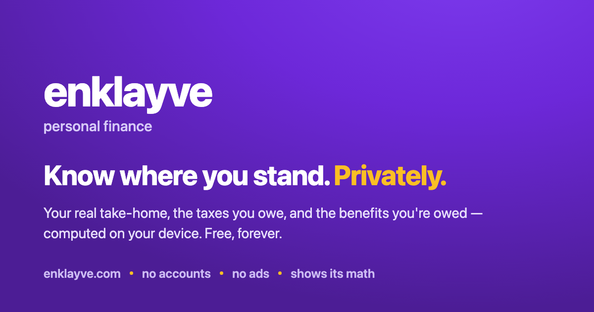
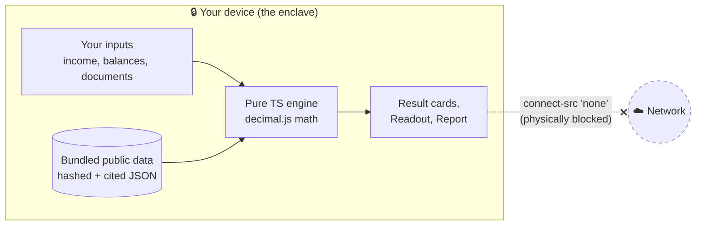
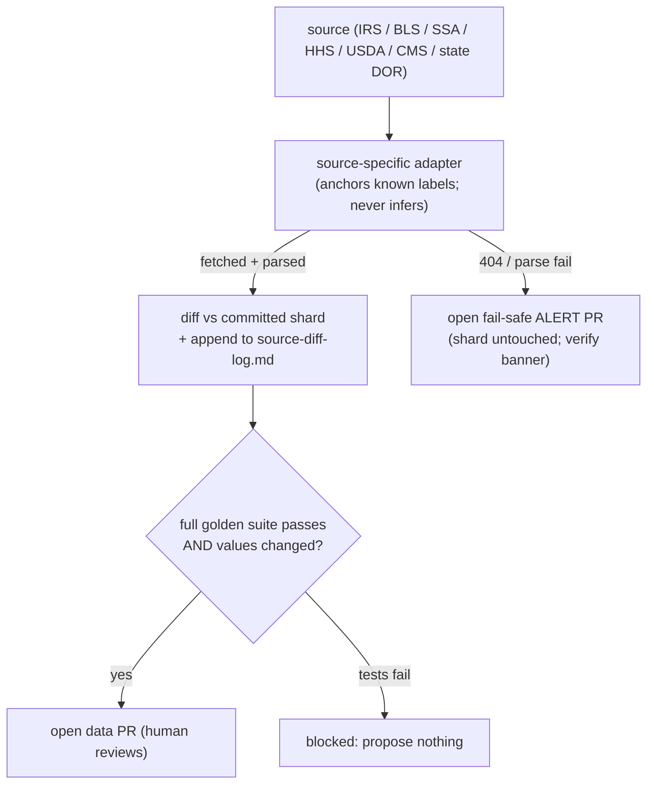
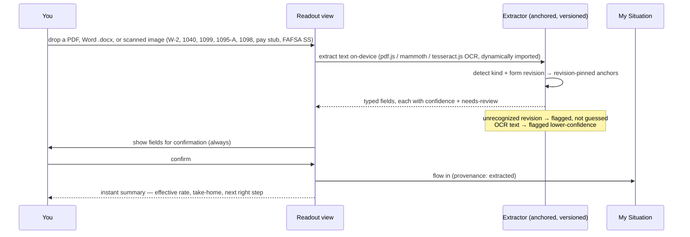
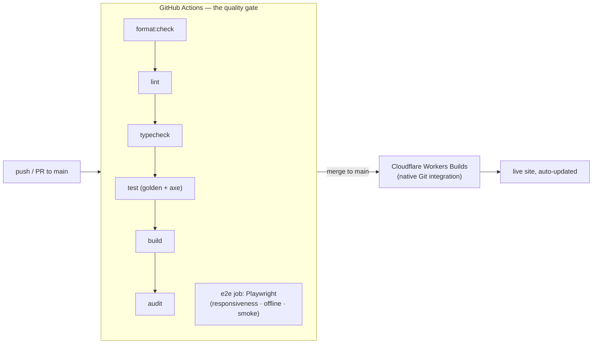

# enklayve

> Your private financial enclave. Every number is computed on your device. Nothing is ever sent anywhere.



[](https://github.com/clay-good/enklayve/actions/workflows/ci.yml)
[](LICENSE)
[](#determinism--verification)
[](#the-privacy-guarantee-its-literal)

enklayve is the honest money guidance the personal-finance experts charge for — your real take-home pay, what you owe in taxes, what public benefits you're owed, and your next right step — except it's **free, and it always will be.** No accounts, no ads, no cookie banner, no upsell. It's a free public utility for understanding your money: deterministic, private, and showing its work.

It's meant to feel like peace in a transactional web. Every figure is reproducible from public data bundled into the site, every rule links its source so you can verify it yourself, and there's zero telemetry, zero AI, and zero runtime network calls. The Content-Security-Policy sets `connect-src 'none'`: the browser physically cannot send your data out, even if a bug tried to.

Scope is the **United States** today (federal and state taxes and benefits); Europe, then India, China, and Russia are on the roadmap as each jurisdiction's rules are learned properly. enklayve is educational information, not financial, tax, investment, or legal advice.

See [docs/specs/SPEC.md](docs/specs/SPEC.md) (the vision + Phases 0–11) and [docs/specs/SPEC-2.md](docs/specs/SPEC-2.md) (experience, ingestion, guidance + Phases 12–17) for the full plan.

### By the numbers

A verifiable snapshot — every figure here is reproducible from the repo, not marketing.

| Metric | Value | Where to check |
|---|---|---|
| Deterministic calculators | **53** in **10 topic hubs**, plus the on-home anti-budget | [`src/tiles/registry.ts`](src/tiles/registry.ts) |
| Tax jurisdictions | **25** — 15 income-tax states + DC + 9 no-income-tax | [`data/state-*-income-tax-*.json`](data) |
| Cited dataset shards | **42**, each with a sibling `.sha256` + manifest entry | [`data/manifest.json`](data/manifest.json) |
| Tests | **673** unit/golden across 56 files, **+17** Playwright e2e | `npm run test` / `npm run test:e2e` |
| Runtime network requests | **0** — `connect-src 'none'` blocks them at the browser | [`worker/index.ts`](worker/index.ts) |
| Auto-persisted user data | **0** — only the locale preference touches `localStorage` | `npm run audit` |
| UI framework / runtime deps that phone home | **none** | [`package.json`](package.json) |

---

## Table of contents

- [What you can do with it](#what-you-can-do-with-it)
- [The privacy guarantee, it's literal](#the-privacy-guarantee-its-literal)
- [The home: the budget is the plan](#the-home-the-budget-is-the-plan)
- [Architecture at a glance](#architecture-at-a-glance)
- [The tax engine (the moat)](#the-tax-engine-the-moat)
- [The data layer and refresh workflows](#the-data-layer-and-refresh-workflows)
- [The Readout: deterministic document ingestion](#the-readout-deterministic-document-ingestion)
- [My Situation, the plan, and My Readout Report](#my-situation-the-plan-and-my-readout-report)
- [Determinism & verification](#determinism--verification)
- [Design language](#design-language)
- [Build status](#build-status)
- [Project layout](#project-layout)
- [Develop](#develop)
- [CI/CD and deploy](#cicd-and-deploy)
- [Design decisions worth knowing](#design-decisions-worth-knowing)
- [Roadmap & deliberately deferred](#roadmap--deliberately-deferred)
- [License](#license)

---

## What you can do with it

**53 deterministic calculators**, each with a worked example, per-figure citations, a plain-English "How this works," "Learn more" links, and deep-linkable URL state. They're grouped into **10 plainly-named topic hubs** (a hub is one page with a segmented control switching between its calculators; the underlying engine is shared, so a number entered in one tool prefills every other). The **anti-budget** that gives every dollar a job lives directly on the home — it *is* the plan, in written form. Reach any calculator by ⌘K search or the crawlable [All Tools index](#cicd-and-deploy), which lists **every calculator by name under its hub** (and the static `tools.html` mirror links each one's pre-rendered landing page, so all 63 pages are reachable in one hop, not just via the sitemap).

### Paycheck & Taxes

| Tool | What it answers |
|---|---|
| Take-Home Pay | Your real net pay (federal + FICA + state + local) across every modeled state — 25 jurisdictions today, growing data-only |
| W-4 Withholding & Refund Check | Is my withholding right? The per-paycheck tweak to land near $0 |
| Hourly ↔ Salary | Convert either way, with overtime and a second-job stack |
| Federal Income Tax | Marginal + effective breakdown, standard vs itemized (the big four) |
| Marginal Rate Explorer | What your next $1,000 of income actually costs |
| Paycheck Optimizer | Tax saved per $1,000 into a 401(k) vs an HSA |

### Self-Employed & 1099

| Tool | What it answers |
|---|---|
| Self-Employment Tax | The full 15.3%, the deductible half, the four 1040-ES installments |
| Quarterly Taxes & Set-Aside | What to skim off each 1099 payment; the safe-harbor minimum |
| What Should I Charge? | Work backward from take-home to the billable hourly rate |
| 1099 Contract vs W-2 Salary | The rough salary a contractor rate equals |
| Self-Employed Retirement | SEP-IRA vs Solo 401(k), capped at the §415(c) limit |

### Investing

| Tool | What it answers |
|---|---|
| Capital Gains | Short-term stacked + long-term 0/15/20% bands + the 3.8% NIIT |
| Cost-Basis Lot Picker | FIFO / specific-ID realized gain, split short vs long |
| Tax-Loss Harvesting | Schedule D netting, the $3,000 offset, the carryforward |
| Compound Growth | Growth at a rate you supply (never a market prediction) |
| Treasury I Bond | What a Series I savings bond earns and is worth (TreasuryDirect) |
| CPI Inflation Adjuster | What a past dollar is worth in another year (BLS CPI-U) |

### Retirement

| Tool | What it answers |
|---|---|
| Contribution Optimizer | 401(k)/IRA/HSA room left this year against IRS limits + catch-ups |
| Roth Conversion Ladder | The 5-year seasoning schedule and the bridge stream it builds |
| Backdoor / Mega-Backdoor Roth | The pro-rata rule; after-tax 401(k) room |
| Required Minimum Distribution | Balance ÷ the IRS Uniform Lifetime factor for your age |
| Retirement Drawdown & RMD Timeline | How long savings last, in today's dollars |
| Social Security Claiming Age | Benefit at 62 / FRA / 70 from the published SSA formula |
| Downshift Point | When you can stop adding savings and still arrive |

### Borrowing & Debt

| Tool | What it answers |
|---|---|
| Debt Freedom Planner | Snowball vs avalanche, the freedom date and interest for each |
| Loan & Mortgage Amortization | Full schedule + extra-payment what-ifs |
| Refinance Break-Even | Months to recoup the closing costs |
| Auto Loan & True Cost of Credit | Total of payments and the effective annual rate |
| Balance Transfer Break-Even | Net saving after the fee across the intro window |
| Freedom Date | The date a single balance is gone |

### Budgeting & Cash Flow

| Tool | What it answers |
|---|---|
| 50/30/20 Spending Plan | Needs / wants / savings from your take-home |
| Cash-Flow Timeline | The running daily balance and the tightest day |
| Sinking Fund Planner | The level monthly amount to reach a goal by a date |

> The full **zero-based budget** ("give every dollar a job until $0 is left to assign") is the home page itself — it auto-computes taxes through the same engine, splits the rest across living-expense and investing lines, and closes with the anti-budget order-of-operations. It needs no separate tile.

### Home & Big Purchases

| Tool | What it answers |
|---|---|
| Home Buying Readiness | The all-in price you can afford on the 28/36 guideline |
| Rent vs Buy | A net-cost comparison over a chosen horizon |
| College Cost Planner | The monthly contribution to fully fund it by enrollment |

### Insurance & Protection

| Tool | What it answers |
|---|---|
| Health Plan Chooser | The cheaper plan for a year of expected spend |
| Life Insurance Needs | The transparent DIME method |
| Disability Insurance Needs | The monthly income gap if you couldn't work |
| Umbrella Liability Coverage | Coverage sized to net-worth exposure |
| Estate & Beneficiary Checklist | The deterministic basics (not legal advice) |

### Benefits & Aid (What You're Owed)

| Tool | What it answers |
|---|---|
| What Am I Owed? (screener) | A plain-English list of likely-eligible programs + dollars |
| Federal Poverty Level | Your % of the FPL (contiguous / Alaska / Hawaii) |
| Earned Income Tax Credit | The estimate from the published phase-in/out |
| Child Tax Credit | CTC + the refundable Additional CTC |
| ACA Premium Tax Credit | The marketplace subsidy (you supply the benchmark premium) |
| Saver's Credit | 50/20/10% of capped contributions by AGI tier |
| SNAP Eligibility | The gross + net income tests and an estimated benefit |
| Medicaid Threshold | Adult MAGI eligibility by state |
| FAFSA Student Aid Index | The published need-analysis methodology, every step shown |
| Pell Grant | The award from the SAI |

### Where You Stand

| Tool | What it answers |
|---|---|
| Peace of Mind | Rainy-day cushion, runway, net worth, My Enough Number — one calm view |
| Sabbatical / Big-Purchase Planner | What a break costs your runway |

---

## The privacy guarantee, it's literal

Most money sites are lead-generation businesses: you type your income, they route it to lenders and advertisers. enklayve routes **nothing**, and that is enforced at the network layer rather than promised in a policy.



- **`connect-src 'none'`** in the Content-Security-Policy means the page cannot open a network connection — no `fetch`, no `XHR`, no beacon, no websocket. A bug *cannot* exfiltrate your data because the browser refuses the connection.
- **No telemetry, no accounts, no third-party anything.** No analytics, no CDN fonts, no trackers. The only persisted state is your locale preference in `localStorage`.
- **Sensitive inputs never persist.** Income, balances, and parsed documents live in memory and are cleared on page unload (`pagehide`).
- **Datasets are bundled, not fetched.** Every shard is inlined at build time and re-verified in the browser against its content hash before use, so the running app knows exactly what it's computing from while staying offline-capable.
- The release audit (`npm run audit`) fails the build if any of these invariants is violated.

Two same-origin **workers** are the only carve-outs from `connect-src 'none'`, and each is allowed `connect-src 'self'` for the same reason — it fetches same-origin static assets only, has no server endpoint, and never touches your in-memory data: the **offline service worker** (`/sw.js`), which caches the shell, and the **OCR worker** (`/ocr/*`), which loads its wasm engine and bundled language model when you drop a scanned image. A worker's CSP comes from its own response, not the page's, so neither loosens any page — every page still serves `connect-src 'none'`.

---

## The home: the budget is the plan

The home is stripped to the essentials (redesigned through 2026-06-02; BUILD-SPEC-2 §0.7 and the later consolidation notes). The header is just the wordmark **enklayve** with the lowercase tagline *personal finance* — no theme toggle, no buttons. The body is three stacked zones: a one-line hero, the **Readout dropzone** (drop a pay stub / W-2 / tax form for an instant private readout, never uploaded), and then the centerpiece — the **anti-budget**. The budget takes an income at any pay frequency, a filing status, and a state, auto-computes taxes through the **same `evaluateTaxes` engine** the Take-Home tile uses, and lets you split the rest across living-expense and investing lines while a donut fills and "left to assign" falls toward zero. It closes with the plain-English **anti-budget order-of-operations** (automate everything, then fund things in order: full match → kill high-interest debt → six months of cash → 401(k)/IRA/HSA → brokerage → whatever future you believe in). There is no separate "My Plan" page anymore: **the live budget plus that order-of-operations *is* the plan.** Every other calculator is reached by the **⌘K command palette** or the crawlable **All Tools index** (linked in the footer).

```
+---------------------------------------------------------------+
|  enklayve  personal finance                                   |
|                                                               |
|                  Your money, made simple.                     |
|     Your real take-home, the taxes you owe, the benefits      |
|        you might be missing, and your next smart move.        |
|                                                               |
|   +-------------------------------------------------------+   |
|   |   Drop a pay stub, W-2, or tax form                   |   |
|   |        ->  instant private readout (never uploaded)   |   |
|   +-------------------------------------------------------+   |
|                                                               |
|   Your budget                          ╭───────────╮          |
|   Income [ $ 60,000 ] [Annually ▾]     │   donut   │          |
|   Filing [ Single ▾ ]  State [ ID ▾ ]  │  fills to │          |
|   Taxes (auto)        − $11,234        │    $0     │          |
|   Housing/Transport/Food/Debt/Other …  ╰───────────╯          |
|   Retirement / Brokerage …          Left to assign: $0        |
|                                                               |
|   The anti-budget: give every dollar a job …                  |
+---------------------------------------------------------------+
|  [Why enklayve]      [GitHub]          [♥ Clay Good]          |
+---------------------------------------------------------------+
```

A state whose income tax isn't modeled yet shows an **honest amber note** ("we don't model X's state income tax yet, so this shows federal + FICA only") rather than silently under-counting. Every view is **vertical-scroll only on every device width** — form controls shrink inside their grid track (`min-width: 0`), wide "show the math" tables and chart timelines get their own contained horizontal scroll, and an `overflow-x: clip` backstop on both the content column *and the document root* guarantees the viewport itself never scrolls sideways. `viewport-fit=cover` + safe-area insets keep the chrome clear of the notch. A Playwright suite **measures** this — every view and all 53 calculators, from 320px to 1440px, plus landscape phones — so a regression fails CI rather than shipping.

---

## Architecture at a glance

A single static site. **No UI framework** — vanilla TypeScript with a tiny render layer keeps the bundle small and the determinism obvious. A pure engine at the core, a gated data layer feeding it, one module per tool on top, and a thin Cloudflare Worker that only serves assets and sets headers.


| Layer | Responsibility |
|---|---|
| `src/engine` | Exact decimal money math, the citation/provenance gate, the composable tax evaluator, and the per-domain math (benefits, finance, capital gains, RMD, Social Security, FAFSA, the guidance plan) |
| `src/data` | zod schemas for every dataset kind, content-hash integrity, and the per-dataset fail-safe gate (stale or corrupt → a verify banner, never a wrong number) |
| `src/tiles` | One module per calculator. Adding a tool never touches the shell |
| `src/ui` | Render layer, the light theme, result card, fuzzy palette, fragment router, accessible charts |
| `src/profile` | My Situation — the in-memory session profile and the portable encrypted export (surfaced in the Readout Report) |
| `src/readout` | Anchored document extraction, the confirm flow, and the downloadable Readout Report |
| `worker` | A minimal Cloudflare Worker: asset routing + the security headers |

---

## The tax engine (the moat)

A **declarative rule corpus, not a pile of conditionals.** Each jurisdiction is a typed JSON data file; **one generic evaluator** consumes any number of them. Adding a state means adding *data*, not code — which is how the engine stays maintainable across annual updates and how outside contributors can help safely.


- Seeded with **25 jurisdictions** and growing data-only through the staggered annual refresh (SPEC §14.3). **No-income-tax states are first-class records,** not omissions, so a resident sees their state by name with $0 state tax confirmed (and its citation), not a generic "no state tax modeled."
- Handles ordered marginal brackets, filing statuses, standard vs itemized (the "big four": SALT capped, mortgage interest, charitable, medical above the floor), FICA with the wage base + 0.9% Additional Medicare, personal exemptions, special rules (e.g. the CA mental-health surtax), top-bracket surtaxes (e.g. the MA 4% millionaire surtax, modeled as a clean second bracket), and opt-in local add-ons.
- **Filing-status fallback:** the seeded states define single / married-jointly / head-of-household; the other two resolve correctly — **qualifying surviving spouse → the married-jointly schedule** (federally and in essentially every state, so it's never silently taxed as single), and married-filing-separately → single (the documented state-level assumption). Federal defines all five explicitly.
- **Fail-safe is per jurisdiction:** if the California source is stale, California shows a verify banner while every other jurisdiction keeps working.

### State coverage cheat sheet

Every seeded state is modeled at one consistent launch fidelity — **brackets + standard deduction + personal exemption**, cross-checked against the Tax Foundation's 2026 state-rate table and cited to the state DOR — with state-specific credits, county/municipal add-ons, and state itemized deductions deferred to a later wave.

| Shape | States | How it's modeled |
|---|---|---|
| Graduated brackets | CA, NY, DC, OH | Ordered marginal tiers; CA adds the 1% mental-health surtax, OH the opt-in Columbus municipal tax |
| Flat rate | PA (3.07%), IL (4.95%), MI (4.25%), GA (4.99%), NC (3.99%), AZ (2.50%), CO (4.40%), IN (2.95%), KY (3.50%), ID (5.30%) | A single bracket; standard deduction and/or personal exemption where the state grants one. ID conforms to the federal standard deduction (the CO pattern) |
| Flat + top surtax | MA (5.0% + 4% over $1,107,750) | Two brackets — the surtax is just the top marginal tier |
| Flat over a floor | MS (4.0% over the first $10,000) | A `[{0, 0%}, {10000, 4.0%}]` schedule — the exempt floor is the zero-rate tier |
| No income tax | TX, FL, AK, NV, NH, SD, TN, WA, WY | First-class records: empty brackets, $0 confirmed, citation noting any non-wage tax (e.g. WA's capital-gains excise) |

**Idaho** joined this wave: its 2025 mid-year rate cut (HB 40) settled into a clean 5.3% flat tax, so it now models exactly like Colorado. **Utah is still held** — HB 106 (2025) gave it a clean 4.5% flat rate, but its deduction is delivered as a *6%-of-federal-deduction taxpayer tax credit that phases out with income*, which the bracket-plus-standard-deduction model cannot represent without overstating low-income tax. It waits on an exemption-credit engine feature rather than ship an approximation that could be wrong.

---

## The data layer and refresh workflows

Datasets are versioned, sharded JSON, each with a sibling `.sha256` and pinned in a top-level manifest. A GitHub Action per source group keeps them current on a published cadence — and **never ships a wrong number**: a refresh opens a data PR only when values changed *and* the full golden suite passes; a fetch/parse failure opens a fail-safe **alert PR** instead; nothing is auto-committed to `main`.



### Refresh cadence cheat sheet

| Dataset | Source | Cadence | Pillar |
|---|---|---|---|
| Federal income tax, std deduction, AMT, cap-gains thresholds | IRS annual rev. proc. | Annual, Oct–Nov | 1 |
| Retirement / HSA / FSA limits, catch-ups, mileage | IRS annual notice | Annual | 1 |
| FICA wage base, COLA, SS bend points | SSA fact sheets | Annual, Oct | 1 & 3 |
| CPI-U (inflation) | BLS public API | Monthly, ~2nd week | 1 & 3 |
| Treasury I savings-bond rates | TreasuryDirect | Semiannual, May & Nov | 1 & 3 |
| 50-state income tax | State DOR pubs (one adapter/state) | Annual, staggered | 1 |
| Federal Poverty Level | HHS | Annual, January | 2 |
| EITC + Child Tax Credit | IRS annual rev. proc. | Annual | 2 |
| ACA applicable-percentage table | IRS / CMS | Annual | 2 |
| SNAP allotments + deductions | USDA FNS | Annual, Oct | 2 |
| Medicaid MAGI thresholds | CMS / state pubs | Annual | 2 |
| FAFSA SAI + Pell schedule | Dept. of Education | Annual | 2 |

**Every seeded income-tax jurisdiction now has a refresh adapter,** organized by the shape the parser anchors: standard-deduction states (CA, NY, GA, NC, DC), flat-rate states (PA, IL, MI, AZ, CO, IN, KY, ID — IN's personal exemption overlaid like IL's), graduated bracket-table states (OH, plus MS as a two-tier "0% then a flat rate over a $10,000 floor"), and the one special case, MA, whose 5% base rate plus 4% surtax over an inflation-adjusted threshold fits neither parser, so it gets a small dedicated parser that anchors the two figures that actually move (the base rate and the threshold). The no-income-tax records have nothing to refresh. See [docs/data-sources.md](docs/data-sources.md) and [docs/source-diff-log.md](docs/source-diff-log.md).

---

## The Readout: deterministic document ingestion

Drop a document and the browser parses it locally, extracts known fields by **anchoring to form labels and box numbers — never by inference** — and uses them (after you confirm) to populate every tool. The vaulytica pattern, applied to personal finance, with nothing uploaded. (Drop a previously-saved `.json` situation here instead and it's restored, not parsed — the welcome-back path.)



Every document family in the spec has an extractor: the **typed W-2 / 1040 / pay stub**, the **1099 series** (INT, DIV, NEC, B), **1095-A**, **1098**, and the **FAFSA Submission Summary**. Typed PDFs are read with **pdf.js**, **Word `.docx`** files with **mammoth**, and **scanned or photographed images** (PNG/JPG/…) with on-device **OCR (tesseract.js)** — all three dynamically imported (each code-splits into its own lazy chunk, so the shell stays light) and all three run fully on-device, so `connect-src 'none'` stays literally true. The same anchored, revision-pinned extractors read every source, since each reduces to text; OCR output is marked the lower-confidence `"ocr"` source so every field it produces is flagged for review.

**How OCR keeps the privacy promise.** tesseract.js needs its WebAssembly core and a ~2 MB English language model at runtime — things that normally come from a CDN. enklayve instead **vendors the model** (`public/ocr/eng.traineddata.gz`) and **emits the worker + wasm core same-origin** (`dist/ocr/`, via a small Vite plugin), so nothing is ever fetched cross-origin. The OCR Web Worker is created from that same-origin URL (`workerBlobURL: false`) so it adopts its own response CSP — `connect-src 'self'` plus `'wasm-unsafe-eval'`, scoped to `/ocr/*` only — exactly the way the offline service worker (`/sw.js`) is the one other carve-out. **Every page still serves `connect-src 'none'`.** The assets are lazy and the service worker runtime-caches them on first use, so OCR works offline thereafter and never weighs down the first visit. tesseract.js and the language model are Apache-2.0.

---

## My Situation, the plan, and My Readout Report

- **My Situation** — a single in-memory profile every tool reads from and writes to, so you enter income once. Per-field provenance (typed / extracted / assumed). Never persisted automatically; cleared on unload. It is invisible plumbing — ~34 tiles share it so a value entered once prefills the rest, and the Readout flows confirmed document fields into it. **Continuity is opt-in and user-held:** the **Readout Report** carries a "Keep a private copy" control that exports the profile to a local file you keep — plain JSON, or **passphrase-encrypted on-device (PBKDF2 → AES-GCM)** — and restores one there; you can also **drop that saved `.json` on the Readout dropzone** to restore it on the way back in. All via [`src/profile/portable.ts`](src/profile/portable.ts). The product never writes it to storage and never sends it anywhere.
- **The plan** — the default ordered plan (starter cushion → full employer match → high-cost debt → full rainy-day fund → tax-advantaged retirement → sinking funds → war chest) is encoded as **data** in a pure engine (`src/engine/plan.ts`), so steps reorder and toggle. Its user-facing form is now the **home anti-budget** (the live budget *is* your situation; the order-of-operations *is* the next right step) rather than a separate "My Plan" page, which was retired. The engine lives on: it computes the single next right step that the Readout Report prints.
- **My Readout Report** — a downloadable, self-contained, script-free HTML summary generated entirely on-device: the snapshot, the tax picture, what you may be owed, your next right step (from the plan engine above), and an assumptions-and-sources appendix. **Byte-identical** when regenerated from the same profile + dataset versions (a golden test asserts it). It can also be printed straight from the app: a `@media print` stylesheet strips the site chrome and interactive controls, lays the content out black-on-white, keeps tables and sections from breaking across pages, and prints each citation's URL so the appendix stays verifiable on paper. Alongside it, a **"Keep a private copy"** control exports/restores your situation (plain or passphrase-encrypted) — the opt-in, user-held continuity across sessions.

---

## Determinism & verification

Every output is a pure function of the inputs and the bundled dataset version. No AI, no inference, no randomness, no market prediction.

- **Golden corpus.** Hundreds of `inputs + dataset → expected output` cases under [`tests/golden`](tests). CI fails if any case drifts; it's also the gate every data-refresh PR must pass. Regenerate an intended change with `npm run golden:regen`.
- **Cross-validation.** Federal/state/FICA cases are checked against published worked examples for the seeded tax year.
- **Bounds & fuzz.** More income never decreases tax owed within a bracket; take-home is never negative; marginal rate is never below zero (seeded fuzz, thousands of iterations).
- **No-hang, no-NaN robustness.** Every horizon (years / months / compounding periods) and dynamic-row count is clamped at the engine, so an absurd input — or a crafted deep link — can never spin a runaway loop or an astronomically large `Decimal.pow` and freeze the tab. And the display layer is the last line of defense: a value that overflows JS `Number` range or computes to NaN renders a neutral "(out of range)" sentinel rather than "$NaN"/"$∞" — guarded at the formatting chokepoints (`Money.format`, the percent helper, and the count-up animation). An all-tools e2e sweeps the whole catalog across five hostile input classes — a big-but-finite `999,999,999`, zero (divide-by-zero bait), a negative, and magnitudes near and over `Number.MAX_VALUE` (`1e308`) that overflow intermediate math to `Infinity` (where `Infinity / Infinity` becomes NaN and `Intl` prints the `∞` glyph, both of which the sweep matches) — and asserts zero hangs and zero NaN/Infinity/∞; `horizonCaps`, `money`, and `countup` unit tests hold the individual bounds. The fragment router is equally forgiving: a garbled link with a malformed percent-sequence (`#/%`) falls back to the home instead of throwing and blanking the page.
- **Provenance gate.** Every shipped figure must resolve to a non-empty citation — no orphan numbers ship.
- **Accessibility.** axe-core runs inside the test suite across the home, About, All Tools, the Readout, the Report, and every tile form, with **zero violations**. A **skip-to-content link** (WCAG 2.4.1) is the first focusable element on every page — it focuses the `<main>` directly (no hash navigation), and focus moves into the content region after each route change; visible focus rings throughout, and the command palette is fully keyboard-operable, never traps, and restores focus to the prior element when dismissed.
- **Release audit.** `npm run audit` mechanically verifies CSP `connect-src 'none'`, no cross-origin loads in the built output, full citation coverage, and no sensitive persistence.
- **End-to-end in a real browser.** A Playwright suite (`npm run test:e2e`) runs the production build in headless Chromium to verify what happy-dom can't: **no horizontal scroll on every view across eight device widths (320–1440px)** and on **all 53 calculators** at a 360px phone, **plus landscape phones** (short viewports, where the ⌘K palette must also stay within the screen) and **every Readout state that renders only after a file drop** — the confirm + summary (driven through the real anchored extractor with a sample W-2), and the unrecognized-document warning, the encrypted-restore unlock row, the wrong-passphrase error, and a successful restore feeding a populated Report — the **offline** service worker (loads with the network cut), the deep-link → compute path, that **print media strips the app chrome** so the Report prints as a clean document, and that **no tool hangs or renders NaN/Infinity** when every field is set to an absurd value. It runs as its own CI job so the unit suite stays fast.

**673 unit/golden tests across 56 files** (plus 17 Playwright e2e tests) pass today, alongside `format:check`, `lint`, `typecheck`, `build`, the audit, and `wrangler deploy --dry-run`.

---

## Design language

The jan.ai feeling (clean, airy, friendly, fast) with a royal identity.

| Token | Value |
|---|---|
| Primary | Royal purple, ~`#6D28D9`, with vivid violet accents |
| Secondary | Warm gold / amber for good-news states and primary CTAs |
| Red | **Warnings only** — money tools that use red as a primary color make people anxious |
| Theme | A single calm light theme — soft off-white background, easy on the eyes, no toggle |
| Numbers | Big and legible; one gentle count-up on reveal that respects `prefers-reduced-motion` |
| Tone | Plain English, encouraging, never scolding — "here's where you stand," not "you're behind" |

Owned surfaces are named in the first person (My Situation, My Readout Report, My Enough Number; the standalone My Plan page was retired into the home anti-budget). Every tool carries a "How this works" explainer, "Learn more" links, and the on-device / US-only / not-advice promise. Modals are never traps (Close + Done + Escape + click-outside).

---

## Build status

All phases from both specs are complete or at a deliberately-deferred boundary. Highlights:

| Phase | Status | What landed |
|---|---|---|
| 0–4 | ✅ | Scaffold, money/citation primitives, data layer, the tax engine, the UI shell + design system |
| 5 | ✅ | Every Pillar 1 tile (paycheck, taxes, investing, borrowing, growth, RMD, CPI) |
| 6 | ✅ | Every Pillar 2 tile + the combined "What Am I Owed?" screener |
| 7 | ✅ | Safe Harbor: Peace of Mind, Freedom Date, Downshift, Sabbatical |
| 8 | ✅ | Offline PWA — service worker precache + runtime cache, installable, manifest (offline load verified end-to-end) |
| 9 | ✅ | Data-refresh workflows for every seeded source with an anchorable figure |
| 10 | ✅ | CI, the release audit, the Cloudflare Git-integration deploy, and the Playwright e2e job (responsiveness + offline + smoke) |
| 11 | ✅ | Crawlability (per-tile shells, sitemap, robots), on-page SEO/social (incl. a raster 1200×630 social card), docs, mobile responsiveness |
| 12–13 | ✅ | My Situation (session profile + encrypted export); the home (redesigned to three calm zones, §0.7) |
| 14 | ✅ | The Readout — every document family has an anchored, revision-pinned extractor; reads typed PDF (pdf.js), Word `.docx` (mammoth), and scanned images (on-device OCR, tesseract.js) on-device |
| 15–16 | ✅ | The guidance engine (`plan.ts`, now surfaced as the home anti-budget); My Readout Report |
| 17 | ✅ | The §6 expansion catalog — budgeting, debt, home, open enrollment, tax moves, protection, long-horizon |

See the spec files for the full per-wave history.

---

## Project layout

| Path | What lives here |
|---|---|
| `src/engine` | Money math, citation/provenance, the tax evaluator, and per-domain math |
| `src/data` | Dataset schemas, integrity check, manifest loader, fail-safe gate, browser loader |
| `src/tiles` | One module per calculator (53 of them), the hub factory, and the registry |
| `src/ui` | Render layer, the light theme, result card, command palette, router, charts, views |
| `src/profile` | My Situation — the in-memory session profile and the portable encrypted-export module |
| `src/readout` | Anchored extractors, the confirm flow, and the Readout Report builder |
| `data` | Sharded JSON datasets, sibling `.sha256` files, and the manifest |
| `scripts` | Data-refresh adapters, the manifest builder, static-page generators, the social-card (`og:image`) generator, the release audit |
| `worker` | Cloudflare Worker asset router and security headers |
| `tests` | Unit tests, the golden correctness corpus, and the axe accessibility sweep |
| `docs` | The specs, data sources, adding-a-state, contributing, the source diff log, and the launch checklist |

---

## Develop

```sh
npm install
npm run dev            # local dev server (Vite)
npm run test           # unit + golden corpus + axe accessibility (Vitest)
npm run test:e2e       # responsiveness + offline + smoke in a real browser (Playwright)
npm run typecheck      # tsc --noEmit
npm run lint           # eslint
npm run format         # prettier --write
npm run build          # production build to dist/
npm run audit          # CSP / no cross-origin loads / provenance / no sensitive persistence
npm run data:manifest  # regenerate data/manifest.json + .sha256 after editing a shard
npm run golden:regen   # regenerate the tax-engine golden snapshot after an intended change
npm run og:image       # regenerate the 1200x630 social-card PNG after a brand/copy change
npm run deploy:dry     # wrangler dry-run deploy
```

Node 20+ for the app (Node 24 in CI runs the TypeScript build scripts directly). New to the codebase? [docs/contributing.md](docs/contributing.md) covers the tile contract and the non-negotiable principles; [docs/adding-a-state.md](docs/adding-a-state.md) is a data-only walkthrough.

---

## CI/CD and deploy



**GitHub Actions is the quality gate; Cloudflare is the deploy.** The repo is connected to Cloudflare's native Git integration (Workers Builds), which builds and deploys on every push to `main` — so there is no deploy workflow and no `CLOUDFLARE_*` secret. Production responses carry the full security headers (CSP, HSTS, `Referrer-Policy: no-referrer`, `X-Content-Type-Options`, frame/permissions policies); `index.html` and the data manifest are served `no-cache`, hashed `/assets/*` are immutable for a year.

The [launch checklist](docs/launch-checklist.md) walks every acceptance criterion before announcing.

---

## Design decisions worth knowing

- **No UI framework.** Vanilla TS + a tiny render layer. Smaller bundle, obvious determinism. Revisited only if a framework clearly earns its weight.
- **`decimal.js` for all money math.** Never floating-point arithmetic on currency.
- **Adding a state is data, not code.** The tax engine is one evaluator over typed jurisdiction files.
- **The user supplies the one un-bundleable figure.** Rather than ship a genuinely huge dataset, a few tools ask for the single local number (ACA's county benchmark premium, Social Security's PIA, the W-4 paycheck withholding) and keep every other figure verifiable.
- **Consolidation over duplication.** Rainy Day / Runway / War Chest / Enough Number share one computation, so they're one Peace of Mind dashboard, not four tools that re-collect the same inputs.
- **Never predict markets.** Where a return or inflation rate is needed, the user supplies it or accepts a labeled default; CPI is used only for the honest "what a past dollar is worth" question.
- **One eager shell, heavy libs lazy.** All ~53 calculators ship in a single bundle (~140 kB gzipped) that the service worker precaches whole, so the app is instant and works fully offline after the first visit. The only genuinely large dependencies — pdf.js, mammoth, and tesseract.js, used solely by the Readout — are dynamically imported into their own lazy chunks and runtime-cached on first use, so they never weigh down the shell. (Vite's 500 kB chunk warning is tuned up accordingly, with a documented regression tripwire.)

---

## Roadmap & deliberately deferred

Deferred *for accuracy or scope*, not faked:

- **International** (Europe → India, China, Russia) as each jurisdiction's rules are learned properly. Be right before being everywhere.
- **Income-tax states beyond the seeded 25** — added through the staggered annual refresh (15 income-tax states + DC and all nine no-income-tax states already ship). Utah is still held for accuracy — its phasing-out taxpayer tax credit isn't representable as a standard deduction (see the [state coverage cheat sheet](#state-coverage-cheat-sheet)).
- **i18n string extraction** — the locale preference persists; a full pre-rendered-variant extraction is held rather than ship a speculative abstraction.
- **Per-filing-status graduated state schedules** — for any future state whose marginal tiers differ by filing status (none of the seeded income-tax states do).

The Playwright live-offline + responsiveness e2e suite, previously deferred, now ships as its own CI job (see [Determinism & verification](#determinism--verification)).

---

## License

MIT — free forever, open source, auditable. See [LICENSE](LICENSE).
