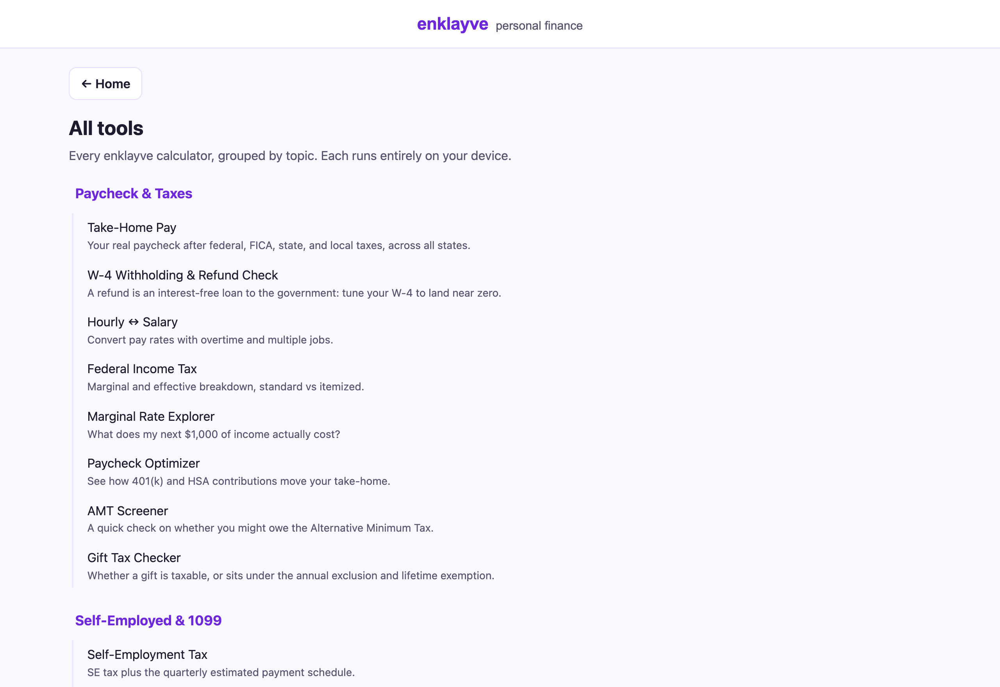
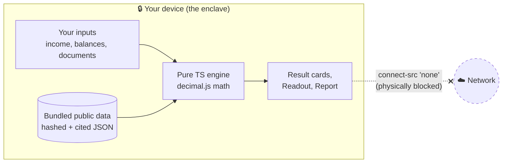
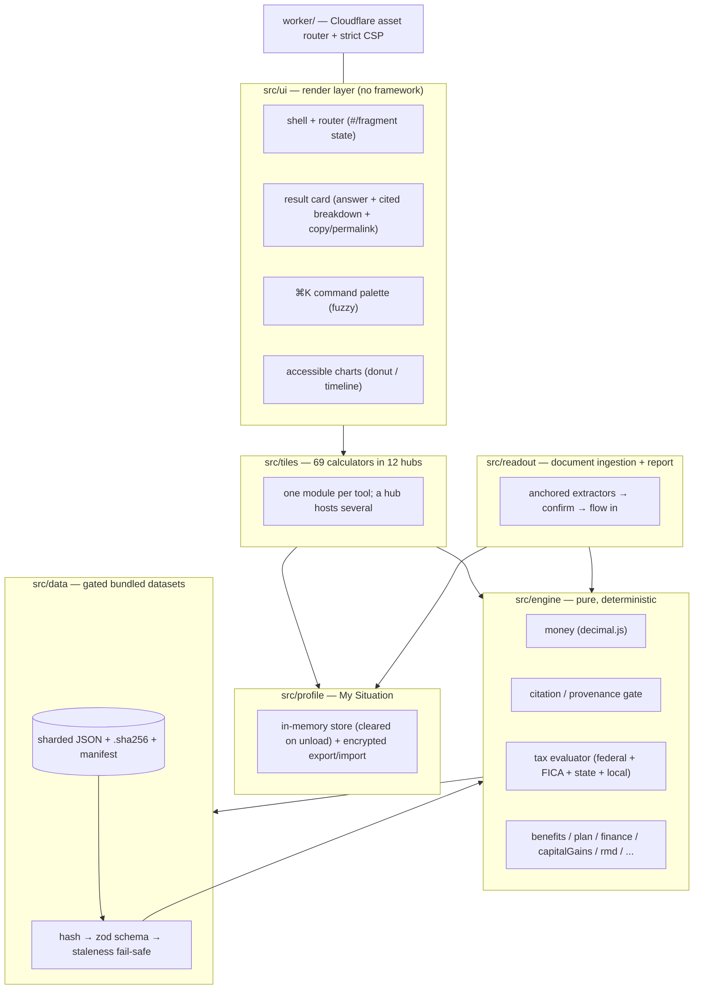
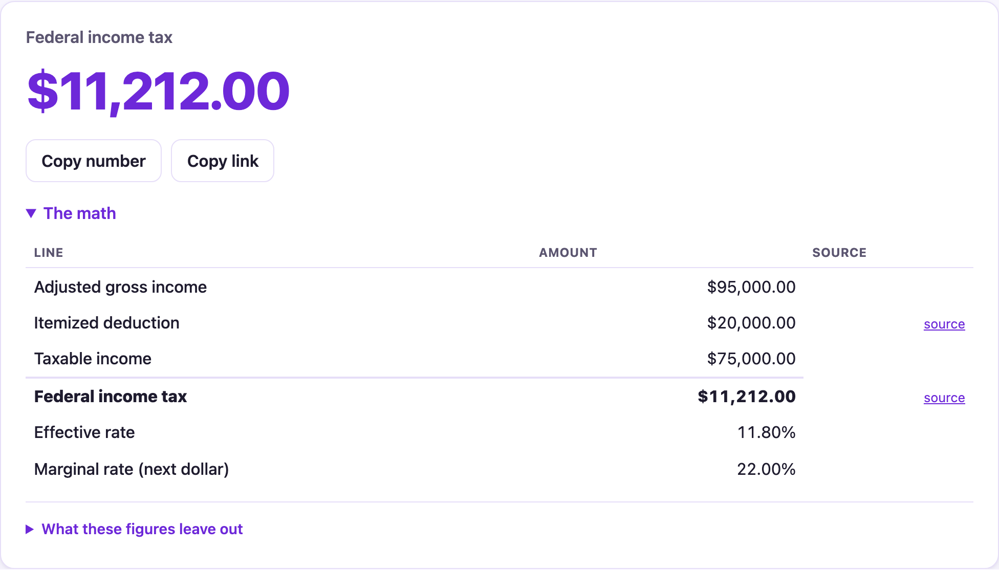
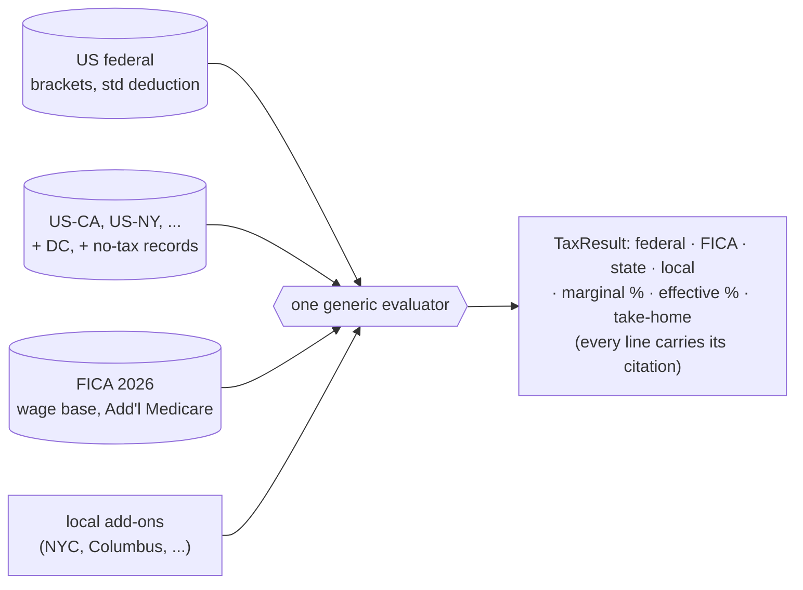
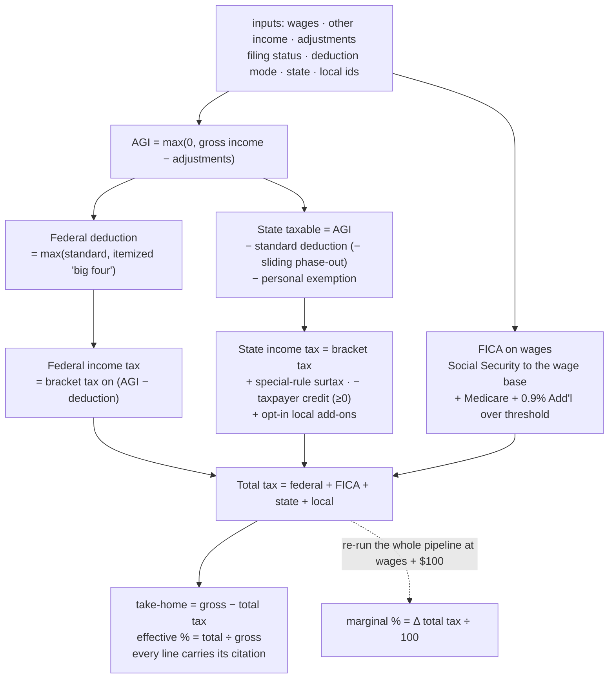
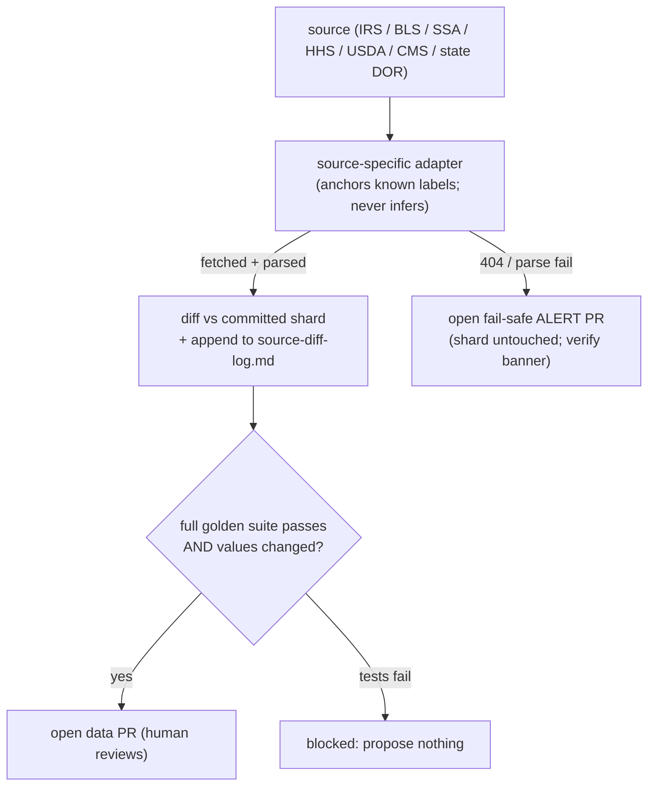
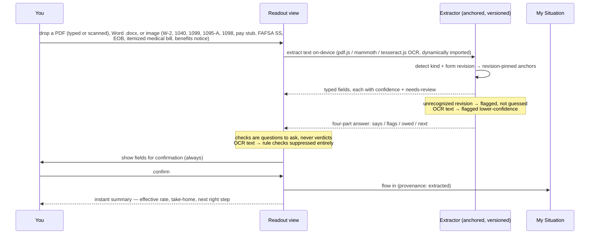
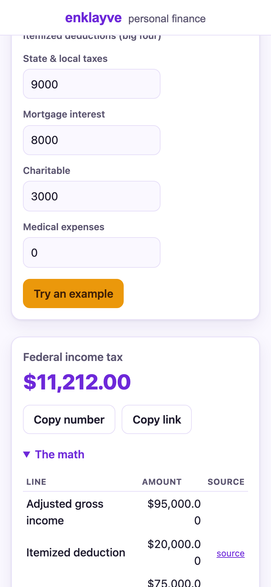
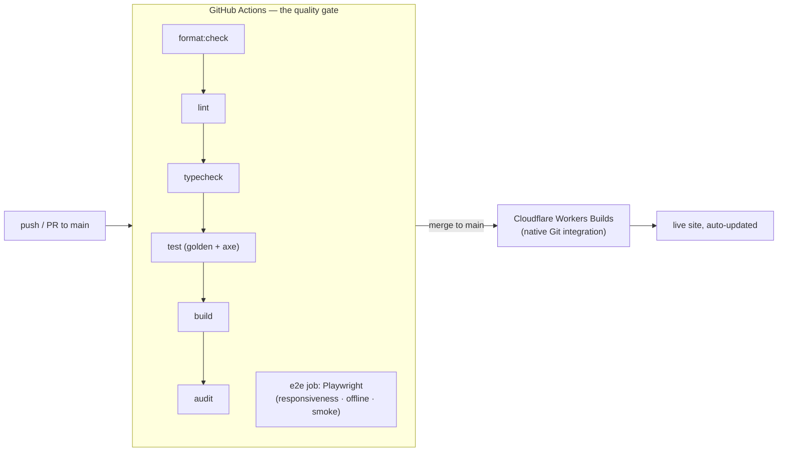

# enklayve

> Your private financial enclave. Every number is computed on your device. Nothing is ever sent anywhere.


[](https://github.com/clay-good/enklayve/actions/workflows/ci.yml)
[](LICENSE)
[](#determinism--verification)
[](#the-privacy-guarantee-its-literal)

enklayve is the honest money guidance the personal-finance experts charge for — your real take-home pay, what you owe in taxes, what public benefits you're owed, and your next right step — except it's **free, and it always will be.** No accounts, no ads, no cookie banner, no upsell. It's a free public utility for understanding your money: deterministic, private, and showing its work.

It's meant to feel like peace in a transactional web. Every figure is reproducible from public data bundled into the site, every rule links its source so you can verify it yourself, and there's zero telemetry, zero AI, and zero runtime network calls. The Content-Security-Policy sets `connect-src 'none'`: the browser physically cannot send your data out, even if a bug tried to.

Scope is the **United States** today (federal and state taxes and benefits); Europe, then India, China, and Russia are on the roadmap as each jurisdiction's rules are learned properly. enklayve is educational information, not financial, tax, investment, or legal advice.

See [docs/specs/SPEC.md](docs/specs/SPEC.md) (the vision + Phases 0–11), [docs/specs/SPEC-2.md](docs/specs/SPEC-2.md) (experience, ingestion, guidance + Phases 12–17), [docs/specs/SPEC-3.md](docs/specs/SPEC-3.md) (the trust pass: robustness invariants, citation integrity, and the next-wave roadmap), and [docs/specs/SPEC-4.md](docs/specs/SPEC-4.md) (the public-utility pass: Pillar 4 “Rough Water”, documents that answer, the sequencers, and the standing ledger) for the full plan.

### By the numbers

A verifiable snapshot — every figure here is reproducible from the repo, not marketing. Every repo-relative link in every markdown file is checked too — a claim you can click into is checkable, one you cannot is marketing. The counts are **checked by a test** ([`tests/build/readmeCounts.test.ts`](tests/build/readmeCounts.test.ts)) that reads them out of this file and compares them against the registry, the manifest, and the build's own page list, so a claim here cannot drift from the code that backs it.

| Metric | Value | Where to check |
|---|---|---|
| Deterministic calculators | **69** in **12 topic hubs**, plus the on-home anti-budget | [`src/tiles/registry.ts`](src/tiles/registry.ts) |
| Tax jurisdictions | **51 — every one of the 50 states + DC** (41 income-tax states + DC + 9 no-income-tax) | [`data/state-*-income-tax-*.json`](data) |
| Cited dataset shards | **81**, each with a sibling `.sha256` + manifest entry — the file, its sibling, and the manifest are checked to agree three ways; every `sourceDocument` ≤160 chars (audit-enforced) | [`data/manifest.json`](data/manifest.json) |
| Tests | unit/golden across **150** files, **+62** Playwright e2e | `npm run test` / `npm run test:e2e` |
| Source audits | **all 51 jurisdictions + the federal and benefits shards** read against the agency's own document; 9 wrong figures found and fixed — the ninth being the AMT exemption phase-out **rate**, which an earlier audit of that same shard missed because it read the columns the revenue procedure *tabulates* and not the one that cross-checks them. Every one also has a hand-verified golden case, and that is now a **gate** rather than somebody's diligence | [`docs/data-sources.md`](docs/data-sources.md#source-audits) |
| Runtime network requests | **0** — `connect-src 'none'` blocks them at the browser | [`worker/index.ts`](worker/index.ts) |
| Auto-persisted user data | **0** — only the locale/theme preference touches `localStorage`, and the gate now covers `sessionStorage`, IndexedDB, cookies and the Cache API too, asserted end-to-end across a full session | `npm run audit` / `npm run test:e2e` |
| UI framework / runtime deps that phone home | **none** | [`package.json`](package.json) |

---

## Table of contents

- [What you can do with it](#what-you-can-do-with-it)
- [The privacy guarantee, it's literal](#the-privacy-guarantee-its-literal)
- [The home: the budget is the plan](#the-home-the-budget-is-the-plan)
- [Architecture at a glance](#architecture-at-a-glance)
- [The tax engine (the moat)](#the-tax-engine-the-moat)
- [The data layer and refresh workflows](#the-data-layer-and-refresh-workflows)
- [The Readout: deterministic document ingestion](#the-readout-deterministic-document-ingestion)
- [My Situation, the plan, and My Readout Report](#my-situation-the-plan-and-my-readout-report)
- [Determinism & verification](#determinism--verification)
- [Design language](#design-language)
- [Build status](#build-status)
- [Project layout](#project-layout)
- [Develop](#develop)
- [CI/CD and deploy](#cicd-and-deploy)
- [Design decisions worth knowing](#design-decisions-worth-knowing)
- [Roadmap & deliberately deferred](#roadmap--deliberately-deferred)
- [License](#license)

---

## What you can do with it

**69 deterministic calculators**, each with a worked example, per-figure citations, a plain-English "How this works," "Learn more" links, and deep-linkable URL state — all four **enforced as a test over the whole catalog** ([`tests/ui/catalogInvariants.test.ts`](tests/ui/catalogInvariants.test.ts)), so the bar is a gate rather than a review checklist. They're grouped into **12 plainly-named topic hubs** (a hub is one page with a segmented control switching between its calculators; the underlying engine is shared, so a number entered in one tool prefills every other). The **anti-budget** that gives every dollar a job lives directly on the home — it *is* the plan, in written form. Reach any calculator by ⌘K search or the crawlable [All Tools index](#cicd-and-deploy), which lists **every calculator by name under its hub** (and the static `tools.html` mirror links each one's pre-rendered landing page, so all 81 pages are reachable in one hop, not just via the sitemap).



*The crawlable All Tools index — the full catalog, grouped by hub, each line a deep link. The same list is mirrored as static `tools.html` for search engines.*

### Paycheck & Taxes

| Tool | What it answers |
|---|---|
| Take-Home Pay | Your real net pay (federal + FICA + state + local) across all 50 states + DC — every U.S. jurisdiction is now modeled |
| W-4 Withholding & Refund Check | Is my withholding right? The per-paycheck tweak to land near $0 |
| Hourly ↔ Salary | Convert either way, with overtime and a second-job stack |
| Federal Income Tax | Marginal + effective breakdown, standard vs itemized (the big four) |
| Marginal Rate Explorer | What your next $1,000 of income actually costs — naming any point where a state's own schedule charges a flat amount for crossing a line |
| Paycheck Optimizer | Tax saved per $1,000 into a 401(k) vs an HSA |
| AMT Screener | A coarse yes/maybe/no on the Alternative Minimum Tax, with a Form 6251 pointer |
| Gift Tax Checker | Whether a gift is taxable, or sits under the annual exclusion / lifetime exemption |

### Self-Employed & 1099

| Tool | What it answers |
|---|---|
| Self-Employment Tax | The full 15.3%, the deductible half, the four 1040-ES installments |
| Quarterly Taxes & Set-Aside | What to skim off each 1099 payment; the safe-harbor minimum (§6654's AGI threshold, halved for a separate return, measured on last year's return); the four 1040-ES due dates (next-business-day rule applied) |
| What Should I Charge? | Work backward from take-home to the billable hourly rate |
| 1099 Contract vs W-2 Salary | The rough salary a contractor rate equals |
| Self-Employed Retirement | SEP-IRA vs Solo 401(k), capped at the §415(c) limit |

### Investing

| Tool | What it answers |
|---|---|
| Capital Gains | Short-term stacked + long-term 0/15/20% bands + the 3.8% NIIT |
| Cost-Basis Lot Picker | FIFO / specific-ID realized gain, split short vs long |
| Tax-Loss Harvesting | Schedule D netting, the $3,000 offset, the carryforward |
| Child Tax Estimator | A child's investment income across the three IRC §1(g) bands |
| Compound Growth | Growth at a rate you supply (never a market prediction); opt-in ± range |
| Treasury I Bond | What a Series I savings bond earns and is worth (TreasuryDirect) |
| CPI Inflation Adjuster | What a past dollar is worth in another year (BLS CPI-U) |

### Retirement

| Tool | What it answers |
|---|---|
| Contribution Optimizer | 401(k)/IRA/HSA room left this year against IRS limits + catch-ups |
| Roth Conversion Ladder | The 5-year seasoning schedule and the bridge stream it builds |
| Backdoor / Mega-Backdoor Roth | The pro-rata rule; after-tax 401(k) room |
| IRA Deduction Checker | Whether your traditional-IRA contribution is deductible at your income (IRC §219(g) phase-outs) |
| Required Minimum Distribution | Balance ÷ the IRS Uniform Lifetime factor for your age |
| Retirement Drawdown & RMD Timeline | How long savings last, in today's dollars; opt-in ± range |
| Social Security Claiming Age | Benefit at 62 / FRA / 70 from the published SSA formula |
| Social Security Taxation | How much of your benefit is taxable — the IRC §86 0/50/85% provisional-income rule |
| Downshift Point | When you can stop adding savings and still arrive |

### Borrowing & Debt

| Tool | What it answers |
|---|---|
| Debt Freedom Planner | Snowball vs avalanche, the freedom date and interest for each |
| Loan & Mortgage Amortization | Full schedule + extra-payment what-ifs |
| Refinance Break-Even | Months to recoup the closing costs |
| Auto Loan & True Cost of Credit | Total of payments and the effective annual rate |
| Balance Transfer Break-Even | Net saving after the fee across the intro window |
| Freedom Date | The date a single balance is gone |

### Budgeting & Cash Flow

| Tool | What it answers |
|---|---|
| 50/30/20 Spending Plan | Needs / wants / savings from your take-home |
| Cash-Flow Timeline | The running daily balance and the tightest day |
| Sinking Fund Planner | The level monthly amount to reach a goal by a date |

> The full **zero-based budget** ("give every dollar a job until $0 is left to assign") is the home page itself — it auto-computes taxes through the same engine, splits the rest across living-expense and investing lines, and closes with the anti-budget order-of-operations. It needs no separate tile.

### Home & Big Purchases

| Tool | What it answers |
|---|---|
| Home Buying Readiness | The all-in price you can afford on the 28/36 guideline |
| Rent vs Buy | A net-cost comparison over a chosen horizon; opt-in ± range that can flip the verdict |
| College Cost Planner | The monthly contribution to fully fund it by enrollment; opt-in ± range |

### Insurance & Protection

| Tool | What it answers |
|---|---|
| Health Plan Chooser | The cheaper plan for a year of expected spend |
| Medical Bill & EOB Checker | Whether a health claim adds up, and whether the No Surprises Act covers it (tier 3, screener-only) |
| Life Insurance Needs | The transparent DIME method |
| Disability Insurance Needs | The monthly income gap if you couldn't work |
| Umbrella Liability Coverage | Coverage sized to net-worth exposure |
| Estate & Beneficiary Checklist | The deterministic basics (not legal advice) |

### Benefits & Aid (What You're Owed)

| Tool | What it answers |
|---|---|
| What Am I Owed? (screener) | A plain-English list of likely-eligible programs + dollars |
| Federal Poverty Level | Your % of the FPL (contiguous / Alaska / Hawaii) |
| Earned Income Tax Credit | The estimate from the published phase-in/out |
| Child Tax Credit | CTC + the refundable Additional CTC |
| ACA Premium Tax Credit | The marketplace subsidy (you supply the benchmark premium) |
| Saver's Credit | 50/20/10% of capped contributions by AGI tier |
| SNAP Eligibility | The gross + net income tests and an estimated benefit |
| Medicaid Threshold | Adult MAGI eligibility by state |
| FAFSA Student Aid Index | The published need-analysis methodology, every step shown |
| Pell Grant | The award from the SAI |
| Education Credit Comparison | AOTC vs Lifetime Learning Credit — which saves more this year |

### Benefit Cliffs (Pillar 4, "Rough Water")

| Tool | What it answers |
|---|---|
| Benefit Cliff Explorer | Whether earning more actually leaves you better off, and exactly where the edges sit |
| Marginal Reality Rate | What your next $1,000 costs once benefit phase-outs are counted, not just tax |

### When Money Is Tight (Pillar 4, "Rough Water")

| Tool | What it answers |
|---|---|
| Bill Triage | What to pay first when you can't pay everything, ordered by consequence, not interest rate (tier 2) |
| Life-Event Sequences | Six ordered checklists for the events that rearrange your money — job loss, death, divorce, disability, a new child, a move (tier 2) |
| Enrollment & Appeal Windows | The federal deadlines that decide whether you keep coverage or a benefit, counted from a date you set (tier 2) |
| Wage Garnishment Limits | The federal ceiling on what a garnishment can take, and why your state may allow less (tier 3, screener-only) |
| Hospital Financial Assistance | The discount a nonprofit hospital must let you ask for (tier 3, screener-only) |
| Do I Have to Pay to File? | Which free federal filing channel you qualify for — there is always one |

### Where You Stand

| Tool | What it answers |
|---|---|
| Peace of Mind | Rainy-day cushion, runway, net worth, My Enough Number, and the time to reach it — one calm view |
| Sabbatical / Big-Purchase Planner | What a break costs your runway |

---

## The privacy guarantee, it's literal

Most money sites are lead-generation businesses: you type your income, they route it to lenders and advertisers. enklayve routes **nothing**, and that is enforced at the network layer rather than promised in a policy.


```mermaid
flowchart LR
    subgraph Device["🔒 Your device (the enclave)"]
        I["Your inputs<br/>income, balances, documents"]
        E["Pure TS engine<br/>decimal.js math"]
        D[("Bundled public data<br/>hashed + cited JSON")]
        R["Result cards,<br/>Readout, Report"]
        I --> E
        D --> E
        E --> R
    end
    R -. "connect-src 'none'<br/>(physically blocked)" .-x Net(("☁️ Network"))
    style Net stroke-dasharray: 5 5
```

- **`connect-src 'none'`** in the Content-Security-Policy means the page cannot open a network connection — no `fetch`, no `XHR`, no beacon, no websocket. A bug *cannot* exfiltrate your data because the browser refuses the connection.
- **No telemetry, no accounts, no third-party anything.** No analytics, no CDN fonts, no trackers. The only persisted state is your locale preference in `localStorage`.
- **Sensitive inputs never persist.** Income, balances, and parsed documents live in memory and are cleared on page unload (`pagehide`).
- **Datasets are bundled, not fetched.** Every shard is inlined at build time and re-verified in the browser against its content hash before use, so the running app knows exactly what it's computing from while staying offline-capable.
- The release audit (`npm run audit`) fails the build if any of these invariants is violated.
- **The dependencies are audited too, and the reasoning is written down.** The guarantee is a claim about the code running on your device, and most of that code is other people's — a document reader, a PDF renderer, an OCR engine. `npm audit` knew about a moderate advisory in `@xmldom/xmldom` — the XML parser behind the Readout's Word support — and nothing in this repo was reading it. [`npm run check:advisories`](scripts/check-advisories.ts) ([workflow](.github/workflows/check-advisories.yml), monthly) now does, and it gates on **an advisory nobody has looked at** rather than on an advisory: most findings in a front-end dependency tree are unreachable, the upgrade often does not exist, and a check that fails on every one of them is muted inside a month. Each finding must appear in [`advisory-triage.json`](scripts/advisory-triage.json) naming the vulnerable entry point and what calls it; a test rejects a reason too short to be checkable, because *"not exploitable"* is a decision with no argument attached. **The triage file is empty today, and that is the state to want** — the xmldom advisory was fixed rather than argued with.

**Its entry was wrong, and how it was wrong is the more useful story.** The bar for accepting an advisory is two halves: no upgrade is available, *and* the vulnerable path is unreachable. The unreachability half held — the flaw is in `XMLSerializer`, and neither this app nor mammoth ever serializes. The availability half did not. The entry said the fix was 0.9.x and out of reach, since mammoth calls `parseFromString(string)` with no mimeType and 0.9 rejects that. All true of 0.9 — and 0.8.15 had backported the same fix *inside* mammoth's own `^0.8.6` range, published eleven minutes before the 0.9.12 that got tested and twelve days before the entry was written. Only the 0.9 door was tried. `npm audit` was reporting `fixAvailable: true` the whole time, in the same payload the check already parsed to find the advisory at all — so the check now reads it, and **an entry standing while npm reports a fix fails the run, whatever the prose beside it says.** "Unreachable" is a judgement worth trusting for a year; "there is no fix" is a fact with an expiry date.

The 0.9 attempt was still worth its cost: the override passed the entire unit suite — because vitest aliases mammoth to its own prebuilt browser bundle while the shipped app links the installed package, so the suite was testing a different parser than production ships — and threw on the first `.docx` in a real browser. [`e2e/wordDocument.spec.ts`](e2e/wordDocument.spec.ts) now reads a Word document in Chromium so the shipped path is held by something, and it is what proved the 0.8.15 upgrade safe.

Two same-origin **workers** are the only carve-outs from `connect-src 'none'`, and each is allowed `connect-src 'self'` for the same reason — it fetches same-origin static assets only, has no server endpoint, and never touches your in-memory data: the **offline service worker** (`/sw.js`), which caches the shell, and the **OCR worker** (`/ocr/*`), which loads its wasm engine and bundled language model when you drop a scanned image. A worker's CSP comes from its own response, not the page's, so neither loosens any page — every page still serves `connect-src 'none'`.

---

## The home: the budget is the plan


*The home: a hero, the on-device Readout dropzone, and the anti-budget — income in, taxes auto-computed through the same `evaluateTaxes` engine, every remaining dollar given a job while "left to assign" falls to zero.*

The home is stripped to the essentials (redesigned through 2026-06-02; BUILD-SPEC-2 §0.7 and the later consolidation notes). The header is just the wordmark **enklayve** with the lowercase tagline *personal finance* — no theme toggle, no buttons. The body is three stacked zones: a one-line hero, the **Readout dropzone** (drop a pay stub / W-2 / tax form for an instant private readout, never uploaded), and then the centerpiece — the **anti-budget**. The budget takes an income at any pay frequency, a filing status, and a state, auto-computes taxes through the **same `evaluateTaxes` engine** the Take-Home tile uses, and lets you split the rest across living-expense and investing lines while a donut fills and "left to assign" falls toward zero. It closes with the plain-English **anti-budget order-of-operations** (automate everything, then fund things in order: full match → kill high-interest debt → six months of cash → 401(k)/IRA/HSA → brokerage → whatever future you believe in). There is no separate "My Plan" page anymore: **the live budget plus that order-of-operations *is* the plan.** Every other calculator is reached by the **⌘K command palette** or the crawlable **All Tools index** (linked in the footer).

```
+---------------------------------------------------------------+
|  enklayve  personal finance                                   |
|                                                               |
|                  Your money, made simple.                     |
|     Your real take-home, the taxes you owe, the benefits      |
|        you might be missing, and your next smart move.        |
|                                                               |
|   +-------------------------------------------------------+   |
|   |   Drop a pay stub, W-2, or tax form                   |   |
|   |        ->  instant private readout (never uploaded)   |   |
|   +-------------------------------------------------------+   |
|                                                               |
|   Your budget                          ╭───────────╮          |
|   Income [ $ 60,000 ] [Annually ▾]     │   donut   │          |
|   Filing [ Single ▾ ]  State [ ID ▾ ]  │  fills to │          |
|   Taxes (auto)        − $11,234        │    $0     │          |
|   Housing/Transport/Food/Debt/Other …  ╰───────────╯          |
|   Retirement / Brokerage …          Left to assign: $0        |
|                                                               |
|   The anti-budget: give every dollar a job …                  |
+---------------------------------------------------------------+
|  [Why enklayve]      [GitHub]          [♥ Clay Good]          |
+---------------------------------------------------------------+
```

Every U.S. income-tax state and DC is modeled, so selecting any state shows a real combined figure — no "not modeled yet" caveat anywhere. Every view is **vertical-scroll only on every device width** — form controls shrink inside their grid track (`min-width: 0`), wide "show the math" tables and chart timelines get their own contained horizontal scroll, and an `overflow-x: clip` backstop on both the content column *and the document root* guarantees the viewport itself never scrolls sideways. `viewport-fit=cover` + safe-area insets keep the chrome clear of the notch. A Playwright suite **measures** this — every view and all 69 calculators, from 320px to 1440px, plus landscape phones — so a regression fails CI rather than shipping.

---

## Architecture at a glance

A single static site. **No UI framework** — vanilla TypeScript with a tiny render layer keeps the bundle small and the determinism obvious. A pure engine at the core, a gated data layer feeding it, one module per tool on top, and a thin Cloudflare Worker that only serves assets and sets headers.


```mermaid
flowchart TD
    subgraph UI["src/ui — render layer (no framework)"]
        SH["shell + router (#/fragment state)"]
        RC["result card (answer + cited breakdown + copy/permalink)"]
        CP["⌘K command palette (fuzzy)"]
        CH["accessible charts (donut / timeline)"]
    end
    subgraph TILES["src/tiles — 69 calculators in 12 hubs"]
        T1["one module per tool; a hub hosts several"]
    end
    subgraph PROFILE["src/profile — My Situation"]
        PS["in-memory store (cleared on unload) + encrypted export/import"]
    end
    subgraph READOUT["src/readout — document ingestion + report"]
        RX["anchored extractors → confirm → flow in"]
    end
    subgraph ENGINE["src/engine — pure, deterministic"]
        MN["money (decimal.js)"]
        CI["citation / provenance gate"]
        TAX["tax evaluator (federal + FICA + state + local)"]
        BEN["benefits / plan / finance / capitalGains / rmd / ..."]
    end
    subgraph DATA["src/data — gated bundled datasets"]
        LO["hash → zod schema → staleness fail-safe"]
        DS[("sharded JSON + .sha256 + manifest")]
    end
    TILES --> ENGINE
    READOUT --> ENGINE
    TILES --> PROFILE
    READOUT --> PROFILE
    UI --> TILES
    ENGINE --> DATA
    DS --> LO --> ENGINE
    WORKER["worker/ — Cloudflare asset router + strict CSP"] --- UI
```

| Layer | Responsibility |
|---|---|
| `src/engine` | Exact decimal money math, the citation/provenance gate, the composable tax evaluator, and the per-domain math (benefits, finance, capital gains, RMD, Social Security, FAFSA, the guidance plan) |
| `src/data` | zod schemas for every dataset kind, content-hash integrity, and the per-dataset fail-safe gate (stale or corrupt → a verify banner, never a wrong number) |
| `src/tiles` | One module per calculator. Adding a tool never touches the shell |
| `src/ui` | Render layer, the light theme, result card, fuzzy palette, fragment router, accessible charts |
| `src/profile` | My Situation — the in-memory session profile and the portable encrypted export (surfaced in the Readout Report) |
| `src/readout` | Anchored document extraction, the confirm flow, and the downloadable Readout Report |
| `worker` | A minimal Cloudflare Worker: asset routing + the security headers |

---

## The tax engine (the moat)

A **declarative rule corpus, not a pile of conditionals.** Each jurisdiction is a typed JSON data file; **one generic evaluator** consumes any number of them. Adding a state means adding *data*, not code — which is how the engine stays maintainable across annual updates and how outside contributors can help safely.



*The engine's visible output. Every result opens "The math" by default — a breakdown whose third column links each statutory figure to its source (here, the IRS bracket schedule and the standard-deduction notice). Derived lines (effective rate, taxable income) carry no link by design; only sourced numbers do. Captured from the live app via `npm run screenshots`.*


```mermaid
flowchart LR
    F[("US federal<br/>brackets, std deduction")]
    S[("US-CA, US-NY, ...<br/>+ DC, + no-tax records")]
    K[("FICA 2026<br/>wage base, Add'l Medicare")]
    L["local add-ons<br/>(NYC, Columbus, ...)"]
    EV{{"one generic evaluator"}}
    F --> EV
    S --> EV
    K --> EV
    L --> EV
    EV --> RES["TaxResult: federal · FICA · state · local<br/>· marginal % · effective % · take-home<br/>(every line carries its citation)"]
```

**Anatomy of one evaluation.** [`evaluateTaxes`](src/engine/tax/evaluate.ts) is a pure function that composes the three tax bases in a fixed order, then measures the *combined* marginal rate the only honest way — by re-running the entire pipeline against a $100 wage probe, so bracket edges, the Social Security wage base, and the Additional Medicare threshold all register at once (no hand-derived marginal formula to drift).


```mermaid
flowchart TD
    IN["inputs: wages · other income · adjustments<br/>filing status · deduction mode · state · local ids"]
    IN --> AGI["AGI = max(0, gross income − adjustments)"]
    AGI --> FD["Federal deduction<br/>= max(standard, itemized 'big four')"]
    FD --> FTAX["Federal income tax<br/>= bracket tax on (AGI − deduction)"]
    IN --> FICA["FICA on wages<br/>Social Security to the wage base<br/>+ Medicare + 0.9% Add'l over threshold"]
    AGI --> SD["State taxable = AGI<br/>− standard deduction (− sliding phase-out)<br/>− personal exemption"]
    SD --> STAX["State income tax = bracket tax<br/>+ special-rule surtax · − taxpayer credit (≥0)<br/>+ opt-in local add-ons"]
    FTAX --> SUM["Total tax = federal + FICA + state + local"]
    FICA --> SUM
    STAX --> SUM
    SUM --> OUT["take-home = gross − total tax<br/>effective % = total ÷ gross<br/>every line carries its citation"]
    SUM -. "re-run the whole pipeline at wages + $100" .-> MARG["marginal % = Δ total tax ÷ 100"]
```

- Seeded with **all 51 jurisdictions — every one of the 50 states and DC** — kept current through the staggered annual refresh (SPEC §14.3). **No-income-tax states are first-class records,** not omissions, so a resident sees their state by name with $0 state tax confirmed (and its citation), not a generic "no state tax modeled."
- **Per-filing-status schedules are supported** (the schema keys brackets by status and `bracketsFor` resolves each, with the QSS→MFJ→single fallback). New Jersey (different rates *and* thresholds), Minnesota (same rates, different thresholds), Kansas (a two-bracket schedule, single threshold vs. doubled-for-joint), and New Mexico (where head-of-household filers share the married-jointly schedule) all use it, so a state whose tiers differ by status is now data, not code.
- Handles ordered marginal brackets, filing statuses, standard vs itemized (the "big four": SALT capped under the post-OBBBA §164(b)(6)-(7) rule — $40,400 for 2026, phasing down by 30% of MAGI over $505,000 to a $10,000 floor, halved for a separate return — mortgage interest, charitable, medical above the floor), **all five of the One Big Beautiful Bill Act's new individual deductions** — $1,000 of cash giving without itemizing ($2,000 jointly, §170(p)), $6,000 per person aged 65 (§151(d)(5)(C)), $25,000 of tips (§224), $12,500 of overtime ($25,000 jointly, §225), and $10,000 of car loan interest (§163(h)(4)) — each with its own phase-out shape, of which the Act wrote four for five deductions: a rate, a per-person rate, a step counting completed thousands, and a step counting part-thousands too, FICA with the wage base + 0.9% Additional Medicare, personal exemptions, special rules (e.g. the CA mental-health surtax), top-bracket surtaxes (e.g. the MA 4% millionaire surtax, modeled as a clean second bracket), a **taxpayer tax credit** that stands in for a standard deduction (Utah: a nonrefundable credit equal to a share of the federal deduction, phasing out with income), a **sliding standard deduction** that phases down as AGI rises (South Carolina's SCIAD), a **federal-income-tax deduction** — the "federal tax paid" subtraction, either uncapped (the Alabama shape) or capped and AGI-phased (the Oregon shape), computed from the engine's own federal figure so the marginal probe stays honest — a **high-income benefit recapture** that adds a flat amount phasing in over an income band — one ramp for all statuses (Arkansas's bracket adjustment) or per-status stacked ramps (Connecticut's 2% phase-out add-back + tax recapture, which claw back the lower-bracket benefit toward a flat 6.99%), a **percent-of-tax personal credit** that slides down with AGI in a step table (Connecticut's Table E), a **fixed base amount attached to a bracket** — Ohio's statutory "$332.00 plus 2.75% of the amount in excess of $26,050", a genuine cliff where a filer one dollar over the threshold owes the whole $332 — opt-in local add-ons (NYC, Yonkers, Ohio municipalities), and a **mandatory residence-based local tax** — Maryland's county / Baltimore-City income tax, a required single-select set by county of residence (flat or, for Anne Arundel and Frederick, income-tiered), and **federal-taxable-income conformity**, which is the state deduction nobody legislated: Colorado, Idaho, Iowa, Montana, North Dakota, and Oregon start their income tax at *federal taxable income*, so the five new federal deductions above are state deductions there too unless the state adds one back — and two of the six add back exactly one deduction each, different ones. Colorado adds back the overtime deduction (HB25-1296) and says in the same paragraph of its own guide that tips are not; Oregon adds back the car loan interest and only that (enrolled SB 1507, 2026 ch. 142 §2). That is why the shard carries five booleans and not one. New Mexico looks like the same case and is not: it starts from adjusted gross income and subtracts "an amount equal to the standard deduction allowed ... by Section 63" (NMSA §7-2-2), which is §63(c) alone, so nothing in §63(b) reaches it.
- **Filing-status fallback:** the seeded states define single / married-jointly / head-of-household; the other two resolve correctly — **qualifying surviving spouse → the married-jointly schedule** (federally and in essentially every state, so it's never silently taxed as single), and married-filing-separately → single (the documented state-level assumption). Federal defines all five explicitly.
- **Fail-safe is per jurisdiction:** if the California source is stale, California shows a verify banner while every other jurisdiction keeps working.

### State coverage cheat sheet

Every seeded state is modeled at one consistent launch fidelity — **brackets + standard deduction + personal exemption** (plus the documented capability each state needs: a taxpayer credit, a sliding deduction, a federal-tax deduction, or — Maryland — a mandatory county local tax), cross-checked against the Tax Foundation's 2026 state-rate table and cited to the state DOR — with state-specific credits, optional municipal add-ons, and state itemized deductions deferred to a later wave.

| Shape | States | How it's modeled |
|---|---|---|
| Graduated brackets (one schedule, all statuses) | CA, NY, DC, OH, VA, MO, DE, RI | Ordered marginal tiers; CA adds the 1% mental-health surtax, OH the opt-in Columbus municipal tax, VA stacks a $930 personal exemption on its standard deduction, MO runs eight compressed tiers (0%→4.7%) over a federal-conformity deduction, DE runs seven tiers (0%→6.6%) over a small statutory $3,250/$6,500 deduction with the *same* brackets for joint filers — a built-in marriage penalty. RI (3.75/4.75/5.99%) keeps uniform brackets but stacks *both* a standard deduction and a $5,250-per-taxpayer exemption (the VA stack on a uniform schedule). WV (2.11→4.58%, the 2026 5% cut) runs five uniform tiers with NO standard deduction and a $2,000-per-exemption personal exemption |
| Graduated, **schedule differs by filing status** | NJ, MN, KS, NM, OK, HI, MT, ND, VT, NE | NJ: single/MFS run a 7-bracket schedule, MFJ/HoH/QSS an 8-bracket one (an extra 2.45% tier); no standard deduction, a $1,000 exemption ($2,000 joint). MN: same four rates (5.35–9.85%) but single/MFJ/HoH thresholds all differ, over an indexed standard deduction. KS: two rates (5.20%/5.58%) crossing at $23,000 single / $46,000 joint (SB 1), over a standard deduction *and* a $9,160/$18,320 exemption. NM: six rates (1.5–5.9%, HB 252) where head-of-household and surviving-spouse filers share the married-jointly schedule (NM has no separate HoH schedule), over the federal-conformity deduction. OK: three rates (2.5/3.5/4.5%, HB 2764 2026) over a 0% band, single thresholds doubled for joint/HoH/surviving-spouse, plus a $6,350/$12,700/$9,350 deduction and $1,000/exemption. **HI: twelve brackets (1.40%→11.00%, the most of any state)** where the thresholds derive by a fixed statutory ratio — MFJ exactly 2× single, HoH exactly 1.5× single (Act 46 2024) — over an $8,000/$16,000/$12,000 standard deduction and a $1,144 exemption. **MT: two rates (4.70%/5.65%, HB 337 2025) on federal taxable income** (conformity, federal standard deduction embedded) with the 4.70% bracket running to $47,500 single / $95,000 joint (2×) / $71,250 HoH (1.5×). **ND: a 0% band then two rates (1.95%/2.50%, SB 2034) on federal taxable income** (conformity) — the lowest top rate of any wage-taxing state — where, unlike MT/HI's clean ratios, the per-status thresholds index independently (1.95% opens at $49,575 single / $82,800 joint / $66,400 HoH; the 0% band means a single filer at $60k taxable owes $0). **VT: four rates (3.35/6.60/7.60/8.75%, 32 V.S.A. §5822)** over per-status thresholds (single 6.60% at $49,400 / joint at $82,500 / HoH at $66,200, climbing to 8.75% over $249,700 / $304,000 / $276,850) — over the Rhode Island/Virginia stack: a $7,650/$15,300/$11,450 standard deduction *and* a $5,300-per-exemption personal exemption (one single/HoH, two joint). **NE: three rates (2.46/3.51/4.55%, LB 754) for 2026** — the 2025 schedule's top two rates (5.01%/5.20%) both cut to 4.55% and merged — over per-status thresholds (single 4.55% over $24,120, joint over $48,250, HoH over $38,590) and a $8,600/$17,200/$12,600 standard deduction; the ~$171 per-person exemption *credit* is omitted at launch fidelity. The engine resolves brackets per status — adding such a state is now data, not code |
| Flat rate | PA (3.07%), IL (4.95%), MI (4.25% + Detroit 2.4%), GA (4.99%), NC (3.99%), AZ (2.50%), CO (4.40%), IN (2.95%), KY (3.50%), ID (5.30%), LA (3.00%), IA (3.80%) | A single bracket; standard deduction and/or personal exemption where the state grants one. ID and IA conform to the federal standard deduction (the CO pattern); LA grants a large $12,875 / $25,750 standard deduction ($25,750 for head of household too) |
| Flat + top surtax | MA (5.0% + 4% over $1,107,750) | Two brackets — the surtax is just the top marginal tier |
| Flat over a floor | MS (4.0% over the first $10,000) | A `[{0, 0%}, {10000, 4.0%}]` schedule — the exempt floor is the zero-rate tier |
| Flat + taxpayer credit | UT (4.45%) | Taxes federal AGI directly, then subtracts a nonrefundable taxpayer tax credit (6% of the federal deduction, phasing out at 1.3% of income over a filing-status base) — the credit stands in for a standard deduction |
| **Sliding standard deduction** | SC (1.99% / 5.21% over $30k), WI (3.50→7.65%), ME (5.8→7.15% + 2% surtax) | A deduction that phases down as income rises, two forms of the engine's `standardDeductionPhaseOut` field. **SC** (`divisor` form): the SCIAD ($15k/$30k/$22.5k) is reduced *proportionally* — by `deduction × (AGI − threshold)/divisor` (single $40k→$95k, etc.), rounded down to the next-lowest $10 (H.4216). **WI** (`reductionRate` form): a $13,960/$25,840 maximum reduced by a *flat percentage of AGI* above a threshold — 12% over $20,119 (single, gone by $136,453), 19.778% over $29,039 (joint, gone by $159,690), independent of the deduction's size (Wis. Stat. §71.05(23)); WI also stacks a $1,200-per-exemption personal exemption. **ME** (`divisor` form, read straight from 36 M.R.S. §5124-C): $15,700/$31,400/$23,550 reduced by `deduction × (AGI − threshold)/divisor`, divisors $75k/$112.5k/$150k (single $102,250→$177,250, etc.), over per-status brackets (MFJ 2× / HoH 1.5× single), a $5,300 exemption, and a new 2026 9.15% millionaire-surtax bracket |
| **Federal income tax deduction** | AL (uncapped), OR (capped + AGI-phased) | The "federal tax paid" subtraction against *state* taxable income, computed from the engine's own federal figure so the marginal probe stays honest. **AL**: 2/4/5% graduated (Ala. Code §40-18-5), the **full** federal tax deductible (§40-18-15(a)(1)), over a sliding standard deduction that floors at $2,500/$5,000 ($3,000/$8,500/$5,200 max). **OR**: 4.75→9.9% graduated (ORS §316.037), the federal-tax subtraction **capped at $8,500** ($4,250 MFS) and **phased out by AGI** — full below $125k single / $250k joint, gone by $145k / $290k (OR-40 Table 4, ORS §316.680/§316.695) — over a $2,835/$5,670/$4,560 standard deduction |
| **Mandatory residence-based local tax** | MD (state 2%→6.5%, plus a county tax 2.25%–3.30%), IN (state 2.95%, plus a county tax 0.50%–3.00%) | Two states where a county income tax is *mandatory*, set by county of residence — not opt-in like NYC. Modeled via the engine's `residenceLocalTax`: the take-home tile renders a required single-select **county** dropdown (defaulting to Montgomery), and the engine applies the chosen county's rate to Maryland taxable income. 22 counties are flat; **Anne Arundel and Frederick are income-tiered** (modeled with per-bracket local add-ons). The per-status state schedule runs 2%→6.5% (the FY2026 bill adding 6.25%/6.5% tops over $500k/$1M single, $600k/$1.2M joint) over a fixed $3,350/$6,700 standard deduction and a $3,200/$6,400 exemption. **IN** is the same shape at four times the county count: all **92** Indiana counties, flat, 0.50% (Porter) to 3.00% (Randolph), on the same base as the 2.95% state rate, defaulting to Marion (Indianapolis, 2.02%) |
| **High-income benefit recapture** | AR (0/2/3/3.4/3.9% + a bracket adjustment) | A *uniform* graduated schedule (same brackets for every status, like DE/WV), but above ~$94,700 of net taxable income the **bracket adjustment** recaptures the benefit of the lower 0–3.4% brackets, converging to a near-flat 3.9%. Modeled via the engine's `incomeRecapture`: a flat amount ramping linearly from $0 (at $94,700) to a constant **$329** (at $97,900), added to the bracket tax — exact below the band and above it (matching the AR1000F "$3,809 + 3.9% over $100,000" note to the cent), with a ≤~$15 residual only inside the band. Standard deduction $2,470/$4,940; the low-income tables and the $29 personal credit are omitted (conservative) |
| **Full multi-stage computation** | CT (2%→6.99%, the deepest schedule modeled) | The whole CT-1040 Tax Calculation Schedule (Tables A–E): a seven-rate per-status schedule over a personal exemption ($15k/$24k/$19k) that **phases out dollar-for-dollar** (`standardDeductionPhaseOut`, reductionRate 1.0); **two stacked high-income recaptures** — the 2% phase-out add-back (Table C) and the tax recapture (Table D) — via per-status `incomeRecapture` stages that claw back the lower-bracket benefit toward a flat 6.99%; and a **percent-of-tax personal credit** (Table E, 0.75→0 by AGI) via the `personalCreditRate` step table, so `tax = (B + C + D) × (1 − credit)`. Exact to the cent against the official schedule (apart from a ≤ one-step residual inside each recapture ramp) |
| No income tax | TX, FL, AK, NV, NH, SD, TN, WA, WY | First-class records: empty brackets, $0 confirmed, citation noting any non-wage tax (e.g. WA's capital-gains excise) and any *dated* one (WA's SB 6346 taxes AGI over $1,000,000 at 9.9% from 2028) |

**Idaho** computes on federal taxable income like Colorado, but it is *not* a clean flat tax: Idaho Code §63-3024 puts a **0% band** under its single 5.3% rate (HB 40, 2025) — to $4,811 for single filers and $9,622 for couples, exactly double — and charges 5.3% only on the amount over it. The band is worth about $255 to a single filer and $510 to a couple, so it is modeled rather than rounded away. **Utah** joined once the engine learned the **taxpayer tax credit** it needs: Utah grants no standard deduction, so it taxes federal AGI at a flat **4.45%** (SB 60, 2026, cutting the 4.5% 2025 rate) and gives relief through a *nonrefundable* credit — 6% of the federal deduction, reduced by 1.3% of taxable income above a filing-status base ($18,213 single / $36,426 married jointly), floored at zero. That phase-out raises the effective marginal rate in its band (the engine's wage probe measures it correctly), and below ~$21k the credit cancels the tax entirely. The optional `taxpayerCredit` field on the jurisdiction schema carries it as data, so the one generic evaluator stays the moat. The $2,111-per-dependent personal exemption that would enlarge the credit is omitted (the engine models the no-dependent filer, like every state), so the figure errs slightly high — the conservative side.

**Louisiana** joined via its 2024 reform (Act 11), which collapsed the graduated 1.85%/3.5%/4.25% schedule into a clean **3% flat tax** and raised the standard deduction to **$12,875 single / $25,750 married jointly** — and, unusually, **$25,750 for head of household too** (the federal split puts HoH below MFJ). It needed no engine change (flat rate + standard deduction, the Georgia pattern). Those are the 2026 CPI-indexed amounts (the $12,500/$25,000 2025 base grown 3.0% under Act 11's annual adjustment), cross-checked against the Tax Foundation 2026 table.

**Iowa** joined via Senate File 2442 (2024), which finished Iowa's move to a flat **3.8%** for 2025 and after, over the **federal-conformity standard deduction** ($16,100 / $32,200 / $24,150) — the same shape as Idaho and Colorado, so again no engine change. Iowa's small $40 single / $80 married personal-exemption *credit* and its opt-in local school-district surtaxes are omitted at launch fidelity (like every state's credits and county/municipal add-ons), so the figure errs slightly high by at most $40/$80 — the conservative side.

**Connecticut** (the **51st jurisdiction**, ~3.6M residents) is **the last U.S. income-tax state — with it, every one of the 50 states + DC is modeled** — and the deepest single tax computation the engine performs. Connecticut runs the entire CT-1040 **Tax Calculation Schedule**, Tables A through E, every figure read verbatim from the official 2025 form: Connecticut income tax = **(Table B initial tax + Table C 2% add-back + Table D recapture) × (1 − Table E credit)**. Four mechanisms had to compose correctly. **(A) The personal exemption** — $15,000 single / $24,000 joint / $19,000 head of household — **phases out dollar-for-dollar** (reduced $1,000 per $1,000 of AGI over $30k/$48k/$38k, gone by $44k/$71k/$56k), modeled by reusing the engine's `standardDeductionPhaseOut` with `reductionRate` 1.0. **(B) The seven-rate schedule** (2% / 4.5% / 5.5% / 6% / 6.5% / 6.9% / 6.99%, per status). **(C + D) Two stacked high-income recaptures** that claw back the benefit of the lower brackets so the top earners pay a near-flat 6.99% — the 2% phase-out add-back (max $250/$500/$400) and the tax recapture (max $3,400/$6,800/$5,320). These generalized the Arkansas `incomeRecapture` capability to **per-status stacked ramps**; because the exemption is fully phased out before any recapture begins, taxable income equals AGI throughout the recapture range, so the model matches Tables C/D exactly (apart from a ≤ one-step residual inside each ramp). **(E) A percent-of-tax personal credit** that slides from 0.75 down to 0 as AGI rises in published steps — *essential*, because a $60,000 single filer gets a 10% credit that a bare-bracket model would silently drop. This needed a new `personalCreditRate` step table per filing status, applied as `tax × (1 − rate)` after the recapture. Verified against the official 2025 CT-1040 Tax Calculation Schedule (Tables A–E) and Conn. Gen. Stat. §12-700, cross-checked against the Tax Foundation 2026 table; **golden-tested to the cent across the whole income range** (single $25k → **$130.00** with a full exemption + 35% credit, single $40k → $1,192.50 with a partial exemption, single $60k → **$2,312.50** as the 2% add-back begins, single $100k → $4,991.67 past the credit cutoff, single $300k → $19,812.07 into the Table D recapture, MFJ $40k → $208.00, MFJ $80k → $2,790.00, MFJ $500k → $30,862.07 with both recaptures stacked, HoH $60k → $2,070.00, MFS = single, QSS = joint), plus synthetic isolation tests of the recapture stages and the credit table. Married filing separately maps to single (its slightly different exemption / Table C band / credit steps the documented rare-status approximation); the property-tax credit, EITC, and pass-through-entity-tax credit are omitted at launch fidelity; no local income tax. **With Connecticut, the fifty-state moat is complete — every U.S. income-tax state and DC is modeled, cited, and golden-tested.**

**Arkansas** (the **50th jurisdiction**, ~3.1M residents) brings coverage to every U.S. income-tax state but one, and it needed the session's one new capability: a **high-income benefit recapture**. Arkansas's rate schedule (Ark. Code §26-51-201) is *uniform* across filing statuses — it does not double the brackets for couples — running 0% on the first $5,599 of net taxable income, then **2% / 3% / 3.4% / 3.9%** over $5,600 / $11,200 / $16,000 / $26,400, read verbatim from the official **2025 AR1000F Regular Income Tax Table** (which reconciles to the dollar: net taxable $61,000 → $1,961). Its signature is the **bracket adjustment**: above ~$94,700 of net taxable income Arkansas claws back the benefit of those lower brackets, so a high earner's tax converges to a near-flat 3.9% schedule. The engine gained an `incomeRecapture` block — a flat amount that ramps linearly from $0 (at $94,700) to a constant **$329** (at $97,900) and stays $329 above — derived *exactly* from the table's own "$3,809 + 3.9% of the excess over $100,000" note: the graduated tax at $100,000 is $3,480.00, so the recapture is precisely $3,809 − $3,480 = **$329**. That makes the model **exact below the band and above it** — every high income matches the AR1000F note to the cent — with only a ≤~$15 linear-vs-step residual inside the narrow $94,700–$97,900 phase-in band. The standard deduction is **$2,470** ($4,940 married jointly); married filing separately maps to single, a qualifying surviving spouse to married jointly. Omitted at launch fidelity, all conservative (errs high): the **Low Income Tax Tables** (which zero out tax below $14,643 of AGI for a single filer, so the engine over-taxes the lowest earners by ≤~$141), the $29-per-person personal credit, and Arkansas's 2026 indexing (the latest-published 2025 schedule is used — the CA/VT/NE precedent; the 3.9% top rate held and thresholds index ~2-3%/year). Verified against the official 2025 AR1000F table and Ark. Code §26-51-201, cross-checked against the Tax Foundation 2026 table; golden-tested across every region of the schedule (single $60k → **$1,823.67**, single $15k → $151.90 in the low brackets, single $90k → $2,993.67 just below the recapture, single $97,170 → $3,273.30 exactly at the $94,700 floor with no recapture, single $99k → $3,532.82 mid-band, **single $130k → $4,882.67 with the full $329 recapture, exact against the table note**, MFJ $60k → $1,727.34, MFS = single, QSS = joint), plus a synthetic isolation test of the recapture ramp and its schema guard. Its refresh adapter anchors the standard deduction; the brackets, the recapture band, and the $29 credit are the reviewer's data-only step. *(Connecticut has since shipped as the 51st — every one of the 50 states + DC is now modeled.)*

**The two tiles that answer "what does the next dollar cost" now charge the county tax too.** The Marginal Rate Explorer and the Paycheck Optimizer run the same engine as Take-Home, and until 2026-09-02 they passed it no local jurisdiction at all — so a Maryland resident asking what a raise costs was answered with up to **3.3 points** of their real marginal rate missing, and an Indiana resident up to **3.0**. That was a fair omission while no mandatory local existed in the engine; with two states and roughly **13M people** behind them it was simply a wrong number, and an invisible one — a county tax you cannot opt out of is not a footnote to a marginal rate, it *is* part of it. Both tiles now render the same required county dropdown and resolve it to the shard's default rather than leaving it empty, through one shared module ([`ui/residenceLocal.ts`](src/ui/residenceLocal.ts)) that Take-Home was refactored onto as well, so the tiles cannot drift apart on what a resident owes — and the home budget, which draws its own row rather than a tile's labeled field, takes the *rule* from that module even though it keeps its own presentation. It had a copy for an afternoon, which is how long it took for a fix to the shared one to not reach it. **The Benefit Cliff Explorer and the Marginal Reality Rate charge it too**, for the same reason and a sharper one: those two exist to answer *what does this household actually have*, and a county tax nobody can opt out of came off that figure before it was ever plotted — $989.80 a year for a Marion County household at $50,000, drawn at the wrong height across the whole curve. So does **Quarterly Taxes**, where it matters most of all: that figure is the one a person transcribes onto a payment four times a year, and an estimate short by a county's 3% is an underpayment with a penalty on it, not a display rounding. And so does **the home anti-budget** — it asks four questions on purpose, and in these two states a fifth is unavoidable, because a county tax of up to 3.3% of income is larger than several of the spending rows underneath it.

The county is a **shared field** now, like filing status and state: choose it once and the other tiles start there. `county` had been declared on the situation profile and read by nothing since the day it was written; it holds a `localAddOns` id (`md-montgomery`, `in-marion`) rather than a place name, because *Washington* is a county in Maryland, a county in Indiana, and a state. Only a **mandatory** local is ever remembered — storing New York City or Detroit as "the county you live in" would carry a choice the reader made about themselves into tiles that never asked, and charge them for it — and a county from a state you have left is dropped rather than following you across the border — in **both** directions it could arrive, the remembered one and the one still sitting in the previous state's selection. That second door was open for most of a day and was quiet by construction: the engine matches a local by id, so an Indiana county in California charged **nothing** and stayed invisible, while sitting in the deep link and in any permalink shared from it — a URL telling whoever opens it that the reader lives in a county of another state. It is held in Chromium by [`e2e/countyTax.spec.ts`](e2e/countyTax.spec.ts) rather than in the unit suite, because happy-dom mis-reports a `<select>`'s value when its options are built with `selected` set before insertion, which is how every tile builds them; `catalogInvariants.test.ts` has carried that warning for a while, and the honest response to it is to ask the question where a select behaves like one.

**`county` was not the only field declared and never read.** `preTaxContributions` was in the same state for longer — documented, carried through the portable profile file and the Standing Ledger, and consulted by no line of application code — while the Take-Home tile asked for the very same number under the label *Pre-tax adjustments*. It is shared now, with the usual precedence (deep link, then profile, then zero). The Paycheck Optimizer deliberately does **not** write it: it asks for the 401(k) and the HSA separately and is right to, because an HSA dollar taken through payroll leaves the FICA wage base as well as taxable income and a 401(k) dollar does not — summing them would hand Take-Home an adjustment that is correct for income tax and too small for FICA, which is a wrong take-home figure arriving through a convenience. A test now fails on any profile field that nothing reads: `Required<SituationValues>` made the compiler demand a *value* for each one, and nothing demanded a *reader*, so a field could sit in a file format people carry between sessions doing nothing at all. **The Readout Report charges it as well** — that is the document a household saves and comes back to, and an effective rate in it that disagrees with the tile that produced it means one of the two is lying with no way to tell which. **Opt-in** locals stay out of both on purpose: New York City, Yonkers, Columbus and Detroit are a question the reader answers about themselves, not a fact about where they live, and Take-Home is where it is asked.**The same shape, one pillar over.** The Cost-Basis Lot Picker's own "How this works" recommends specific identification *"often to harvest losses"* and said nothing about [IRC §1091](https://www.irs.gov/publications/p550), the rule that most often makes a harvested loss not real — while the Tax-Loss Harvesting tile has named it since the day it was written. The lot picker is the tile where a person actually chooses which shares go, so it is the one that needed it. It warns **per lot rather than on the net**, because §1091 disallows the loss on the *replaced* shares: a sale can come out ahead overall and still contain a washed loss. The citation moved into [`statutes.ts`](src/data/statutes.ts) on the way, for the reason that module exists — a statute cited from two places must not become two versions of itself. **The same checkbox is also wrong about a third audience, and there is no column to move them to.** The earned income credit's schedule has two, joint and everyone else, and unchecked puts *married filing separately* on the everyone-else column — where [IRC §32(d)(1)](https://www.law.cornell.edu/uscode/text/26/32) says the credit does not reach them at all: it applies only if a joint return is filed. Both the EITC tile and the screener produced a confident dollar figure for a credit that usually is not theirs. The figure is named rather than zeroed, because §32(d)(2)(B) genuinely does reach a separated spouse who lived apart from their spouse and with a qualifying child — a test that turns on facts no figure on this site carries, so computing $0 would be its own wrong answer in the direction that costs the most. Both surfaces now say so, cited to the section, and the citation lives in [`statutes.ts`](src/data/statutes.ts) with the other rules that impose an obligation and tabulate nothing. **A field nothing reads is one hazard; a field written by a control that cannot express it is the other.** `filingStatus` has five values, and four tiles ask about it with a single *married filing jointly* checkbox, which has two. Education Credits wrote that checkbox straight through — `married ? "married_jointly" : "single"` — so a head-of-household filer who typed a MAGI into that tile left with their shared status rewritten to `single`, and every tile downstream, Take-Home included, then charged them a different standard deduction and a different schedule for a status they never changed. The same collapse cost something on the way *in*: the What Am I Owed screener handed it to the Saver's Credit, whose Form 8880 table has a head-of-household column at 1.5× the single ceilings, so a single parent between **$40,250 and $60,375** of AGI was told the credit was zero when it is 10% — the screener's entire job, in reverse. Both go through one function now. Checked means a joint return; unchecked means *not* a joint return, which four of the five statuses satisfy, so a stored status that already agrees with it survives and only a stored joint return the box contradicts is narrowed — `single` being the only thing that bit can mean.

**Detroit** is the first local income tax this engine computes on a base that is not the state's, and it is the reason the capability exists. Michigan taxes AGI less a **$5,900** exemption; the City of Detroit return starts from AGI and subtracts **$600 per exemption** ($1,200 joint). Running Detroit's **2.4%** resident rate over Michigan's base — which is what every local before it did, correctly, because Maryland's and Indiana's counties are levied on state taxable income *by statute* — would have understated the city tax by **$127.20**. Small; and on the wrong side, since every other launch-fidelity omission in this engine errs slightly high. So a local add-on may now carry its own `personalExemptionByFilingStatus`, and one that does is computed on AGI less that amount; the 24 counties of Maryland, the 92 of Indiana, and New York City are untouched. Both figures are read from **Michigan Treasury Form 5123 (Rev. 03-25)**, the 2026 City Estimated Income Tax for Individuals, which states them outright. Worked single $60,000 in Detroit: state 4.25%·$54,100 = **$2,299.25**, city 2.4%·$59,400 = **$1,425.60**. It is **opt-in**, a checkbox rather than Indiana's required dropdown, because only 24 of Michigan's cities levy one — a default-selected county would charge Detroit's rate to everyone in the state. The **1.2% nonresident** rate is omitted (the tile models where you live, and the resident rate is the higher of the two), and the other **23 cities** — Grand Rapids, Lansing, Flint, Saginaw and the rest, generally 1% — administer and publish their own rates, so each needs its own citation and none ships yet; the shard's note names them rather than implying Michigan is now complete.

**Indiana** was seeded early in the flat-rate wave and carried a hole in it for a year: a 2.95% state rate, and no sign of the **county** tax every one of its 6.9M residents actually pays. Its own `sourceNote` said so — *"a real Indiana filer owes meaningfully more than the figure shown"* — which is the honest thing to write and a poor thing to leave written. Indiana is the second state (after Maryland) whose local income tax is **mandatory and residence-based**: it is set by the county you lived in on Jan. 1 (IC 6-3.6-8-2), you do not opt into it, and it is levied on the same base as the state rate — Schedule CT-40 line 1 is literally *"the amount from IT-40, line 7"*. So the capability Maryland paid for covers it with **no engine change**, and all 92 counties now ship through the same required single-select dropdown. They are not a rounding error: the chart runs from **Porter's 0.50%** to **Randolph's 3.00%** — a **$1,180** spread on the same $60,000 wage — and **Cass County's 2.95% matches the state rate outright**, so an Indiana filer there pays exactly twice what the old figure showed. Every rate is read verbatim from the Indiana DOR's **Departmental Notice #1 (R46 / 01-26)**, and golden-tested (single $60k in Marion → state **$1,740.50** + county **$1,191.80**; Porter → $295.00; Randolph → $1,770.00; MFJ $60k → state $1,711.00 on the doubled $2,000 exemption; MFS = single, QSS = joint). The refresh adapter was **repointed off the DOR's rates page onto the notice** — the rates page states the state rate and not one county — and now parses the whole chart, so 92 figures that used to be watched by nothing are diffed on every run. It refuses the entire overlay if even one county is unreadable, because half a chart written over a whole one is a shard where some counties are current and some are a year stale with nothing on screen saying which. Perry County's credit for tax paid to three Kentucky localities (CT-40 lines 5–6) is omitted, which can only reduce the figure; the dependent, first-year-dependent, adopted-child and age-65/blind exemptions are omitted at launch fidelity, and so is the county-of-principal-employment rule for filers who lived out of state on Jan. 1.

**Maryland** (the **49th jurisdiction**, ~6.2M residents) was the deferred state that needed a genuinely new *capability*: a **mandatory, residence-based local income tax**. Every Maryland resident pays a county (or Baltimore City) income tax set by **where they live**, not where they work — unlike the opt-in NYC/Yonkers/Columbus add-ons, where a resident checks the one that applies. So the engine gained a `residenceLocalTax` block: when a state carries it, the take-home tile renders a **required single-select county dropdown** (defaulting to Montgomery, the most populous county, at 3.20%) rather than checkboxes, and the evaluator applies the chosen county's rate to Maryland taxable income. The 2026 county rates run **2.25%** (Worcester) to **3.30%** (Dorchester, Kent — the FY2026 budget bill raised the cap from 3.20%), all 24 jurisdictions read from the official Comptroller of Maryland 2026 withholding memo; **Anne Arundel and Frederick adopted income-tiered local rates** (Anne Arundel 2.70%/2.94%/3.20%, Frederick 2.25%/2.75%/2.96%/3.20%), modeled with the engine's existing per-bracket local add-on. The **state** schedule is ten per-status rates — 2% / 3% / 4% / 4.75% / 5% / 5.25% / 5.5% / 5.75% / **6.25% / 6.5%** (the last two added by the FY2026 bill, HB 352, over $500k/$1M single, $600k/$1.2M joint) — over the fixed **$3,350 / $6,700** standard deduction the 2025 session set and a **$3,200 / $6,400** personal exemption. Verified against the Comptroller memo and Md. Code Tax-Gen §10, cross-checked against the Tax Foundation 2026 table; golden-tested to the cent (single $60k in Montgomery → **state $2,486.38 + local $1,710.40**; the county swap to Worcester drops the local line to $1,202.63 with the state line unchanged; Anne Arundel's tiered rate → $1,451.43, Frederick's → $1,352.12; MFJ $60k → state $2,175.25; single $200k → state $9,649.75 into the 5.5% bracket; MFS = single, QSS = joint), plus a UI test that the county selector is a required single-select defaulting to Montgomery and deep-links the choice. Launch-fidelity residuals, all disclosed: the personal-exemption phase-out (above $100k single / $150k joint federal AGI — the full $3,200/$6,400 is exact below it, where most filers sit, the RI/VT/ME precedent), the Anne Arundel/Frederick tiers modeled on their single-filer thresholds (exact for single, ≤~$345 conservative for a high-income joint filer in those two counties), the new 2% net-capital-gains surtax (never reached by the wage engine), and the local EITC. As with NYC for New York, the marginal-rate and optimizer tiles show Maryland **state + federal only** (they omit all local taxes by design); the take-home tile carries the county tax. Its refresh adapter anchors the standard deduction; the per-status brackets and the county-rate chart are the reviewer's data-only step. *(Arkansas and Connecticut have since shipped as the 50th and 51st — all 50 states + DC are now complete.)*

**Nebraska** (the **48th jurisdiction**, ~2.0M residents) is a clean per-filing-status data-only add — proof the bracket-by-status capability keeps paying off. Its 2023 **LB 754** reform set a multi-year rate-cut path (top rate 5.84% in 2024 → 5.20% in 2025 → **4.55% in 2026** → 3.99% in 2027), and for 2026 the statute (Neb. Rev. Stat. §77-2715.03) drops **both** of the 2025 schedule's top two rates — the 5.01% and 5.20% bands — to 4.55%, collapsing a four-bracket schedule into a clean **three-bracket** one: **2.46% / 3.51% / 4.55%**. The two lower rates and every threshold are read verbatim from the **official 2025 Nebraska Tax Calculation Schedule** (Form 8-460-2025): single 4.55% over **$24,120**, married jointly/QSS over **$48,250**, head of household over **$38,590** (the 2.46%/3.51% breakpoints at $4,030/$8,040/$7,510), and the base-tax figures reconcile **to the cent** (the single 4.55% band opens at $24,120 on a cumulative base of $804.30 = 2.46%·4,030 + 3.51%·20,090). The **2026 rate (4.55%) is the statutory LB 754 value** — definitively in effect, not a forecast — while the bracket thresholds and the **$8,600 / $17,200 / $12,600** standard deduction use the latest-published official **2025** figures, because Nebraska's DOR had not yet posted the 2026 indexed schedule at retrieval; the thresholds index ~2-3% a year, so using the 2025 ones under-indexes slightly and **errs slightly high** — the conservative side, the California/Vermont precedent. **Married filing separately maps to single exactly** (Nebraska's MFS schedule and $8,600 deduction match single); a qualifying surviving spouse falls back to the married-jointly schedule. It needed **no engine change**. Nebraska's relief for personal exemptions is a nonrefundable **~$171-per-person credit** (§77-2716.01), not a deduction — the engine has no flat-credit mechanism, so it is omitted at launch fidelity (a flat ≤$171 overstatement, the conservative side, like Oregon's exemption credit). Verified against the official 2025 Tax Calculation Schedule, the Form 1040N booklet, and §77-2715.03, cross-checked against the Tax Foundation 2026 table; golden-tested (single $60k → **$2,045.54**, single $20k → $357.83 in the 3.51% band, single $100k → $3,865.54 in the 4.55% band, MFJ $60k → $1,417.86, HoH $60k → $1,676.51, MFS = single, single > joint, QSS = joint). The child/dependent-care and earned-income credits, the now-exempt Social Security income, and the property-tax-paid credit (Form PTC) are omitted at launch fidelity; no local income tax. Its refresh adapter anchors the indexed standard deduction; the per-status bracket tables and the scheduled 2027 cut to 3.99% stay the reviewer's data-only step. *(Maryland, Arkansas, and Connecticut have since shipped as the 49th–51st — all 50 states + DC are now complete.)*

**Alabama** (the **46th jurisdiction**, ~5.1M residents) and **Oregon** (the **47th**, ~4.2M) shipped together because both needed one engine capability the project built ahead of the data: a **federal income tax deduction** — the "federal tax paid" subtraction, taken against *state* taxable income and computed from the engine's *own* federal figure for the same filer, so the combined marginal-rate probe captures the interaction automatically. Alabama uses the **uncapped** form, Oregon the **capped-and-AGI-phased** form.

**Alabama** runs three statutory, unindexed rates (Ala. Code §40-18-5) — **2% / 4% / 5%**: single, married-filing-separately, and head-of-family filers pay 2% on the first $500, 4% to $3,000, 5% above; married-jointly filers get doubled bands ($1,000 / $6,000), so **head of family uses the single rate schedule**, not the doubled one. Alabama taxable income = Alabama AGI (≈ federal AGI for wages) − standard deduction − personal exemption − **the full federal income tax** (§40-18-15(a)(1)). Its standard deduction is the sliding Form 40 chart (§40-18-15(b)): a maximum of **$3,000 single / $8,500 joint / $5,200 head of family / $4,250 MFS** that slides down — by $25 / $175 / $135 / $87.50 per $500 of AGI over $25,500 — to a **non-zero floor** of $2,500 (single/HoH/MFS) or $5,000 (joint) at AGI $35,500. That floor is a *new* shape: the existing `standardDeductionPhaseOut` only slid a deduction to **zero**, so the engine gained an optional per-status **`floor`** (additive and gated, so the other 45 jurisdictions are untouched) — every Alabama status phases over the same $25,500→$35,500 band at its own rate (single 5%, head of family 27%, joint 35% of AGI over $25,500), each landing on its floor at exactly $35,500. The personal exemption is **$1,500** (single/MFS) / **$3,000** (joint/head of family), §40-18-19. Verified against the Alabama DOR Form 40 standard-deduction chart and Ala. Code §§40-18-5/-15/-19, cross-checked against the Tax Foundation 2026 table; golden-tested across the floor (single $25k → $940.50 with the full $3,000 deduction below the phase-out, single $30k → $1,175.25 mid-phase-out, single $60k → **$2,509.00** at the $2,500 floor deducting the full $5,020 federal tax, joint $60k → $2,378.00, head of family → $2,487.60, QSS = joint). The continuous phase-out understates the deduction by at most one $500 step (≤ ~$9 of tax) inside the band, always the conservative direction; the per-dependent exemption (which slides $1,000→$300 by AGI) and municipal occupational taxes are omitted at launch fidelity. Its refresh adapter anchors the deduction maximums (the figure last moved by Act 2022-292).

**Oregon** is the harder shape — the federal-tax subtraction is **capped and AGI-phased**. Its four rates (ORS §316.037) — **4.75% / 6.75% / 8.75% / 9.9%** — sit over per-status thresholds read from the official **2025 Form OR-40 rate charts**: Chart S (single / MFS) 4.75% to $4,400, 6.75% to $11,100, 8.75% to $125,000, 9.9% above; Chart J (joint / head of household / surviving spouse) doubles the lower two ($8,800 / $22,200, top $250,000). These reconcile **to the cent** against the charts' published base figures (the single 8.75%-band base **$4,065.00** = 4.75%·4,400 + 6.75%·6,700 + 8.75%·38,900). Oregon taxable income = AGI − standard deduction (**$2,835 / $5,670 / $4,560**) − a **federal income tax subtraction** that is **capped at $8,500** ($4,250 MFS) and **phases out linearly with AGI** per the OR-40 **Table 4** — full below $125,000 (single/MFS) / $250,000 (joint/HoH/QSS), zero at $145,000 / $290,000 — modeled via the cap-plus-phase-out form of `federalTaxDeduction` (the evaluator subtracts `min(federal tax, cap-after-phase-out)`). Oregon's $256-per-person exemption relief is a nonrefundable **credit**, not a deduction, so it is omitted at launch fidelity (a flat ≤$256 overstatement, the conservative side, like every state's credits). The 2025 figures are carried to 2026 — Oregon hadn't posted indexed 2026 *annual* schedules at retrieval (only the 2026 withholding formulas), the California/Vermont precedent, a slight under-index erring **high** — while the $125k/$250k bracket top and the phase-out band are **statutory-fixed** (ORS §316.037/§316.695), unchanged. Verified against the 2025 OR-40 instructions (rate charts + Table 4) and ORS §§316.037/316.680/316.695, cross-checked against the Tax Foundation 2026 table; golden-tested (single $60k → **$4,252.69** subtracting the full $5,020 federal tax, joint $60k → $3,885.38, HoH → $3,885.55, single $30k → $1,942.69 where the subtraction equals the federal tax itself rather than the cap, single $135k → $10,916.09 with the cap halved to $4,250 mid-band, single $160k → $13,811.84 with the subtraction fully phased out, **MFS $60k → $4,320.06 showing the $4,250 cap bind**, QSS = joint). With Alabama and Oregon, the **federal-tax-deduction capability is no longer a waiting test fixture — it ships in production data,** leaving four income-tax jurisdictions (Maryland, Connecticut, Arkansas, Nebraska) before every one of the 50 states + DC is complete.

**Maine** (the **43rd jurisdiction**, ~1.4M residents) is the *third* state to use the engine's **sliding standard deduction** — with the phase-out read verbatim from statute. Maine's three rates (36 M.R.S. §5111) — **5.8% / 6.75% / 7.15%** — sit over per-status thresholds (married jointly **2× single**, head of household **1.5× single**): single 6.75% at $27,400, 7.15% at $64,850. Effective 2026, Maine adds a **new 2% surcharge** on income above $1M (single) / $1.5M (joint/HoH), modeled as a **9.15%** top bracket (the Massachusetts-millionaire shape). It subtracts **both** a standard deduction (**$15,700 / $31,400 / $23,550**) **and** a **$5,300-per-exemption** personal exemption, and the standard deduction **phases out** exactly per §5124-C(2) — reduced by `deduction × (Maine AGI − threshold) ÷ divisor`, thresholds **$102,250 / $153,400 / $204,550**, divisors **$75,000 / $112,500 / $150,000** (so it reaches zero at $177,250 / $265,900 / $354,550) — modeled with the existing `standardDeductionPhaseOut` divisor form, **no engine change**. The *separate* personal-exemption phase-out (§5126-A, applicable only above ~$341,000) is omitted at launch fidelity: the one non-conservative residual (≤ ~$485), at incomes where the standard deduction is already fully gone (the MN/RI high-income-phase-out precedent). Both phase-out statutes were read in full from the Maine Legislature PDFs to get the divisors exact. Cited to the MRS 2026 rate schedule (revised May 5, 2026) and 36 M.R.S. §§5111/5124-C/5126-A; golden-tested (single $60k → $2,372.20, **single $120k → $6,824.47 exercising the phase-out**, MFJ $120k → $4,743.93, HoH $90k → $3,737.18, single > joint, QSS = joint). The age/blindness additional deduction, the dependent-exemption credit, and other Maine credits are omitted at launch fidelity — the figure errs slightly high. No local income tax. *(Nebraska was deferred at the time Maine shipped — its 2026 indexed schedule was unpublished — but has since shipped as the **48th**, once its statutory 2026 LB 754 rate over the official 2025 schedule gave a clean, verifiable figure.)*

**Montana** (the **42nd jurisdiction**, ~1.1M residents) is a clean **federal-taxable-income conformity** add (the Idaho/Iowa/North Dakota pattern). Montana's 2021 **SB 399** reform replaced six progressive brackets with a **two-rate** schedule computed on **federal taxable income** — the federal standard deduction *is* the starting point — and **HB 337 (2025)**, billed as the largest income-tax cut in state history, cut the top rate from 5.90% to **5.65%** for 2026 (→ 5.40% in 2027) and widened the **4.70%** bracket. For 2026 the 4.70% rate runs to **$47,500** (single), **$95,000** (joint, exactly 2× single), and **$71,250** (head of household, exactly 1.5× single); **5.65%** applies above. The engine models it as conformity — Montana taxable income = AGI − the federal standard deduction ($16,100 / $32,200 / $24,150 for 2026), then the two-rate per-status schedule — so it needed **no engine change**, and **married filing separately maps to single exactly**. Cited to the Montana DOR HB 337 guidance, MCA §15-30-2103, and the Tax Foundation 2026 table; golden-tested (single $60k → $2,063.30 all in the 4.70% band, single $120k → $5,419.10 crossing to 5.65%, MFJ $120k → $4,126.60 on the 2× threshold, HoH $100k → $3,608.65 crossing the 1.5× threshold, single > joint, QSS = joint). Montana's preferential 7.25%-equivalent **net long-term capital-gains rate** (which the wage engine never reaches), its credits, and any Montana-specific addbacks are omitted at launch fidelity — the figure errs slightly high. No local income tax.

**North Dakota** (the **44th jurisdiction**, ~0.8M residents) is the *fourth* federal-taxable-income conformity add (the Idaho/Iowa/Montana pattern) and the **lowest top rate of any state that taxes wage income**. North Dakota's 2023 **SB 2034** reform replaced its old five-bracket schedule with a **0% bottom band** then just **1.95%** and **2.50%**, computed on **federal taxable income** — so, as with Montana, the federal standard deduction ($16,100 / $32,200 / $24,150 for 2026) *is* the starting point and the engine needed **no change**. Unlike Montana's and Hawaii's clean 2×/1.5× ratios, North Dakota's per-status thresholds index **independently** for inflation: for 2026 the 1.95% band opens at **$49,575** (single), **$82,800** (married jointly, ≈1.67× single), and **$66,400** (head of household, ≈1.34×); the 2.50% band opens at **$250,400 / $304,850 / $277,600**. The figures are the **official** ones from the North Dakota Office of State Tax Commissioner's 2026 ND-1/ND-EZ Tax Rate Schedules (Form ND-1ES, SFN 28709 (12-2025)), **verified to the cent** — the schedule's published base tax of **$3,916.09** at the single 2.50% break is exactly 1.95% × ($250,400 − $49,575), and the joint **$4,329.98** and HoH **$4,118.40** base figures reconcile the same way. Because the bottom band is 0% on the first $49,575 of taxable income, a single filer at $60,000 (taxable $43,900) owes a deliberate, **cited $0** — not a missing number. **Married filing separately maps to single exactly** (its published schedule shares the $16,100 deduction). Golden-tested (single $60k → $0 in the 0% band, single $80k → $279.34, single $300k → $4,753.59 reaching the 2.50% top band, MFJ $120k → $97.50, HoH $100k → $184.28, single > joint, QSS = joint). North Dakota's preferential long-term **net capital-gains exclusion** (a lower rate the wage engine never reaches), its marriage-penalty credit, and other North Dakota credits are omitted at launch fidelity — the figure errs slightly high. No local income tax. *(Nebraska was deferred at the time North Dakota shipped — its 2026 indexed schedule wasn't yet posted — but has since shipped as the **48th**, applying its statutory 2026 LB 754 rate over the official 2025 Tax Calculation Schedule.)*

**Vermont** (the **45th jurisdiction**, ~0.6M residents) is a pure data-only add on the **deduction-plus-exemption stack** (the Rhode Island / Virginia shape), now on a per-filing-status graduated schedule. Vermont's four rates (32 V.S.A. §5822) — **3.35% / 6.60% / 7.60% / 8.75%** — sit over per-status thresholds read verbatim from the official **2025 Vermont Tax Rate Schedules** (IN-111): single (Schedule X) 6.60% over $49,400, 7.60% over $119,700, 8.75% over $249,700; married jointly (Schedule Y-1) over $82,500 / $199,450 / $304,000; head of household (Schedule Z) over $66,200 / $171,000 / $276,850. The schedule's published whole-dollar base-tax figures reconcile **to the cent** against these marginal thresholds (the single 8.75% base **$16,175** = 1,654.90 + 6.60%·70,300 + 7.60%·130,000; MFJ base **$18,428**; HoH **$17,179**). Vermont taxable income = AGI − the **standard deduction** ($7,650 / $15,300 / $11,450) − the **$5,300-per-exemption** personal exemption (one single/HoH, two joint), both read from the **IN-111-2025 instructions** — the existing stack, so it needed **no engine change**. Vermont indexes its brackets, deduction, and exemption annually, but the department had not posted indexed 2026 *annual* rate schedules at retrieval (only the 2026 wage-bracket withholding charts, effective Jan 1 2026); the **Tax Foundation 2026 table carries these 2025 figures forward as 2026**, so the latest-published 2025 schedule is used — the same call made for California's brackets — a small under-index that errs slightly **high**, the conservative side. **Married filing separately maps to single** at launch fidelity (Vermont's true Schedule Y-2 is slightly narrower — 6.60% over $41,250, 7.60% over $99,725, 8.75% over $152,000 — so a rare MFS filer errs slightly low). Vermont's **high-income minimum** (for AGI over $150,000, the greater of the schedule or 3% of AGI less U.S.-obligation interest) **never binds for wage-only income** — the schedule tax exceeds 3% of AGI at every income the engine models — so it is omitted with no effect on the figure. Cited to the VT 2025 Rate Schedules, the IN-111-2025 instructions, and the Tax Foundation 2026 table; golden-tested (single $60k → $1,576.18 in the 3.35% band, single $120k → $5,459.80, single $200k → $11,413.30 in the 7.60% band, MFJ $60k → $1,142.35, MFJ $400k → $24,562.00 in the 8.75% top band, HoH $100k → $3,343.00, single > joint, QSS = joint). The additional $1,250 age-65/blind standard deduction, dependent exemptions beyond the filer, the Vermont capital-gains and Social Security exclusions, and Vermont's credits are omitted at launch fidelity — the figure errs slightly high. No local income tax.

**Hawaii** (the **41st jurisdiction**, ~1.4M residents) is the **deepest graduated schedule the engine models** — **twelve brackets**, the most of any state, beating Delaware's seven. Hawaii's twelve rates (HRS §235-51) — **1.40% / 3.20% / 5.50% / 6.40% / 6.80% / 7.20% / 7.60% / 7.90% / 8.25% / 9.00% / 10.00% / 11.00%** — are uniform across filing statuses; only the thresholds differ, and they do so by a **fixed statutory ratio**: the married-filing-jointly schedule is exactly **2× single** and head-of-household exactly **1.5× single** (verified against both the 2024 published schedule and the Tax Foundation 2026 table — single's 3.20% tier opens at $9,600, joint's at $19,200, HoH's at $14,400). **Act 46 (SLH 2024)** — the largest income-tax cut in Hawaii history, phasing in through 2031 — widened the brackets for 2025 (carried to 2026; next widening 2027) and stepped the **2026 standard deduction** up to **$8,000** (single/MFS), **$16,000** (joint), **$12,000** (head of household), from the 2024-25 $4,400/$8,800/$6,424; a **$1,144-per-exemption** personal exemption stacks on top. It needed **no engine change** — the existing brackets + standard deduction + personal exemption stack covers it, just deeper. Notably, **married filing separately maps to single exactly** here (Hawaii's Schedule I, the $8,000 deduction, and the $1,144 exemption all apply to MFS), so the engine's MFS→single fallback is precise rather than an approximation. Cited to the Hawaii Department of Taxation, HRS §235-51, and Act 46; cross-checked against the Tax Foundation 2026 table; golden-tested across the depth of the schedule (single $60k → $2,756.26 into the 7.6% tier, single $15k → $81.98 in the bottom 1.4% band, MFJ $120k → $5,512.51, HoH $60k → $2,027.01, single $300k → $22,551.80 climbing into the 10% tier, QSS = joint). The per-dependent and age-65 exemptions, the refundable food/excise and EITC credits, and the lower **7.25% long-term capital-gains rate** (which the wage-based engine never reaches) are omitted at launch fidelity, so the figure errs slightly high — the conservative side. Hawaii levies no county/local income tax.

**Wisconsin** (the **40th jurisdiction**, ~5.9M residents) is the state with the most intricate deduction in the country, and as of **August 29, 2026** it is modeled in full against the DOR's own printed schedules ([2026 Form 1-ES Instructions, D-101A (R. 1-26)](https://www.revenue.wi.gov/TaxForms2026/2026-Form1-ES-Inst.pdf)). Four rates — **3.50% / 4.40% / 5.30% / 7.65%** (Wis. Stat. §71.06) — over two bracket tables: the DOR's **Schedule A covers single *and* head of household together** (4.40% at $15,110, 5.30% at $51,950, 7.65% at $332,720), Schedule B married jointly ($20,150 / $69,260 / $443,630). The elevated 5.30% threshold reflects the 2025-27 budget's second-bracket expansion (2025 Act 15). Its signature is the **sliding standard deduction** (§71.05(23)(a)): a maximum reduced by a *flat percentage* of Wisconsin income above a threshold — **$13,960 less 12% over $20,120** (single, reaching $0 at $136,453), **$25,840 less 19.778% over $29,040** (joint, $0 at $159,690). That is a genuinely *different* form from South Carolina's SCIAD: SC reduces *proportionally* to the deduction (`deduction × (AGI − threshold)/divisor`), Wisconsin by a flat rate *independent* of it (`rate × (AGI − threshold)`) — so the engine's `standardDeductionPhaseOut` carries an optional **`reductionRate`** alternative to `divisor` (the schema enforces exactly one per entry). **Head of household is a two-segment schedule**, and the engine models both segments: **$18,030 less 22.515% over $20,120** until that steeper curve meets the single line at **$58,827**, after which it follows the single line to $0. The engine stores the two lines and takes **whichever gives the larger deduction** — both are measured from the same threshold, so the crossover falls out of the arithmetic instead of being a third stored number that can drift; a test asserts it lands on the DOR's printed $58,827 band boundary, which is what proves the $18,030 and the 22.515% are right. A **$700-per-exemption** personal exemption stacks on top ($700 single/HoH, $1,400 joint) — 2025 Act 15 widened the brackets, it did not touch the exemption, and the 2026 Form 1-ES worksheet still states $700. Golden-tested across every branch (single $60k → $2,069.54; single $18k → $116.90 with the full deduction below the threshold; joint $120k → $5,065.06; single $150k → $7,309.36 fully phased out; HoH $18k → $0 on the higher base where single owes $116.90; HoH $40k → $996.83 on the steep segment; HoH $70k → $2,646.72, converged with single; QSS = joint). Married filing separately is not seeded and falls back to single at launch fidelity (Wisconsin publishes a separate Schedule C and a $12,280 / 19.778% / $13,779 deduction schedule for it), as are the $700-per-dependent and $250 age-65 exemptions, the Act 15 retirement-income exclusion, the married-couple credit, and the WAGI-rounded lookup tables (the engine uses the continuous statutory formula).

**West Virginia** (the **39th jurisdiction**, ~1.8M residents) shipped data-only on the uniform-graduated (Ohio/Missouri) pattern. Its five rates for 2026 — **2.11% / 2.81% / 3.16% / 4.22% / 4.58%** at $0 / $10k / $25k / $40k / $60k — reflect the **5% across-the-board cut effective Jan 1, 2026**, the latest step in the multi-year HB 2526 (2023, a 21.25% cut) and SB 2033 (2024) rate-reduction program. The schedule is **identical for single, married jointly, and head of household** — West Virginia doesn't widen the brackets for couples (a marriage penalty, mitigated only by the doubled exemption); married filing separately uses a half-threshold schedule the engine maps to single. West Virginia has **no standard deduction** (§11-21-16 allows none beyond gambling losses); the only subtraction is the **$2,000-per-exemption** personal exemption ($2,000 single/HoH, $4,000 joint). The base tax amounts were **verified to the penny against the WV Tax Division 2026 schedule** ($211 at $10k, $632.50 at $25k, $1,106.50 at $40k, $1,950.50 at $60k). Golden-tested (single $60k → $1,866.10, joint $60k → $1,781.70, head-of-household = single, single $100k → $3,690.90 crossing all five brackets, QSS = joint). The dependent exemption is omitted at launch fidelity; a future trigger-based cut (the next review is August 2026 for a 2027 cut) is the reviewer's data-only step.

**Oklahoma** (the **38th jurisdiction**, ~4.1M residents) was a fresh 2026 reform shipped data-only. **HB 2764** consolidated Oklahoma's old six-bracket schedule into **three brackets over a 0% band**, differing by filing status: single and married-filing-separately filers pay **0%** to $3,750, then **2.5% / 3.5% / 4.5%** over $3,750 / $4,900 / $7,200; married-filing-jointly, head-of-household, and surviving-spouse filers use a **doubled** schedule (0% to $7,500, then the same rates over $7,500 / $9,800 / $14,400) — so **head of household uses the joint rate schedule** (the New Mexico shape) while keeping its own standard deduction. The bracket tables were **verified to the penny against the Oklahoma Tax Commission's 2025 Legislative Update** (its published base amounts — $28.75 / $109.25 single and $57.50 / $218.50 joint — match exactly). Oklahoma starts from federal AGI over a frozen standard deduction ($6,350 / $12,700 / $9,350, §2358) and a **$1,000-per-exemption** personal exemption, so the existing deduction + exemption stack covers it with no engine change. Golden-tested (single $60k → $2,154.50, joint $60k → $1,609.00, head-of-household $60k → $1,804.75 on the joint schedule with the $9,350 deduction, single > joint, QSS = joint). HB 2764's revenue trigger (which can cut every rate 0.25% in a future year — the "path to zero"), the low-income additional exemption, and other OK credits are out of scope at launch fidelity; a trigger-based rate cut is the reviewer's data-only step.

**South Carolina** (the **37th jurisdiction**, ~5.4M residents) was the first to need a new engine capability since Utah — a **sliding standard deduction**, the form the roadmap had deferred (with Wisconsin). H.4216 (signed March 30, 2026, effective 2026) restructured SC into **two uniform brackets** — **1.99%** on the first $30,000 of taxable income, **5.21%** above (no 0% bracket) — and **decoupled from the federal deductions**: federal AGI is the starting point, and the deduction is the new **South Carolina Income Adjusted Deduction (SCIAD)** of **$15,000** (single/MFS), **$22,500** (head of household), **$30,000** (joint/surviving spouse). The SCIAD *slides*: it is reduced by `SCIAD × (AGI − threshold) ÷ divisor` — single $40k/$55k (gone by $95k AGI), HoH $60k/$82.5k (gone by $142.5k), joint $80k/$110k (gone by $190k) — and the reduction **rounds down to the next-lowest $10** (§12-6-1140(15)). Because that phase-out bites at ordinary incomes (a $60k single filer is mid-phase-out), it couldn't be dropped like Rhode Island's high-income phase-out; instead the engine gained an **optional `standardDeductionPhaseOut` field** (additive and gated, so the other 36 jurisdictions are untouched). Worked single $60k: reduction = $15,000 × (60,000 − 40,000)/55,000 = $5,454.54 → rounded to $5,450, so SCIAD = $9,550, taxable = $50,450. Verified against the SCDOR "Information about H. 4216" page and the H.4216 bill text, cross-checked against the Tax Foundation 2026 table, and golden-tested across every phase-out branch (single $60k → $1,662.45, MFJ $60k → $597.00 below the start, HoH $60k → $987.75 at the start, single $80k → $2,988.39 mid-band with the $10 round-down, single $100k → $4,244.00 fully phased out, QSS = joint). The dependent exemption and other SC credits are omitted at launch fidelity. Its refresh adapter anchors the SCIAD base amounts; a future trigger-based rate cut stays the reviewer's data-only step.

**Rhode Island** (the **36th jurisdiction**, ~1.1M residents) is a combination not yet seeded: **uniform brackets across filing statuses** (like Delaware and Missouri) *stacked with both a standard deduction and a personal exemption* (like Virginia and Kansas). Its three rates — **3.75% / 4.75% / 5.99%** — apply at the *same* dollar breakpoints for everyone (4.75% over $82,050, 5.99% over $186,450 for 2026); only the standard deduction ($11,200 single / $22,400 joint / $16,800 head of household) and the **$5,250-per-taxpayer** personal exemption ($5,250 single/HoH, $10,500 joint) differ by status, both subtracted before the brackets. Every figure is the 2026 inflation-adjusted amount from the **Rhode Island Division of Taxation Advisory ADV 2025-22** (issued Nov 3, 2025), **verified to the penny against the advisory** (3.75% of $82,050 = $3,076.88; the cumulative tax at the top breakpoint is $8,035.88). It needed no engine change — the uniform schedule plus the existing personal-exemption field cover it. Golden-tested (single $60k → $1,633.13, joint $60k → $1,016.25, head-of-household $60k → $1,423.13, single $250k → $10,857.17 crossing all three brackets, QSS = joint). Rhode Island phases out the standard deduction and exemptions for modified AGI between $261,000 and $290,800 and grants a $5,250-per-dependent exemption — both omitted at launch fidelity (the no-dependent, below-phase-out filer), so the figure errs slightly high for very high earners, the conservative side. Its refresh adapter anchors the standard deduction (the MN/VA pattern); since RI's uniform brackets, deduction, and exemption all index together each year in one advisory, they roll alongside it as the reviewer's data-only step.

**New Mexico** (the **35th jurisdiction**, ~2.1M residents) is a per-filing-status shape: the first seeded state with **no separate head-of-household schedule** — heads of household and surviving spouses use the *same* schedule as married filing jointly (the state statute, §7-2-7 NMSA, groups them), while single filers use their own. Its six rates (**1.5% / 3.2% / 4.3% / 4.7% / 4.9% / 5.9%**) were restructured by **HB 252** (Laws 2024, ch. 67) effective 2025, and the thresholds are fixed in statute (not indexed), so they carry to 2026: the single schedule crosses at $5,500 / $16,500 / $33,500 / $66,500 / $210,000, the joint/HoH schedule at $8,000 / $25,000 / $50,000 / $100,000 / $315,000. New Mexico computes from federal AGI over the **federal standard deduction** ($16,100 / $32,200 / $24,150 for 2026 — a head of household takes the $24,150 federal HoH deduction while using the joint *rate* schedule) with no personal exemption, so it needed no engine change. The schedules were **verified to the penny against the HB 252 bill text** (the single schedule's cumulative tax at $210,000 is exactly $9,748; the joint schedule's at $315,000 is exactly $14,624 — both matching the bill's stated base amounts). Golden-tested (single $60k → $1,654.30, joint $60k → $784.40, head-of-household $60k → $1,130.55 on the joint schedule with the HoH deduction, single > joint, QSS = joint). New Mexico's fourth statutory schedule (married filing separately, thresholds half of joint) is approximated by the engine's documented MFS → single mapping, so an MFS filer's tax errs slightly *low* — the one non-conservative direction, accepted at launch fidelity for a rare status and disclosed in the shard. The low-income comprehensive tax rebate, the capital-gains deduction, and other NM credits are omitted at launch fidelity. Its refresh adapter anchors the standard deduction (the MN pattern); the federal-conformity deduction rolls with the IRS refresh and the statutory bracket tables stay the reviewer's data-only step on any HB 252 successor.

**Delaware** (the **34th jurisdiction**, ~1.0M residents) was the deepest graduated schedule at the time it landed — **seven tiers** (since surpassed by Hawaii's twelve) — but with the cleanest provenance: both the rates and the standard deduction are fixed in statute and unindexed, so it needed no engine change. The schedule (30 Del. C. §1102, unchanged for tax years 2014 and later) is 0% on the first $2,000, then 2.2% / 3.9% / 4.8% / 5.2% / 5.55% over $2k / $5k / $10k / $20k / $25k, and **6.6% above $60,000** — and it is **identical for every filing status**: Delaware does *not* double the brackets for couples, a built-in **marriage penalty** where a joint return's only relief is the larger standard deduction. That deduction is the statutory **$3,250 single / $6,500 joint** (§1108, unindexed since 2000; HoH uses the single figure). Delaware grants **no personal exemption** — it was replaced in 1996 by a nonrefundable $110-per-exemption *credit* (plus $110 for filers 60+), omitted at launch fidelity like every state's credits, so the figure errs slightly high (by at most $110–220). **HB 13** would add 6.75% / 6.95% tiers above $125k / $250k effective 2026 but was **not enacted** (the 2025 session adjourned without it), so the statutory schedule stands; a future enactment is the reviewer's data-only step. Cited to the DE Division of Revenue rate schedule and the Delaware Code, cross-checked against the Tax Foundation 2026 table, and golden-tested (single $60k → $2,763.13, joint $60k → $2,582.75, HoH = single, the marriage-penalty invariant — joint stays above 90% of single — and QSS = joint). Its refresh adapter anchors the standard deduction; since both it and the brackets are statutory, the adapter is purely a change-watch on the source.

**Kansas** (the **33rd jurisdiction**, ~2.9M residents) is a *third* per-filing-status shape. Senate Bill 1 (2024 special session) collapsed its old three-bracket schedule into **two rates** — 5.20% then **5.58%** — but the crossover depends on filing status: Kansas publishes a "married filing joint" schedule (5.58% over **$46,000**) and an "all other filers" schedule (5.58% over **$23,000**, covering single, married-filing-separately, and head of household). Taxable income subtracts **both** a standard deduction ($3,605 / $8,240 / $6,180) **and** a large personal exemption ($9,160 per filer, $18,320 joint) — the Virginia stack, now on a per-status schedule. The rates, thresholds, and exemption are statutory (SB 1); the lightly-indexed standard deduction is the figure that moves. Golden-tested (single $60k → $2,548.31, joint → $1,738.88, head-of-household → $2,404.63 on the $23,000 schedule, single > joint, QSS = joint). The $2,320-per-dependent exemption is omitted at launch fidelity (conservative); Kansas has no local income tax.

**Minnesota** (the **32nd jurisdiction**, ~5.7M residents) was the *second* per-filing-status state — proof the lifted capability generalizes. Its four rates (5.35% / 6.8% / 7.85% / 9.85%) are the same for everyone, but the thresholds differ by status: single crosses into 6.8% at $33,310, married-filing-jointly at $48,700, head-of-household at $41,010 (and so on up the schedule), so the per-status bracket arrays genuinely diverge. It runs over an **indexed standard deduction** ($15,300 / $30,600 / $23,000 for 2026) with no personal exemption (TCJA conformity). These are the Minnesota DOR's official 2026 figures (announced December 2025; brackets and deduction index together each year). Golden-tested (married $60k → $1,572.90, head-of-household → $1,979.50, single → $2,556.61, single > joint at equal income, QSS = joint). The $5,300-per-dependent exemption and the high-earner standard-deduction phase-out are omitted at launch fidelity (conservative). Its refresh adapter anchors the indexed standard deduction; the three per-status bracket tables roll alongside it (they index in lockstep) as the reviewer's data-only step.

**New Jersey** (the **31st jurisdiction**, ~9.3M residents) was the first whose graduated **schedule differs by filing status** — which lifted a capability the project had deliberately deferred. The engine already keyed brackets by status (`bracketsByFilingStatus` + the QSS→MFJ→single fallback); New Jersey is simply the first seeded state to exercise it, so it needed **no engine change**. Single and married-filing-separately filers use Schedule A — 1.4% / 1.75% over $20k / 3.5% over $35k / 5.525% over $40k / 6.37% over $75k / 8.97% over $500k / **10.75% over $1M** (seven brackets). Married-filing-jointly, head-of-household, and qualifying-surviving-spouse filers use Schedule B, which inserts a **2.45% tier over $50k** and a 3.5% tier over $70k (5.525% over $80k, 6.37% over $150k) — eight brackets, taxing the middle more gently, so a joint return owes materially less than two singles at the same income. New Jersey has **no standard deduction** and a **$1,000 personal exemption** ($2,000 joint; $1,000 for a head of household). The rates are statutory (N.J.S.A. 54A:2-1), unchanged since the 2020 "millionaire's" bracket, so accuracy is high-confidence; golden-tested (single $60k → $1,767.25, joint $60k → $1,001.00, and a QSS return equals the joint one). The $1,500-per-dependent exemption, the up-to-$15,000 property-tax deduction, and other deductions/credits are omitted at launch fidelity, so the figure errs slightly high — the conservative side. Its refresh adapter is a dedicated parser that anchors the live top rate and its $1M threshold (the figures that move), ignoring the $500k tier below it.

**Missouri** (the **30th jurisdiction**, ~6.2M residents) runs a graduated tax whose **eight-tier** schedule is identical for every filing status (RSMo 143.011): 0% on the first $1,348 of taxable income, then 2% / 2.5% / 3% / 3.5% / 4% / 4.5% in $1,348 steps, and a top rate of **4.7%** above $9,436 (reduced from 4.8% under the SB 3 (2022) revenue triggers, holding at 4.7% for 2026). The brackets are so compressed that essentially all of a normal wage is taxed at 4.7% on the margin. Its standard deduction equals the **federal** figure by statute ($16,100 / $32,200 / $24,150 for 2026, the IA/ID/CO conformity pattern), and it has **no personal exemption** (TCJA conformity zeroed it). It needed no engine change — the existing graduated parser fits — and is golden-tested (single $60k → $1,882.67, married $60k → $1,125.97). The schedule is the **2026 indexed** one from the MO DOR's 2026 Withholding Tax Formula, whose published $262.86 base amount for the graduated portion below $9,436 is what pins the step width; the annual CPI index shifts each tier by ~$35 (immaterial, since the margin is 4.7% either way) and rolls as the reviewer's data-only step. Missouri's percentage-of-federal-tax-paid deduction (phased down to 0% as AGI rises, ~$15–50 of state tax for a typical filer) and the Kansas City / St. Louis 1% earnings taxes are omitted at launch fidelity, so the figure errs slightly high — the conservative side.

**Virginia** (the **29th jurisdiction**) was the first *graduated* state that also grants a flat-dollar **personal exemption**, so the engine subtracts both the standard deduction and the exemption before the brackets: taxable income = AGI − standard deduction − $930 per exemption. Its 2% / 3% / 5% / 5.75% schedule (at $3,000 / $5,000 / $17,000) is fixed in statute (Code of Va. §58.1-320) and identical for every filing status — only the standard deduction and exemption vary — so it needed no engine change, just data. The **$8,750 single / $17,500 married** standard deduction is the 2026 figure under HB1600 (2025); it carries a documented **sunset back to $3,000 / $6,000 for tax year 2027** unless the General Assembly extends it (recorded in the shard's `sourceNote`). Virginia has no head-of-household status, so federal HoH filers use the single figures. Cross-checked against the §58.1-320 statute and Virginia Tax; golden-tested (single $60k → $2,635.90, married $60k → $2,079.30). A new `state-va` refresh adapter anchors the movable standard deduction (the CA/NY/GA/NC/DC pattern), with the statutory brackets left as the reviewer's data-only step.

---

## The data layer and refresh workflows

Datasets are versioned, sharded JSON, each with a sibling `.sha256` and pinned in a top-level manifest. A GitHub Action per source group keeps them current on a published cadence — and **never ships a wrong number**: a refresh opens a data PR only when values changed *and* the full golden suite passes; a fetch/parse failure opens a fail-safe **alert PR** instead; nothing is auto-committed to `main`.


```mermaid
flowchart TD
    SRC["source (IRS / BLS / SSA / HHS / USDA / CMS / state DOR)"]
    A["source-specific adapter<br/>(anchors known labels; never infers)"]
    DIFF["diff vs committed shard<br/>+ append to source-diff-log.md"]
    GATE{"full golden suite passes<br/>AND values changed?"}
    PR["open data PR (human reviews)"]
    ALERT["open fail-safe ALERT PR<br/>(shard untouched; verify banner)"]
    SRC --> A
    A -- "fetched + parsed" --> DIFF --> GATE
    GATE -- yes --> PR
    A -- "404 / parse fail" --> ALERT
    GATE -- "tests fail" --> BLOCK["blocked: propose nothing"]
```

### The failure the diagram doesn't show

That flow is fail-safe against shipping a *wrong* number. It is not fail-safe against shipping a **stale** one, and in August 2026 an audit of all 51 jurisdictions found eight figures that were: Ohio missing a $332 statutory base, Idaho a whole 0% band, Wisconsin's exemption at $1,200 instead of $700, Georgia's deduction two years behind, Missouri's brackets a year behind its own deduction, Michigan's and Illinois's exemptions stuck on 2024, and the federal head-of-household 32% threshold quietly holding single's.

Each had a working adapter pointed at a live `.gov` page. What had happened is the left edge of the diagram: the adapter could no longer *read* that page. A parse failure routes to the alert PR — correct, the shard keeps its last-good values — but the shard then stops being watched and sits at whatever year it was authored in, still carrying a citation that looks entirely current. A wrong number wearing a correct citation is the one failure this project cannot tolerate, and it had eight.

So `npm run check:adapters` ([workflow](.github/workflows/check-adapters.yml), monthly) runs every adapter's parser against its live source and reports which can still find their figure. Its first run said 18 of 49, and its second — once it started asking whether the value was *right* rather than whether the page still parsed — said five. Three causes, all now fixed or surfaced: the runner identified itself as a bot and was WAF-blocked at sites the link check reads fine; the link check never swept `scripts/`, where an adapter's URL lives, so four were pointing at hard 404s; and the pipeline could not read **PDFs**, which is where agencies have moved these figures — Illinois states its exemption in a bulletin, Michigan its rate on page one of Form 446, Maryland its 24 county rates in Withholding Tax Facts.

One caveat the check prints on its own second line: **anchored does not mean correct**. Pointing Maine's deduction adapter at the form that genuinely does state its deduction made it "anchor" a bracket threshold and the personal exemption. Repointing an adapter means dry-running it and reading the diff.

Running that dry run across all 49 answered a question the check could not: **five** were genuinely watching their shard, not 23. Getting there took a day — **42 of 59 adapters watch their shard**, and the useful part is not the number — it is that every failure was a different way for a parser to find a number that is not the one it was looking for. The other nineteen are the second half of the answer: **seventeen refuse on purpose** (a figure that is statutory and has not moved since 2000, six states that have not published the shard's year, a page whose numbers mean something else) and one — the BLS CPI API's spent daily quota — could not be reached. The eighteenth was Mississippi, and it was not refusing or flaking: the whole state was unreachable. Every one of the seventeen used to print the same sentence a genuinely broken parser prints, so the check lists them apart — a reader who opens a report and finds six entries needing nothing does not open the seventh — and its "could not anchor" section is now empty. Seven of the eleven waiting on a state end by themselves: the parser runs against the watched page first, so the day it states the figure, the adapter anchors and the explanation stops printing with nobody having to notice. **Four cannot**, and that is now watched rather than remembered. Oregon, Nebraska, Arkansas and Vermont are parked on a document at a *different* URL — a booklet, a schedule, a year of forms — and the menu page each one watches will never state a deduction however much the state publishes; their notes all end "repoint this adapter the day the 2026 forms appear", which is a task with no owner and no trigger. Each now carries a probe for the day: Oregon's is whether a year-carrying booklet URL has started answering, the other three are the schedule's own title on a listing page. The probe is **calibrated on the year that IS published** and must see it, for the same reason the boundary check refuses to be trusted when a known-visible case is invisible — a pattern aimed at a URL a state can rename would otherwise report patience forever, in exactly the words it uses when the wait is real. An arrival fails the check, and it is not permission to scrape: repointing still means dry-running the adapter and reading the diff. **California carries a probe too, and it is not a refusal at all** — the shape a roster of refusals makes easy to miss. Its adapter reads the FTB's deductions page, which states a 2026 amount the shard already carries, so the check reports California healthy every month; the *brackets* beside that deduction are the ones the FTB indexes to the California CPI and had not published for 2026, so the shard carries the 2025 thresholds forward and says so. A refusal is at least visible in the report. An adapter that agrees is not, and California is the largest of the fifty-one — a year of un-indexed brackets there is the most people this project can be slightly wrong about at once. So the rule the probes enforce is the wait rather than the refusal: whatever the adapter's own status, a figure in the shard that is waiting on a document names the document and how to tell it has arrived. The enumeration in this paragraph is itself the claim, so [`anchorCoverage.test.ts`](tests/build/anchorCoverage.test.ts) reads the probes out of the adapter file and fails if this prose has stopped naming one of them — which is exactly how California came to be missing from it for as long as it was.

| The failure | Where it showed up |
|---|---|
| Watching a document that can never change | The **federal** adapter, on Rev. Proc. **2023-34** — the 2024 procedure, frozen three years ago. It reports agreement forever and a change never: not a broken watch, a watch of nothing, wearing the same green as a working one. |
| The parser wanted a figure the source never had | Massachusetts' surtax page is about the surtax and states no base rate — the only "5%" on it is the pass-through excise, in an answer explaining that the excise is *not* the surtax. Demanding it reported a moved source about a page that says exactly what the shard carries. The 5% is statutory and comes from the shard; the page supplies the surtax and its by-year threshold list. |
| The figure is stated, in a table | Illinois' rate is a table row — label cell "Individual Income Tax", value cell "4.95 percent of net income", the word "rate" only in the column heading. Eleven words apart in prose, a hundred characters of markup apart in the source. Pages are reduced to visible text before anything is matched. |
| The figure is stated twice, one year apart | A revenue procedure carries the new year's table *and* the one it replaces, identically labelled. Colorado's guide lists a rate per year since 2019. Rhode Island's advisory prints last year beside this one under a `Filing status 2025 2026` header. The shard says which year it is, so the shard selects the table, the row, or the column — and where the document does not label them, the refusal says so and names the amounts it will not choose between. |
| The figure is stated, for someone else | New York states two single deductions and the smaller is a **dependent's** — so reaching it returns not a number that looks wrong but one that looks like a stingier state. SNAP's allotment table has a column per region, and Alaska (Rural 2) is twice the contiguous figure. |
| The figure is stated in the schedule's own arithmetic | New Jersey states its brackets only in the rate-schedule PDF, which writes the top tier backwards from prose and in decimals: `$1,000,000 and over __________ .1075 = __________ – $ 32,926.25`. The adapter watched the page that *links* to that PDF, which is a menu and states no bracket. |
| One page, three rates claiming one threshold | West Virginia's rate-cut page anchors the SB 392 headline ("a 5% income tax cut"), the base tier ("Not over $10,000 2.11%") and the second tier ("plus 2.81% of the excess over $10,000") all at $10,000. Its table states each rate's floor twice, and the one inside the rate's own clause is the authoritative pairing — reading the trailing figure rather than the leading one is what keeps the base rate out of the second bracket. |
| The ladder is split across two rows | Missouri's withholding formula states its rates on one row and its annual bands four hundred characters and four payroll frequencies later, so no "rate in excess of a threshold" pattern can pair them. They are read as two rows and zipped, with the count checked against each other *and* against the committed schedule. |
| The figure is a cell in a schedule, not a figure | Wisconsin states no standard deduction at all — it states four phase-out schedules, and the number wanted is the maximum, the third cell of the first row. A label-then-amount pattern reaches the `$ 0` that opens the income band instead, 85 characters and a column heading later, and "Married Filing Separately" ($12,280) sits directly under "Married Filing Jointly" ($25,840). The schedules are addressed by name and the row read positionally. |
| Two rates claiming one threshold | West Virginia's rate-cut page anchors three different things at $10,000: the SB 392 headline ("a 5% income tax cut"), the base tier ("Not over $10,000 2.11%"), and the second ("$211.00 plus 2.81% of the excess over $10,000"). First-wins used to resolve that silently, and a ladder built from a collision is wrong in the way nothing downstream can see — right shape, right thresholds, one rate off. |
| The figure is stated backwards | California's Form 540-ES: "$5,706 single or married/RDP filing separately $11,412 married/RDP filing jointly". Every pattern here reads label-then-amount, so `single` reaches past its own figure and reads $11,412. The FTB states them the right way round elsewhere, so the adapter watches that instead. **Georgia states them backwards in both of its documents**, so it gets a parser that reads the sentence's real unit — an amount and the list of statuses it applies to — which is also the only way to learn that Georgia's deduction does *not* double for head of household. South Carolina's SCIAD is stated the same way round, so it uses the same parser. |
| The page is right and the law moved | Iowa's DOR page still described a 3.9% flat tax that SF 2442 repealed before it took effect. **Utah's is the reverse**: SB 60 cut the rate to 4.45% and the Tax Commission's own pages still say 4.5%. The shipped figure was right; it is cited to the bill now. Both get a refusal that names the statute, because no plausibility guard can separate a real rate cut from a stale page. |
| The source declined to serve | The BLS CPI API answers `200` with `REQUEST_NOT_PROCESSED` when its keyless daily quota is spent, and the adapter reported that the API had changed shape — sending a reader to rewrite a parser that was fine. |
| The page mentions the table before it states one | Maine's rate schedule talks about the standard deduction's inflation factor 1,500 characters above the line that states the amounts. Narrowing to the *first* lead-in narrowed to prose with no figure in it, and the adapter reported "could not anchor" about a document stating all three. The region is now the first lead-in with a table actually under it. |
| The figure is stated, for a different reason | Maine states the **additional** deduction for age and blindness directly under the base table, in a sentence containing "married … filing jointly" — so $3,300 became a second joint candidate and the ambiguity guard refused the page over a figure that is not a standard deduction at all. The table ends where the add-on begins. |
| The page's wrong answer is plausible | Connecticut has no standard deduction — the shard's field carries the CT-1040 Table A personal exemption — and the DRS page states neither phrase. Its $15,000 / $19,000 / $24,000 are the gross-income *filing thresholds*, which equal the exemption amounts today and are a different figure. Anchoring them would be right by accident until the year Connecticut moved one and not the other. It is the one refusal here that does not run the parser first, because the parser succeeding is the danger. |
| The figure only exists as the corner of a chart | Alabama states no standard-deduction figure anywhere — it states a chart, two hundred AGI bands deep and four statuses wide, and the shard carries the maximum of each column. Nothing labels those: they are the first cell of a column in a wall of numbers. A parser that needs table geometry is a parser that should be a reviewer step instead. The FAQ titled "How much is the Alabama standard deduction?" answers by pointing at the chart, which is how the parser came to read Alabama's 2%/4%/5% *rate* brackets as dollars. |
| Nothing to parse, ever | Delaware's standard deduction is statutory and unindexed — 30 Del. C. §1108 has set it at $3,250 / $6,500 since tax year 2000 — so an annual value adapter asks a question with no annual answer. The section is a bad target too: a history of periods (the Colorado trap) that never says "married filing jointly", only "resident spouses ... if they file a joint return". Moved to the change-watch, which asks a person to read an amendment. |
| The table says which year it is, and it is not yours | Hawaii introduces its figures with "For tax year 2025, the standard deduction amounts are the same as in tax year 2024" while its shard is on 2026, where Act 46 steps the amounts up. The drift guard caught it at 63% — which is luck, because two adjacent years of ordinary indexation differ by 3%. A table that names its own year is now checked against the shard's. Kansas joined it once the narrowing learned to see a lead-in that ends in a colon eleven words later. |
| An undated schedule that is a year stale | Missouri's year-changes page prints an eight-tier ladder under "Tax Rate Changes – Indexed for Inflation" with no year anywhere near it, and that ladder is 2025's: $1,313 steps where the 2026 shard carries $1,348. The moment the graduated parser read visible text it parsed cleanly and proposed rolling every threshold in the state back a year. An undated schedule may now confirm the shard and may not change it — refusing them all would punish Mississippi, whose 4% over $10,000 is statutory and has no year to state. |
| Nothing to watch yet | Oregon has no 2026 OR-40 booklet; Vermont has posted 2026 *withholding* charts and no 2026 annual schedule; Nebraska's 2026 final-forms page lists a payment voucher and nothing else. Idaho's rate schedule is a heading per year with a schedule under it — a shape the by-year reader could not see at all — and its headings stop at 2025. Both shards carry last year's indexed figures deliberately and say so. "Could not anchor" and "the state has not published this year" look identical in a report and mean opposite things — one says fix a parser, the other says nothing is wrong — so these now say which. |
| A wall reported as an afternoon | "Unreachable" is not gated, because it is usually weather: an agency's bad afternoon, a keyless API's spent daily quota, both of which clear by themselves. Mississippi's does not. `dor.ms.gov` serves an **incomplete certificate chain** — a browser and curl fetch the missing intermediate, Node refuses — so that fetch fails identically every month and the shard behind it had stopped being watched for good, under a heading telling the reader to wait. The link check had diagnosed the same server correctly for a year; the adapter check printed `fetch failed: fetch failed`, because Node reports every transport failure with those four words and puts the reason in `cause`. The cause chain is read now, the certificate pattern lives beside the one fetch both checks share so they cannot disagree, and a failure that will not clear on its own is reported apart from one that will. It still does not gate: it would fail every run by definition, and an alarm that always fires is not an alarm. **Then it was repaired.** A browser closes that gap by following the leaf's Authority Information Access pointer to the certificate the server left out, and the shared fetch does that now — verifying the fetched intermediate against Node's own root store before trusting it, because everything in a CA bundle is a trust anchor. Mississippi is watched for the first time, and it is a state that needed it: its rate steps down by statute every January, 4.4% to 4% to 3.75%. |
| Nobody was asking | Alaska and Hawaii's poverty guidelines had **no adapter at all**, because a region-blind parser could only ever serve one of three shards. |

Two of those are worth generalising. **A source is not better for being denser or more official** — a form thick with numbers is a worse source than a menu with none, because it parses; running every adapter against the document its own shard cites fixed two of twenty-one and the other nineteen refused, correctly. And **the shard usually knows the thing the page is ambiguous about**: its tax year, its region, its filing statuses. Four state adapters were asking a state DOR page for a standard deduction those states do not publish, because they conform to the federal one — which their own shard notes say.

Every audit, including the ones that changed nothing, is recorded in [`docs/data-sources.md`](docs/data-sources.md#source-audits).

### Refresh cadence cheat sheet

| Dataset | Source | Cadence | Pillar |
|---|---|---|---|
| Federal income tax, std deduction, AMT, cap-gains thresholds | IRS annual rev. proc. | Annual, Oct–Nov | 1 |
| Retirement / HSA / FSA limits, catch-ups, mileage | IRS annual notice | Annual | 1 |
| FICA wage base, COLA, SS bend points | SSA fact sheets | Annual, Oct | 1 & 3 |
| CPI-U (inflation) | BLS public API | Monthly, ~2nd week | 1 & 3 |
| Treasury I savings-bond rates | TreasuryDirect | Semiannual, May & Nov | 1 & 3 |
| 50-state income tax | State DOR pubs (one adapter/state) | Annual, staggered | 1 |
| Federal Poverty Level | HHS | Annual, January | 2 |
| EITC + Child Tax Credit | IRS annual rev. proc. | Annual | 2 |
| ACA applicable-percentage table | IRS / CMS | Annual | 2 |
| SNAP allotments + deductions | USDA FNS | Annual, Oct | 2 |
| Medicaid MAGI thresholds | CMS / state pubs | Annual | 2 |
| FAFSA SAI + Pell schedule | Dept. of Education | Annual | 2 |
| IRA deduction phase-outs · gift-tax exclusion/exemption · AMT exemption | IRS annual notice / rev. proc. (Notice 2025-67, Rev. Proc. 2025-32) | Annual | 1 |
| Bill-triage consequence rules | CFPB, *Prioritizing bills* | Annual, `staleAfterYears: 0` | 4 |
| Free tax-filing channels and their thresholds | IRS filing-season release | Annual, Jan, `staleAfterYears: 0` | 4 |
| No Surprises Act scope, exclusions, and channels | CMS, *Medical bill rights* | Annual, `staleAfterYears: 0` | 4 |
| Wage-garnishment ceilings (CCPA Title III) | 15 U.S.C. §§1673/1674/1677; 29 U.S.C. §206(a)(1) | On any federal minimum-wage change, `staleAfterYears: 0` | 4 |

**Every seeded income-tax jurisdiction now has a refresh adapter,** organized by the shape the parser anchors: standard-deduction states (CA, NY, GA, NC, DC, VA, MN, KS, DE, NM, RI, SC, OK, WI, and HI — the adapter anchors the standard deduction (for SC, the statutory SCIAD base amounts; for OK, the frozen §2358 amounts, with a trigger-based rate cut the reviewer's step; for WI, the indexed sliding-deduction maximum, the MN pattern; for HI, the Act 46 standard-deduction amounts, with the twelve per-status bracket tables and the 2027 Act 46 widening the reviewer's step; for MT, the federal-conformity standard deduction, with the two-rate per-status schedule and the scheduled 2027 cut to 5.40% the reviewer's step; for ME, the indexed standard deduction, with the per-status brackets and the §5124-C phase-out thresholds the reviewer's step; for ND, the federal-conformity standard deduction (the MT pattern), with the independently-indexed per-status 1.95%/2.50% thresholds the reviewer's step); VA's and KS's brackets are statutory, DE's brackets and deduction are both statutory so its adapter is a pure change-watch, NM's six-rate per-status schedule is statutory (HB 252) with a federal-conformity deduction that rolls with the IRS refresh, RI's uniform brackets and exemption index together with the deduction in one annual advisory, while MN's index in lockstep with the deduction, so their per-status / uniform / statutory bracket tables roll alongside as the reviewer's data-only step), flat-rate states (PA, IL, MI, AZ, CO, IN, KY, ID, UT, LA, IA — IN's personal exemption overlaid like IL's), graduated bracket-table states (OH, MO, and WV — MO's eight uniform tiers and WV's five (its 2026 5% cut, no standard deduction, $2,000 exemption) anchored the same way — plus MS as a two-tier "0% then a flat rate over a $10,000 floor"), and two special cases with their own dedicated parsers: MA, whose 5% base rate plus 4% surtax over an inflation-adjusted threshold fits neither generic parser (it anchors the base rate and the threshold), and NJ, whose schedule differs by filing status (its parser anchors the live top "millionaire's" rate and its $1M threshold, ignoring the $500k tier below). The no-income-tax records have nothing to refresh. See [docs/data-sources.md](docs/data-sources.md) and [docs/source-diff-log.md](docs/source-diff-log.md).

---

### What a figure leaves out, under the figure

Every dataset shard can carry a `sourceNote`: prose about where its figures came from and, more usefully, what they do **not** include. Until August 2026 that prose reached only the exported Readout Report's citation appendix, which is the wrong place for it — a Michigan filer could read a take-home number with nothing on screen to say that Michigan's 24 city income taxes were outside this engine, so a Detroit resident really owed more than shown. Detroit itself is modeled now — an opt-in 2.4% over the city's own $600 exemption — and the note says which 23 cities are still missing instead of implying all 24 are. Pennsylvania has the same shape (the local Earned Income Tax that most municipalities levy), and Kentucky's occupational license taxes. Indiana's 92 county taxes stood on that list until 2026-09-02 and now do not: they are modeled, not disclosed — the difference between telling someone their number is low and giving them the right one.

So every result card now ends with a **"What these figures leave out"** disclosure, closed by default — long prose most readers do not want, present for the readers who need it. Notes dedupe by source document, because a breakdown cites the same jurisdiction on several lines. And they print **expanded**: a printout is read away from the screen where nobody can expand anything, which is verified in a real browser rather than asserted from the stylesheet, because a closed `<details>` is hidden by a different mechanism in each engine.

## The Readout: deterministic document ingestion

Drop a document and the browser parses it locally, extracts known fields by **anchoring to form labels and box numbers — never by inference** — and uses them (after you confirm) to populate every tool. *Never by inference* is the whole promise, and the filing status on Form 1040 was breaking it in the least visible way available. A checked box is a glyph; the text layer carries the **printed option list** instead — "Check only one box. Single / Married filing jointly (MFJ) / Married filing separately (MFS) / Head of household (HOH) / Qualifying surviving spouse (QSS)" — and the detector walked its own priority order and returned the first phrase it matched, which is *married filing jointly*, at **high confidence with the review flag off**. Every filer who dropped in a real 1040 was read as filing jointly, and confirmed it because nothing suggested there was anything to check: joint brackets and a joint standard deduction in Take-Home, in the plan, and in the Readout Report. A list of the options is not an answer to the question the list asks. Several statuses in the window now produce a **needs-review field with no `target`**, the way an un-annualized pay stub does — so confirming it cannot write a guess into My Situation — and a note naming what the page showed and where to set it instead. One status still reads as one status. The vaulytica pattern, applied to personal finance, with nothing uploaded. (Drop a previously-saved `.json` situation here instead and it's restored, not parsed — the welcome-back path.)


```mermaid
sequenceDiagram
    participant U as You
    participant V as Readout view
    participant X as Extractor (anchored, versioned)
    participant P as My Situation
    U->>V: drop a PDF (typed or scanned), Word .docx, or image (W-2, 1040, 1099, 1095-A, 1098, pay stub, FAFSA SS,<br/>EOB, itemized medical bill, benefits notice)
    V->>X: extract text on-device (pdf.js / mammoth / tesseract.js OCR, dynamically imported)
    X->>X: detect kind + form revision → revision-pinned anchors
    X-->>V: typed fields, each with confidence + needs-review
    Note over X: unrecognized revision → flagged, not guessed<br/>OCR text → flagged lower-confidence
    X-->>V: four-part answer: says / flags / owed / next
    Note over V: checks are questions to ask, never verdicts<br/>OCR text → rule checks suppressed entirely
    V->>U: show fields for confirmation (always)
    U->>V: confirm
    V->>P: flow in (provenance: extracted)
    V-->>U: instant summary — effective rate, take-home, next right step
```

Every document family in the spec has an extractor: the **typed W-2 / 1040 / pay stub**, the **1099 series** (INT, DIV, NEC, B), **1095-A**, **1098**, the **FAFSA Submission Summary**, and — new in Readout v2 — a health plan's **Explanation of Benefits**, an **itemized medical bill**, and a **benefits determination notice**. Typed PDFs are read with **pdf.js**, **Word `.docx`** files with **mammoth**, and **scanned or photographed images** (PNG/JPG/…) with on-device **OCR (tesseract.js)** — all three dynamically imported (each code-splits into its own lazy chunk, so the shell stays light) and all three run fully on-device, so `connect-src 'none'` stays literally true. The same anchored, revision-pinned extractors read every source, since each reduces to text; OCR output is marked the lower-confidence `"ocr"` source so every field it produces is flagged for review.

**Tax year 2026 added two boxes and the Readout reads both.** The One Big Beautiful Bill Act made an employer report the figures IRC §§224 and 225 deduct, so the W-2 gained **box 12 code TP** (total cash tips reported to the employer) and **code TT** (qualified overtime compensation) — IRS *General Instructions for Forms W-2 and W-3*, Rev. 1-2026. Both flow into My Situation and pre-fill Take-Home's tips and overtime fields, so a server or an hourly worker does not type numbers off a form they just handed us. The two are not read the same way, and the difference is the point: **TT is already exactly what §225 deducts** ("only the 'half' portion of 'time-and-a-half'"), while **TP is *cash tips reported*, not *qualified* tips** — §224 counts only occupations the Treasury lists, and the new **box 14b** carries the occupation code that says whether this was one, with `000` meaning at least some were not. So TP arrives labeled a ceiling. Both anchors demand the code as a word after a box-12 subscript, because "TP" and "TT" occur inside ordinary English words and reading an amount that follows a stray one would be exactly the inference this module refuses to make. **Box 14b is read too, and it earns a check**: when the employer entered `000`, the answer's "what looks wrong" section asks whether all of those tips qualify, citing the instruction that requires that code — the one thing about a tips figure that no amount can say. It is a `rule` check, so it is suppressed entirely on OCR: three digits are exactly what a scan gets wrong, and the claim is about a person's occupation. The Treasury occupation list itself is deliberately **not** bundled — it changes by notice, and a stale copy would let this site tell someone their job does not qualify when it does.

### Readout v2: documents that answer

A table of extracted fields answers a question nobody asked. Every recognized document now also produces an **answer** in a fixed four-part shape ([SPEC-4-readout-v2](docs/specs/SPEC-4-readout-v2.md) §2) — the same four sections, in the same order, for every kind:

| Section | What it holds | The rule it obeys |
|---|---|---|
| **What this says** | The document restated in plain English. | Restatement only. Every figure traces to an extracted field. |
| **What looks wrong** | Deterministic checks that fired. Empty is valid and common. | Never asserts an error. States the mismatch and names who to ask. |
| **What you may be owed** | Programs or protections the document indicates, each linking to the tile that computes it. | An estimate with a citation, never a determination. |
| **What to do next, by when** | An ordered list of next actions. | Free, and it names the specific channel. |

A section that cannot be filled is left **empty with a one-line reason**. Empty is honest; filler is not.

**The check catalog is a first-class artifact.** Checks live in a registry ([`src/readout/checks.ts`](src/readout/checks.ts)) rather than as inline conditionals, so their properties are testable in one place. Each declares its family — *arithmetic* (the document disagrees with itself), *plan-math* (it disagrees with parameters **you** supplied), *rule* (it appears to conflict with a published rule), *anomaly* (unusual, not provably wrong) — and **what a false positive looks like, in one sentence**. A check that can't state that does not ship; a registry test fails it, along with any `rule` check missing a citation or willing to run on OCR text. The failure mode this exists to prevent is a household disputing a *correct* bill because we flagged it confidently, so every outcome is phrased as a question, carries its confidence as a visible label, and names the free channel to raise it through.

**Scanned documents degrade, they do not fail.** OCR-sourced text suppresses `rule` checks **entirely** — an OCR misread must never become a "this bill is wrong" claim — while arithmetic still runs, clearly labeled as read from a scan. The soft duplicate-line screen is suppressed too, since a scan is exactly what manufactures a spurious duplicate.

**Cross-document reconciliation.** Documents read in one tab accumulate **in memory only**, which makes the **EOB × medical-bill** check possible: does the provider's bill match the patient responsibility the plan actually calculated? It catches real money, fires only when both halves of the pair are present, and — like everything else here — asks rather than accuses. Nothing is persisted, and nothing reaches My Situation without the same confirmation step as before.

**How OCR keeps the privacy promise.** tesseract.js needs its WebAssembly core and a ~2 MB English language model at runtime — things that normally come from a CDN. enklayve instead **vendors the model** (`public/ocr/eng.traineddata.gz`) and **emits the worker + wasm core same-origin** (`dist/ocr/`, via a small Vite plugin), so nothing is ever fetched cross-origin. The OCR Web Worker is created from that same-origin URL (`workerBlobURL: false`) so it adopts its own response CSP — `connect-src 'self'` plus `'wasm-unsafe-eval'`, scoped to `/ocr/*` only — exactly the way the offline service worker (`/sw.js`) is the one other carve-out. **Every page still serves `connect-src 'none'`.** The assets are lazy and the service worker runtime-caches them on first use, so OCR works offline thereafter and never weighs down the first visit. tesseract.js and the language model are Apache-2.0.

---

## My Situation, the plan, and My Readout Report

- **My Situation** — a single in-memory profile every tool reads from and writes to, so you enter income once. Per-field provenance (typed / extracted / assumed). Never persisted automatically; cleared on unload. It is invisible plumbing — ~36 tiles share it so a value entered once prefills the rest, and the Readout flows confirmed document fields into it. **Continuity is opt-in and user-held:** the **Readout Report** carries a "Keep a private copy" control that exports the profile to a local file you keep — plain JSON, or **passphrase-encrypted on-device (PBKDF2 → AES-GCM)** — and restores one there; you can also **drop that saved `.json` on the Readout dropzone** to restore it on the way back in. All via [`src/profile/portable.ts`](src/profile/portable.ts). The product never writes it to storage and never sends it anywhere.
- **The plan** — the default ordered plan (starter cushion → full employer match → high-cost debt → full rainy-day fund → tax-advantaged retirement → sinking funds → war chest) is encoded as **data** in a pure engine (`src/engine/plan.ts`), so steps reorder and toggle. Its user-facing form is now the **home anti-budget** (the live budget *is* your situation; the order-of-operations *is* the next right step) rather than a separate "My Plan" page, which was retired. The engine lives on: it computes the single next right step that the Readout Report prints.
- **The Standing Ledger** — the return-visit mechanic, with no account and no server. From the Report you keep a file holding your situation **and the answers themselves**; drop it back on the Readout and every answer is recomputed on your device against the data bundled that day, showing only what moved — a threshold that flipped, a figure past the greater of $25 or 1%, a deadline coming up. Storing the *answers* rather than only the inputs is what makes historical shards unnecessary. Same on-device envelope as the situation export (PBKDF2 → AES-GCM) under its own `enklayve.ledger` format id. A `.strict()` schema rejects any snapshot carrying a document, a name, or an identifier, and "nothing changed" renders as reassurance rather than an empty state. See [`src/profile/ledger.ts`](src/profile/ledger.ts).
- **My Readout Report** — a downloadable, self-contained, script-free HTML summary generated entirely on-device: the snapshot, the tax picture, what you may be owed, your next right step (from the plan engine above), and an assumptions-and-sources appendix. **Byte-identical** when regenerated from the same profile + dataset versions (a golden test asserts it). It can also be printed straight from the app: a `@media print` stylesheet strips the site chrome and interactive controls, lays the content out black-on-white, keeps tables and sections from breaking across pages, and prints each citation's URL so the appendix stays verifiable on paper. Alongside it, a **"Keep a private copy"** control exports/restores your situation (plain or passphrase-encrypted) — the opt-in, user-held continuity across sessions.

---

## Determinism & verification

Every output is a pure function of the inputs and the bundled dataset version. No AI, no inference, no randomness, no market prediction.

- **Golden corpus.** Hundreds of `inputs + dataset → expected output` cases under [`tests/golden`](tests). CI fails if any case drifts; it's also the gate every data-refresh PR must pass. Regenerate an intended change with `npm run golden:regen`.
- **Cross-validation.** Federal/state/FICA cases are checked against published worked examples for the seeded tax year.
- **Bounds & fuzz.** More income never decreases tax owed within a bracket; take-home is never negative; marginal rate is never below zero (seeded fuzz, thousands of iterations).
- **A constant is a figure nobody is watching.** The engine held `SALT_CAP = 10000` — no citation, no shard, nothing checking it. The One Big Beautiful Bill Act rewrote IRC §164(b)(6) into an "applicable limitation amount" of **$40,400 for 2026**, phasing down by 30% of modified AGI over **$505,000** to a **$10,000** floor and **halved for a married individual filing separately**. The federal shard had already been refreshed to Rev. Proc. 2025-32 "reflecting the One Big Beautiful Bill Act"; the constant sitting beside it had not, because a constant is not a dataset and none of the machinery here — the provenance audit, the refresh adapters, the staleness banner, the source watch — can see one. A single filer with $200,000 of wages and $20,000 of state and local tax was shown **$2,400 more federal tax than they owe**, and the golden corpus contained a worked example pinning exactly that answer, because a corpus checks the engine against itself. The figure is now a **field on the federal shard**, cited to the Code and watched at the statute; the schema **requires** it on the federal shard, so a shard that cannot answer fails validation and the tile shows its verify-before-relying banner rather than being answered for by a literal. Found by grepping for `??` numeric fallbacks after the SPEC-3 hardening passes named the anti-pattern three times and found one more each time — the hint that it wanted a sweep rather than a fourth pair of eyes.
- **A statute with two numbers in it, and the code kept one.** The Quarterly Taxes tile exists to answer "what do I send the IRS so I am not penalized", and it held IRC §6654(d)(1)(C) as a lone `SAFE_HARBOR_HIGH_AGI = 150000` applied to every filing status. Clause (ii) says otherwise, verbatim: a married individual filing a separate return has **$75,000 substituted for $150,000**. So a separate filer with prior-year AGI between the two was told **100%** of last year's tax was a safe harbor where the statute wants **110%** — and the gap is an underpayment penalty under §6654, printed on the one line whose whole purpose is avoiding one. Beside it, a second reading error in the same comparison: clause (i) measures "the adjusted gross income shown on the return of the individual for the **preceding** taxable year", and the tile tested *this* year's computed AGI. For a self-employed reader that is exactly the number that swings — a business that doubled was charged 110% on a year that had not been filed, and one that halved was told 100% when last year's return said otherwise. The rule now lives in the engine ([`estimatedTaxSafeHarbor`](src/engine/dueDates.ts)) beside the §6654 due-date calendar, the tile takes an optional **last year's AGI**, and when that is blank this year's stands in *and the line says so* — a substituted number presented as the statute's own answer is the failure this tile already had. Both lines are pinned exactly where they turn on, because "exceeds" means $150,000 is the 100% side and $150,001 is not, and $100,000 is the case where the two filing statuses **must** disagree. The two thresholds and all three multiples are named constants **bound to the prose that quotes them**, so the sentence and the arithmetic move together; wiring that binding up found that both prose sweeps read a constant with `\d+`, so an ordinary `150_000` failed as "is not declared in" — a numeric separator reported as a missing constant.
- **Boundaries held, and the ones that cannot be.** A green suite can hold *none* of the lines it draws: an exact threshold is measure-zero for an arbitrary input, so it only ever appears in a case somebody wrote on purpose. [`npm run check:boundaries`](scripts/check-boundaries.ts) flips every `<=`/`>=` in `src/engine` to its strict form and reruns the suite — a mutation that still passes is a line no test holds. **47 of 68 were unheld on 2026-08-30.** [`statutoryThresholds.test.ts`](tests/engine/statutoryThresholds.test.ts) took nine of them off the list by standing a household exactly on each: $15,960 of income for a household of one is **100.000% of the poverty line**, which is the difference between a premium tax credit and nothing at all; a two-person SNAP household is floored at the **$24 minimum benefit**, not paid the $21 the formula computes; provisional income of exactly **$25,000** is the *none* tier, not the 50% one; and at **$290 of weekly disposable earnings** the 25% test and the $217.50 protected floor agree exactly, where the module's own comment commits to naming the floor. Note what most of those have in common: **the dollars are identical under either reading**, and only the word beside the number moves — the tier, the deduction's *status*, which limit binds. A corpus of worked examples cannot see that class of error, because it checks the amount. A further **six were investigated and are unholdable** — the branch and its `else` compute the same observable answer, so nothing depends on the comparison — and [the baseline](scripts/boundary-baseline.json) records *which* and *why* rather than deleting them, because "nothing depends on this" is a finding someone will otherwise have to re-derive. A second pass took seven more, this time the lines the codebase drew for *itself* ([`engineThresholds.test.ts`](tests/engine/engineThresholds.test.ts)): a resource dip of exactly **$1** is a cliff rather than rounding noise across five engines; an AMT base of exactly **zero** must read "none", where the flipped comparison reaches a band in which `0 >= 0 × 0.85` is *true* and tells a filer with no exposure at all that they might owe it; and the swept range **includes its top point**, which is the one a household is about to walk into. Alongside them one statute: when **January 15 is a Monday it is Martin Luther King Jr. Day**, so the fourth estimated-tax payment moves to the 16th — flipped, the engine names a due date on a day the IRS is closed. A third pass took ten more, in the goal plan and the finance engine: the plan's advice is a **dollar figure**, so anyone who follows it lands *exactly* on the target — and the flipped comparison hands that person an active step reading "set aside $0.00", a task the plan will not let them finish. Beside it, a mortgage term of exactly **zero years** sits one comparison away from dividing the principal by zero, and the **31st of the month** exists in the cash-flow timeline only because a `<=` says so. The triage is as useful as the tests: `debtPayoff`'s "a payment that cannot cover the interest never retires the debt" turns out to be a **fast path, not a decision** — the loop ends with the same `return null` either way — so it is recorded as redundant rather than counted as a gap. **21 remain**, and a fourth pass answered the question they leave open rather than adding more tests: `npm run check:boundaries:classify` flips each survivor again and re-runs the *engine* over the values its comparisons test, instead of the suite. A mutation that moves an observed value is a decision a test could hold; one that moves nothing is a branch whose `else` computes the same answer at that point, which no test can ever hold — asking for one is asking for a fixture that manufactures a difference. **All 21 move nothing. Zero are observable**, so there is no known case left unwritten, and the backlog is a description of the code rather than a list of debts. The verdict is evidence, not proof, and what makes it worth believing is the **calibration**: all 48 *held* boundaries must be visible to the same probe, since a test distinguishes them by definition, and the report refuses to be trusted when one is not. It refused twice — eight comparisons where the probe stood *near* a threshold rather than on it, and one where a fixture used a shape the type does not have and a cast let it compile. Both were the probe's fault; both were caught by the calibration rather than by a person. **It refused a third time on 2026-09-03, on code written that same day.** `acaCreditEligible`'s `>= 100` and `inEnhancedCatchUpWindow`'s `age >= 60` were both held by new tests and both invisible to the probe, which had been extended for the *values* those functions return and not for the predicates themselves. A weaker check would have printed a clean report resting on a probe that had gone partly blind where the day's work was. **And the same run showed what the calibration cannot tell apart:** it also reported `educationCredits.ts:77` — the AOTC-versus-LLC tie-break — as held-and-invisible, and applying that mutation by hand leaves the whole suite green, so the boundary is unheld and the report had inherited a flaky suite run. "Held" is measured by running the suite, so a spurious failure anywhere promotes a boundary and then the calibration blames the probe for not seeing a difference that does not exist. It costs 1.5 seconds a comparison instead of eight, and the gate still fails only on a new one. **What it cannot see is a comparison that is too strict.** The check flips inclusive to exclusive and asks whether anything notices; a line that should have been inclusive and never was draws its threshold one cent off in the direction that denies a benefit, and every mutation of it passes because the test suite agrees with the bug. That is exactly how the ACA's top band read `< 400` — held by a test that asserted the denial, and named a statute that says the opposite. One last thing the check owed its own standard: it rewrites `src/engine` in place, and the restore lived in a `finally`, which a signal does not run. Kill a run and it left a flipped comparison on disk in a file nobody had edited — green build, clean type-check, one test failing somewhere that looks unrelated. The path is now journalled before the rewrite and erased after the restore, so the next run repairs whatever a SIGKILL left behind, and the suite is spawned asynchronously so the handler fires at once instead of queueing behind the eight-minute run it means to stop. **And it read prose as if it were code.** The scan was substring-based over raw lines, so on 2026-09-05 the sentence explaining that §414(v)(2)(E)(i) is a *window* — "written as `age >= 60` it would quietly overstate the limit for every year after" — was collected as a comparison, flipped, and reported as a **brand-new unheld boundary**. It was not on the baseline, so the check failed and the scheduled workflow was one run from filing an issue asking for a test that pins a threshold inside a doc comment. No such test can exist: the mutation rewrites the sentence, the suite stays green, and the entry sits on the backlog forever — the check's one job is to make that list shrink, and a permanently unfixable entry is how a backlog stops being read. Comments and string literals are now blanked before the scan, character by character with a small state machine that carries block comments and template literals across line ends, and `${...}` stays code because it runs. The mask writes **spaces, not deletions** — the mutation writes at a column and the report quotes the line, so both still index the real file — and the id keeps hashing the original line, so the twenty-one baseline entries were not silently renamed into twenty-one newly-broken ones. Regular expressions are deliberately left alone: telling `/` division from `/` regex needs the parse this script exists to avoid, and a wrong guess would blank out real code, which is the failure that *hides* a boundary. **72 comparisons became 71**, and the one that went was a sentence.
- **Robustness property suite.** A deterministic property suite ([`tests/engine/propertyInvariants.test.ts`](tests/engine/propertyInvariants.test.ts), SPEC-3 §2.9) sweeps every public engine function over the boundary space — zero, negative, fractional, near-`MAX_SAFE_INTEGER`, and absent-key — and asserts no function throws and no `Money` it returns is non-finite, so the screen can never paint `$NaN`. The **benefit-cliff sweep** — the one tool composing almost every other engine — joins the same suite across **all 51 jurisdictions × all 5 filing statuses**, checking not just each swept point but the figures the tile puts in front of a reader: every cliff's depth and width, and every field of the marginal-reality result. The **tax evaluator** is fuzzed over **every one of the 51 jurisdictions × all five filing statuses × a grid of incomes and AGI shapes** (~7,650 evaluations), asserting the family invariants no tile may violate: tax is finite and never negative, never exceeds 100% of gross (take-home ≥ 0), and the effective and marginal rates stay in [0, 1] — so the recaptures, the percent-of-tax credit, the exemption phase-outs, and the local add-ons hold under stress, not just at the golden incomes. It also pins the load-bearing statutory identities: self-employment tax on the 92.35% base, long-term capital gains *stacking* on ordinary income, the EITC plateau paying exactly the max credit, and the TreasuryDirect I-bond composite-rate formula.
- **"No cliff found" was a claim about the resolution, not about the household.** The cliff sweep is bounded at 400 evaluations and widens its step rather than truncating its range — the right trade, with a price nobody had stated. The sweep compares consecutive points, so a cliff narrower than one step hides inside it: Ohio's $332 at $26,050 is plainly visible at $250 steps and **invisible at $500**, because the ordinary gain over the wider raise outruns the loss. A large household's range widens the step past that on its own. Reporting "income step used: $559" states the fact and not what it means, which is how a reader comes away with "no cliff here" from a sweep that could not have seen one. The tile now says what the widened step costs and points at the Marginal Reality Rate beside it, which asks the question a dollar at a time — and it says it only when the step actually widened, since an explanation everyone sees is furniture.

- **The same argument, one file over — a style rule nothing can reach.** `src` is one eager bundle the service worker precaches whole, and the *stylesheet* is in it with nothing watching. Five selectors were unreachable on 2026-09-03: `.budget-lead`, `.cat-chips`, `.journey-step` (three rules, two of them hover states), `.tile-link--soon`, and `.visually-hidden` — the last being the one that costs more than its bytes, since a reader scanning the file for the standard screen-reader-only helper would find it and use it, and nothing had rendered it in a long time. [`deadStyles.test.ts`](tests/build/deadStyles.test.ts) fails on the next one. The interesting half is what it does *not* flag: `deadline--past` appears nowhere in the source because the source writes `` deadline--${status.state} ``, and the same is true of the ledger rows, readout flags, stat cards, triage items and free-filing channels — so a `stem--value` selector counts as reached when the source builds `` stem--${ `` anywhere. Derived, not an exemption list somebody has to remember to add to.
- **Exported, documented, and read by nobody.** The profile learned this first — `county` and `preTaxContributions` were each declared, carried through the portable file and the Standing Ledger, and consulted by no line of application code, and a test now fails on any profile field nothing reads. The same hazard is one directory wider, and two cases were live: `asMoney` in the cliff engine, sitting under a comment reading "convenience for callers formatting money from the raw numbers above" that no caller had ever taken up, and `DATASET_KINDS` in the schemas — `Object.keys(DATASET_SCHEMAS)` computed at module load and read by nothing, while the schema six lines below recomputed the identical expression rather than using it. Neither is free: `src` is one eager bundle the service worker precaches whole, so it is bytes on every first visit against a budget with a few kilobytes of headroom, and it is a claim a reader believes. Both are gone, and [`tests/build/deadExports.test.ts`](tests/build/deadExports.test.ts) fails on the next one. **Values only** — a type or interface is erased at build time and exporting one for a caller who may arrive later is ordinary; this is about code that ships.

- **"Every state is hand-verified" was true because somebody kept it true.** All 51 jurisdictions have hand-computed golden cases in [`tests/golden/states.test.ts`](tests/golden/states.test.ts), and nothing said so — a 52nd shard arriving with no case, or a refactor dropping the only case a state had, would leave every test green while this README went on claiming the fifty-state moat is golden-tested, and the state computed by nobody would be indistinguishable from the fifty that are. The suite now ends by asserting its own completeness. It reads which jurisdictions the cases actually **asked the loader for**, rather than scanning the file for two-letter strings: a state named in a comment is not a state anybody checked, and `"or"`, `"in"`, `"it"` and `"ma"` are all ordinary English inside a test file. Verified by mutation — deleting Montana's cases fails with Montana named.

- **A privacy gate named after the one API it checked.** `checkLocalStorage` did exactly what its name said, and the name is why the hole lasted: `sessionStorage`, IndexedDB, cookies and the Cache API all outlive a page the same way, and a tile writing a household's income into any of them passed an audit whose success line reads *"no sensitive persistence"* — under a table on this page stating, flatly, **auto-persisted user data: 0**. Nothing under `src/` used any of them, so this is a hole closed rather than a leak stopped. The one allowance stays exactly as narrow as it was — `ui/theme.ts`, and only for `localStorage` — and a case now asserts that theme is not thereby allowed IndexedDB. Comments are stripped before scanning, which the narrow version could afford to skip and the wide one cannot: this repo's own prose says "the service worker **caches** the shell", and `caches` is the CacheStorage global. A sentence about storage is not a write to it.

- **The clock is an input, and now something says so.** "Every figure is reproducible" is the first principle of the spec and a badge at the top of this page, and the four modules carrying the highest-harm figures each promise it in prose — `enrollmentWindows.ts`, `lifeEvents.ts`, `deadline.ts` and `ledger.ts` all say *never `Date.now()`*. **Nothing enforced it.** A clock read dropped into a deadline path would make a COBRA election window answer differently on Tuesday than on Monday from the same link, and every test would still pass, because a test that runs today agrees with code that reads today. [`tests/build/determinism.test.ts`](tests/build/determinism.test.ts) now fails on any clock read under `src/` outside four named places where the current date genuinely *is* the answer — a deadline view's default `asOf`, the ledger form's default snapshot date, the date stamped on a saved report, and the year the staleness gate measures against — and it asserts separately that the engine, the tiles, the profile and the readout contain **none at all**, so the list cannot grow into the compute path one reasonable-looking entry at a time. Two details the first version got wrong are now cases: `new Date(Date.UTC(…))` and `new Date(ms)` are not clock reads but constructions from an argument, and a JSDoc block promising *never `Date.now()`* contains the same characters as the call — counting those made the check flag its own documentation, all four times.

- **A column that did not add up.** Every line of the Take-Home breakdown is correct to the cent on its own, and that is still not enough: `sum(round(xᵢ))` and `round(sum(xᵢ))` differ by a cent in roughly **one case in fourteen**, so a reader adding federal, FICA, state and local got a number the "Total tax" line beside it disagreed with — on the site whose whole claim is that its arithmetic can be checked. New York at $123,456 was one of them: the column came to $34,051.47 under a total reading $34,051.48. **The obvious fix is the wrong one.** Quantizing the total inside the engine was tried and measured: the combined marginal rate is derived from a $100 wage probe, so cents of noise in the total become hundredths of a point in a printed rate, and a hand-verified §68 identity stopped holding to its stated tolerance. So the total stays engine-exact and the parts are allocated to it by **largest remainder** ([`allocateRounded`](src/engine/money.ts)) — the cent goes to the part whose own rounding gave up the most, which is the allocation with the smallest total displayed error and the one every financial statement uses. Held across all 51 jurisdictions at five incomes each, plus the property that no part is ever moved by more than the single cent it is allowed. **Two more tiles had it**, found by turning the question into a sweep over the whole catalog ([`tests/ui/columnsAddUp.test.ts`](tests/ui/columnsAddUp.test.ts)): Self-Employment Tax and Quarterly Taxes. The sweep is told nothing about which lines are supposed to add up — a hand-kept list of those goes stale the day a tile gains a line. It looks for a run of consecutive money rows that sums to *within a few cents* of a later row without matching it, which is what a total whose parts were rounded independently looks like and what nothing else looks like: rows that are not addends of each other miss by dollars, not by cents. Every calculator is checked at its worked example and at four perturbed incomes, because a cent of disagreement is a property of the particular numbers — the Take-Home one is invisible at most incomes and plain at $123,456.

- **A chart legend is a column too.** The sweep above read `.bd-row` — the breakdown table — and so was blind to money shown anywhere else on a tile, which is the same failure it was built to prevent, one level up: it had been *told where to look*. It now reads **every leaf element whose entire text is a currency figure**, in document order, which is the order a reader's eye goes down the page. That widening found the donut legend in **Quarterly Taxes**, where at $37,777 of net profit four amounts summed to $37,776.99 beside a "Net business profit" row reading $37,777.00 — and, in the column next to them, four percents summing to **99**. A legend is a list of parts of one stated whole, so both of its columns are now allocated to that whole by largest remainder rather than rounded row by row ([`allocatePercents`](src/ui/charts.ts), and `allocateRounded` for the cents). The same tile had a third defect the picture made invisible rather than wrong: the ring had **no slice for the county tax**, which the breakdown beneath it lists on its own line, so a Maryland household's local tax vanished from the chart and every other share was drawn against a whole that was short by it. All three are mutation-checked — reverting each fix fails a named case ([`tests/ui/chartLegend.test.ts`](tests/ui/chartLegend.test.ts)).

- **The same defect on the document nobody can ask a question.** Asking where else a column is printed pointed at the **Readout Report**, which is not a tile and so was in no sweep: it is generated on the device, saved as a file, and read again months later with no calculator beside it to explain a gap. "My tax picture" had two. Its parts rounded to themselves, so the column missed the total by a cent wherever the halves fell badly — California at $250,001, New York at $61,111. And the **county tax was in the total and not on the page**: a Maryland resident at $95,000 read federal, FICA and state summing to $23,486.38 under a "Total tax" line reading **$26,316.78**, with nothing anywhere in the document accounting for the other **$2,830.40**. The county tax now has its own line, exactly as it does in the tiles, and the parts are allocated to the total by largest remainder. Held over **every jurisdiction at five incomes**, not the one that happened to break — and mutation-checked both ways ([`tests/readout/report.test.ts`](tests/readout/report.test.ts)).

- **And the sweep now covers the pages that are not calculators.** Finding that one by hand is the part that does not scale: it turned up because somebody asked where else a column is printed, and the answer had to be re-derived. The catalog sweep walks `SUB_TOOLS`, and "every calculator" is not the set "every page that prints a column" — so it now also renders the **Readout Report** (three households, including the Maryland one) and the **home budget** (five incomes) and holds the same property over them. The home budget was clean; it is in the sweep anyway, because the next view added is the one nobody thinks to check.

- **A minus sign in front of nothing.** `Intl` renders -0 — and every amount that rounds to it — as **"-$0.00"**, and `toFixed` does the same for **"-0.00%"**. Neither is a number a reader can act on: it reads as a bug, or as a debt of zero dollars, which is a poor thing to print on a page whose promise is that its arithmetic checks out. An exact zero multiplied by -1 is enough to produce one. **No realistic figure does** — the catalog was swept at $0.01, $0.50, $1, $5, $25 and $100 in every numeric field and stayed clean — but sub-cent amounts do, and those are typeable, by hand or through a deep link, which is the door [SPEC-3 §2.3](docs/specs/SPEC-3.md) opened the input clamps for. Three tiles showed one at `0.004`: Savings Bond, Cash Flow, and Home Affordability. The guard is on the **two formatters** rather than on the three tiles, because the next tile is written against the same two, and the sign is dropped *after* rounding, never before — an amount still negative at the cent it prints keeps its sign ([`tests/ui/signedZero.test.ts`](tests/ui/signedZero.test.ts)).

- **What the CI token is allowed to do, written down.** This repository is public now, and `npm ci` runs install scripts from the whole dependency tree on every push and every pull request — the widest untrusted code path the project has. The gate declared no `permissions:` block, so it ran with whatever the repository default is: a setting in a web UI that nothing in the repository can see, review, or diff. CI is now explicitly **`contents: read`**, which is everything it needs and nothing else. The **49 refresh workflows** were a quieter version of the same gap in the other direction: GitHub caps a called workflow at its caller's scope, so `_data-refresh.yml` asking for `contents: write` got it or did not depending on that same invisible setting. Each caller now states the callee's permissions verbatim. A gate holds both rules — every workflow declares a block, and a caller's block equals its callee's *exactly*, so 49 files cannot drift upward one at a time ([`tests/build/workflowPermissions.test.ts`](tests/build/workflowPermissions.test.ts)).

- **Two more columns, in the field the sweep was not moving.** The sweep drove "the largest field the worked example filled" — the income, on a tax tile — and on the three tiles whose examples fill nothing above $1,000 it drove nothing at all and passed. It now drives **every numeric field in turn, and every dropdown through every option**, because a state's bracket schedule decides where the halves fall as surely as the income does. That found the last two: the **Marginal Explorer**, whose federal + FICA + state came a cent under "Total cost of the next dollars", and **Marginal Reality**, whose extra pay + tax + benefits came a cent under "What you actually keep" at $37,777, $91,913 and $123,457. Both were moved by the *step*, not the income. Marginal Reality's fix pins the raise — it is the number the reader typed, and it prints exactly as entered — and allocates only the two derived rows to what is left.

- **A figure that contradicted itself at a glance.** Fixing the legend exposed the next layer: the Quarterly Taxes ring states a share in its hole, and that was a *third* independent rounding of the same split — the hole from the exact rate, each legend percent from its own slice, the "Set aside this share" row from the exact rate again at one decimal. In **5 of 42** combinations the hole and the legend disagreed outright: **"30% to taxes"** printed above a column reading 14 + 11 + 4. Allocating the legend to a whole of its own — the obvious fix — only moved the disagreement, leaving the hole at 29% under a breakdown row reading 29.6% in **27 of 312**. There is one rounding now: the hole rounds the rate once, the tax slices are allocated to *that* number, and "what you keep" is the remainder to 100. Checked across **every jurisdiction at six incomes** — 312 combinations, all three figures agreeing.

- **An invariant that was false, and a number that read as a bug.** The property sweep asserted the combined marginal rate "never above 100%", with a comment reading *"no welfare cliff drives a $1 raise to cost more than $1 in tax."* It is false of this engine, and it passed because its income grid — `[0, 1, 0.5, 12,345.67, 60,000, 95,000, …]` — never lands in the hundred dollars below Ohio's $26,050. It does: the rate is measured over a $100 wage probe, so an Ohio filer at $26,000 has a combined marginal rate of **351%**, and Take-Home Pay was printing that beside the words "next dollar" with no explanation at all. The number is arithmetic, not a defect — $332 lands whole on the first dollar over the line — but printing it bare is worse than printing nothing: it reads as a broken calculator, and a reader who believes it takes away a rate that is true of a hundred dollars and of no dollar after them. The tile now says why, naming the line and the amount, and only when the number is actually strange — a warning attached to every Ohio paycheck is furniture, so both sides of the line are held as cases. **The document a household keeps says it too, from the same sentence.** The Readout Report's Snapshot prints the same marginal rate, and a bare "351%" there outlives the session that produced it — read months later with no way to ask what it meant. The words live in one module ([`src/ui/statuteStep.ts`](src/ui/statuteStep.ts)) that the tile and the report both call, because a document that disagrees with the tile that made it is a failure this project has already had once, over this very section. A test asserts the two are the same string rather than two strings that happen to match today. The invariant now asserts the ceiling that is **true**: the rate exceeds 1 only where the probe crosses a statutory step, and by no more than that step spread across the probe, swept over all 51 jurisdictions.

- **The dollar that crosses the line.** More income never lowering *tax* is fuzz-tested over thirteen hand-listed jurisdictions with random income steps, and that is the wrong instrument for the failure that costs a household money. A notch is a **one-dollar event at an exact threshold** — a stage that adds a flat amount at its top rather than ramping to it, an exemption that vanishes instead of phasing — and a $90 notch inside a random $60,000 jump is invisible, while a threshold in the thirty-eight jurisdictions the list does not name is never sampled at all. So [`tests/engine/thresholdMonotonicity.test.ts`](tests/engine/thresholdMonotonicity.test.ts) asks the question where it can be answered: at each threshold, from the dollar below it to the dollar above, in **all 51 jurisdictions plus federal**. The thresholds are **harvested from the shards** rather than listed — every number a jurisdiction states is a candidate boundary, so a state that gains a new kind of threshold is covered the day the shard lands. It found that crossing a line really does cost money in exactly two places, both statute rather than arithmetic, and both now pinned by size so a data error cannot invent a third or deepen these. **Ohio is the one worth knowing.** Ohio Rev. Code §5747.02(A)(3)(c) owes nothing at or below $26,050 of nonbusiness taxable income and states the band above it as "$332.00 plus 2.75% of the amount in excess of $26,050" — and the $332 is not accumulated tax from the bands below, because those are 0%. It arrives whole on the first dollar over the line: **a worker at $26,050 who earns one more dollar keeps about $331 less**, the deepest single-dollar loss in any jurisdiction this repo models, landing on the lowest income Ohio taxes at all. Connecticut has twenty-seven smaller ones per filing status, none over $40, because CT-1040's Tables B and C step the personal exemption and the 3% rate credit down rather than ramping them. Everywhere else, every threshold, one more dollar leaves a filer better off. **Ohio's is now named where a reader would meet it.** The Marginal Rate Explorer's whole question is what the next $1,000 costs, and answering that with a combined marginal rate alone is a true number and a misleading answer at $26,050: the reader takes a rate off it and applies it to the dollar after, which costs 2.75%. When the step crosses a point the schedule itself charges for, the breakdown carries that step as its own cited line and a note says plainly that it is a step rather than a rate, that one dollar either side of the line is $332.00 apart, and that the dollars after it cost the ordinary rate again. It fires on the crossing, not on the state — an Ohio filer at $10,000 or at $80,000 sees nothing, because a note that appears whenever you pick Ohio is furniture within a week. **And the cliff chart now says which of its drops is not a benefit.** The Benefit Cliff Explorer sums what a household actually has, state income tax included, so a single Ohio filer sweeping past $26,050 sees resources fall about $130 — drawn exactly like the drops a benefit causes, with nothing to say it was not one. An unexplained drop on the one chart whose whole purpose is explaining drops is the failure that matters there, and the remedy is different in kind: no benefit ended, nothing was applied for or lost, and there is nothing to appeal. It is annotated the way a Medicaid flip already was — named at the income the sweep crosses it, cited to the state's schedule, listed apart from the benefit cliffs rather than folded into them. The step is derived from the shard's own `baseTax` band ([`statutoryNotches`](src/engine/tax/brackets.ts)), so a state that gains or loses one is described by its data rather than by a constant somebody has to remember.

- **No-hang, no-NaN robustness.** Every horizon (years / months / compounding periods) and dynamic-row count is clamped at the engine, so an absurd input — or a crafted deep link — can never spin a runaway loop or an astronomically large `Decimal.pow` and freeze the tab. And the display layer is the last line of defense: a value that overflows JS `Number` range or computes to NaN renders a neutral "(out of range)" sentinel rather than "$NaN"/"$∞" — guarded at the formatting chokepoints (`Money.format`, the percent helper, and the count-up animation). An all-tools e2e sweeps the whole catalog across five hostile input classes — a big-but-finite `999,999,999`, zero (divide-by-zero bait), a negative, and magnitudes near and over `Number.MAX_VALUE` (`1e308`) that overflow intermediate math to `Infinity` (where `Infinity / Infinity` becomes NaN and `Intl` prints the `∞` glyph, both of which the sweep matches) — and asserts zero hangs and zero NaN/Infinity/∞; `horizonCaps`, `money`, and `countup` unit tests hold the individual bounds. The fragment router is equally forgiving: a garbled link with a malformed percent-sequence (`#/%`) falls back to the home instead of throwing and blanking the page. Two paths reach a tile, and both are now swept: the **input** path by the all-tools e2e above, and the **deep-link** path by a catalog-wide unit sweep ([`tests/ui/catalogInvariants.test.ts`](tests/ui/catalogInvariants.test.ts)) that mounts every registered calculator against a hostile fragment, reads each tile's *own* numeric field names off its rendered form rather than a hand-kept list, and asserts it neither throws nor paints a non-finite value. That distinction was not academic: a `<input type="number" min="0">` clamps what a user can type, and a pasted URL does not, so **sixteen tiles threw a `RangeError` and rendered a blank page** for a link like `?bal=1e308` — a finite input that overflowed one multiplication later. The fix is a single clamp at the parse boundary (`parseNonNegative` / `parseNumber` in [`src/ui/form.ts`](src/ui/form.ts)), which is where SPEC-3 §2.3 says inputs are clamped, and which covers tiles that do not exist yet. That boundary covers two of the three ways a figure reaches a tile. The third is **My Situation**, which a restored profile file and a confirmed Readout document both write into without passing it: a file with `1e308` in every value blanked the Downshift and Life Insurance tiles by the same overflow, and a W-2 whose wage box held a 300-digit number put `1e300` into `annualIncome`, because the only check on that path was `Number.isFinite`. The ceiling sits on the profile's own write now — values bounded to the same `MAX_INPUT_MAGNITUDE`, lists capped at `MAX_PROFILE_ROWS` (50,000 restored debts took one tile past eight seconds and twelve thousand DOM nodes) — so one rule covers every door and every tile that does not exist yet, and the catalog sweep mounts all 69 against a hostile restored profile the way it already does against a hostile link. Clamping the horizon and *quoting* it are two different promises, and only the first one was kept: six tiles read their own field back into the label above the answer, so `?yrs=500` on the life-insurance tile multiplied an income by the **100 years** the engine allows and headed the product "Income replacement (500 yr)", and `rent-vs-buy`, `college-cost`, `sinking-fund`, `peace-of-mind` and `compound-growth` each did the same with their own field. Nothing was miscalculated and nothing printed `NaN` — the sentence beside the right number was about a different horizon. Those six clamp where they read now, so the label and the math cannot disagree, and the catalog sweep asks the question directly: **an ungrouped run of five or more digits in front of "years" or "months"** is past every ceiling the engines enforce (`MAX_YEARS` is 100, `MAX_HORIZON_MONTHS` is 1,200) and fails, with no allowlist to hide behind.
- **A failed gate is visible, not silent.** The loader has always checked each shard's content hash, schema, and effective year, and marked anything that failed. Nothing consumed those marks: a **stale** shard kept rendering figures that looked as current as the rest, and an **invalid** one — a hash that did not match the manifest — produced only a generic "data unavailable" on the tiles that needed it. A site-wide banner now sits above the content on every view and names the datasets. The two are told apart deliberately: a stale figure is merely old, while an invalid one is not the bytes that were reviewed, so it is reported first and more loudly, and never as "out of date".
- **Honest deep links and honest gaps.** A deep link promises that pasting it reproduces the exact result, and until 2026-09-02 the catalog gate checked that a tile *called* `setParams`, which is not the same claim: it cannot tell a link that carries the reading from one that carries half of it, and half a link is the worse failure of the two, because it opens, it looks like the tool, and it shows the reader something other than what the sender saw. **Peace of Mind shipped exactly that.** The front door of the Safe Harbor pillar kept its essentials, total spending and liquid savings in the session profile alone — and My Situation is session-only by design, so the URL written beside "$12,000 covers 3.8 months" reopened on "Add your essential monthly expenses below" for anyone it was sent to, and for the sender's own reload. Every other tile in the pillar already read the param first and fell back to the profile (`p.has("s") ? … : profile.get(…)`); nothing held the one that did not. It follows the same rule now, and the gate asks the real question over the whole catalog: press "Try an example", take the link the tile wrote, reopen it in a fresh mount with an **empty** profile — which is what a recipient has — and compare the *answer*, not the form, since reading the boxes back would let a tile pass by restoring the inputs while computing from something else. Sixty-eight of sixty-nine already round-tripped. Verifying the fix in Chromium then found the flaw one layer down: those three were written to the link only when they were **non-zero**, the rule the tile's assumptions use — and an assumption omitted from a link is restored by its default, while these are restored by My Situation, which is not silent. A reader who cleared their savings to zero got a link, and a reload, showing the $12,000 another tile had put in the profile earlier in the session. They are written whether or not they are zero now. So when a stale or hostile fragment param is out of range (`?m=0`, `?wr=0`, `?size=0`) the read-time clamp that keeps the math safe also surfaces a calm one-line note saying what it raised — and dismisses it the moment you start editing (the clamp is unchanged; only the silence is). In the same spirit, where coverage genuinely stops — SNAP for Alaska and Hawaii, whose allotment tables aren't bundled yet — the screener prints a "not estimated here, check Benefits.gov" row instead of silently dropping the program (SPEC-3 §2.3 / hardening B1, B3).
- **Provenance gate.** Every shipped figure must resolve to a non-empty citation — no orphan numbers ship. On screen, every statutory breakdown line carries an inline "source" link; a citation's name (`sourceDocument`) is capped at 160 characters so the hover tooltip stays readable, with the long "why this value / transcription" rationale split into a `sourceNote` that the Readout Report renders where it can wrap. The audit enforces the cap so the convention can't silently regress (SPEC-3 §3, [docs/specs/SPEC-3-citations.md](docs/specs/SPEC-3-citations.md)).
- **A filing status has five values, and this catalog kept answering with fewer.** Three instances in one day, three mechanisms, the same audience every time: a joint/not-joint **checkbox** handed a married-filing-separately reader a $2,500 education credit that [IRC §25A(g)(6)](https://www.law.cornell.edu/uscode/text/26/25A) gives to nobody filing separately; a **select with three options** left that reader picking *Single* on the Social Security tile, where §86(c)(1)(C)(ii) makes their base amount **zero** and the $0.00 on screen should have been **$17,000**; and the earned income credit had already been through it with §32(d)(1), which is where `filesSeparately` came from. No figure sweep could see any of them, because no figure was wrong — the schedule that ran was correct for the status it ran, and the status was not the reader's. [`filingStatusCoverage.test.ts`](tests/ui/filingStatusCoverage.test.ts) asks the different question, of every tile at once: can the control express the reader? A status may be omitted only with the **statute** that makes the omission correct — the one recorded entry is the qualifying surviving spouse on the Social Security tile, whose base amounts §86(c)(1)(C)(i) makes identical to a single filer's, so a fifth option would imply a distinction the statute does not draw. **A sentence beside a figure is a claim.** Nothing compared the explainer under a calculator with the shard the calculator computes from, and two were live on 2026-09-01: the federal-tax explainer said state and local taxes were "capped at $10,000" after the engine was fixed to the statute's $40,400, and the Child Tax Credit explainer said "$2,000 per qualifying child" while the shard had carried $2,200 since the One Big Beautiful Bill Act — so that tile computed $2,200 under a paragraph saying $2,000. Three sweeps now read every module under `src/` the way a reader does (strings, not comments) and account for **every dollar amount** ([`proseFigures.test.ts`](tests/ui/proseFigures.test.ts)), **every percentage** ([`proseRates.test.ts`](tests/ui/proseRates.test.ts)) and **every year** ([`proseYears.test.ts`](tests/ui/proseYears.test.ts)): each is either bound to the shard field or named constant it mirrors, or written down as not-a-figure with the reason. The year sweep is what makes the annual roll self-enforcing — rolling a shard to 2027 fails the sentence still saying "we use the published 2026 figures", which neither of the other two can see, since rolling a bracket table changes the numbers they compare and they report the new ones happily under the old year. It also checks the **source**: `Rev. Proc. 2025-32` in a tile is read back out of that shard's own `citation.sourceDocument`. Writing the rate sweep found what a dollar sweep structurally cannot — IRC §1402(a)(12)'s **92.35% self-employment base was an inline `0.9235`**, invisible to the named-constant gate because that one fires on a bare number of 100 or more and no rate is ever that.
- **Accessibility.** axe-core runs inside the test suite across the home, About, All Tools, the Readout, the Report, and **every one of the 68 calculators and 12 hubs** — the roster derived from the registry rather than a hand-kept list, so a tile added tomorrow is covered the moment it lands — with **zero violations**. **Colour contrast (WCAG 1.4.3)** is measured two ways, because neither alone was enough: axe runs it in a real browser over every hub with an answer on the screen (happy-dom has no computed colours, so the unit suite cannot), and the stylesheet's own pairs — the `:root` tokens, then every rule whose `color` sits on a background declared on it or on a selector it descends from — are checked arithmetically in the fast suite, which reaches the states a browser pass never opens. Together they found five surfaces failing at once, all one mistake: `--enk-good` and `--enk-warn` clear 4.5:1 on the plain surface and **neither clears it on a wash of itself**, so the good stat card sat at 4.38, the warn card at 4.19, the site-wide staleness banner at 4.01 and a badge at 3.71. Text on a tint now uses a darker ink of the same colour. A **skip-to-content link** (WCAG 2.4.1) is the first focusable element on every page — it focuses the `<main>` directly (no hash navigation), and focus moves into the content region after each route change; visible focus rings throughout, and the command palette is fully keyboard-operable, never traps, and restores focus to the prior element when dismissed. On any **coarse pointer** (a `@media (pointer: coarse)` block), every primary control — buttons, links, the switch-calculator tabs, the All Tools hub headers, every `<select>`, the checkbox rows, and the disclosure toggles — is sized to a **≥44px tap target** (WCAG 2.5.8), so nothing is fiddly under a thumb.
- **Release audit.** `npm run audit` mechanically verifies CSP `connect-src 'none'`, no cross-origin loads in the built output, full citation coverage, the ≤160-char citation-name cap, and no sensitive persistence. Every one of those checks reads `dist/`, and until 2026-09-02 nothing checked that `dist/` was the build of the code beside it — so a run against a stale build printed "✓ Release audit passed" about an artifact several commits old, which is the failure this gate exists to prevent, in the gate that exists to prevent it. It happened twice that day, reporting the eager shell at 271.3 kB with 8.7 kB free while the tree it stood in built to 275.2 kB with 4.8 kB free, and that budget's whole headroom is a few kilobytes wide. CI never saw it, because CI builds in a fresh checkout and then audits; the person running the launch checklist by hand is the one who got the wrong answer. The audit now refuses a `dist/` older than any of `src`, `data`, `public`, `worker`, `index.html` or `vite.config.ts`, and names the file that moved. `tests/` and `docs/` are deliberately outside that set: editing a test does not make a build stale, and a gate that fires on an edit it does not depend on is one people learn to work around.
- **Security-header contract.** A unit test drives the real Cloudflare Worker `fetch` with a mock asset binding and asserts the full family on every response — `connect-src 'none'` on pages (relaxed to `'self'` only for `/sw.js` and the `/ocr/*` wasm worker), HSTS with `preload`, `Referrer-Policy: no-referrer`, `X-Content-Type-Options`, `X-Frame-Options: DENY`, a locked-down `Permissions-Policy`, COOP/CORP, and the immutable-vs-`no-cache` policy — so a dropped header or a loosened CSP fails CI rather than shipping.
- **End-to-end in a real browser.** A Playwright suite (`npm run test:e2e`) runs the production build in headless Chromium to verify what happy-dom can't: **no horizontal scroll on every view across eight device widths (320–1440px)** and on **all 69 calculators** down to the **320px iPhone SE** (and the modern 360px baseline), **plus landscape phones** (short viewports, where the ⌘K palette must also stay within the screen) and **every Readout state that renders only after a file drop** — the confirm + summary (driven through the real anchored extractor with a sample W-2), and the unrecognized-document warning, the encrypted-restore unlock row, the wrong-passphrase error, and a successful restore feeding a populated Report — the **offline** service worker (loads with the network cut — **and fails honestly for what it did not cache**, which it did not: the shell fallback caught every failed same-origin GET, so with no network a request for anything outside the six-asset precache came back `200 text/html` carrying index.html. That is the pdf.js reader, the OCR wasm core and the 2 MB language model, none of which are precached, so dropping a scan into the Readout offline reported a *syntax error* — a page parsed as a module — instead of a missing network. The fallback is a navigation's alone now, and an uncached asset is a network error. Asked before the offline reload and about a path that does not exist, both deliberately: the emulated offline state does not survive the navigation it was set before, and `vite preview` answers an unknown path with index.html, which is the very response being ruled out), the deep-link → compute path, that a **clamped deep link** still shows its disclosure note and fits a phone, that **print media strips the app chrome** so the Report prints as a clean document, that **no tool hangs or renders NaN/Infinity** when every field is set to an absurd value, and that on a **coarse pointer** every primary control (switch-calculator tabs, selects, hub headers, checkbox rows) renders at a **≥44px tap target** (WCAG 2.5.8). It runs as its own CI job so the unit suite stays fast.



*The same computed result on a 390px phone — the guarantee made visible: the form controls shrink to their track and the breakdown's amounts **wrap** instead of forcing a sideways scroll, so the page scrolls vertically only. Regenerate every shot from the live build with `npm run screenshots`.*

**The unit and golden suite across 150 files** (plus 62 Playwright e2e tests) passes today, alongside `format:check`, `lint`, `typecheck`, `build`, the audit, and `wrangler deploy --dry-run`.

---

## Design language

The jan.ai feeling (clean, airy, friendly, fast) with a royal identity.

| Token | Value |
|---|---|
| Primary | Royal purple, ~`#6D28D9`, with vivid violet accents |
| Secondary | Warm gold / amber for good-news states and primary CTAs |
| Red | **Warnings only** — money tools that use red as a primary color make people anxious |
| Theme | A single calm light theme — soft off-white background, easy on the eyes, no toggle |
| Numbers | Big and legible; one gentle count-up on reveal that respects `prefers-reduced-motion` |
| Tone | Plain English, encouraging, never scolding — "here's where you stand," not "you're behind" |

Owned surfaces are named in the first person (My Situation, My Readout Report, My Enough Number; the standalone My Plan page was retired into the home anti-budget). Every tool carries a "How this works" explainer, "Learn more" links, and the on-device / US-only / not-advice promise. Modals are never traps (Close + Done + Escape + click-outside).

---

## Build status

All phases from both specs are complete or at a deliberately-deferred boundary. Highlights:

| Phase | Status | What landed |
|---|---|---|
| 0–4 | ✅ | Scaffold, money/citation primitives, data layer, the tax engine, the UI shell + design system |
| 5 | ✅ | Every Pillar 1 tile (paycheck, taxes, investing, borrowing, growth, RMD, CPI) |
| 6 | ✅ | Every Pillar 2 tile + the combined "What Am I Owed?" screener |
| 7 | ✅ | Safe Harbor: Peace of Mind, Freedom Date, Downshift, Sabbatical |
| 8 | ✅ | Offline PWA — service worker precache + runtime cache, installable, manifest (offline load verified end-to-end) |
| 9 | ✅ | Data-refresh workflows for every seeded source with an anchorable figure |
| 10 | ✅ | CI, the release audit, the Cloudflare Git-integration deploy, and the Playwright e2e job (responsiveness + offline + smoke) |
| 11 | ✅ | Crawlability (per-tile shells, sitemap, robots), on-page SEO/social (incl. a raster 1200×630 social card), docs, mobile responsiveness |
| 12–13 | ✅ | My Situation (session profile + encrypted export); the home (redesigned to three calm zones, §0.7) |
| 14 | ✅ | The Readout — every document family has an anchored, revision-pinned extractor; reads typed PDF (pdf.js), Word `.docx` (mammoth), and scans (on-device OCR, tesseract.js) on-device — a scan is read whether it arrives as an image or **inside a PDF**, since a PDF is a container and a phone photo saved as one has no text layer at all |
| 15–16 | ✅ | The guidance engine (`plan.ts`, now surfaced as the home anti-budget); My Readout Report |
| 17 | ✅ | The §6 expansion catalog — budgeting, debt, home, open enrollment, tax moves, protection, long-horizon |
| 18 | ✅ | Pillar 4 foundations — the harm-tier admission bar and the deadline rule, made enforceable by the release audit *before* the first Pillar 4 tool shipped |
| 19 | ✅ | The Benefit Cliff Explorer and the Marginal Reality Rate, with hand-computed golden cases on the ACA, Medicaid, and SNAP edges |
| 20 | ✅ | The sequencers — **20a** Bill Triage (the CFPB's own ordering framing), **20b** Life-Event Sequences, dated by the Phase 23b clocks rather than by literals |
| 21 | ✅ | Free filing and free help. Sourcing found that **IRS Direct File is not running for filing season 2026**, so the tile says so rather than sending people to a door that is shut |
| 22 | ✅ | Readout v2 — **22a** the four-part answer and the check registry, **22b** the three new document kinds, the EOB × bill cross-check, and OCR that degrades instead of failing |
| 23 | ✅ | The rights-adjacent screeners — **23a** Wage Garnishment Limits (tier 3), **23b** Enrollment & Appeal Windows (tier 2), which is what unblocked 20b |
| 24 | ✅ | The Standing Ledger, Path 1 — the recompute diff on the carried-file path. Device-local storage is **deferred, not adopted**: widening the privacy gate needs evidence, not convenience |

See the spec files for the full per-wave history.

---

## Project layout

| Path | What lives here |
|---|---|
| `src/engine` | Money math, citation/provenance, the tax evaluator, and per-domain math |
| `src/data` | Dataset schemas, integrity check, manifest loader, fail-safe gate, browser loader |
| `src/tiles` | One module per calculator (69 of them), the hub factory, and the registry |
| `src/ui` | Render layer, the light theme, result card, command palette, router, charts, views |
| `src/profile` | My Situation — the in-memory session profile and the portable encrypted-export module |
| `src/readout` | Anchored extractors, the confirm flow, and the Readout Report builder |
| `data` | Sharded JSON datasets, sibling `.sha256` files, and the manifest |
| `scripts` | Data-refresh adapters, the manifest builder, static-page generators, the social-card (`og:image`) and README-screenshot (`screenshots`) generators, the release audit |
| `worker` | Cloudflare Worker asset router and security headers |
| `tests` | Unit tests, the golden correctness corpus, and the axe accessibility sweep |
| `docs` | The specs, data sources, adding-a-state, the annual-roll runbook, contributing, the source diff log, and the launch checklist |

---

## Develop

```sh
npm install
npm run dev            # local dev server (Vite)
npm run test           # unit + golden corpus + axe accessibility (Vitest)
npm run test:e2e       # responsiveness + offline + smoke in a real browser (Playwright)
npm run typecheck      # tsc --noEmit
npm run lint           # eslint
npm run format         # prettier --write
npm run build          # production build to dist/
npm run audit          # CSP / no cross-origin loads / provenance / citation length / no sensitive persistence
npm run data:manifest  # regenerate data/manifest.json + .sha256 after editing a shard
npm run golden:regen   # regenerate the tax-engine golden snapshot after an intended change
npm run og:image       # regenerate the 1200x630 social-card PNG after a brand/copy change
npm run screenshots    # regenerate the README screenshots (docs/screenshots/) from the live build
npm run deploy:dry     # wrangler dry-run deploy
```

Node 20+ for the app (Node 24 in CI runs the TypeScript build scripts directly). New to the codebase? [docs/contributing.md](docs/contributing.md) covers the tile contract and the non-negotiable principles; [docs/adding-a-state.md](docs/adding-a-state.md) is a data-only walkthrough, and [docs/annual-roll.md](docs/annual-roll.md) is the runbook for the one recurring task that touches every shard at once — rolling the tax year, where the year is a three-line edit in the manifest and 81 files in the shards, and that asymmetry is the whole danger.

**Found a wrong number?** That is the most useful report this project gets, and there is a [form for it](.github/ISSUE_TEMPLATE/wrong-figure.yml) that asks for the one thing a fix needs: a deep link to the agency that publishes the figure. A security problem goes the other way — privately, through [SECURITY.md](SECURITY.md) — and a wrong figure is explicitly *not* one, because it belongs where it can be cited and argued with.

---

## CI/CD and deploy


```mermaid
flowchart LR
    PUSH["push / PR to main"] --> CI
    subgraph CI["GitHub Actions — the quality gate"]
        direction TB
        FMT["format:check"] --> LINT["lint"] --> TC["typecheck"] --> TEST["test (golden + axe)"] --> BUILD["build"] --> AUDIT["audit"]
        E2E["e2e job: Playwright<br/>(responsiveness · offline · smoke)"]
    end
    CI -->|"merge to main"| CF["Cloudflare Workers Builds<br/>(native Git integration)"]
    CF --> LIVE["live site, auto-updated"]
```

**GitHub Actions is the quality gate; Cloudflare is the deploy.** The repo is connected to Cloudflare's native Git integration (Workers Builds), which builds and deploys on every push to `main` — so there is no deploy workflow and no `CLOUDFLARE_*` secret. Production responses carry the full security headers (CSP, HSTS, `Referrer-Policy: no-referrer`, `X-Content-Type-Options`, frame/permissions policies); `index.html` and the data manifest are served `no-cache`, hashed `/assets/*` are immutable for a year. **That sentence was false for a while, and the reason is worth knowing before you write the same config.** With Workers Static Assets, a request matching a file under `[assets] directory` is answered by the asset server *without invoking the Worker* — and the Worker is where every one of those headers is set. On 2026-09-03 the live site was serving no CSP at all, on every path, while every check in this repository passed: they all read the code that sets the headers, and none asked whether it runs. **`run_worker_first = true`** is what puts the Worker in front of the request, [`workerRouting.test.ts`](tests/build/workerRouting.test.ts) holds it, and the live check stays a live check because this is exactly the class of failure only production shows.

**Two repository settings live in the repo rather than in a web UI**, because a setting nothing here can see is a setting nothing here can review. Every workflow declares its own `permissions:` block ([`tests/build/workflowPermissions.test.ts`](tests/build/workflowPermissions.test.ts)) instead of inheriting whatever the repository default happens to be. And the label set is declared in [`.github/labels.yml`](.github/labels.yml) and written from it by [`sync-labels.yml`](.github/workflows/sync-labels.yml) — a label an issue form names and the repository does not have is dropped on the way in silently, so `wrong-figure.yml` naming a `data` label the repository does not have would have created the project's most valuable report class untagged — caught here before the first one arrived, rather than after.

The [launch checklist](docs/launch-checklist.md) walks every acceptance criterion before announcing.

---

## Design decisions worth knowing

- **No UI framework.** Vanilla TS + a tiny render layer. Smaller bundle, obvious determinism. Revisited only if a framework clearly earns its weight.
- **`decimal.js` for all money math.** Never floating-point arithmetic on currency.
- **Adding a state is data, not code.** The tax engine is one evaluator over typed jurisdiction files.
- **The user supplies the one un-bundleable figure.** Rather than ship a genuinely huge dataset, a few tools ask for the single local number (ACA's county benchmark premium, Social Security's PIA, the W-4 paycheck withholding) and keep every other figure verifiable.
- **Consolidation over duplication.** Rainy Day / Runway / War Chest / Enough Number share one computation, so they're one Peace of Mind dashboard, not four tools that re-collect the same inputs.
- **Never predict markets.** Where a return or inflation rate is needed, the user supplies it or accepts a labeled default; CPI is used only for the honest "what a past dollar is worth" question. When an assumption matters, the answer is **sensitivity** not a forecast: an opt-in low/base/high range re-runs the same deterministic function at the assumption ±a labeled delta (three pure evaluations, never a simulation). And when a rate leaves any defensible band, a calm one-line hint ("…of 80.0% is unusually high — treat the result as a stress scenario, not a recommendation") signposts the extreme **without ever clamping it** — the input stands and the math still runs, so an honest stress test never reads as a quiet correction.
- **One eager shell, heavy libs lazy.** All 69 calculators (plus `decimal.js` and the zod schemas, with every dataset shard inlined at build time) ship in a single bundle that the service worker precaches whole — **284.0 kB gzipped** across the whole precached shell, which is what a first visit actually costs and what running offline requires, so the app is instant and works fully offline after the first visit. The only genuinely large dependencies — pdf.js, mammoth (with its pako/jszip docx stack), and tesseract.js, used solely by the Readout — are dynamically imported into their own lazy chunks and runtime-cached on first use, so they never weigh down the shell. Nearly a third of that gzipped shell is the data itself (85.8 kB of the 284.0), and it stays inlined on purpose. **About 44 kB of it is prose, not figures** — the `sourceNote` every shard carries about what it leaves out, which the result cards render under the number. That is a deliberate 15% of a first visit, bought on 2026-08-29 when the notes moved from an exported appendix to the screen, and re-measured on 2026-09-05 rather than re-quoted, and it cannot be split out: the manifest hash is computed over the exact shard bytes, so lazily loading the notes would mean hashing a shard that is not the shard — breaking the integrity gate to save bytes on prose about integrity. Splitting them into lazily-imported chunks is *technically* possible under the CSP — a dynamic `import()` is a script load governed by `script-src`, which is how pdf.js and the OCR engine already load, not a fetch that `connect-src 'none'` would block. It is rejected anyway: a lazily-imported chunk is only runtime-cached once it has been used, so a reader who has never opened their own state would lose their state tax the first time they were offline. Trading a working offline promise for that same 15% off a first visit is the wrong way round. (It read "~7%" and "~11%" in the two places it stated one quantity, both left behind by the shards growing; the measured figure is 43.8 kB gzipped of 284.0, which `npm run audit -- --breakdown` prints. The shell figure itself had gone the same way: it read 280 while the budget had been raised to 284 beneath it, so a paragraph explaining why the shell costs what it costs was quoting a number two raises out of date. A test now holds it against the pinned budget.) That is the reason the shell is the size it is, written down so it does not have to be re-derived. That number is a **gate, not a note**: `npm run audit` fails if the precached shell passes its pinned gzipped budget, and a failure names the chunk that grew so the fix is not simply raising the number. It also fails a shell that is *inside* the budget by less than a kilobyte, because zlib does not compress identically across Node versions and the spread is 0.4-0.6 kB: a budget set from a local reading with 0.2 kB free was green here and red in CI on the same tree, three pushes running, on a number nobody had changed. A gate that reports whose machine ran it is not a gate. Vite's own chunk warning is a nudge above it — it had been tripping on every build for long enough to become scenery, which is precisely why the real check measures the gzipped shell instead of one chunk's minified size.

---

### The One Big Beautiful Bill Act, modeled end to end

The Act rewrote enough of the individual code that it is worth stating what this site does with it in one place. **All five new deductions** are computed — $1,000 of giving without itemizing (§170(p)), $6,000 a person at 65 (§151(d)(5)(C)), $25,000 of tips (§224), $12,500 of overtime (§225), $10,000 of car loan interest (§163(h)(4)) — each with its own phase-out shape, of which the Act wrote four for five deductions. The **SALT limitation** is the post-Act $40,400 with its 30% phase-down. Six states inherit the deductions because their income tax starts at *federal taxable income*, and two of the six add back a different one each. The **2026 W-2's new box 12 codes** TP and TT are read by the Readout and pre-fill the calculator that spends them, with box 14b's occupation code asking whether the tips qualify. The **§530A account** for a child under 18 has its own tile, including the $1,000 the Treasury pays under §6434 and the fact that the account is tax-deferred rather than tax-free. **IRC §68 is applied too** — dormant since 2017, rewritten by the Act, and capping what an itemized deduction is worth at 35 cents on the dollar above the 37% bracket. Charitable giving is modeled in **both** directions the Act moved it: §170(p)'s deduction without itemizing, and §170(b)(1)(I)'s **0.5% floor** on an itemizer's giving — which the Code exempts §170(p) from by name, so the same $1,000 can be worth more to a filer who does not itemize. **Every figure the bundle ships is now read by something, and a test says so.** A shard field costs a reader nothing to carry and costs this project a great deal to be wrong about — it is hashed, manifested, cited, watched by a refresh adapter and audited against the agency's own document, all of which happens whether or not a line of code ever asks for it. Two were in exactly that state, both named in the schema's own comment: the 60–63 catch-up below, and **`fsa_health`** ($3,400, §125(i)), which nothing anywhere offered. The health FSA is a row on the Retirement Contribution Optimizer now, shown only to a household with no HDHP selected — §223(c)(1)(B) makes anyone covered by a general-purpose health FSA **HSA-ineligible**, so offering the room without asking would hand an HSA holder a number that disqualifies the account they already have — and it says out loud that the money is use-it-or-lose-it. Neither of these was a bug in the ordinary sense: nothing computed a wrong number and every test passed. The site simply did not know something it had been told, which is invisible to a sweep over the figures that *are* stated. **Turning 65 moves two deductions, and only the newer one was modelled.** §151(d)(5)(C)'s $6,000 shipped the day the Act passed; [**IRC §63(f)**](https://www.law.cornell.edu/uscode/text/26/63), the additional standard deduction for the aged, has been in the Code for decades and was in neither the engine nor the disclosures — so a 66-year-old single filer taking the standard deduction was short **$2,050**. It behaves differently in three ways, all of them modelled: it rides on the *standard* deduction so an itemizer never gets it, the amount is **larger** for someone unmarried and not a surviving spouse ($2,050 against $1,650) which is the opposite of how §151(d)(5)(C) treats a surviving spouse, and it does not phase out with income — so at $200,000, where the $6,000 has vanished entirely, this is the whole difference between 64 and 65. **The AMT exemption phase-out runs at 50%, not the 25% the section states on its face.** [§55(d)(4)(A)(ii)(IV)](https://www.law.cornell.edu/uscode/text/26/55), as the Act amended it, applies §55(d)(2) *"by substituting '50 percent' for '25 percent'"* — and Rev. Proc. 2025-32, which this shard already cited, proves it without the statute: its **complete phase-out** column reads $1,280,400 joint against a $1,000,000 threshold and a $140,200 exemption, and half of $280,400 is exactly $140,200. The shard carried the threshold column and ignored the one that checks the rate, so a single filer with $600,000 of AMT income kept a **$65,100** exemption where the law allows **$40,100** — roughly **$6,500** of tentative minimum tax, understated. Both complete-phase-out points are golden cases now. **SECURE 2.0's §414(v)(2)(E) catch-up is computed too, and the window closes.** A participant who attains age 60, 61, 62 or 63 in the year gets **$11,250** of 401(k) catch-up rather than $8,000; a 64-year-old goes back to $8,000, because the section reaches someone who "would attain age 60 but not age 64". The shard had carried `catch_up_401k_60to63` since the 2026 limits landed, cited to Notice 2025-67, and no application code read it — the schema's own comment named it as one of the notice's other limits, kept without being required. So both retirement tiles told a 61-year-old their limit was $32,500 when it is **$35,750**, understating what they may shelter by $3,250 on the two tiles whose entire job is stating that limit. Written as `age >= 60` it would have been wrong in the more expensive direction for every year after 63, since a contribution over the limit is a correction and a 6% excise tax under §4973 if it is not fixed in time. And the ACA's **400% subsidy cliff** is back, because §71302(a) repealed the suspension — with 400% itself on the *inside* of it. The engine read the top applicable-percentage band as `< 400`, so a household standing exactly on the line was told it had no premium tax credit, while [IRC §36B(c)(1)(A)](https://www.law.cornell.edu/uscode/text/26/36B) defines an applicable taxpayer as one whose income "does not exceed 400 percent" of the poverty line and Form 8962 bars the credit only when line 5 is *more than* 400. The What Am I Owed screener drew the same band inclusively with its own literals and told that household it likely qualified, so the site contradicted itself on the one input where the answer is worth the most: for a household of one at exactly $63,840, roughly **$3,242 a year** of credit at an $800 benchmark premium. The last closed band now owns its endpoint and every interior band stays half-open, which is what keeps the schedule continuous where two bands meet at a shared percentage. **The floor was wrong in the mirror-image way.** §36B(c)(1)(A) requires income that *equals or exceeds* 100% of the poverty line as firmly as it requires not more than 400%, and the engine zeroed only the ceiling — so the ACA tile headlined about **$482 a month** for a household of one at $10,000 of income, while the Benefit Cliff Explorer, calling the same function and gating on `eligible`, plotted zero at that income. Below the line the credit is now zero on every surface, and the tile says which of the two situations the reader is in: Medicaid in an expansion state, the **coverage gap** in the rest, and the §36B(c)(1)(B) exception that makes the credit real for a lawfully present person barred from Medicaid by immigration status. The Readout Report was asking `acaCovered`, which answers the narrower question of whether the applicable-percentage *table* has a band for an income — the table starts at 0%, so it said yes at 50% FPL and the saved document told that household it was likely eligible. Both ends of the rule live in one exported predicate now, instead of three surfaces each writing half of it — and the **What Am I Owed screener** was the last one still drawing both bands from literals. Its `<= 138` for Medicaid could not see the shard's per-state override, so a **DC resident at ~169% of the poverty line** — eligible, since DC covers adults to **215%** — was told so by the Medicaid tile and by the saved Report and heard nothing from the screener. The same literal was too generous the other way: a household under 138% in a state that never expanded was offered a "likely" for an answer that is known and is no. **And the figure beside the answer stopped rounding onto the line.** Every threshold here is a whole number of percent, and every surface printed a household's position with `toFixed(0)`, so $63,900 for a household of one — **400.38%** — was shown as "400% FPL" directly above the sentence saying that above 400% there is no credit. Two more of the same: $15,900 is 99.62% and read "100%" beside the explanation for being under it, and $22,100 is 138.47% and read "138%" beside a Medicaid row that is missing because the true figure is over the line. The page contradicted itself in the one place a reader cannot check without redoing the division. A figure that would round *onto* a threshold its own surface decides with now keeps a decimal, and only then — a household genuinely at 400% still reads 400%, and the ordinary 200% case is unchanged.

## Roadmap & deliberately deferred

Deferred *for accuracy or scope*, not faked:

- **International** (Europe → India, China, Russia) as each jurisdiction's rules are learned properly. Be right before being everywhere.
- **The fifty-state moat is complete — every one of the 50 states + DC is modeled, cited, and golden-tested** (41 income-tax states + DC + 9 no-income-tax). What remains is *keeping it current* through the staggered annual refresh, not adding states. The clean flat-tax states landed fastest (Louisiana's 3% and Iowa's 3.8% reforms, both data-only); same-schedule graduated states followed (Virginia 29th, Missouri 30th, Delaware 34th — a deep seven-tier statutory schedule — Rhode Island 36th, a standard-deduction + exemption stack on a uniform schedule, and West Virginia 39th, its 2026 5% cut over a uniform schedule with no standard deduction); the **federal-taxable-income conformity** states (Idaho, Iowa, **Montana (42nd)** — a two-rate 4.70%/5.65% schedule under HB 337, the largest income-tax cut in Montana history — and **North Dakota (44th)**, a 0%-band-then-1.95%/2.50% schedule under SB 2034, the lowest top rate of any wage-taxing state) compute on federal taxable income, so the federal standard deduction is the starting point; **New Jersey (31st) lifted the per-filing-status limitation**, **Minnesota (32nd), Kansas (33rd), New Mexico (35th), Oklahoma (38th), and Hawaii (41st)** proved it generalizes (Oklahoma a fresh 2026 reform — three brackets over a 0% band, head of household on the joint schedule; Hawaii the deepest schedule yet — twelve brackets whose thresholds derive by a fixed 2×/1.5× ratio), **South Carolina (37th) lifted the sliding-standard-deduction limitation** (H.4216's SCIAD, a deduction reduced *proportionally* with AGI), **Wisconsin (40th) added the second sliding-deduction form** (Wis. Stat. §71.05(23)'s deduction reduced by a *flat percentage* of AGI — 12% single, 19.778% joint), and **Maine (43rd) reused the SC divisor form** (its §5124-C standard-deduction phase-out, plus a new 2026 9.15% millionaire surtax) — so all three deferred *engine* capabilities (per-filing-status, taxpayer credit, and both sliding-deduction variants) ship; and **Vermont (45th)** added the Rhode Island deduction-plus-exemption stack on a per-status graduated schedule (3.35→8.75%, data-only, cited to the official 2025 IN-111 rate schedules confirmed for 2026 by the Tax Foundation table); and **Alabama (46th) and Oregon (47th) shipped the federal-income-tax-deduction capability into production data** — the "federal tax paid" subtraction against state taxable income, computed from the engine's own federal figure so the marginal probe stays honest, **uncapped** for Alabama (Ala. Code §40-18-15(a)(1), over a sliding standard deduction that floors at $2,500/$5,000 — a new per-status `floor` on the engine's `standardDeductionPhaseOut`) and **capped-and-AGI-phased** for Oregon (ORS §316.680/§316.695, the $8,500 cap phasing out $125k→$145k single / $250k→$290k joint per the OR-40 Table 4), each golden-tested to the cent in [`states.test.ts`](tests/golden/states.test.ts) alongside the synthetic shape/fallback/schema cases in [`federalTaxDeduction.test.ts`](tests/engine/federalTaxDeduction.test.ts); and **Nebraska (48th)** shipped data-only once its 2026 figures resolved cleanly — the 2023 LB 754 reform cut both of the 2025 schedule's top two rates (5.01%/5.20%) to a single **4.55%** for 2026, collapsing it to a clean three-bracket per-status schedule (2.46%/3.51%/4.55%) over the official 2025 Tax Calculation Schedule thresholds and the $8,600/$17,200/$12,600 standard deduction, with the ~$171 per-person exemption *credit* omitted at launch fidelity (the Oregon precedent); and **Maryland (49th)** lifted the **mandatory residence-based local-tax** capability — every resident pays a county income tax set by where they live (2.25%–3.30%, two counties income-tiered), modeled via the engine's new `residenceLocalTax` block and a required single-select county dropdown in the take-home tile, over a ten-rate per-status state schedule (the FY2026 bill adding 6.25%/6.5% tops); and **Arkansas (50th)** lifted the **high-income benefit-recapture** capability — its bracket adjustment claws back the lower-bracket benefit above ~$94,700 of net taxable income, modeled via the engine's new `incomeRecapture` block (a flat $329 ramping over $94,700→$97,900), exact below the band and above it against the official AR1000F table, with the low-income tables and the $29 personal credit omitted (conservative); and finally **Connecticut (51st)** — the deepest computation modeled — composing the whole CT-1040 Tax Calculation Schedule: the seven-rate schedule, a dollar-for-dollar exemption phase-out, **two stacked high-income recaptures** (the 2% phase-out add-back and the tax recapture, which generalized `incomeRecapture` to per-status stacked ramps), and a **percent-of-tax personal credit** (the new `personalCreditRate` step table, essential because it reaches the middle class — a $60k single filer's 10% credit), all four mechanisms golden-tested to the cent across the income range. **No income-tax state remains** — the map is full. See the [state coverage cheat sheet](#state-coverage-cheat-sheet).
- **i18n string extraction** — the locale preference persists; a full pre-rendered-variant extraction is held rather than ship a speculative abstraction.
- **Finer-grained local income taxes** — residence-driven *mandatory* locals now ship for **both** states that have one: Maryland's county / Baltimore-City tax (2.25–3.30%, 24 jurisdictions) and **all 92 Indiana counties** (0.50–3.00%), via the engine's `residenceLocalTax`; opt-in municipal add-ons ship for NYC / Yonkers / Columbus and now **Detroit** — the first local computed on a base that is *not* the state's, since the city return starts from AGI and subtracts $600 per exemption where Michigan subtracts $5,900 (the new `personalExemptionByFilingStatus` on a local add-on). What's still deferred is the *long tail* of **opt-in** locals: Ohio's full municipal set beyond the opt-in example, Pennsylvania's local EIT, Kentucky's occupational license taxes, Michigan's other 23 cities, and similar — modeled where a state would materially undercount without them, otherwise held. (Per-filing-status graduated schedules, mandatory residence-based locals, the federal-tax deduction, sliding deductions, high-income recaptures, and percent-of-tax credits are all **no longer deferred** — every one ships; see the [state coverage cheat sheet](#state-coverage-cheat-sheet).)

The Playwright live-offline + responsiveness e2e suite, previously deferred, now ships as its own CI job (see [Determinism & verification](#determinism--verification)).

**SPEC-3 §4 next wave — complete.** The whole roadmap shipped, all cited to the 2026 IRS figures and tested: the IRA Deduction Checker, Gift Tax Checker, AMT Screener, Child Tax Estimator, and Education Credit Comparison (five new tools, five new shards); the Quarterly-Taxes 1040-ES due-date calendar and the Peace-of-Mind arrival date (two enhancements); cross-tool "Related tools" links (§4.1); and opt-in sensitivity bands (§4.9) on Compound Growth, College Cost, Rent vs Buy, and Retirement Drawdown. Only the §4.10 parked items remain by design — anything needing a market-return forecast stays out, with sensitivity bands as the in-scope answer.

**SPEC-4 — the public-utility pass, complete.** Specs 1–3 completed the catalog for a household that is *planning*; [SPEC-4](docs/specs/SPEC-4.md) adds **Pillar 4, "Rough Water"** — the safety-net and crisis side, where a raise can cost more in lost benefits than it adds in pay, a hospital bill can be wrong, and the order you pay four bills in decides whether you keep your housing and your job. **All thirteen phases below have shipped** — 18 through 26, the whole safety-net wave, its two closing passes, and the link-health sweep. What follows is a record of what each one is and what it deliberately leaves out, not a plan.

- ✅ **Phase 18 — the foundations** (shipped, no user-visible change). Pillar 4 carries obligations the other pillars don't, so the enforcement landed before the first tool: a `harmTier` field on every `pillar: "rough"` tile (1 informational · 2 decision-shaping · 3 rights-adjacent/screener-only), gated by `checkHarmTier` in [`scripts/audit-release.ts`](scripts/audit-release.ts) — it fails the build on a rough tile with no tier, a tier-3 tile naming no free channel to act through, or a tier-2/3 tile whose "how" block omits the advice line, and it runs over the real catalog in [`auditRelease.test.ts`](tests/build/auditRelease.test.ts). Alongside it, [`engine/deadline.ts`](src/engine/deadline.ts) makes a deadline's citation **non-optional at the type level** and [`ui/deadline.ts`](src/ui/deadline.ts) is the single path one reaches the screen through, so the source link and the "counted from" date can't be forgotten. `asOf` is always an explicit, displayed parameter — the clock is an *input*, never an ambient fact, which keeps the determinism promise honestly for the one view that needs today's date.
- ✅ **Phase 19 — the Benefit Cliff Explorer** (shipped). The marquee item, built with **no new data**: [`engine/cliffs.ts`](src/engine/cliffs.ts) composes the existing tax engine with the EITC, Child Tax Credit, ACA premium-tax-credit, SNAP, and Medicaid engines and sweeps income to compute what a household *actually has* — pay after federal, FICA, and state tax, plus credits, plus the premium tax credit, plus SNAP. Plotting that against gross income exposes the stretches a bracket table can't: for a head-of-household with two children in California, a **$1,533 drop** at the SNAP gross-income test around $35,300, Medicaid eligibility ending at $37,800, and the **ACA 400%-FPL cliff** around $109,000. The companion **Marginal Reality Rate** answers the same question for one specific raise, and reports a **248% combined marginal rate** at that SNAP edge — a $1,000 raise that leaves the household $1,488 worse off — rather than tidying it to something under 100%.

  Three honesty rules are load-bearing rather than decorative. **Medicaid is never monetized** — losing coverage is a status change annotated at the income where it happens, because we cannot price a household's coverage from public data and a made-up number would poison the whole chart. **The sweep is bounded** at 400 points, widening the step rather than truncating the range, so a narrow cliff is never hidden by a shortened axis. And **what isn't modeled is named on screen, never behind a disclosure** — housing assistance, childcare subsidies, WIC, LIHEAP, TANF, and state-only programs are excluded, and several have steeper cliffs than anything included, so the honest line is "your real cliff may be larger."
- ✅ **Phase 20a — Bill Triage** (shipped). "I have $600 and $1,400 of bills. What do I pay first?" Every debt calculator sorts by interest rate; in a month you can't cover, that's backwards. A 24% card is the expensive debt on a spreadsheet and the cheap one in a bad month — missing it costs a fee and a credit mark, while missing rent can cost the home and missing the car payment can cost the way you get to work. [`engine/triage.ts`](src/engine/triage.ts) sorts by **consequence severity** against a cited rules table ([`bill-triage-2026`](data/bill-triage-2026.json), whose ordering framing and consequence language come from the CFPB's own *Prioritizing bills* tool), applies the money you have down the list, and shows partial coverage where it runs out — because a partial payment often stops a shutoff even when it doesn't clear the balance.

  It is harm tier 2, so the obligations are enforced by test rather than review: **the consequence renders inline on every ranked line** (a ranking without its reasons is an instruction, and this tool doesn't issue instructions), **it never tells anyone to skip a bill** (a copy test asserts the forbidden phrasings never appear), and anything genuinely set by state law — shutoff notice periods, eviction timelines, when a car can be repossessed — is carried as *your state's rule* rather than a number, with a schema test asserting no "within N days" figure can leak into that field for 50 jurisdictions we don't model.
- ✅ **Phase 21 — Do I Have to Pay to File?** (shipped). Most households can file a federal return for nothing and a great many pay anyway, because the paid products have the advertising budget and the free ones have a .gov page and no marketing. The new [`free-filing-2026`](data/free-filing-2026.json) shard carries the published eligibility tests — Free File guided software at **$89,000 AGI** for tax year 2025, Free File Fillable Forms with **no ceiling at all**, VITA at generally $69,000 *plus* people with disabilities and taxpayers with limited English proficiency, TCE at age 60 with no income limit, and MilTax — and the tile shows what you *don't* qualify for with the exact shortfall, so nothing looks quietly skipped. A test pins the load-bearing property at every income up to $5,000,000: there is always a free federal option, so "you have to pay to file" is never the honest answer.

  Sourcing turned up one thing worth recording in the data itself: **IRS Direct File is not available for the 2026 filing season**. Rather than dropping it, the shard carries an `omitted` block — channels checked and found unavailable, with the reason and a link — so an absence reads as a verified fact rather than a list nobody updated.
- ✅ **Phase 21b — Hospital Financial Assistance** (shipped). A hospital bill is the debt that causes the most fear and, unpaid for a month, usually carries the least immediate consequence — and it is the one most likely to shrink before you pay it. Every nonprofit hospital must have a written financial assistance policy under **IRC §501(r)(4)**, must say who qualifies, and must hand you a paper copy on request at no charge; most people who could use it never ask because nobody tells them it exists. The tile computes where the household sits as a percentage of the poverty level (the scale nearly every policy keys off, from the same cited guidelines the rest of the site uses) and gives the questions to ask.

  It is **harm tier 3, screener-only** — the first tier-3 tile on the site, and the first to exercise that branch of the audit gate. Thresholds are set per hospital and published nowhere central, so tests assert the tile can never say "you qualify", "you are eligible", or "you do not qualify" at any income; guessing would invent the single most important number in the answer.
- ✅ **Phase 22a — Readout v2, the answer layer** (shipped). Until now a Readout ended at a table of extracted fields. Nobody has a field-extraction problem; they have a *"what does this mean and what do I do"* problem. Every recognized document now renders the same **four sections in the same order** — **what this says**, **what looks wrong**, **what you may be owed**, **what to do next** — and a section that cannot be filled states its one-line reason rather than padding itself. Three new document kinds join the ten existing ones: a health plan's **Explanation of Benefits**, an **itemized medical bill**, and a **benefits determination notice** (Medicaid / SNAP / Marketplace / UI). None is a standardized form, so each is exempt from the form-revision pin and anchors only on captions every issuer uses — and the bill reads a charge line *only* where a date of service introduces it and an amount closes it, so a paragraph of prose is never promoted to a line item.

  "What looks wrong" is where a document reader earns its keep and where it can most easily do harm, so the checks live in a **registry** ([`src/readout/checks.ts`](src/readout/checks.ts)), not as inline conditionals. **A check that cannot state what a false positive looks like does not ship** — a registry test fails an empty `falsePositive`, fails a `rule` check with no citation, and fails one that would survive OCR. Every outcome is phrased as a question and names who to ask; a test asserts the copy never asserts a verdict. Phase 22a ships the arithmetic, plan-math, and anomaly families plus the **EOB × medical-bill cross-check** — the single most valuable one on the list, which fires only when both documents are read in one session and stays silent on a lone document. Documents accumulate **in memory for the tab only**; nothing is persisted, and nothing reaches My Situation without the same confirmation step as before.
- ✅ **Phase 22b — the No Surprises balance-billing screen** (shipped). The new [`no-surprises-2026`](data/no-surprises-2026.json) shard carries the scope of the federal law in effect since **January 1, 2022**, transcribed from the CMS consumer pages: the **three protected situations** (an emergency room visit; care from an out-of-network provider during a visit to an in-network hospital, hospital outpatient department, or ambulatory surgical center; air ambulance), the **five exclusions** (ground ambulance, vision-only and dental-only plans, short-term and sharing-ministry plans, fixed indemnity plans, and government coverage that has its own rules), the notice-and-consent form that gives the protection up, and the uninsured good-faith-estimate route (3 business days' advance scheduling; a bill **at least $400** above the estimate may be disputed). There is not a benchmark price anywhere in it, and there must never be: the Act sets **who may bill you**, not what care costs.

  With the rule in hand, the balance-billing `rule` check fires on an out-of-network EOB — and a new **Medical Bill & EOB Checker** tile ships in the Insurance & Protection hub, at **harm tier 3**. It does two separate things: recompute what one claim should cost you from your plan's own terms (`claimPatientResponsibility` — the allowed amount fills the deductible you have left, coinsurance applies to the rest, capped by your remaining out-of-pocket maximum), and state whether the situation *you describe* sits inside the No Surprises Act. It never infers where care happened from a document, and it never says "you don't owe this" — a copy test pins that across every input combination.

  Two things the build turned up. A rule check's citation now travels with the hashed shard rather than being copied into the code that reads it (`citationFromData`), and `runChecks` **drops** a rule outcome that arrives without one — the promise is enforced, not just declared. And the harm-tier gate used to apply only to tiles in the Pillar 4 "rough" pillar, which would have let this tier-3 screener through unchecked in an older hub; it now binds any tile that declares a tier, and that widened gate immediately caught a latent bug where a hub inherited its `how` block from the first tool listed rather than from the tool that set the tier — so a tier-3 hub could carry a `how` with no advice line in it.
- ✅ **Phase 23a — Wage Garnishment Limits** (shipped). A garnishment order arrives with a number on it and nothing that says whether the number is allowed. The new [`garnishment-limits-2026`](data/garnishment-limits-2026.json) shard carries **Consumer Credit Protection Act Title III** from the statutory text: the ordinary-debt ceiling of whichever is smaller — **25%** of disposable earnings, or the amount above **thirty times the $7.25 federal minimum hourly wage** (a protected floor of **$217.50 a week**, the two tests crossing at **$290**) — the higher **50% / 60%** support-order caps (each rising five points for arrears more than twelve weeks old), the debts Title III does not reach at all (state and federal tax, chapter 13 orders), and the §1674 rule that an employer may not fire you over one debt's garnishment.

  **The caveat renders above the figure, and a DOM-order test asserts it.** Several states bar wage garnishment for ordinary consumer debt outright and many protect more than the federal floor; where a state protects more, the state rule governs (§1677). Below the number that sentence reads as a footnote to an answer the reader has already accepted — so it sits on top, and the ordering is pinned by test across every input rather than trusted to review.

  Two notes from the build. The shard stores the statutory **inputs** — the $7.25 wage and the thirty-hour multiple — and the biweekly, semi-monthly, and monthly floors are derived from the one weekly figure, so there is one number to refresh when the minimum wage moves and no way for four literals to drift apart. And that derivation had to be exact: `$217.50 × 52 ÷ 24` in floating point is `$471.24999999999994` where the statute means `$471.25`, which is precisely what the repo's `Money` decimal type exists for.
- ✅ **Phase 23b — Enrollment & Appeal Windows** (shipped). The statutory clocks, sourced against the regulations themselves rather than a summary. The new [`enrollment-windows-2026`](data/enrollment-windows-2026.json) shard carries eleven windows, **each with its own citation to the section that sets it**: the COBRA election period and both premium clocks (29 U.S.C. §§1165, 1162), the ACA 60-day special enrollment period and the 2026 open-enrollment dates (45 CFR §§155.420, 155.410), Medicare's seven-month initial period, its January–March general period, and the eight-month Part B special enrollment period (42 CFR §§407.14, 407.15, 406.24), and the Medicaid, SNAP, and Marketplace appeal windows (42 CFR §431.221, 7 CFR §273.15, 45 CFR §155.520). Every one renders through `renderDeadline`, counted from an `asOf` date the **user sets** — shown on screen and in the deep link, never `Date.now()`. It was **split out of Phase 20 on purpose**: these are the highest-harm numbers on the site — miss the COBRA election window and the coverage is simply gone — and they deserved their own sourcing pass against the regulations as published rather than riding along inside the life-event checklists that point at them.

  Three things the sourcing pass turned up. **`Deadline` gained a calendar-month window**, because two of these rules are written in months and three months is 89, 90, 91, or 92 days depending on where in the year it lands — a difference that decides whether someone enrolls in time. **A floor is not a ceiling.** COBRA, SNAP, and the Marketplace windows are floors a plan may exceed and never shorten; the Medicaid fair-hearing period is the opposite — 42 CFR §431.221(d) gives a state "a reasonable time, not to exceed 90 days", so 90 days is the *most* a state must allow, and a test asserts the "this is the federal minimum" caveat never appears on it. And **a rule change already published for 2027 is carried as data**: 45 CFR §155.410(e)(5) shortens Marketplace open enrollment from the 2027 benefit year, so the January 15 date is labeled as the 2026 rule that does not carry forward, rather than left to quietly rot.

  Where the states set the clock — unemployment appeals above all — **no number is shown at all**, and a schema test asserts none can creep in: there is no federal figure, the states differ widely, and a plausible-looking default would be worse than a pointer to the reader's own notice.
- ✅ **Phase 20b — Life-Event Sequences** (shipped, and with it Pillar 4's whole safety-net wave). Six ordered checklists for the events that rearrange a household's money: losing a job, a death, a divorce, a disability, a new child, and a move across a state line. Each is a *sequence*, not a list, because the order is the value — two or three steps in each have a clock on them, and at least one starts before anyone feels ready to think about it. Losing job-based coverage, for instance, starts the same enrollment window whether you elect COBRA or not, and the Medicare Part B clock runs from the end of *employment-based* coverage, so electing COBRA does not pause it.

  **The sequences shard carries no figure at all**, and a schema test enforces it: every dated step names a window in [`enrollment-windows-2026`](data/enrollment-windows-2026.json), which holds the clock and its citation. A deadline written twice is a deadline that will eventually be wrong in one of the two places. That test earned its keep on the first run — the draft prose said "opens a 60-day window" in five places, which is exactly the duplication the rule exists to prevent.

  A second new test, checking that every "Related tools" link names a tool that actually exists, **found two bugs already shipped**: `cliff-explorer` and `bill-triage` both pointed at `benefits/owed-screener` when the real id is `screener`, so those buttons silently landed on the hub's default calculator instead. It also caught five bad references in the new sequences data before they shipped. Both are fixed.
- ✅ **Phase 24 — The Standing Ledger, Path 1** (shipped). The return-visit mechanic for a utility with no accounts and no server. Every personal-finance product that wants you back builds the same loop: an account, a server-side copy of your finances, and a notification. This builds the useful half with none of the machinery.

  From the Report you **keep a file**. It holds your situation *and the answers themselves* — not just the inputs — which is what makes historical shards unnecessary: the diff is stored-answer against recomputed-answer, so the site only ever needs last year's *results*, and you are carrying them. Drop the file back on the Readout and every answer is recomputed on your device against the data bundled that day, then rendered in three tiers: **threshold crossings first** (an eligibility line that flipped — reported whatever the dollar amount, because the boundary wins), **material changes** next (a move past the greater of $25 or 1%, so a rounding-level shift in a bracket never manufactures news), and **deadlines** last. It reuses the situation export's envelope exactly — PBKDF2-SHA256 at 210,000 iterations → AES-GCM, on-device — under its own `enklayve.ledger` format id, so there is one piece of crypto in the codebase and the two files can never be confused.

  **"Nothing changed" is a first-class result** and renders as one calm line of reassurance, not an empty state. It is also the common one, which is the point.

  What a snapshot may never hold — a document, a name, an SSN, an account number, anything extracted but unconfirmed — is enforced by a **`.strict()` Zod schema rather than a convention**: an unrecognized key fails the import whole, including one smuggled inside a watched answer or a deadline, and tests prove it. Viewing a diff loads the snapshot into a *temporary* store, so it never quietly overwrites My Situation. And **Phase 24 adds no persistence at all**: a new e2e walks a full session and reads back `localStorage`, `sessionStorage`, cookies, and IndexedDB, asserting the locale/theme key is the only thing there. **Path 2 — "remember on this device" — stays deferred**, because widening a privacy gate should be paid for with evidence that users actually lose snapshots on the carried-file path, not with the observation that it would be more convenient.
- ✅ **Phase 25 — closing SPEC-4's own acceptance criteria** (shipped). Auditing the spec against the code turned up two gaps, one of them consequential.

  **The staleness banner did not exist.** The loader had always gated each shard on its staleness window and marked the ones that lapsed — and *nothing consumed the flag*, so a dataset past its window kept producing figures that looked exactly as current as everything else. That is the failure the window exists to prevent, and it would have landed first on the six Pillar 4 shards deliberately pinned at `staleAfterYears: 0`, where the figures are a COBRA election period and a garnishment ceiling. There is now a site-wide banner above the content on every view. It **names** the lapsed datasets rather than gesturing at "some data", and it renders nothing at all in the healthy case — a warning that cries wolf is a warning people learn to skip.

  **The Pillar 4 shards needed a refresh workflow, and the right one is a review.** The existing `refresh-*.yml` jobs fetch a source and parse the figures out of it, which is correct for a bracket table and wrong for a shard carrying what the No Surprises Act protects or what a benefits notice must tell you — auto-rewriting the site's most safety-critical sentences from a scraped page is exactly the failure to avoid. So [`watch-pillar4-sources.yml`](.github/workflows/watch-pillar4-sources.yml) fingerprints the **visible text** of each source quarterly and opens an issue naming the shards whose sources moved. It never edits a shard. Markup churn does not register, a change to the words does, and an unreachable source is reported separately — "we could not check" and "nothing moved" are different facts. All six baselines were fetched live, not assumed.

  Also landed: a test asserting that every deadline the site can render carries a source link and that a *ceiling* is never rendered with the "at least" wording reserved for a floor — run over the real shard, so a window added later without a citation fails here.
- ✅ **Phase 26 — link health** (shipped). The site's whole trust model is that every rule links its source, so a link that has quietly rotted breaks the thing it is built on. A sweep of all **198 external URLs** the repo ships found **13 dead links and 34 redirects** — and the worst of them were not the 404s.

  Agencies reuse article ids. The CFPB URL labeled "what does it mean to refinance my mortgage" redirected to an article about **USDA rural housing loans**; "what is a balance transfer" to one about **mortgage payment calculations**; "the best way to pay off my debt" to the **foreclosure timeline**. A reader following any of them landed somewhere authoritative, plausible, and about something else, with no way to tell. Every one is fixed, each replacement fetched and confirmed live; the baseline is now **197 ok, 0 broken, 0 redirected**.

  `npm run check:links` and a monthly [workflow](.github/workflows/check-links.yml) keep it that way. It sweeps `src`, `data`, `docs`, `scripts` **and every markdown file in the repository root** — `scripts` because a refresh adapter names the page it watches and that URL lives nowhere else (without it, four adapters were pointing at hard 404s with nothing to notice), and the root because walking it would descend into `node_modules`, so it was skipped and the README — which carries one source per state and the most-read links in the project — was checked by nothing. The root was **three filenames** until 2026-09-02, which is the same bug one level further in: adding `CODE_OF_CONDUCT.md` put five external links in the root that the list did not name, the sweep went on reporting the same 240, and four of those five turned out to be redirects the moment it could see them. A list of files is a promise somebody has to remember to keep, so it reads the directory now; a test fails if a root markdown file is unswept. Adding it immediately caught two bugs in the URL extractor, both silently checking the wrong string: a CI badge is an image link wrapped in a second link, and since `)` and `[` are both legal in a path (the eCFR writes a regulation as `.../section-1.401(a)(9)-9`) the match ran through the `)](` between them and checked *neither* URL; and markdown emphasis rode along the way a sentence's period does, leaving a trailing `)**`. It reports a redirect as loudly as a failure, because a redirect means the canonical URL moved and nobody has checked where it went. It separates a third case — a server serving an **incomplete certificate chain**, which browsers repair and Node does not, so the page is fine and calling it broken would send someone to replace a working link. It now repairs that case rather than only naming it, sharing the repair with the refresh pipeline so the two cannot disagree about one server: Mississippi's whole estate was reported here as unverifiable for a year. And it distinguishes a chain from a *certificate*: expired, issued for another hostname, or self-signed is reported as broken, because a browser refuses those too and the reader never sees the page — they used to be filed under "almost certainly fine". On 2026-09-02 the sweep reached **246** external links and every one resolved directly, none redirected — but it first reported one broken, and it was not: `www.oregonlegislature.gov`, a host whose A record answered on the very next ask. `getaddrinfo` — what `fetch` and curl both go through — asks the operating system, and the operating system can be wrong on its own: a stale negative cache, a VPN's resolver, a sandboxed runner. The comment beside the classifier said "every other transport failure (DNS, refused, timeout) really is a broken link", which is true of the common case and wrong about the one that costs something, since the report it produces asks a person to go replace a working citation. A name is now asked of DNS **directly** before it is called dead: resolves there and nowhere else, and the machine is the problem, not the link; resolves nowhere at all, and it is still a dead link. That is the certificate-chain distinction arriving through a different door, and it lands in the same section. That door had one hinge left on it. A transport failure was retried and an HTTP status never was — "a 404 is an answer" — and it is, from a server, which can be wrong for a minute. The same run that reached 246 links reported Wisconsin's `2026-Form1-ES-Inst.pdf` as a hard 404, and the identical URL answered `200` on the very next ask; eight-way concurrency against one agency is enough to meet a throttle, and several agencies answer a throttle with a 404 rather than a 429. A broken status is confirmed once, after a pause, before it is believed, and a healthy link pays nothing for that — the second ask happens only on the answer that was about to become a line in the report. It checks with HEAD before GET, so a multi-megabyte cited PDF is not downloaded just to learn its status. **A fourth case joined the list on 2026-09-03, and its sibling check had been right about it all along.** NAIC's consumer life-insurance page — cited by the Life Insurance tile — answered `403` to the sweep and rendered perfectly in a browser the same minute: an agency turned on bot protection, and nothing about the page changed. The refresh pipeline's `sourceStatus` has held since it was written that *only* a 404 or a 410 is an absence, and that a 403 from a WAF is not a statement about the document; this check said the opposite about the same servers, which is how one check sends somebody to replace a citation the other one is happily reading. A `401`, `403` or `429` is now unreachable rather than broken, and it is still asked twice, because plenty of servers refuse a HEAD and serve the GET — returning early on the refusal would file a 200 page as unreachable. A 404, a 410 and a 5xx stay broken. **The label beside that link was wrong in a way no link check can see.** It read *"CFPB, life insurance basics"* and opened NAIC — the association of the state insurance commissioners who actually regulate insurance, a fine source, and not the bureau the label credited. Two more of the same shape: a COBRA channel credited to the Department of Labor opened Cornell's LII, and four *"Benefits.gov"* links opened USA.gov, which is where benefits.gov redirects. Both halves of each are individually fine, which is exactly why nothing caught them, so [`catalogInvariants.test.ts`](tests/ui/catalogInvariants.test.ts) now sweeps every resource and channel in the catalog and fails when a label names a publisher that does not serve the host. And it stays out of the unit CI on purpose: a suite that fails when a state revenue site has a bad afternoon is a suite people learn to ignore.

---

## License

MIT — free forever, open source, auditable. See [LICENSE](LICENSE).
