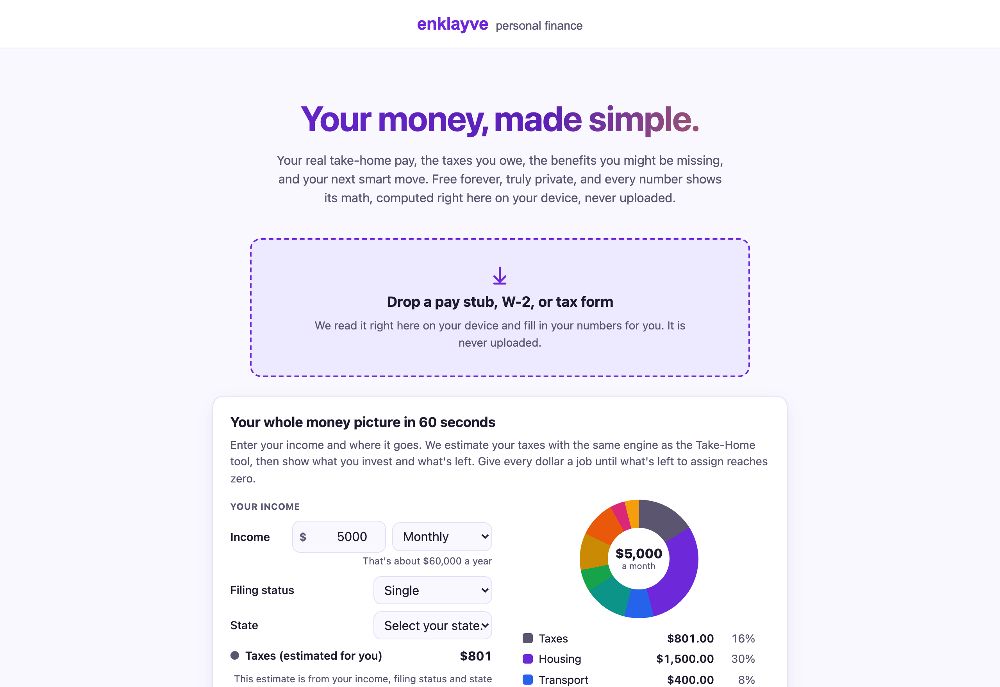

# enklayve

**Free, private money tools. Everything runs in your browser. Nothing leaves your device.**

👉 **[enklayve.com](https://enklayve.com)**



## What it does

Plain answers to everyday money questions:

- **Your paycheck and taxes.** Take-home pay, federal and state income tax (all 50 states + DC), W-4 withholding.
- **What you might be owed.** EITC, the Child Tax Credit, and other public benefits.
- **Your next step.** Budgeting, debt payoff, saving, retirement, insurance, buying a home, and help for when money is tight.

Every number shows its work and links to the official source, so you can check it yourself.

## Why you can trust it

- **Private.** No accounts, no tracking, no ads. Your browser is blocked from sending your data anywhere.
- **Free.** No upsell, now or later.
- **Works offline.** After your first visit, it works with no connection.
- **Open source.** Every line is here to read.

enklayve covers the United States. It's educational information, not financial, tax, or legal advice.

## Found a wrong number?

That's the most helpful thing you can tell us. [Report it here](.github/ISSUE_TEMPLATE/wrong-figure.yml) with a link to the official source. Security issues go to [SECURITY.md](SECURITY.md).

## Run it yourself

```sh
npm install
npm run dev
```

Want the details? The [technical tour](docs/under-the-hood.md) covers the architecture, the tax engine, the data, and how it's all tested. To contribute, start with [docs/contributing.md](docs/contributing.md).

## License

[MIT](LICENSE)
